## What is Jarvis?

Jarvis is a self-hosted AI assistant for voice, chat, automation, memory, and coding. It can answer questions, call tools, run repeatable workflows, manage local knowledge, create and organize artifacts, control external services, and hand larger software tasks to an autonomous coding workspace.

At its core, Jarvis is an orchestration layer. A request can be handled as simple Q&A, routed to one tool, expanded into a multi-tool plan, executed through a deterministic workflow, or delegated to an autonomous agent. Tool RAG keeps the active tool list focused, MCP support makes the system extensible, and persistent memory lets Jarvis reuse what it learns across sessions.

Jarvis can run with cloud LLMs or in a fully local/offline mode using local models, speech-to-text, text-to-speech, self-hosted assets, and tool profiles that disable internet-dependent capabilities. Profiles let you swap between setups such as full cloud power, local-first privacy, development, Docker-safe tools, or a locked-down offline assistant.

The project includes several ways to use and inspect the system:

- **Voice, CLI, Web UI, and TUI** entry points for talking to Jarvis, sending commands, and running workflows.
- **Chat UI** with streaming tools, mode switching, prompt enhancement, file/image uploads, conversation search, exports, pinned-safe cleanup, and live logs.
- **Canvas plus Image, Audio, and Video Galleries** for saved notes, generated artifacts, media browsing, favorites, and visual reports.
- **Memory Dashboard** for knowledge, conversations, scheduled tasks, reminders, and database maintenance.
- **Intelligence Dashboard** for self-learning insights, tool performance, experience history, confidence tracking, and repair feedback.
- **Docs Viewer** for browsing the project documentation with an assistant grounded in the local `docs/` folder.
- **Logs Viewer and full API** for debugging, automation, webhooks, monitoring, reminders, workflows, images, Canvas, memory, and intelligence data.

The `jarvis-dashboard` TUI is the terminal control center: one place to launch commands, inspect status, reach common tools, and operate Jarvis without opening a browser.

Deterministic workflows are Jarvis's reliable automation path. Instead of asking an LLM to improvise every step, a workflow defines the exact tools, order, retries, timeouts, validation, and output handling. That makes repeated jobs predictable, inspectable, and easier to debug.

[](https://bigsk1.com/jarvis-voice/docs/diagrams/jarvis-runtime-architecture.html)

## Prerequisites

Bare minimum to try Jarvis in the **browser** (Web UI chat — no local mic or speakers required):

| Path | Native (Ubuntu 24.04+, Python 3.12+) | Windows / macOS |
|------|----------------------------------------|-----------------|
| **Cloud** | `OPENAI_API_KEY` in `config/cloud.env` | [Docker](docs/docker/MAC-WINDOWS.md) + `OPENAI_API_KEY` |
| **Local** | [Ollama](docs/ollama/README.md) + a local TTS server (default in example: Kokoro — see `config/local.env.example`) | [Docker](docs/docker/MAC-WINDOWS.md) + Ollama on the host/LAN + Kokoro or Qwen3-TTS |

Native `./install.sh` also sets up wake word and host TTS playback — that path assumes a working mic and speakers. Use the Web UI first if you only want chat in the browser.

> **Quick start**
> 1. Clone the repo so it ends up at **`$HOME/jarvis-voice`**
> 2. Run **`./install.sh`** on Ubuntu 24.04+ with Python 3.12+
> 3. Add your API keys and audio settings in **`config/cloud.env`** and **`config/local.env`**
> 4. Re-run **`./verify-env.sh`**, then start with **`./bin/start`**
>
> The base installer handles the core Jarvis setup only: system deps, `uv`, the `~/jarvis-venv` environment, config seeding, and project setup. Optional extras like OpenCode and n8n come later and are not required for a normal install.
>
> Full walkthrough: [Install Guide](docs/INSTALL_GUIDE.md)
> Config details: [config/README.md](config/README.md)
> Web UI guide: [docs/JARVIS_WEB_UI.md](docs/JARVIS_WEB_UI.md)
> Speech-to-text guide: [docs/SPEECH_TO_TEXT.md](docs/SPEECH_TO_TEXT.md)
>
> **macOS and Windows:** The experimental Docker Desktop path runs the Web UIs without a native Ubuntu or Python installation. See [Mac and Windows Docker Installation](docs/docker/MAC-WINDOWS.md) for Terminal, PowerShell, and Command Prompt steps, limitations, and troubleshooting.

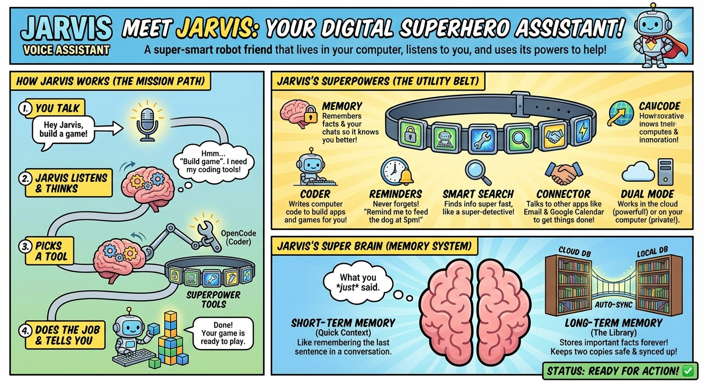


## ✨ Key Features


### Web Interface
- **Jarvis Web UI** - Full-featured chat interface at localhost:5001
  - Real-time WebSocket communication with tool streaming
  - Mode switching (cloud/local) with per-mode settings
  - **Audio playback controls**: Speaker button with pause/resume/stop
  - **Music generation**: ElevenLabs music plays inline in chat
  - **Server Logs Panel**: Real-time LLM + Tool log streaming (simpler than Grafana!)
  - **`/logs` Log Viewer**: Read-only browser for `.jsonl`, `.log`, and `.md` logs with folder drill-down, search, lazy loading, and YAML-style JSONL rendering
  - **Workflow commands**: `/archive`, `/research`, `/note`, `/health` - deterministic multi-tool pipelines
  - **Workflow hover tooltips**: Hover over `/` suggestions to see steps and descriptions
  - **Prompt hover tooltips**: Hover over `@` suggestions to see key points
  - **@prompts**: `@research`, `@quick`, `@compare`, `@generate_music`, `@email`, `@daily`
  - **Context-first injection**: Prompts inject BEFORE user message for better LLM context
  - **Tool Hints**: Start typing to get tool suggestions as you type or use #tool_name to add a tool to the request
  - **Chat only**: Use `#chat_only` to keep a sticky no-tools conversation mode that skips Tool RAG schemas and provider-hosted tools until its mode chip is removed
  - **✨ Enhance with AI**: Magic button transforms input into optimal prompts
  - **Conversation search/export**: Filter, deep search, JSON/Markdown export, pinned-safe 90-day cleanup via `cleanup-all`
  - **Completion Guard**: Manual `Completed correctly?` card plus auto-evaluator mode, one bounded repair pass, stop/cancel support for repair runs, follow-up tickets, workflow/fire-and-forget exclusions, exported metadata, and intelligence-layer corrected-path learning
  - **Image upload**: Drag-drop/paste/click with multi-image vision analysis (up to 6 cloud / 2 local)
  - **Structured result previews**: Focused cards, lists, metrics, and image galleries for search, shopping, local, travel, trends, and news tools
  - **Mode-aware TTS/STT**: Cloud vs Local providers
  - Dynamic LLM/model switching on-the-fly
  - Launch: `./bin/jarvis-web`
  - See [`docs/JARVIS_WEB_UI.md`](docs/JARVIS_WEB_UI.md)


### Intelligence & Self-Learning
- **Intelligence Layer**: Self-learning system that improves over time
  - Records interactions and reflects on them into reusable procedural insights
  - **Positive constraints**: "Use mcp_fetch_fetch for server status checks"
  - **Negative constraints**: "Avoid search_memory for real-time data"
  - **Tool provenance**: Source experience, web conversation ID, source tool sequence, and evidence trail for insight audits
  - **Preferred sequences**: Stores advisory multi-tool sequences plus primary intent/supporting tools without forcing rigid workflows
  - **Workflow attribution**: Reflection separates workflow selection from recipe-owned component order and stores only specific, currently runnable `preferred_workflow_id` recommendations
  - Generalizability filtering (only stores reusable insights)
  - **Insight tracking**: times_applied, times_helpful, times_failed are updated when retrieved insights are later used
  - **Reflection observability**: Lifetime reflection tokens/cost and last reflection provider/model on insight records
  - **Decay job**: Interval-protected confidence decay with dry-run support; prunes very low-confidence stale/failed insights
  - **Anomaly detection**: Flags unusual experiences
  - **Meta-cognition**: Analyzes learning health
  - Separate databases for cloud/local (1536 vs 768 dimensions)
  - See [`docs/INTELLIGENCE_LAYER.md`](docs/INTELLIGENCE_LAYER.md)

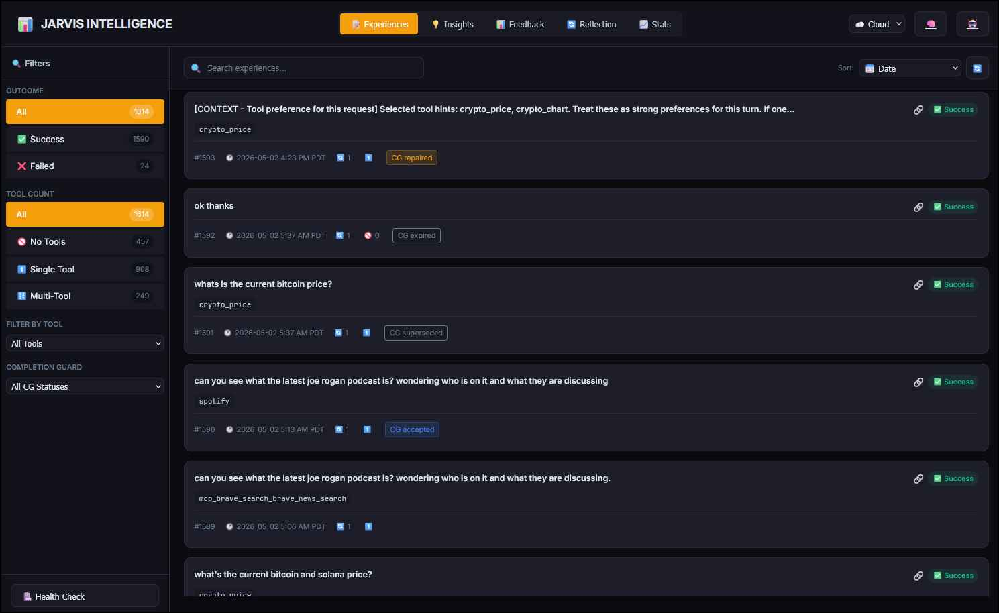

- **Intelligence Dashboard** at localhost:5003
  - Server-side paginated experience/insight lists with scroll loading and lightweight summary counts
  - Experience cards show IDs; sort by date, turns, tool count, Completion Guard status
  - Filter by success/fail, tool count, specific tool, Completion Guard status
  - Experience details show configured-local + UTC time, Completion Guard metadata, and stored raw JSON
  - Sort insights by applied, helpful, preferred/avoided tools
  - 5-tier confidence filtering (Elite/High/Good/Medium/Low)
  - Insight details show preferred workflow/sequence, source experience/web conversation, evidence trail, and reflection cost/tokens
  - Tool performance plus optional lifetime Completion Guard repaired/status totals
  - Maintenance actions include safer decay confirmation; CLI/API dry-run available for previews
  - Launch: `./bin/jarvis-intelligence`

### Tool System
- **Tool profile overlays** (optional): JSON files under `skills/profiles/` merge with each tool’s `enabled` flag — set `JARVIS_TOOL_PROFILE` in `config/local.env` or `config/cloud.env` to the profile name (e.g. offline). Copy starters from [`skills/profiles/examples/`](skills/profiles/examples/). After switching profile, restart services and run `./bin/sync-tools.py local` or `cloud`. CLI: `./bin/manage-tools.py -h`. Details: [`skills/README.md`](skills/README.md) (section *Tool profiles*).
- **Tool RAG System**: Dynamic tool retrieval - loads only relevant tools for each query
  - Scales to 100+ tools without context flooding
  - Vector-based semantic search for tool discovery
  - Ghost tools plus enabled `tool_search` and `workflow` discovery helpers are prioritized inside the final schema cap
  - Effective order: manifest → profile override → mode/config availability → live registry → Web/request blocks → Tool RAG shortlist
  - See [`docs/TOOL_RAG_STRATEGY.md`](docs/TOOL_RAG_STRATEGY.md)
- **Versioned Router Prompts**: selectable `v1`-`v4` system prompts for routing
  - `v1` is the immutable full-context baseline; `v2`, `v3`, and `v4` reduce router prompt size while preserving production routing contracts
  - `v4` is the local-mode default in `config/local.env.example`; cloud examples stay on `v1` unless changed in env or Web Settings
  - See [`orchestrator/router_prompts/README.md`](orchestrator/router_prompts/README.md)
- **Advanced Tool Calling**: LLM-powered routing with 100+ tools
- **OpenAI Responses API support**: Optional `/v1/responses` routing for OpenAI tool-capable turns, in-flight client-tool continuation, hosted-tool gates, prompt-cache hints, and safe Chat Completions fallback
- **Multi-Turn Orchestration**: Chains multiple tools to complete complex tasks
- **Auto-Context System**: Automatic short-term memory of recent conversations
  - Remembers what you just discussed without needing explicit "remember" commands
  - Catches contradictions, continues workflows seamlessly, learns from failures
  - See [`docs/AUTO_CONTEXT_SYSTEM.md`](docs/AUTO_CONTEXT_SYSTEM.md)
- **Intelligent Memory**: Semantic search + conversation history with auto-save
- **OpenCode Integration**: Autonomous coding agent for building projects
- **MCP Support**: Extensible via Model Context Protocol servers

### Proactive System
- **Event-Driven API**: Receive webhooks from external systems (port 8880)
  - **Optional API Authentication**: Bearer token auth (`JARVIS_API_AUTH=true/false`)
  - Localhost whitelisted, public paths always accessible
  - See [`docs/SECURITY_HARDENING.md`](docs/SECURITY_HARDENING.md)
- **Auto-Resolve**: URL-based and agent-based automatic issue resolution
- **Background Services**: 24/7 daemons for follow-ups, healing, reminders, and scheduled task execution
- **Scheduled Tasks**: Native scheduler for one-time or recurring Jarvis queries and workflows
  - Natural schedule parsing like `tomorrow at 1pm`, `April 4th at 4pm`, `4/4 at 4pm`, and `every weekday at 9am`
  - Durable task registry with run history, `run_now`, cancel/delete, and cloud/local DB sync
  - Managed by `scheduled_task_runner` alongside the other background services
  - Full task management in the Memory Browser UI Scheduled tab
  - See [`docs/tools/scheduled-tasks/scheduled-tasks.md`](docs/tools/scheduled-tasks/scheduled-tasks.md)
- **Smart Reminders**: Time-based reminders with natural language parsing and recurring support
- **Remote Monitoring**: Deploy [Jarvis Monitor](https://github.com/bigsk1/jarvis-monitor) (Docker) anywhere to send health checks and alerts
- **Voice Notifications**: Jarvis speaks alerts and reminders via TTS

### Integrations & Automation
- **AI Phone Calls via Vapi.ai**: Outbound AI phone calls on your behalf
  - "Call Boss and ask if he wants to see Gladiator II tonight"
  - Multiple personas: Jarvis (default), James (professional), Jay (casual), Samantha (female)
  - Custom Vapi dashboard characters with dynamic variables (`{{owner}}`, `{{task}}`)
  - Voicemail detection and handling
  - Auto-save transcripts to Canvas and memory for later recall
  - Contact management: save numbers by name
  - See [`docs/tools/phone/PHONE_CALLS.md`](docs/tools/phone/PHONE_CALLS.md)
- **Spotify Integration**: Full music control via Spotify API
  - "Play Chill Vibes playlist", "Skip this song", "What's playing?"
  - Search your library first, then public Spotify
  - Multi-device support (Fire TV, Echo, phone, desktop)
  - Queue management, shuffle, repeat, volume control
  - Share what's playing via email with album art
  - See [`docs/tools/spotify/SPOTIFY.md`](docs/tools/spotify/SPOTIFY.md)
- **Modular Webhook System**: Named webhook registry for triggering external services
  - `send_email` - Send emails via SMTP with beautiful HTML templates
  - `send_webhook` - Trigger any webhook (Slack, Discord, APIs, custom endpoints)
  - Contact management with name resolution ("email Andrew" → looks up email)
  - Multiple auth methods (Bearer, Basic, API Key, JWT, custom headers)
  - Rate limiting to prevent duplicates
  - See [`docs/WEBHOOK_SYSTEM.md`](docs/WEBHOOK_SYSTEM.md)
- **Google Calendar Sync**: Bidirectional reminder ↔ calendar event sync via n8n
  - Create reminder in Jarvis → syncs to Google Calendar
  - Create event in Google Calendar → syncs to Jarvis
  - Full CRUD support (create, update, delete) with metadata tracking
  - Timezone handling (UTC normalization for correct comparison)
  - See [`docs/n8n/docs/GOOGLE_CALENDAR_SYNC.md`](docs/n8n/docs/GOOGLE_CALENDAR_SYNC.md)
- **n8n Workflow Engine**: Extensible automation workflows
  - Email sending with SMTP
  - Calendar sync orchestration
  - Custom webhook endpoints
  - OAuth2 handling and token refresh
  - See [`docs/n8n/docs/`](docs/n8n/docs/)
- **Samantha Multi-Agent Integration**: Secondary AI assistant on remote VPS (openclaw)
  - Real-time chat via `samantha` tool (OpenAI-compatible API)
  - Fire-and-forget webhooks for Discord/Telegram posting
  - Samantha can POST back to Jarvis API (intel, canvas, alerts, voice)
  - **Multi-agent voice**: Samantha speaks with her own voice through Jarvis's speakers
  - Priority levels (urgent/normal/background) and configurable timeouts
  - Division of labor: Jarvis = local/home, Samantha = web/social
- **Cloudflare Images CDN**: Permanent image hosting for multi-agent workflows
  - Upload from file, URL, base64, or stash reference
  - Organized paths: `{uploader}/{date}/{category}/{filename}`
  - Metadata storage (prompt, tags, provider) for tracking
  - Enables Samantha to share generated images via permanent URLs
  - API: `POST /api/images`, `POST /api/images/base64`
  - See [`docs/api/IMAGES.md`](docs/api/IMAGES.md)
- **Generated Images API**: Full management of AI-generated images
  - **3 providers**: Gemini (grounding), OpenAI (best text), xAI (fast & cheap!)
  - **Image-to-image editing**: Edit existing images via `reference_image` parameter
  - **Batch generation**: xAI supports `n=1-10` for multiple variations ($0.02/image!)
  - List, search, download, delete local images
  - Generate new images with optional `upload_to_cdn` for one-step CDN URL
  - CDN catalog (`cdn_catalog.json`) caches URLs - no re-uploads needed
  - API: `/api/generated-images/*`
  - See [`docs/api/GENERATED_IMAGES.md`](docs/api/GENERATED_IMAGES.md)
- **Generated Music API**: Catalog-backed AI music generation
  - Generate songs, instrumentals, jingles, and soundtracks with duration,
    genre, mood, tempo, quality, and structured composition options
  - ElevenLabs (`music_v1` or `music_v2`) and Google Gemini Lyria Clip/Pro
    adapters; `MUSIC_TOOL_PROVIDER` and per-request `provider` choose the provider
  - API: `POST /api/generated-music/generate`
  - See [`docs/tools/generate-music-tool/README.md`](docs/tools/generate-music-tool/README.md)
  - See [`docs/api/GENERATED_MUSIC.md`](docs/api/GENERATED_MUSIC.md)
- **Feedback System**: LLM self-critique for continuous improvement
  - Per-query feedback: `--feedback` flag on orchestrator
  - Batch testing: `./bin/jarvis-feedback batch tests/queries.txt`
  - Cross-model grading via `FEEDBACK_PROVIDER`/`FEEDBACK_MODEL`
  - View issues: `./bin/jarvis-feedback issues --days 7`


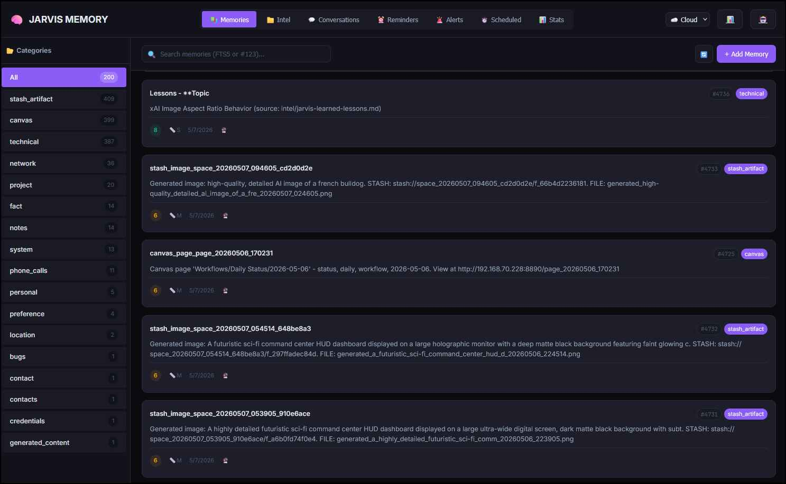

### Memory System
- **Dual Database**: Separate DBs for cloud (OpenAI embeddings) and local (nomic embeddings)
- **Auto-Sync**: Bidirectional sync between modes on startup
- **FTS5 Full-Text Search**: SQLite FTS5 with BM25 ranking for fast, accurate keyword searches
- **Knowledge Base**: Facts, preferences, technical info with embeddings
- **Conversation History**: Full logging with metadata (cost, tokens, model)
- **Semantic Search**: AI embeddings with configurable similarity threshold (tune via .env)
- **Hybrid Search**: Combines keyword (FTS5) and semantic (embeddings) for comprehensive results
- **Auto-Save**: Automatically remembers project locations, commands, solutions
- **Tool Management**: Enable/disable tools per mode to optimize context window

### Dual Mode Operation
- **Cloud Mode**: OpenAI (shipped default), xAI Grok (`grok-4.6` recommended for xAI), Anthropic Claude, or Ollama Cloud (`*:cloud` / `*-cloud` models through a signed-in Ollama daemon)
  - OpenAI can use Chat Completions by default or opt into Responses API routing for tool-capable turns with `OPENAI_API_MODE=responses` + `OPENAI_RESPONSES_TOOLS=true`
- **Local Mode**: Ollama (`gemma4` default) + faster-whisper + Kokoro/Qwen3-TTS (free, offline)
- **Mode is not provider selection**: `JARVIS_MODE` chooses config/data boundaries; `LLM_PROVIDER` chooses the chat backend. See [`docs/ollama/README.md`](docs/ollama/README.md).
- **Model Prompt Overrides**: Small provider/model-specific YAML prompt overlays in `config/models/`
  - Lets you patch stable model quirks without changing the global prompts for every provider
  - Supports exact model folders plus deterministic aliases for dated model names and runtime suffixes like `:latest` and `:cloud`
  - See [`docs/MODEL_PROMPT_OVERRIDES.md`](docs/MODEL_PROMPT_OVERRIDES.md)

### TTS Providers
| Provider | Mode | Quality | Cost | Notes |
|----------|------|---------|------|-------|
| **ElevenLabs** | Cloud | Excellent | Paid | Best quality, expressive voices |
| **xAI TTS** | Cloud | Good | Paid | Native xAI TTS using `XAI_API_KEY`; built-in and custom voice IDs; optional expressive speech tags |
| **Qwen3-TTS** | Both | Excellent | Free | 28 cloned voices (Jarvis, Samantha, etc.), local network |
| **Kokoro** | Local | Good | Free | Lightweight, fast, Nicole+Sarah voices |
| **OpenAI TTS** | Cloud | Good | Paid | alloy, echo, fable, onyx, nova, shimmer |

Configure via `TTS_PROVIDER` in `cloud.env` or `local.env`. xAI TTS uses its native `/v1/tts` API and supports optional final-speech tags via `XAI_TTS_STYLE_TAGS_ENABLED`; Qwen3-TTS uses an OpenAI-compatible API.
See: [`docs/qwen3-tts/QWEN3_TTS_INTEGRATION_GUIDE.md`](docs/qwen3-tts/QWEN3_TTS_INTEGRATION_GUIDE.md)

**Voice API** (`/api/voice/speak`): Supports per-request TTS provider/voice overrides for multi-agent voice identity
See: [`docs/api/VOICES.md`](docs/api/VOICES.md)

**Cloud Chat Default:** OpenAI. For xAI, the tracked recommended model is **Grok 4.5**; Grok 4.3 remains available for 1M context or non-reasoning use.

### Voice & Wake Word
- **Wake Detection**: "Hey Jarvis" using OpenWakeWord
- **Fine-tuned Audio**: Optimized for noisy environments + far-field mic
- **Smart Response Formatting**: Auto-condenses verbose outputs for voice
- **Status Updates**: Real-time voice progress during long tasks
  - "Searching the web", "Building with OpenCode", "Checking the weather"
  - Optional LLM summaries run concurrently and never delay tool execution
  - 250 ms debounce skips unnecessary speech between fast tool calls
  - Bounded, sanitized execution context with static phrase fallback
  - Configurable phrases with humor/encouragement toggles
  - Phrase modes: `normal` or `unhinged` (chaotic/funny)
  - Native and Web status-audio caching for repeated phrases
  - See [`docs/STATUS_UPDATES.md`](docs/STATUS_UPDATES.md)


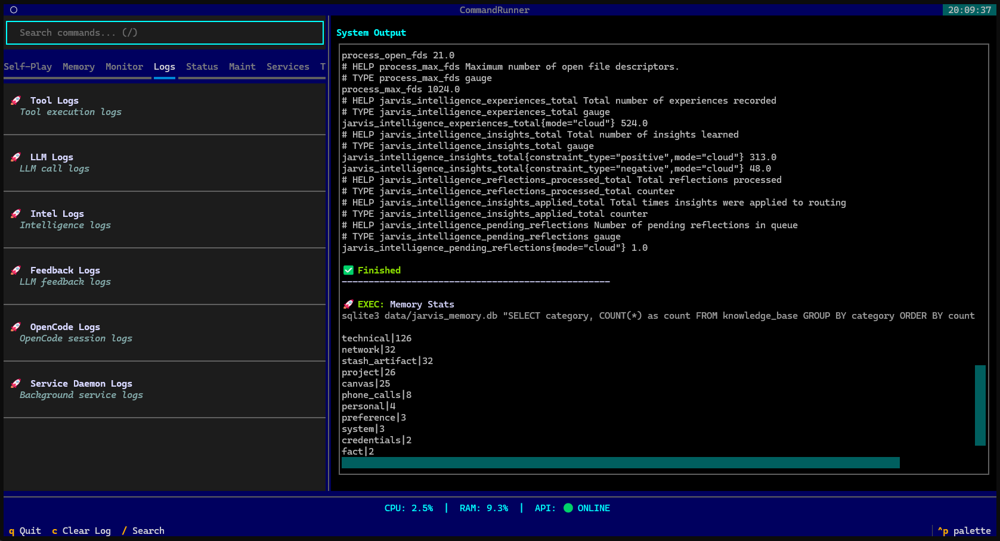

### Developer Experience
- **Command Dashboard TUI**: Interactive terminal UI with 70+ commands
  - Browse, search, and run any Jarvis command from one place
  - Organized by category (Core, API, Memory, Intelligence, Tools, Logs, etc.)
  - Live system status (CPU, RAM, API health)
  - Separate full-stack and UI-only startup actions for cloud/default and local env modes
  - Launch: `./bin/jarvis-dashboard` or `jarvis-d` alias
- **Intelligence Dashboard**: Visual dashboard for self-learning at localhost:5003
  - Experience sorting (date, turns, tool count) and filtering (success/fail, tool count, specific tool)
  - Insight sorting (applied, helpful, preferred/avoided tools, confidence)
  - 5-tier confidence: Elite (96%+), High (85-95%), Good (75-84%), Medium (50-74%), Low (0-49%)
  - Tool performance showing ALL tools with prefer/avoid stats
  - **Feedback tab** - View all feedback logs with rating/time filters, expandable details, no terminal needed
  - Mobile responsive: hamburger menu at ≤730px
  - Launch: `./bin/jarvis-intelligence`
- **Memory Browser UI**: Web interface for memory management at localhost:5002
  - View, search, add, edit, delete memories from `knowledge_base`
  - Intel file manager (create, upload, edit, ingest `.md`/`.txt` files)
  - Conversation browser with full detail popup
  - Scheduled Tasks tab for creating, editing, running, cancelling, deleting, filtering, and inspecting scheduled jobs
  - FTS5 search, dual database (cloud/local), re-embed after edits
  - Mobile responsive: hamburger menu at ≤730px
  - Launch: `./bin/jarvis-memory`

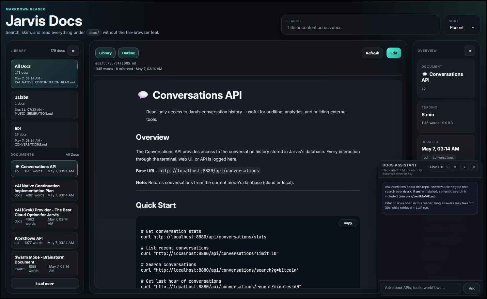

- **Docs viewer** (`jarvis-docs`): Dedicated markdown workspace for everything under `docs/` at localhost:5004
  - Reader-first layout with global search across markdown files
  - Section rail + document feed + rendered article canvas
  - Optional in-place `.md` editing via `DOCS_UI_EDIT_ENABLED=true`
  - **Docs Assistant** — In-panel LLM chat with read-only answers from retrieved `docs/` excerpts; retrieval uses **[QMD](docs/qmd/README.md)** when installed, otherwise **ripgrep** (no crash if neither is present)
  - Launch: `./bin/jarvis-docs`
- **Canvas Viewer**: Visual knowledge display at localhost:8890
  - Jarvis saves research results, code snippets, comparisons
  - Beautiful dark UI with Markdown rendering
  - Search, pin, edit, delete pages
  - Mobile responsive: hamburger menu at ≤730px
  - Launch: `./bin/jarvis-canvas`

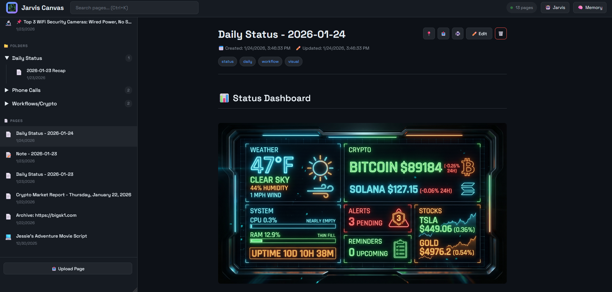

---

- **Image Gallery UI**: Browse generated images in Canvas web UI
  - Grid view with thumbnails, search, favorites filter, and date/name/size/CDN cached sorting
  - Lightbox viewer, favorite, download, get CDN URL, delete
  - Favorites are preserved by generated-image cleanup; uncached CDN uploads require confirmation
  - Access via "🖼️ Gallery" link in Canvas header

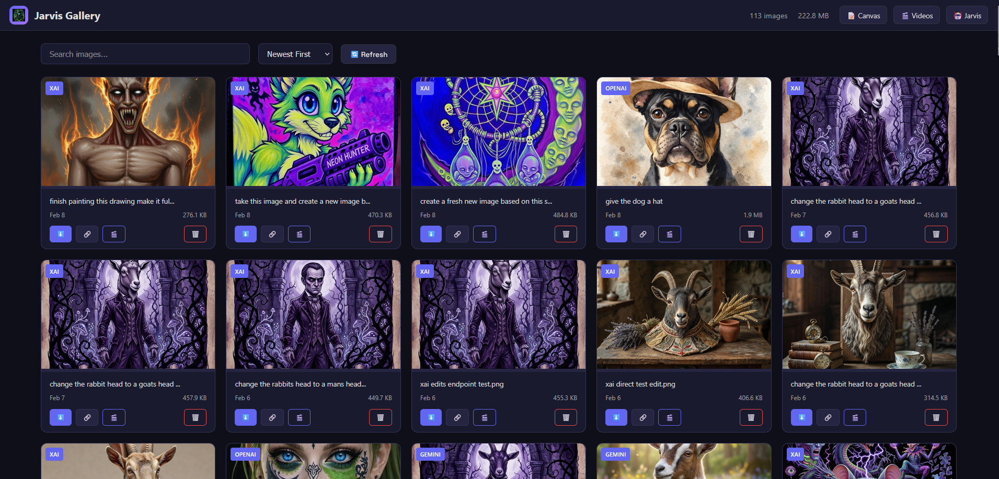

---

- **Audio Gallery UI**: Browse retained generated music in Canvas
  - Playback with a live spectrum, search, filtering, favorites, download, and delete
  - Share retained tracks as temporary xAI waveform videos
  - Access via the "🎵 Audio" link in the Canvas header

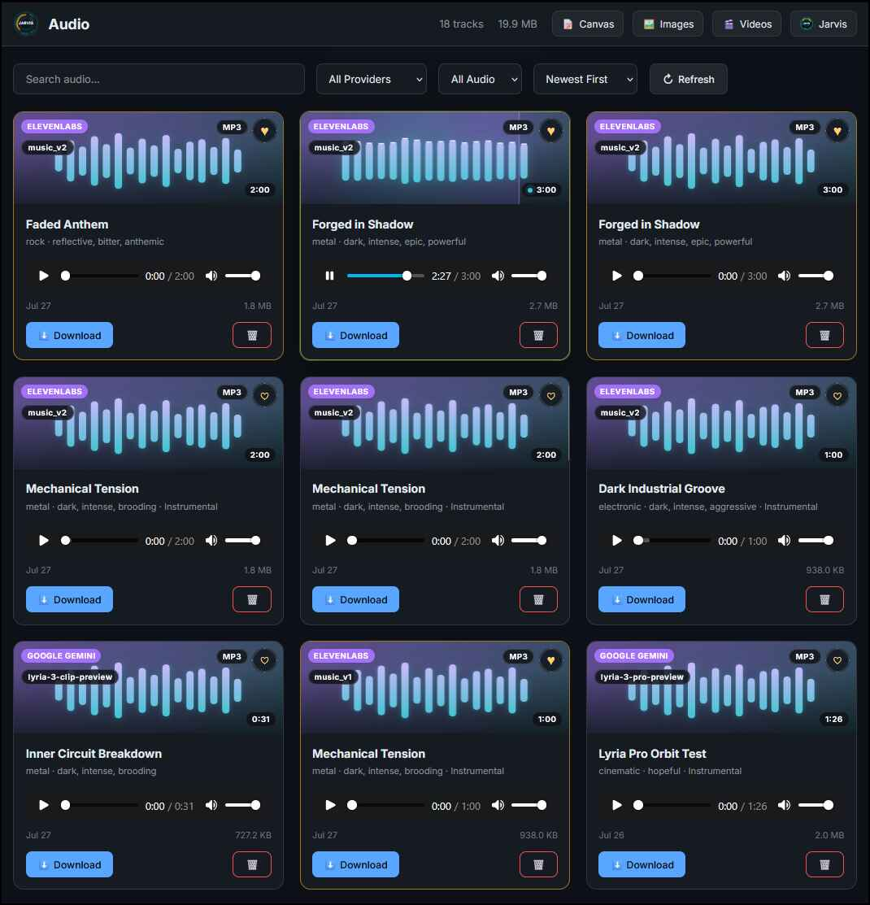

---

- **Video Gallery UI**: Browse generated videos in Canvas web UI (Feb 2026)
  - Grid view with hover preview, provider badges (xAI/OpenAI/Gemini)
  - Lightbox viewer with video controls
  - Search, sort by date/name/size/duration
  - Download and delete functionality
  - Access via "🎬 Videos" link in Canvas header

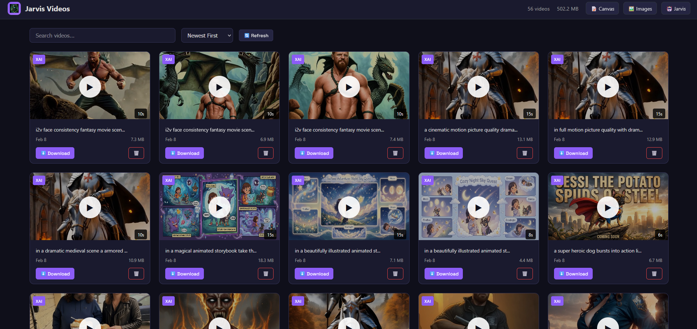

### Jarvis Logs Viewer

Dedicated **read-only** log triage inside Jarvis Web (`./bin/jarvis-web`): open **`http://localhost:5001/logs`** (same host/port as chat; respects Web UI auth if enabled).

- **Scope** — Browses repo log folders that contain `.jsonl`, `.log`, or `.md`; no uploads, edits, or deletes
- **Navigation** — Folder list (sorted A→Z); files newest-first inside each folder; folder search narrows files before you open them
- **Viewing** — JSONL lines render as expandable YAML-style cards (good for LLM/tool/jsonl traces); markdown files render as Markdown; large files load in pages instead of dumping the whole file at once
- **Mobile** — Drill-down flow (folder → file list → viewer) with back navigation on small screens
- **Compared to chat** — The in-chat **Server Logs Panel** streams live tail; **`/logs`** is for paging through dated files under `logs/` (e.g. `llm-calls-*`, `tools/tool-calls-*`, `opencode`, `feedback`, web errors)

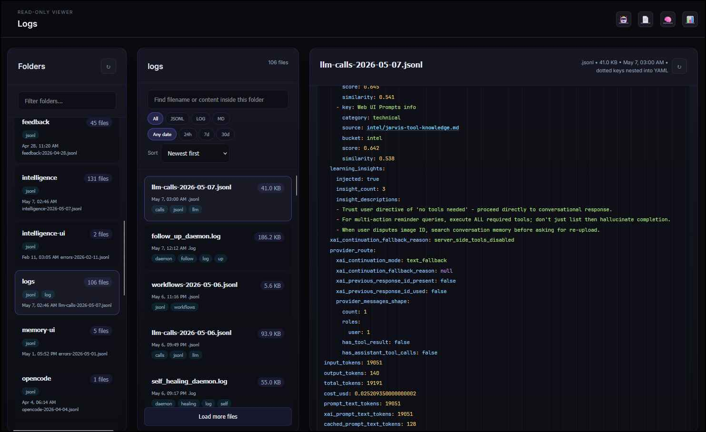

Full detail: [`docs/JARVIS_WEB_UI.md`](docs/JARVIS_WEB_UI.md) (*`/logs` Read-Only Browser*).

---

### Speech Modes - Smart Adaptive Response System

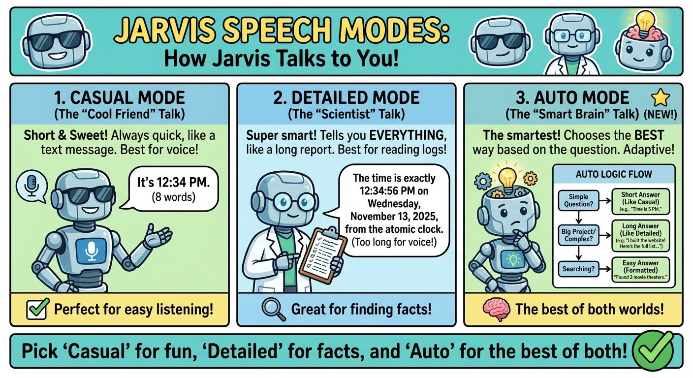

Jarvis adapts its response style based on your environment and task complexity:

**🎙️ Casual Mode** (Default for Voice)
- Concise responses with configurable word limits (75/50/35 words)
- Strips `stash://` refs, long URLs, file paths from speech
- Perfect for: Voice interactions, speakers, TTS

**🖥️ Detailed Mode** (Best for CLI/Debugging)
- Full LLM response with complete context
- Perfect for: CLI testing, debugging, logs
- Example: Full technical breakdown with file lists, URLs, next steps

**🤖 Auto Mode** ⭐ (Smart Adaptive)
- **Search tools** → Always formatted (removes URLs, summarizes)
- **Simple queries** → Keep short if already concise
- **Complex builds** → Detailed if >50 words (keeps technical context)
- **Multi-turn** → Formatted summary
- Perfect for: Mixed usage, general assistant work

**Configuration:**
```bash
# Set in config/cloud.env or config/local.env
JARVIS_RESPONSE_STYLE="auto"    # Smart adaptive (recommended)
JARVIS_RESPONSE_STYLE="casual"  # Always short (voice default)
JARVIS_RESPONSE_STYLE="detailed" # Always verbose (CLI) and full Web UI display (no tts)
```

See full guide: [`docs/AUTO_MODE_EXPLAINED.md`](docs/AUTO_MODE_EXPLAINED.md)

---

## 🔍 How It Works

**New to Jarvis?** See these comprehensive guides:

**Reactive Mode** (Current):
- 📊 **[Complete Workflow Guide](docs/JARVIS_WORKFLOW.md)** - How Jarvis processes your requests
  - Visual flowcharts, memory strategy, tool selection
  - Multi-turn orchestration, configuration impact
  - Real-world examples with thinking mode enabled

**Proactive Mode** (Current):
- 🔮 **[Proactive Assistant API](docs/api/API_OVERVIEW.md)** - Event-driven webhook system
  - Receives webhooks from any external system
  - Auto-resolves issues when services recover
  - Background services for follow-ups and reminders
  - Remote monitoring with agent templates
  - See also: [API Docs](docs/api/), [Service Docs](docs/service/)

**Quick Overview:**
```
User Query → Router (LLM analyzes) → Memory Check → Tool Selection →
Execute Tool(s) → Multi-Turn if Needed → Format Response → User
```

Key decision points:
- **Memory First**: Always checks stored info before external calls
- **Thinking Mode**: See LLM's reasoning process (toggle via `--debug-thinking`)
- **Smart Tool Selection**: Keyword search vs semantic search vs direct tool call
- **Multi-Turn**: Chains tools automatically for complex tasks

---

## 📁 Project Structure

<details>
<summary><strong>Project Directory Structure (click to expand)</strong></summary>

```
jarvis-voice/
├── api/                      # Proactive Assistant FastAPI app (routes, managers; run via bin/jarvis-api :8880)
├── audio/                    # TTS/STT-related dirs (cloud/ vs local/)
├── bin/                      # Executable scripts & utilities (50+)
│   ├── wake-jarvis.py        # Cloud wake word loop
│   ├── wake-jarvis-local.py  # Local wake word loop
│   ├── say.sh / say-local.sh # Text-to-speech
│   ├── jarvis-api            # API server (port 8880)
│   ├── jarvis-services       # Background services supervisor
│   ├── jarvis-dashboard      # Command dashboard TUI
│   ├── jarvis-web            # Main chat Web UI (port 5001)
│   ├── jarvis-docs           # docs/ browser + assistant UI (port 5004)
│   ├── jarvis-canvas         # Canvas & gallery (port 8890)
│   ├── jarvis-memory         # Memory browser (port 5002)
│   ├── jarvis-intelligence   # Intelligence UI (port 5003)
│   ├── jarvis-feedback       # Feedback CLI
│   ├── build-tool            # Tool builder
│   ├── evolve-prompts        # Prompt evolution
│   ├── manage-tools.py       # Enable/disable tools, profile helpers
│   ├── sync-memory-db.py     # Memory DB maintenance
│   ├── sync-tools.py         # Tool RAG: embed registry into memory DB
│   ├── cleanup-intelligence.py
│   ├── spotify-auth          # Spotify OAuth setup
│   ├── memory                # Memory CLI
│   └── question*.sh          # Q&A entry points
├── lib/                      # Shared Python modules (~45)
│   ├── config_loader.py      # Env & project config
│   ├── memory_db.py          # SQLite memory + tool embedding index
│   ├── llm_provider.py       # xAI / Anthropic / OpenAI / Ollama
│   ├── tool_schema.py        # Tool registry, MCP merge, Tool RAG helpers
│   ├── tool_profiles.py      # JARVIS_TOOL_PROFILE overlays
│   ├── tool_search_runtime.py # tool_search implementation
│   ├── tts_normalizer.py     # Speech-oriented text cleanup
│   ├── model_catalog.py      # Model metadata & defaults
│   ├── intelligence.py       # Self-learning core
│   ├── intelligence_hooks.py
│   ├── tool_builder.py
│   ├── mcp_client.py / opencode_client.py
│   ├── stash_helper.py / embeddings.py / feedback.py
│   └── …                     # loggers, cost_estimator, routing helpers, etc.
├── orchestrator/             # Multi-turn orchestration (uses lib/, not a copy of it)
│   ├── orchestrator_v2.py
│   ├── router_v2.py          # Routing + Tool RAG selection
│   ├── executor.py
│   ├── context_assembler.py  # Conversation & tool-result context
│   ├── response_formatter.py # Final display / speech shaping
│   ├── workflow_loader.py
│   ├── workflow_tool_runtime.py # Autonomous workflow search/describe/run
│   └── pipeline_executor.py
├── skills/                   # Tools: *.py + *.tool.json + auto-tools/
│   ├── profiles/             # Tool profile overlays (JARVIS_TOOL_PROFILE)
│   │   ├── default.json
│   │   └── examples/         # Tracked templates (copy to profiles/<name>.json)
│   ├── auto-tools/           # Tool-builder outputs (docker_control, text_summarizer, …)
│   ├── tool_search.py        # Summary-first discovery
│   ├── workflow.py           # Compact deterministic-workflow meta-tool
│   ├── canvas.py / stash.py / memory tools / generate_* / crawl_url / serpapi_* …
│   └── *.tool.json
├── config/                   # Environment & wiring
│   ├── cloud.env / local.env # Active (gitignored); from *.example
│   ├── cloud.env.example / cloud.openai.env.example / local.env.example
│   ├── mcp-servers.json      # MCP server definitions
│   ├── webhook_registry.json / contacts.json / ssh.json (often gitignored)
│   └── …
├── data/                     # SQLite DBs, canvas, stash, workflows, chat exports, backups
│   ├── jarvis_memory*.db / jarvis_intelligence*.db
│   ├── workflows/            # e.g. deep_research, daily_status, web_archive, …
│   ├── canvas/ stash/ generated_* / web_conversations/ backups/
│   └── …
├── logs/                     # tools/, llm-calls-*, api/, services/, intelligence/, tool-rag/, …
├── jarvis-web/               # Main Web UI — client/, server/, data/prompts/
├── jarvis-docs/              # docs/ reader — client/, server/ (:5004)
├── jarvis-canvas/            # Canvas UI — client/ (static/, templates/), server/
├── jarvis-intelligence/      # Intelligence dashboard — client/, server/
├── jarvis-memory/            # Memory browser — client/, server/
├── jarvis-monitor/           # Remote agent — monitor.py, Docker assets, README
├── jarvis-intel/             # Private knowledge tree (often gitignored)
├── services/                 # Python daemons (reminders, follow-up, self-healing, scheduled tasks) + webhook helpers
├── systemd/                  # systemd unit templates
├── monitoring/               # Grafana + Prometheus + Loki
├── tests/                    # Unit, integration, e2e
├── docs/                     # Markdown docs (QMD-indexed); subfolders api/, n8n/, …
├── jarvis / jarvis-local     # Cloud vs local launchers
├── VERSION                   # App version (see bin/bump-version)
├── pyproject.toml / uv.lock  # Packaging
├── requirements.txt
├── setup.sh / install*.sh / verify-env.sh / …
└── README.md                 # This file
```

</details>


---

## 🚀 Quick Start

<details>
<summary><strong>Quick Start (click to expand)</strong></summary>

### 1. Initial Setup

See [INSTALL_GUIDE.md](docs/INSTALL_GUIDE.md) or
[QUICKSTART.md](docs/QUICKSTART.md) for detailed instructions.

### 1.1. Clone the repository
```bash
git clone https://github.com/bigsk1/jarvis-voice.git
cd jarvis-voice
```

```bash
cd ~/jarvis-voice
chmod +x install.sh
./install.sh
```

This will:
- Install system dependencies
- Create the shared Python environment from the lockfile
- Seed missing configuration files without overwriting existing ones
- Run project setup and environment verification

### 2. Configure

Edit the configuration files created by the installer:

```bash
# Cloud mode ships with OpenAI as the default provider
nano config/cloud.env

# Optional xAI alternative
# LLM_PROVIDER="xai"
# XAI_AUTH_MODE="auto"   # API key when set; otherwise a current `grok login`
# XAI_API_KEY="xai-..."  # Optional for chat/OAuth vision; required for xAI generation/TTS/search APIs
# XAI_MODEL="grok-4.6"
# XAI_OAUTH_MODEL="grok-4.6"

# Ollama Cloud alternative (signed-in daemon path):
# LLM_PROVIDER="ollama"
# OLLAMA_BASE_URL="http://your-ollama-host:11434"
# OLLAMA_CLOUD_MODEL="minimax-m3:cloud"
# Or set OLLAMA_API_KEY for direct ollama.com access; see docs/ollama/README.md.

# Local mode uses Ollama with gemma4 by default
nano config/local.env
# ALLOW_OLLAMA_CLOUD=true optionally exposes signed-daemon cloud cards locally.
```

See [`config/README.md`](config/README.md), [`docs/XAI_PROVIDER.md`](docs/XAI_PROVIDER.md),
and [`docs/ollama/README.md`](docs/ollama/README.md) for detailed configuration options.

</details>

### Optional Docker Web Stack

Jarvis can run its Web UIs, API, Canvas, and background services in Docker while wake word, CLI, TUI, and host-integrated tools remain native. Existing databases and runtime files are reused through bind mounts.

```bash
cp docker.env.example .env
docker compose build
docker compose --profile extras up -d
```

The safe Docker tool profile is enabled by default. Hybrid users can select the full `default` profile and block container-incompatible tools only in Web UI Settings. See the **[Docker Guide](docs/docker/README.md)** for setup, LAN access, authentication, shell/CLI examples, and native/Docker coexistence.

### 4. Run Jarvis

```bash
source ~/jarvis-venv/bin/activate

# Cloud mode (provider comes from config/cloud.env)
./jarvis

# Local mode (Ollama)
./jarvis-local

# CLI mode (no voice)
./orchestrator/orchestrator_v2.py cloud "What time is it?"
./orchestrator/orchestrator_v2.py local "What time is it?"

# CLI mode with voice output (speaks result through speakers)
./orchestrator/orchestrator_v2.py cloud "What time is it?" --speak
./orchestrator/orchestrator_v2.py local "Turn up my volume" --speak

# Command Dashboard (all commands in one TUI!)
./bin/jarvis-dashboard
```
### Terminal Wake Word Mode

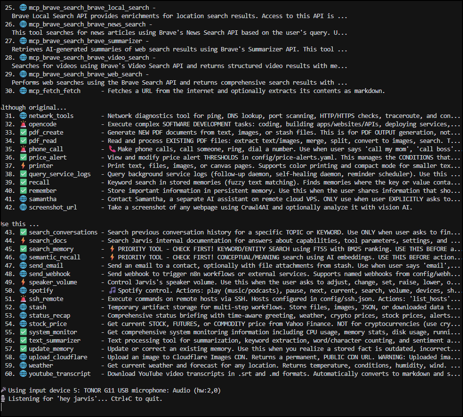

Say **"Hey Jarvis"** to wake it up!

### 5. Start All Services (Recommended)

Start everything with one command using tmux sessions (make sure they are all setup first):

```bash
# Start ALL services (API, background services, all UIs)
./bin/start

# Local-only startup (uses config/local.env)
./bin/start --local

# Or start only what you need:
./bin/start --ui-only    # Just the web UIs (no API/services)
./bin/start --ui-only --local  # Local-env web UIs
./bin/start --list       # Check status of all sessions
./bin/start --stop       # Stop everything
```

The command dashboard exposes the same choices as **Start All Services**,
**Start All Services (Local)**, **Start UI Only**, and **Start UI Only
(Local)**. Cloud remains the default; local actions require
`config/local.env`.

**Services started:**
| Session | Port | Description |
|---------|------|-------------|
| `jarvis-api` | 8880 | Proactive API (webhooks, reminders) |
| `jarvis-services` | - | Background services (auto-resolve) |
| `jarvis-web` | 5001 | Web UI chat interface |
| `jarvis-canvas` | 8890 | Canvas & Gallery viewer |
| `jarvis-memory` | 5002 | Memory Browser UI |
| `jarvis-intelligence` | 5003 | Intelligence Dashboard |
| `jarvis-docs` | 5004 | `docs/` viewer/editor + Docs Assistant chat |

```bash
# Attach to any session to see logs
tmux attach -t jarvis-web

# Detach without stopping: Ctrl+B then D
```


### 6. Proactive API & Reminders

Enable event-driven alerts, notifications, and smart reminders:

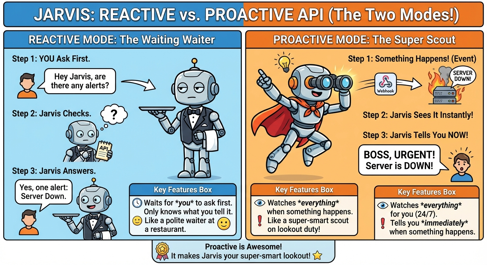

If you prefer to start services individually (instead of `./bin/start`):

```bash
# Start API server (receives webhooks, processes reminders)
./bin/jarvis-api

# Start background services (auto-resolve, follow-ups, reminder scheduler)
./bin/jarvis-services
```

**Create reminders via voice:**
```bash
./jarvis
# Say: "Hey Jarvis, remind me in 4 hours to check dinner"
# Say: "Hey Jarvis, remind me every Friday at 5pm to submit timesheets"
# Say: "Hey Jarvis, what reminders do I have?"
```

**Supported time expressions:**
- "in 30 minutes", "in 4 hours", "in 2 days"
- "tomorrow at 3pm", "at 5pm", "on the 15th"
- "every Wednesday" (weekly, 10am default)
- "every Friday at 5pm" (weekly with time)
- "every month on the 10th" (monthly, 10am default)

See [Proactive API docs](docs/api/) and [Reminder System](docs/api/REMINDER_SYSTEM.md) for details.

### 7. Remote Monitoring Agent (Optional)

Deploy the **[Jarvis Monitor](./jarvis-monitor/README.md)** (Docker) on remote servers for health checks and alerts:

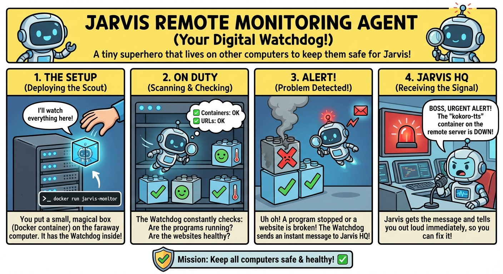

```bash
# On remote server (Docker required)
docker run -d \
  --name jarvis-monitor \
  --restart unless-stopped \
  -e JARVIS_API="http://your-jarvis-server:8880/api/alerts" \
  -e JARVIS_API_KEY="your-api-key-if-JARVIS_API_AUTH-is-enabled" \
  -e MONITOR_URLS="MyApp|http://localhost:8080/health" \
  -e SOURCE_NAME="remote-server" \
  -e CHECK_INTERVAL=60 \
  bigsk1/jarvis-monitor:latest

# Monitor sends alerts to Jarvis API when issues detected
# Jarvis speaks alerts via voice TTS
# Auto-resolve when service recovers
```

See the [Jarvis Monitor repo](https://github.com/bigsk1/jarvis-monitor) for configuration options and Docker Compose examples.


---

## 🛠️ Tool System

### Available Skills (100+)

**Memory Management:**
- `remember` - Store facts, preferences, technical info
- `recall` - Retrieve specific memories by category/key
- `search_memory` - **FTS5 full-text search** with BM25 ranking (keyword/entity searches)
- `semantic_recall` - AI-powered conceptual search (natural language questions)
- `update_memory` - Modify existing memories
- `forget` - Delete memories
- `memory_deduper` - **Memory cleanup**: detect duplicates/conflicts, propose safe deletions (analyze first, apply when approved)
- `get_recent_conversations` - Access conversation history
- `search_conversations` - Search past interactions

**Action Tools:**
- `execute_bash` - Run shell commands
- `send_email` - Send emails with contact lookup and HTML templates
- `send_webhook` - Trigger named webhooks (Slack, n8n, APIs) with auth
- `api_call` - Generic HTTP API calls
- `crypto_price` - Get cryptocurrency prices
- `crypto_chart` - **Crypto chart history**: CoinGecko time-series for price, market cap, and volume; shaped for web UI charts and Canvas
- `get_time` - Current time
- `calculator` - **Advanced math**: arithmetic, percentages, statistics, unit conversions, trig
- `canvas` - **Visual viewer**: save rich content (research, code, comparisons) to web UI
- `weather` - Weather via OpenWeatherMap with Open-Meteo daily forecasts
- `phone_call` - **AI Phone Calls**: outbound calls via Vapi.ai with personas, voicemail detection, transcripts
- `spotify` - **Music control**: play, pause, skip, queue, search, device switching, share via email
- `network_tools` - **Network diagnostics**: ping (with stats), DNS lookup, port checks, HTTP/HTTPS status, traceroute
- `system_monitor` - **System resources**: CPU, RAM, disk, processes, network I/O, uptime
- `text_summarizer` - **Text processing**: summarization, keyword extraction, word count, sentiment analysis
- `stock_price` - **Stock/futures prices**: stocks (TSLA, AAPL), futures (GC=F gold, SI=F silver), forex (EURUSD=X)
- `price_alert` - **Price alerts**: Create crypto/stock alerts monitored by n8n (above/below thresholds)
- `status_recap` - **Daily status**: aggregates weather, crypto, stocks, alerts, reminders, system health → Canvas + Stash
- `schedule_task` - **Scheduled tasks**: create/list/update/cancel/delete future query or workflow runs, inspect run history, and queue `run_now`
- `workflow` - **Deterministic workflow discovery**: search/describe eligible shared or personal recipes and synchronously run one in the current orchestration turn
- [`generate_music`](docs/tools/generate-music-tool/README.md) - **AI Music**: provider-ready music generation with genres, moods, tempo, stash integration
- `generate_password` - **Password generation**: Secure passwords with length, complexity, memorable options
- `samantha` - **Multi-agent**: Chat with Samantha (OpenClaw), delegate tasks, fire-and-forget webhooks
- `deep_memory_search` - **Comprehensive search**: Multi-source search across memory, conversations, intel, canvas, stash
- `search_docs` - **Internal knowledge Q&A**: Semantic search over Jarvis docs (capabilities, parameters, features)
- `ssh_remote` - **Remote execution**: SSH into remote hosts, run commands, apt management, multi-command sequences
- `docker_control` - **Docker management**: containers, compose, images, networks, volumes, exec, prune
- `youtube_transcript` - **YouTube transcripts**: Download video transcripts as .srt/.md files
- `youtube_video` - **YouTube download**: Download videos or audio-only via yt-dlp, save to stash
- `bookmark_search` - **Firefox bookmarks**: Search bookmark export (HTML) by keyword, tags, folders, domains (`*` in Web UI)
- `crawl_url` - **Web scraping**: Crawl4AI to extract markdown from any webpage (stealth mode, JS wait)
- `supa_crawl_knowledge` - **Supa-Crawl-Chat corpus**: read-only search and site/page inspection over your self-hosted Supabase/pgvector index (configure `SUPA_CRAWL_CHAT_URL`; optional API auth via `SUPA_API_KEY` / `SUPA_API_KEY_STYLE`)
- `brave_llm_context` - **Brave LLM Context API**: compact source snippets for LLM grounding (retrieval/context, not a final-answer generator)
- `screenshot_url` - **Screenshot + vision**: Full-page capture with AI analysis (bypasses anti-bot)

**Optional Trakt movie and TV tools (`TRAKT_API_KEY` Client ID):**

- [`trakt_movies`](docs/tools/trakt-movies-tool/README.md) - **Public movie discovery**: Mood-aware and related-title recommendations, search/details, trending/popular/anticipated/streaming-ranked/box-office lists, and public trailer/video metadata without account OAuth
- [`trakt_account`](docs/tools/trakt-account-tool/README.md) - **Optional read-only Trakt account context**: OAuth recommendations, night-workflow watched filtering, watchlist, history, ratings, favorites, personal/smart lists, and up-next progress without account mutations
- [`trakt_tv_shows`](docs/tools/trakt-tv-shows-tool/README.md) - **Public TV-show discovery**: Mood-aware and related-series recommendations, search/details, trending/popular/anticipated/streaming-ranked lists, local negative-genre filtering including no-animation requests, typical episode runtime, and public trailer/video metadata without account OAuth

**Optional TMDB movie and TV tools (`TMDB_ACCESS_TOKEN` or `TMDB_API_KEY`):**

- [`tmdb_movies`](docs/tools/tmdb-movies-tool/README.md) - **Standalone movie discovery + artwork**: Search/details, posters/backdrops/logos, cast/crew, collections, certifications, videos, recommendations/similar titles, filtered discovery, and current TMDB lists without user OAuth or a Trakt dependency
- [`tmdb_tv_shows`](docs/tools/tmdb-tv-shows-tool/README.md) - **Standalone TV discovery + artwork**: Search/details, posters/backdrops/logos, aggregate cast/crew, creators, networks, seasons, content ratings, recommendations/similar shows, included/excluded-genre discovery, future first-air windows, and current TMDB TV lists

**Optional [SerpApi tool suite](docs/tools/serp-api-tool/README.md) (`SERP_API_KEY`):**

- `serpapi_amazon_search` - **SerpApi Amazon Search**: Amazon listing discovery and focused ASIN/product details with price, rating, Prime, delivery, stock, images, and links
- `serpapi_google_shopping_light` - **SerpApi Google Shopping Light**: Fast multi-retailer shopping results with current and prior prices, merchants, ratings, delivery, sale/free-shipping filters, thumbnails, and offer links
- `serpapi_google_sports` - **SerpApi Google Sports**: Current schedules, scores, game details, standings, players, brackets, league statistics, and rankings with query-to-KGMID resolution or direct deterministic IDs
- `serpapi_search_index` - **SerpApi Search Index**: Structured indexed-web source discovery with exact URLs, snippets, standard/deep recall, and workflow-ready pagination for later fetch/crawl steps
- `serpapi_google_images_light` - **SerpApi Google Images Light**: Search existing web images with full-size URLs, thumbnails, source pages, dimensions, filters, workflow-ready references, and optional strict top-result Stash download
- `serpapi_google_news_light` - **SerpApi Google News Light**: Fast topic-specific recent-news discovery with headlines, sources, snippets, grouped Top Stories, and exact article URLs
- `serpapi_google_trends` - **SerpApi Google Trends**: Analyze supplied topics over time, compare regional interest, and discover rising or top related queries/topics for monitoring and workflows
- `serpapi_google_trending_now` - **SerpApi Google Trends Trending Now**: Discover current trends without a seed topic, then explicitly retrieve associated news for a selected trend token
- `serpapi_ebay_search` - **SerpApi eBay**: Marketplace keyword or category search; compact listings with price, condition, listing URL, product ID hints for follow-up
- `serpapi_ebay_product` - **SerpApi eBay product**: Single listing detail by item ID or product URL—price, condition, seller, media/images—for drill-down after search
- `serpapi_home_depot` - **SerpApi Home Depot**: Product search with price, rating, product ID, store/ZIP availability, and follow-up candidate context
- [`serpapi_google_events`](docs/tools/google-events-tool/README.md) - **SerpApi Google Events**: Upcoming concerts, festivals, comedy, family activities, conferences, and virtual events with dates, venues, ticket links, public maps, images, date filters, and active-mode location fallback
- `serpapi_google_local` - **SerpApi Google Local**: Nearby business discovery using an explicit or mode-default location, with ratings, hours, service options, sponsored listings, related searches, and pagination
- `serpapi_google_local_services` - **SerpApi Google Local Services**: Screened US professional-service providers with Google badges, contact/availability details, focused provider drill-down, and explicit city-CID resolution cost
- `serpapi_maps_search` - **SerpApi Maps**: Google Maps place and local business search with normalized address/rating/contact fields
- `serpapi_hotel_search` - **SerpApi Hotels**: Google Hotels search with check-in/out, guest, price, and rating filters
- [`serpapi_travel_explore`](docs/tools/travel-explore-tool/README.md) - **SerpApi Travel Explore**: Flexible destination discovery from an origin with suggested dates, headline flight/hotel planning prices, airport handoffs, and public Google Travel links
- `serpapi_tripadvisor` - **SerpApi Tripadvisor**: Search destinations, hotels, restaurants, attractions, and forums; retrieve place details, nearby suggestions, and filtered reviews by `place_id`
- `serpapi_yelp_search` - **SerpApi Yelp**: Local places (restaurants, coffee, bars) by description + location; filters, sort, optional reviews
- `serpapi_youtube_search` - **SerpApi YouTube search**: Keyword search with video-first results (title, channel, views, duration, thumbnails)
- `serpapi_youtube` - **SerpApi YouTube details**: Video metadata and transcript by URL or `video_id` (useful when `youtube_video` / yt-dlp hits auth or cookie limits)

The 21 `serpapi_*` tools require a nonblank key in the active mode's env file.
Without it they are not callable or included in that mode's Tool RAG sync. Jarvis
Web shows the free Account API quota card only when Settings → System is opened
and the selected mode has a valid key.

**Related flight tool:**

- `flight_search` - **Flight search**: Future airfare and itinerary options through SerpApi Google Flights when configured, with a keyless `fast-flights` fallback

**Artifact & Output Tools:**
- [`document_ocr`](docs/tools/document-ocr-tool/README.md) - **Optional self-hosted OCR**: page-attributed Markdown from scanned PDFs/images, OVIS-hosted structured extraction, and ZIP artifacts with readiness preflight and Stash handoff
- `convert_file` - **Local media conversion**: ImageMagick, FFmpeg, Potrace
  - Images: JPG ↔ PNG ↔ WebP ↔ GIF ↔ BMP ↔ TIFF ↔ ICO
  - Raster to vector: PNG/JPG → SVG (Potrace tracing for logos, line art)
  - Video: MP4 ↔ WebM ↔ MOV ↔ AVI ↔ MKV
  - Audio: MP3 ↔ WAV ↔ FLAC ↔ OGG ↔ AAC ↔ M4A
  - Extract audio from video (MP4 → MP3/WAV)
  - Advanced options: resize, quality, bitrate, FPS, threshold, speckle size
  - **Web UI 🔄 button** with format selector and inline results
  - No API costs - all processing local
- `generate_image` - **AI image generation & editing**: Gemini, OpenAI, or xAI
  - **3 providers**: Gemini (grounding), OpenAI (best text), xAI (fast & cheap - $0.02/image!)
  - **Image-to-image editing**: Upload an image + describe changes → edited image
  - **Batch generation**: xAI `n=1-10` for multiple variations in one request
  - Supports aspect ratios (1:1, 16:9, 9:16, etc.), styles, negative prompts
  - **Gemini Search Grounding** - Real-time data in images (weather, crypto prices, news)
  - Auto-saves original provider bytes to Generated Images storage and an unchanged Stash copy, with catalog metadata; public-URL reference inputs are strictly validated and bounded before provider upload
- `generate_video` - **AI video generation**: xAI Grok, OpenAI Sora, or Gemini Veo
  - xAI: 1-15s duration, 7 aspect ratios, video editing ($0.05/s)
  - OpenAI: 4/8/12s, native audio, image-to-video, remix ($0.10-0.50/s)
  - Gemini: 4/6/8s, native audio, up to 4K resolution ($0.15/s)
  - Text-to-video and image-to-video modes (all providers)
  - Auto-saves to stash + memory for cross-session recall
- `create_social_clip` - **Social B-roll clips**: MoneyPrinterTurbo (self-hosted Docker) — stock footage + AI script + TTS + subtitles + BGM
  - TikTok, Reels, Shorts, faceless YouTube — **not** `generate_video` (that tool is xAI/Sora/Veo AI animation)
  - Configure `MONEYPRINTER_API_URL`, `MONEYPRINTER_VOICE`, `MONEYPRINTER_MAX_WAIT_SEC` in `config/cloud.env`
  - Polls MPT `/api/v1/videos`, downloads `final-*.mp4`, saves to stash; web UI inline player for stash videos
- `analyze_image` - **Vision analysis**: Analyze one or more images from URLs, files, or stash refs
  - Cloud=Grok/Claude/GPT-4o, Local=llava
  - Multi-image analysis and comparison: up to 6 images in cloud mode, 2 in local mode
  - SSRF protection (blocks private IPs), path traversal protection
  - Auto-stashes analyzed images + creates memory_db entry
  - Example: "Compare these images https://example.com/a.png and https://example.com/b.png"
- `stash` - **Artifact storage**: download URLs, store files/images/JSON for multi-step workflows
  - Central workshop for temporary files (7-day TTL)
  - `stash://` references work across tools (printer, email, pdf_create, analyze_image)
  - `kind=image_url` strictly validates, bounds, and records provenance for untrusted public raster images
- `pdf_create` - **PDF generation**: create PDFs from stash files, images, or text
  - Now auto-saves to memory with stash reference for recall
- `pdf_read` - **PDF reading**: extract text, images, merge, split, search PDFs
  - Page range support, image extraction to stash, text search with context
- `printer` - **Print output**: print from stash refs, file paths, or Canvas pages (CUPS)
  - Accepts `stash://space_xxx/file_id` references directly
- `speaker_volume` - **Audio control**: get/set/adjust system speaker volume
- `upload_cloudflare` - **CDN upload**: Upload images to Cloudflare for permanent public URLs
  - Supports file, URL, base64, stash references
  - Metadata tracking (prompt, tags, provider)
- `qr_code_generator` - **QR codes**: Generate QR codes for URLs, text, WiFi, contacts; save PNG to stash

**Development:**
- `opencode` - Autonomous coding agent (builds apps, games, APIs)
- `check_opencode_sessions` - Monitor OpenCode progress
- `ingest_intel` - Bulk import knowledge from markdown files
- `git_release_notes` - **GitHub release notes**: Analyze releases, generate summaries with commit/PR/issue breakdown, risk flags
- `check_tool_logs` - View tool execution history

**Proactive System:**
- `list_alerts` - View active alerts
- `acknowledge_alerts` - Clear alerts
- `create_reminder` - Create time-based reminders (one-time or recurring)
- `list_reminders` - View scheduled/triggered reminders
- `acknowledge_reminders` - Clear/acknowledge reminders
- `query_service_logs` - Check background service status
- `manage_intel` - Create/manage intel files

**System:**
- MCP servers (DuckDuckGo search, web fetch, etc.)

### How Tool Calling Works - Basic Flow

```
User: "Build a Flask API and test it"
  ↓
LLM Router: Analyzes request
  ↓
Turn 1: Call 'opencode' → Build Flask API
  ↓
Turn 2: Call 'api_call' → Test endpoint
  ↓
Turn 3: Q&A response → "Flask API running on port 8091"
```

**Features:**
- Multi-turn orchestration (chains tools automatically)
- Workflows (pre-determinded tools structure)
- Error recovery with retries
- Timeout handling
- Cost tracking (cloud mode)
- Metadata logging
- Permission system - for tools not implemented fully

### Managing Tools (Enable/Disable)

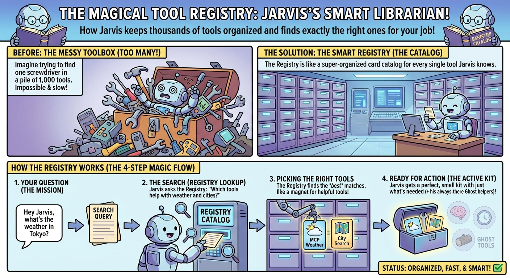

Control which tools are loaded to optimize context window and performance:

```bash
# List all tools and their status
./bin/manage-tools.py list

# Disable a tool
./bin/manage-tools.py disable crypto_price

# Enable a tool
./bin/manage-tools.py enable crypto_price

# Enable all tools
./bin/manage-tools.py enable-all

# Disable multiple tools for local mode (reduce context)
./bin/manage-tools.py disable opencode check_opencode_sessions ingest_intel
```

**Benefits:**
- Reduce token count for local models (Ollama has smaller context windows)
- Create tool profiles (development vs. production)
- Disable experimental/buggy tools without deleting code
- All tools auto-discovered on startup (only enabled ones load)

See [`docs/TOOL_MANAGEMENT.md`](docs/TOOL_MANAGEMENT.md) for details.

---

## 🔄 Workflow Orchestration

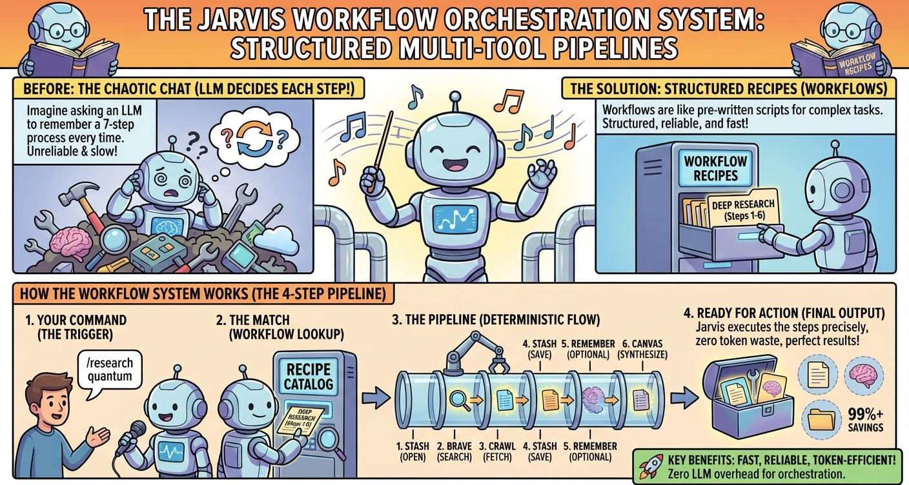

Workflows are deterministic multi-tool pipelines that execute predefined sequences of tools. Unlike normal LLM routing (where the LLM decides which tools to use), workflows guarantee consistent, repeatable execution.

### Workflow Entry Points

| Method | Trigger | Who Decides Tools | Use Case |
|--------|---------|-------------------|----------|
| **LLM Routing** | Any query | LLM analyzes and selects | General questions, flexible tasks |
| **Explicit workflow** | `/command`, API, or schedule | User/task names recipe; JSON defines steps | Repeatable or scheduled automation |
| **Autonomous workflow** | Normal chat/voice request | LLM uses compact `workflow` metadata; JSON defines steps | Reuse an existing recipe without knowing its slash command |

`tool_search` and `workflow` are mandatory discovery candidates only while
enabled in the effective registry. A manifest, tool profile, or Web/request
block can remove either one. Disabling `workflow` turns off autonomous recipe
selection for that surface; it does not disable independent slash commands or
scheduled workflow tasks.

### Workflow Examples

The live list is mode/profile-aware and may also include private
`data/workflows/personal/*.json` recipes. Use `/api/workflows` or the Web slash
picker for the authoritative current surface.

| Command | Description | Tools Used |
|---------|-------------|------------|
| `* [query]` | Search Firefox bookmarks (like * in address bar) | bookmark_search (requires `data/bookmarks.html`) |
| `/archive <url>` | Archive webpage to stash with Canvas summary | crawl_url, stash, canvas |
| `/buying_brief <product>` (also `/price_compare`) | Compare Google Shopping Light, Amazon, and eBay and create a localized buying recommendation | serpapi_google_shopping_light, serpapi_amazon_search, serpapi_ebay_search, stash, canvas |
| `/crypto [coins]` | Crypto prices, news, analysis, email report | get_time, crypto_price, crypto_chart, mcp_brave_search_brave_web_search, crawl_url, stash, canvas, send_email |
| `/deep_dive <url>`, `/dive <url>` | Screenshot + crawl URL, comprehensive canvas summary | screenshot_url, crawl_url, stash, text_summarizer, canvas |
| `/game_brief <sport> <team>` (also `/game_recap`, `/sports_brief`) | Create a current game Canvas brief with status, score, line or period scoring, key performers, and returned watch or recap links; optional Brave sources add narrative context | serpapi_google_sports, optional brave_llm_context, optional mcp_brave_search_brave_web_search, canvas |
| `/github_ai_radar` | Find current GitHub AI project signals and refresh a rolling Canvas report | mcp_brave_search_brave_web_search, brave_llm_context, optional serpapi_youtube_search, crawl_url, stash, canvas |
| `/health [host]` | SSH health check (default: vps2) | get_time, ssh_remote, stash, canvas |
| `/jarvis_self_check` | Check local Jarvis health, refresh its Canvas report, and create a deduplicated alert for problems | get_time, system_monitor, check_tool_logs, query_service_logs, create_alert, canvas |
| `/local_services_compare <service>` (also `/service_compare`) | Compare local providers, screening signals, business details, ratings, and bounded Yelp review excerpts using the active mode location | serpapi_google_local_services, serpapi_google_local, serpapi_yelp_search, stash, canvas |
| `/memory_scan` | Run memory dedupe analysis, save reports to stash + canvas | memory_deduper |
| `/movie_night <mood, constraints, or favorite movies>` (also `/what_to_watch`, `/movie_picker`) | Build a decisive Trakt-based movie shortlist with related-title signals, optional account recommendations and watched-title filtering, TMDB artwork, trailers, current streaming evidence, and a dated Canvas recommendation | trakt_movies, optional trakt_account, optional tmdb_movies, optional serpapi_youtube_search, optional brave_llm_context, canvas |
| `/night_out <occasion or preference>` (also `/date_night`) | Build a date-aware local evening plan; an explicit destination wins, otherwise use the active mode default location/postal code, and weather is skipped when the requested date exceeds the 10-day horizon | optional weather, serpapi_google_local, optional serpapi_yelp_search, optional serpapi_tripadvisor, canvas |
| `/note <text>` | Save note to memory + Canvas | get_time, remember, canvas |
| `/research <topic>` | Multi-source research with Brave + crawling | mcp_brave_search_brave_web_search, crawl_url, stash, remember, canvas |
| `/serpapi_amazon <query>` (also `/amazon_search`, `/serpapi`) | SerpApi Amazon workflow: listings + Stash export + Canvas comparison | serpapi_amazon_search, stash, canvas |
| `/status` | Daily status briefing (weather, crypto, stocks, alerts) | get_time, weather, crypto_price, crypto_chart, stock_price, list_alerts, list_reminders, system_monitor, canvas |
| `/status_visual` | Status briefing + AI-generated dashboard image + same Canvas crypto charts as `/status` | get_time, weather, crypto_price, crypto_chart, stock_price, list_alerts, list_reminders, system_monitor, generate_image, canvas |
| `/team_outlook <sport> <team>` (also `/season_outlook`) | Create a current-centered team outlook with recent and upcoming games, standings, roster context, and optional current news | serpapi_google_sports, optional serpapi_google_news_light, canvas |
| `/trend_reality_check <topic>` (also `/trend_check`) | Test whether a topic shows sustained interest, a transient spike, or weak evidence using topic trends, the seedless current feed, news, and indexed source discovery | serpapi_google_trends, optional serpapi_google_trending_now, optional serpapi_google_news_light, optional serpapi_search_index, canvas |
| `/tv_night <mood, constraints, or favorite shows>` (also `/what_show_to_watch`, `/tv_picker`) | Build a decisive Trakt-based TV shortlist with related-series signals, optional account recommendations and watched-show filtering, TMDB artwork/commitment metadata, trailers, current streaming evidence, and a dated Canvas recommendation | trakt_tv_shows, optional trakt_account, optional tmdb_tv_shows, optional serpapi_youtube_search, optional brave_llm_context, canvas |
| `/upcoming_movie_radar <genre criteria>` (also `/movie_release_radar`, `/upcoming_movies`) | Find a new upcoming movie, maintain a rolling Canvas page per primary genre, and optionally email the pick with shared cross-genre deduplication | get_time, stash, tmdb_movies, optional brave_llm_context, canvas, optional send_email |
| `/upcoming_tv_radar <genre criteria>` (also `/tv_release_radar`, `/upcoming_tv_shows`) | Find a new TV-series premiere in a bounded future window, exclude unwanted genres such as Animation, maintain a rolling Canvas page per primary genre, and optionally email the pick with shared cross-genre deduplication | get_time, stash, tmdb_tv_shows, optional brave_llm_context, canvas, optional send_email |
| `/weather_watch`, `/garden_watch` | Weather watch for default location (`JARVIS_DEFAULT_LOCATION`); alerts for cold, wind, heat, or severe conditions | get_time, weather, create_alert, canvas |
| `/url_ingest <url>` | Crawl URL, create intel file, ingest to memory | crawl_url, stash, text_summarizer, manage_intel, ingest_intel |
| `/vacation_reconnaissance <location>` (also `/vacation_recon`, `/destination_scout`) | Required-location vacation reconnaissance with forecast, attractions, food, local pulse, images, optional Stash evidence, and Canvas | weather, serpapi_tripadvisor, serpapi_google_local, serpapi_google_news_light, serpapi_google_images_light, stash, canvas |
| `/youtube_ingest <url>` | Download video + transcript, summarize, create study brief | youtube_transcript, youtube_video, stash, text_summarizer, canvas |
| `/youtube_research <url>` | Download transcript, summarize, create study notes | youtube_transcript, stash, text_summarizer, canvas |
| `/yt_dlp_release_watch` | Check for a stable yt-dlp release, create Canvas release notes, alert once, and acknowledge it | release_watch, git_release_notes, create_alert |

### Workflow Features

- **Variable System**: Extract parameters from queries, pass data between steps
- **LLM Parameter Filling**: Dynamic parameter resolution via `llm_prompt`
- **Content Validation**: Heuristic validation with min_length, reject_patterns
- **Retry Logic**: Automatic retries with configurable limits
- **Required-Tool Availability**: Disabled, unavailable, or surface-blocked required tools block the recipe; explicit `required: false` tools are skipped and reported as degraded
- **Autonomous Foreground Runs**: Normal orchestration can search compact workflow metadata and wait for one deterministic recipe to finish
- **Safe Follow-Ups**: Web history preserves component Canvas/Stash handles and bounded summaries for later edits or individual tool calls
- **Loop Protection**: One workflow run may start per user request, and Completion Guard does not replay workflow turns

### Token Efficiency

Explicit workflows bypass normal LLM routing overhead, making them ideal for
local models with limited context. Autonomous selection uses a small number of
router calls for discovery and final synthesis, but still avoids sending every
component schema and re-planning every recipe step:

| Execution method | Routing cost |
|------------------|--------------|
| Normal multi-tool chat | Router/tool-schema context can repeat across component turns |
| Explicit slash/API/scheduled workflow | No routing calls; only declared workflow helper/component LLM calls |
| Autonomous `workflow` run | Discovery/final-answer routing plus declared workflow helper/component LLM calls |

The outer autonomous workflow call has no generic 60/75-second subprocess cap;
each component retains its normal or tool-specific timeout. Results are
step-aware and bounded for final synthesis while the canonical Web result
remains available for follow-up extraction.

### API Access

```bash
# List workflows
curl http://localhost:8880/api/workflows | jq

# Execute workflow
curl -X POST http://localhost:8880/api/workflows/crypto_market_report/execute

# View history
curl http://localhost:8880/api/workflows/history | jq
```

See:
- [`docs/WORKFLOW_ORCHESTRATION.md`](docs/WORKFLOW_ORCHESTRATION.md) - Full workflow system documentation
- [`docs/api/WORKFLOWS.md`](docs/api/WORKFLOWS.md) - Workflows API reference
- [`data/workflows/`](data/workflows/) - Workflow JSON definitions

---

## 🧠 Memory System

### Knowledge Base

Stores facts, preferences, and technical information with **hybrid search** (FTS5 + semantic):

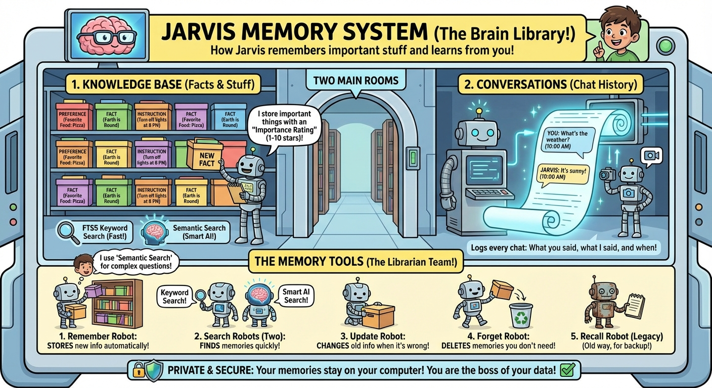

```bash
# Store a fact
"Remember my WireGuard VPN is 192.168.7.0/24"

# Retrieve via keyword search (FTS5 with BM25 ranking)
"Search for VPN network"  # Uses FTS5 for fast, accurate results

# Retrieve via semantic search (AI embeddings)
"What's my VPN network?"  # Uses embeddings for conceptual matching

# View all memories
./bin/memory list

# Tune semantic search sensitivity (in config/cloud.env or local.env)
SEMANTIC_SIMILARITY_THRESHOLD=0.30  # Default: 0.30 (balanced)
# Lower (0.30-0.35) = more results, may include loosely related
# Higher (0.45-0.50) = fewer results, only close matches
```

**Search Strategy:**
- **Keyword/Entity searches** (1-3 words, technical terms): Use `search_memory` → FTS5
- **Natural language questions** (4+ words, conceptual): Use `semantic_recall` → Embeddings

See [`docs/FTS5_SEARCH_SYSTEM.md`](docs/FTS5_SEARCH_SYSTEM.md) and [`docs/SEMANTIC_THRESHOLD_TUNING.md`](docs/SEMANTIC_THRESHOLD_TUNING.md) for details.

### Auto-Save Memory

Jarvis automatically remembers:
- ✅ Project locations and run commands (after OpenCode builds)
- ✅ Working solutions (port conflicts, config changes)
- ✅ URLs and endpoints you create/use
- ✅ Technical facts from intel files
- ❌ Ephemeral data (current time, transient prices)

### Conversation History

Full conversation logging with metadata:
- User queries and responses
- Tools used per session
- Model, tokens, and cost tracking
- Session IDs for grouping

---

## 🧠 Intelligence Layer

The Intelligence Layer is Jarvis's self-learning system. It observes interactions, reflects on what worked and what didn't, and applies learned insights to improve future routing decisions.

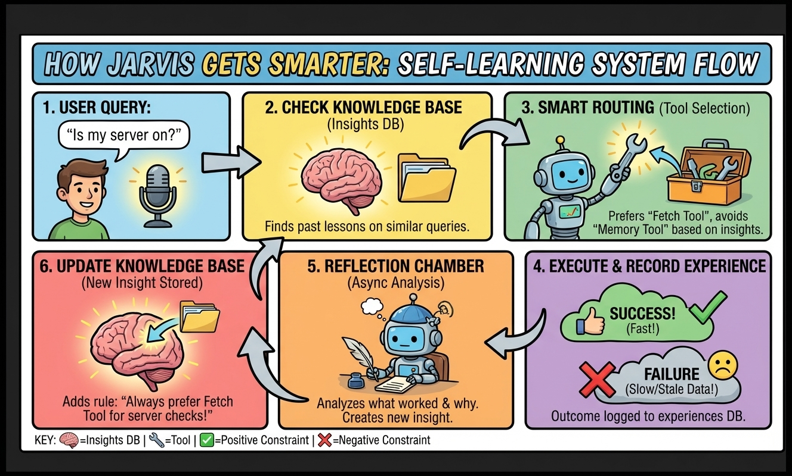


**Key Principles**:
- Everything is continuous (vectors), not discrete rules
- Learning generalizes through semantic similarity
- Positive AND negative constraints (what to do AND what NOT to do)
- Structured negative constraints are request-scoped: a stored trigger must match the clean user request before a tool is penalized
- Fact vs Procedural classification (only skills stored, not facts)
- Generalizability filtering (low-value insights filtered out)

**Experience Recording**:
- Query (as embedding)
- Tools used (in order)
- Turns taken
- Success/failure
- User satisfaction signals
- LLM response & tool results (for content quality eval)

**Insights Generated**:
- Pattern: "Status queries need real-time tools"
- Applies to: "Server health, uptime checks"
- Trigger signals: exact request words/phrases required by narrow negative constraints
- Preferred approach: "Use fetch tools directly"
- Confidence: 0.0-1.0
- Tracking: times_applied, times_helpful, times_failed

**Maintenance Jobs**:
```bash
# Run all maintenance (decay, anomaly, meta-cognition)
./bin/run-intelligence-maintenance.py --watch

# Or via API
curl -X POST http://localhost:8880/api/intelligence/maintenance/all
```

**How Insights Apply**:
When a new query comes in:
1. Generate query embedding
2. Find similar insights (cosine similarity)
3. Weight by confidence and relevance
4. Inject into routing context
5. Track which insights were applied
6. Update helpful/failed counts after interaction

See [`docs/INTELLIGENCE_LAYER.md`](docs/INTELLIGENCE_LAYER.md) for details.


---

## 🤖 OpenCode Integration

OpenCode is an autonomous coding agent that can build entire projects.

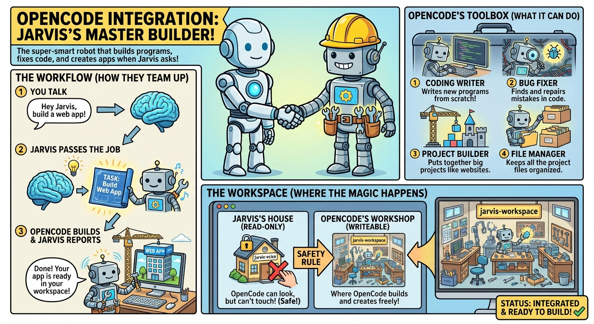

### Usage

```bash
# Via voice
"Use OpenCode to create a Flask API on port 8091"

# Via CLI
./orchestrator/orchestrator_v2.py cloud "Build a Tetris game"
```

### What OpenCode Can Do

- Build web apps (Flask, Express, React)
- Create games (Tetris, Snake, etc.)
- Write scripts and tools
- Install dependencies
- Test and verify builds

### Configuration

```bash
# In cloud.env or local.env (shipped defaults shown)
# cloud: OPENCODE_PROVIDER=xai, OPENCODE_MODEL=grok-build-0.1
# local: OPENCODE_PROVIDER=ollama, OPENCODE_MODEL=gemma4
OPENCODE_PROVIDER="xai"
OPENCODE_MODEL="grok-build-0.1"
OPENCODE_BASE_URL="http://localhost:4096"
```

**Workspace:** All OpenCode projects go to `~/jarvis-workspace/projects/`

See [`docs/opencode/OPENCODE.md`](docs/opencode/OPENCODE.md) for details.

---

## 💾 Database & Costs

### Memory Database (Dual System)

Jarvis uses separate databases for cloud and local modes:

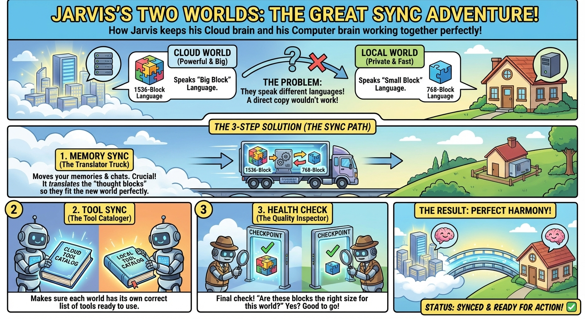


**Cloud Mode** - `data/jarvis_memory.db`:
- Uses OpenAI embeddings (1536 dimensions) by default
- Shared by cloud-mode chat providers, including Ollama Cloud

**Local Mode** - `data/jarvis_memory_local.db`:
- Uses Ollama/nomic embeddings (768 dimensions) by default
- Separate from chat-provider selection

**Auto-Sync**: On startup, newer memories are synced between databases with re-embedded vectors for the target mode's model. See [`docs/DUAL_DATABASE_SYSTEM.md`](docs/DUAL_DATABASE_SYSTEM.md).

**Tables**:
- `knowledge_base` - Facts, preferences, embeddings
- `conversations` - Full conversation history with metadata

### Cost Tracking (Cloud Mode)

Every conversation logs:
- Model used
- Input/output tokens
- Cost in USD
- Tool count
- Execution time

View costs:
```bash
sqlite3 data/jarvis_memory.db "
SELECT
  date(timestamp) as date,
  SUM(json_extract(metadata, '$.cost_usd')) as total_cost,
  COUNT(*) as conversations
FROM conversations
GROUP BY date(timestamp)
ORDER BY date DESC
LIMIT 7;"
```

---

## 📚 Documentation

### Key Documents

**Getting Started:**
- [`config/README.md`](config/README.md) - Configuration guide
- [`config/models/README.md`](config/models/README.md) - Model prompt override config layout
- [`docs/QUICKSTART.md`](docs/QUICKSTART.md) - Quick setup guide
- [`docs/TOOL_CALLING_SYSTEM.md`](docs/TOOL_CALLING_SYSTEM.md) - How tools work
- [`docs/MODEL_PROMPT_OVERRIDES.md`](docs/MODEL_PROMPT_OVERRIDES.md) - Provider/model-specific runtime prompt tuning
- [`docs/SPEECH_TO_TEXT.md`](docs/SPEECH_TO_TEXT.md) - **Speech-to-text** providers, self-hosted Parakeet, fallback behavior, and browser microphone requirements
- [`docs/qwen3-tts/QWEN3_TTS_INTEGRATION_GUIDE.md`](docs/qwen3-tts/QWEN3_TTS_INTEGRATION_GUIDE.md) - **Qwen3-TTS** (28 cloned voices, local network)

**Proactive System:**
- [`docs/api/`](docs/api/) - **Proactive API** documentation (webhooks, alerts, monitoring)
- [`docs/api/API_OVERVIEW.md`](docs/api/API_OVERVIEW.md) - **FastAPI** (Memory, Query, Workflows, Stash, Canvas, Intel, Images, Conversations) ⭐ ENHANCED
- [`docs/api/INTEL.md`](docs/api/INTEL.md) - **Intel API** (CRUD for jarvis-intel files, ingestion, stats)
- [`docs/api/IMAGES.md`](docs/api/IMAGES.md) - **Images API** (Cloudflare CDN upload, multi-agent image sharing)
- [`docs/api/GENERATED_MUSIC.md`](docs/api/GENERATED_MUSIC.md) - **Generated Music API** (generation, readiness, saved-track streaming)
- [`docs/api/WORKFLOWS.md`](docs/api/WORKFLOWS.md) - **Workflows API** (list, execute, history)
- [`docs/service/`](docs/service/) - **Background Services** documentation (daemons, auto-resolve)
- [`docs/tools/scheduled-tasks/scheduled-tasks.md`](docs/tools/scheduled-tasks/scheduled-tasks.md) - **Scheduled Tasks** (scheduler, parser, API, runner, Memory UI)
- **[Jarvis Monitor](https://github.com/bigsk1/jarvis-monitor)** - Docker agent for remote health checks

**Workflow Orchestration:**
- [`docs/WORKFLOW_ORCHESTRATION.md`](docs/WORKFLOW_ORCHESTRATION.md) - **Full workflow system** (pipelines, variables, validation)
- [`docs/api/WORKFLOWS.md`](docs/api/WORKFLOWS.md) - **Workflows API** (programmatic execution)
- [`data/workflows/AGENTS.md`](data/workflows/AGENTS.md) - Workflow building guide
- [`data/workflows/README.md`](data/workflows/README.md) - Workflow recipes reference

**Core System:**
- [`docs/tools/phone/PHONE_CALLS.md`](docs/tools/phone/PHONE_CALLS.md) - **AI Phone Calls** (Vapi.ai, personas, transcripts, contacts)
- [`docs/tools/spotify/SPOTIFY.md`](docs/tools/spotify/SPOTIFY.md) - **Spotify Integration** (playback control, search, multi-device)
- [`docs/tools/generate-music-tool/README.md`](docs/tools/generate-music-tool/README.md) - **Music Generation** (providers, parameters, storage, Audio Gallery, FastAPI)
- [`docs/STASH_SYSTEM.md`](docs/STASH_SYSTEM.md) - **Artifact storage** (multi-step workflows, URL downloads, SSRF protection)
- [`docs/INTELLIGENCE_LAYER.md`](docs/INTELLIGENCE_LAYER.md) - **Self-learning system** (Phase 1: positive/negative constraints)
- [`docs/AUTO_CONTEXT_SYSTEM.md`](docs/AUTO_CONTEXT_SYSTEM.md) - Short-term conversation memory
- [`docs/JARVIS_WORKFLOW.md`](docs/JARVIS_WORKFLOW.md) - Complete request flow with examples
- [`docs/TOOL_CALLING_SYSTEM.md`](docs/TOOL_CALLING_SYSTEM.md) - How tool routing works

**Monitoring & Dashboards:**
- [`monitoring/README.md`](monitoring/README.md) - Grafana + Prometheus + Loki stack
- **Grafana Dashboards:**
  - `Jarvis Intelligence Layer` - Self-learning metrics, insights, confidence
  - `Jarvis - Conversation Audit v2` - Deep drill-down into LLM decisions
  - Plus: LLM Performance, Tool Analysis, API Performance

**Memory System (Updated Nov 2025):**
- [`docs/FTS5_SEARCH_SYSTEM.md`](docs/FTS5_SEARCH_SYSTEM.md) - **NEW**: FTS5 full-text search with BM25 ranking
- [`docs/DUAL_DATABASE_SYSTEM.md`](docs/DUAL_DATABASE_SYSTEM.md) - Cloud/local DB architecture with auto-sync
- [`docs/SEMANTIC_THRESHOLD_TUNING.md`](docs/SEMANTIC_THRESHOLD_TUNING.md) - How to tune similarity threshold
- [`docs/MEMORY_SYSTEM.md`](docs/MEMORY_SYSTEM.md) - Memory & knowledge base overview
- [`docs/MEMORY_SYSTEM_TUNING.md`](docs/MEMORY_SYSTEM_TUNING.md) - Memory system optimization

**Tool Management:**
- [`docs/TOOL_MANAGEMENT.md`](docs/TOOL_MANAGEMENT.md) - Enable/disable tools, create profiles
- [`docs/TOOL_CALLING_SYSTEM.md`](docs/TOOL_CALLING_SYSTEM.md) - How tool system works

**Features:**
- [`docs/opencode/OPENCODE.md`](docs/opencode/OPENCODE.md) - OpenCode integration
- [`docs/MULTI_TURN_ORCHESTRATION.md`](docs/MULTI_TURN_ORCHESTRATION.md) - How tool chaining works
- [`docs/METADATA_SYSTEM.md`](docs/METADATA_SYSTEM.md) - Cost tracking & metadata

**Advanced:**
- [`docs/opencode/OPENCODE_API_REFERENCE.md`](docs/opencode/OPENCODE_API_REFERENCE.md) - Full OpenCode API
- [`docs/opencode/OPENCODE_AGENTS.md`](docs/opencode/OPENCODE_AGENTS.md) - Agent system architecture
- [`docs/mcp/MCP_QUICKSTART.md`](docs/mcp/MCP_QUICKSTART.md) - MCP server integration
- [`docs/ERROR_RECOVERY.md`](docs/ERROR_RECOVERY.md) - Error handling

---

## 🔧 Development

<details>
<summary><strong>Adding a New Tool (click to expand)</strong></summary>

### Adding a New Tool

1. **Create the tool script:**
   ```bash
   nano skills/my_tool.py
   ```

2. **Follow the standard interface:**
   ```python
   #!/usr/bin/env python3
   import sys
   import json

   def main():
       args = json.loads(sys.argv[1]) if len(sys.argv) > 1 else {}

       # Your logic here
       result = do_something(args)

       # Return JSON
       print(json.dumps({
           "ok": True,
           "speech": "Task completed",
           "data": result
       }))

   if __name__ == "__main__":
       main()
   ```

3. **Create tool definition:**
   ```bash
   nano skills/my_tool.tool.json
   ```
   ```json
   {
     "name": "my_tool",
     "description": "What the tool does",
     "input_schema": {
       "type": "object",
       "properties": {
         "param": {"type": "string", "description": "Parameter description"}
       },
       "required": ["param"]
     }
   }
   ```

4. **Make it executable:**
   ```bash
   chmod +x skills/my_tool.py
   ```

5. **Test it:**
   ```bash
   ./orchestrator/orchestrator_v2.py cloud "use my_tool with X"
   ```

The tool will be auto-discovered!

</details>

### Shell shortcuts

Install the managed Bash/Zsh command set with `./update-aliases.sh`. Useful operator commands include `jarvis-d`, `jarvis-start`, `jarvis-start-local`, `jarvis-stop`, `jarvis-status`, and the Web-only `jarvis-web-stop`; `jarvis-cli` and `jarvis-local-cli` run the full text-only orchestrator. Run `jarvis-help` whenever you need the complete shortcut list. See [the install guide](docs/INSTALL_GUIDE.md#step-9-setup-aliases) for explicit Zsh selection.

### Tool Builder

- [Tool Builder](docs/TOOL_BUILDER.md) - Automatically create new tools when capability gaps are detected in feedback or you want a new tool


```bash
./bin/build-tool --mode cloud build "Tool description here"
```


### Testing

```bash
# Deterministic core smoke group (no paid provider calls)
~/jarvis-venv/bin/python -m pytest -q \
  tests/test_docs_integrity.py tests/test_mode_plumbing_scripts.py

# Maintained integration wrappers are also no-cost by default
./tests/integration/test-thinking-mode.sh
./tests/integration/test-opencode-integration.sh

# Explicit live checks (provider cost/logs or OpenCode sessions may apply)
./tests/integration/test-thinking-mode.sh --live cloud
./tests/integration/test-opencode-integration.sh --health cloud

# Test specific tool
./orchestrator/orchestrator_v2.py cloud "remember test fact"
```

See [`docs/TESTING.md`](docs/TESTING.md) for focused suites and the live-test safety boundary. Tests do not rotate or restore active databases.


---

## 🐛 Troubleshooting

<details>
<summary><strong>Troubleshooting (click to expand)</strong></summary>

### Common Issues

**"OpenCode server not reachable"**
```bash
sudo systemctl start opencode-jarvis.service
# or
cd ~/opencode && npm start
```

**"Ollama connection failed"**
```bash
curl http://localhost:11434
ollama serve
```

**"Model not found"**
```bash
ollama pull gemma4
ollama pull nomic-embed-text
```

**"Permission denied" when running a tool script**
```bash
chmod +x skills/*.py
```

**Database issues**
```bash
# Check database
sqlite3 data/jarvis_memory.db ".tables"

# Backup before experiments
cp data/jarvis_memory.db data/jarvis_memory.db.backup
cp data/jarvis_memory_local.db data/jarvis_memory_local.db.backup

# Manual sync between cloud and local databases
./bin/sync-memory-db.py --from local --to cloud  # Sync local → cloud
./bin/sync-memory-db.py --from cloud --to local  # Sync cloud → local

# Tool RAG (tool_definitions) is per-mode and not copied by sync-memory-db — run separately:
./bin/sync-tools.py cloud   # or: local
./bin/sync-tools.py cloud --force   # re-embed every tool (e.g. after embedding model change)

# Prompt evolution sync after using cloud/local prompt tuning
./bin/sync-evolution-db.py local                # Sync cloud prompt versions → local
./bin/sync-evolution-db.py local --update-files # Also refresh local tool description files

# Verify mode-specific databases and embeddings without replacing them
./bin/check-embeddings-health.py --both --json
```

### Logs

Check logs for debugging:
```bash
# Tool execution logs
cat logs/tools/tool-calls-$(date +%Y-%m-%d).jsonl

# OpenCode logs
cat logs/opencode/opencode-$(date +%Y-%m-%d).jsonl

# View recent tool calls
./orchestrator/orchestrator_v2.py cloud "show recent tool logs"
```

</details>

---

## 🎯 Roadmap

<details>
<summary><strong>View roadmap and completed milestones</strong></summary>

**Completed (August 2026) — Search, media discovery, OCR, and workflow UX:**
- ✅ **21 focused SerpApi tools** — Expanded structured search across shopping,
  indexed sources, images, news, trends, events, local places and services,
  maps, sports, hotels, travel, Tripadvisor, Yelp, and YouTube, with quota
  visibility and incident-aware outage diagnostics
- ✅ **Movie and TV discovery** — Added public Trakt and TMDB tools, optional
  read-only Trakt account context, artwork and trailer enrichment, related-title
  recommendations, and watched-title filtering
- ✅ **Movie night and upcoming radars** — Diversified recommendation searches,
  added recurring movie and TV release workflows, separated Canvas pages by
  primary genre, and supported explicit animation/anime exclusions
- ✅ **Multi-tool and workflow result cards** — Repeated tool calls now render in
  execution order, compatible results combine into dedicated workflow surfaces,
  Canvas stays at the end, and skipped steps are distinct from completed or
  failed tools
- ✅ **Optional document OCR** — Added readiness-aware OVIS FastAPI integration
  for scanned PDFs and text-heavy images, with Markdown/JSON extraction,
  follow-up context, bounded timeouts, and graceful disablement
- ✅ **Canvas export and media sharing** — Added themed PDF exports plus retained
  video and audio sharing through xAI-compatible public media
- ✅ **Status and Web UI controls** — Added Web overrides for status-LLM/static
  phrase behavior, expanded dedicated fallback phrases, and slowed conversation
  and result auto-scroll pacing
- ✅ **Workflow and reminder reliability** — Optional unavailable workflow tools
  can be skipped safely, recurring genre radars keep independent pages, and
  stale recurring reminder backlogs no longer replay unexpectedly

**Completed (July 2026) — Web retention, Canvas Gallery, and MCP:**
- ✅ **Pinned-safe Web conversation cleanup** — `cleanup-all` prunes unpinned Web UI conversations after 90 days while preserving pinned conversations
- ✅ **Canvas Gallery favorites** — Generated images can be favorited, filtered, and protected from generated-image cleanup
- ✅ **CDN-aware Gallery sorting** — Images can be sorted by cached Cloudflare URL status without contacting Cloudflare; uncached upload actions ask for confirmation
- ✅ **Credential-free DuckDuckGo MCP** — Hardened Docker search/fetch defaults,
  provider-scoped error normalization, and compact persisted Web follow-up
  evidence for candidates, URLs, pagination, and bounded page excerpts
- ✅ **Complete Web tool follow-up coverage** — Every enabled local/current MCP
  tool has a representative payload test; conventional tools use a bounded
  fallback, complex tools keep dedicated adapters, and router-facing context
  remains strict JSON with explicit truncation metadata

**Completed (June 2026) — v2.52.0 mode plumbing and OpenCode hardening:**
- ✅ **Predictable cloud/local startup** — Shared mode resolution keeps cloud as the default while `./bin/start --local` and per-service launchers load `config/local.env` explicitly
- ✅ **Local-only TUI workflows** — Dedicated Start All and UI-only Local actions retain separate, stoppable tmux controller sessions
- ✅ **Mode-aware UIs and fresh databases** — Every UI reports `startup_mode`; Memory and Intelligence initialize pristine selected-mode databases and default browser selectors accordingly
- ✅ **Docker mode/config parity** — Compose mode reaches every UI, local-only checkouts can omit `cloud.env`, and read-only `config/` plus narrow opt-in overrides expose live configuration safely
- ✅ **OpenCode service isolation** — The systemd unit now renders user-specific paths, starts in `~/jarvis-workspace`, creates workspace subdirectories up front, and pins `TMPDIR` / `TMP` / `TEMP` to `~/jarvis-workspace/temp` so generated projects and scratch files stay out of `~/jarvis-voice` and `/tmp`
- ✅ **OpenCode server auth** — Jarvis and read-only session tools now send HTTP Basic auth from `OPENCODE_SERVER_USERNAME` / `OPENCODE_SERVER_PASSWORD`; install/update scripts copy provider keys and server auth into `~/.config/opencode/jarvis-env.env`
- ✅ **OpenCode model/config defaults** — Added a git-safe `config/opencode.config.json.template`, xAI/Grok Build examples, provider-key setup notes, and safer docs for OpenCode config seeding
- ✅ **OpenCode duplicate-call guard** — `opencode` is now single-call capped per user request, so Jarvis answers from the completed build result instead of launching a second OpenCode pass for summaries or verification
- ✅ **OpenCode observability** — `check_opencode_sessions` remains fallback-only, but now enriches weak OpenCode `/session` metadata with Jarvis JSONL log summaries: task, model, response preview, duration, token usage, and completion status
- ✅ **OpenCode plugin sync** — Install/update scripts sync tracked workspace-protection plugins into `~/.config/opencode/plugin/`, keeping the live OpenCode guardrails aligned with the repo copy

**Completed (May 2026) — v2.50.0:**
- ✅ **OpenAI Responses API routing** — Optional `/v1/responses` path for OpenAI tool-capable routing, gated by `OPENAI_API_MODE=responses` + `OPENAI_RESPONSES_TOOLS=true`, with Chat Completions still the default/fallback path
- ✅ **OpenAI in-flight continuation** — `previous_response_id` + `function_call_output` can continue one active Jarvis client-tool loop without replacing Jarvis memory, Web UI history, follow-up extraction, or canonical tool traces
- ✅ **OpenAI-hosted tools lane** — Separate config and budgets for Responses-hosted `web_search`, `file_search`, and `code_interpreter`, with normalized server-side tool usage and diagnostics
- ✅ **Responses observability + safety** — Adapter-local tool conversion, non-strict schemas, cached-input/reasoning token accounting, prompt-cache hints, continuation fallback reasons, and guardrails so Responses-only payloads do not leak into Chat Completions fallback
- ✅ **Provider result previews + OpenAI vision cleanup** — Tool previews preserve exact source candidates and valid bounded JSON; OpenAI image upload analysis now follows the active OpenAI model and forwards supported `VISION_DETAIL`
- ✅ **Docs + tests** — Added `docs/OPENAI_PROVIDER.md`, refreshed the Responses plan and conversation-state architecture, and covered adapter/continuation/vision preview behavior in tests

**Completed (May 2026) — v2.49.0 → v2.49.1:**
- ✅ **Models & providers** — GPT-5.4 mini support with OpenAI reasoning guardrails; catalog refresh (e.g. `gpt-4o-mini`); Grok 4.3 controls; OpenAI-compatible usage now preserves cached prompt tokens where the API reports them; Anthropic accounting refresh and SDK updates
- ✅ **xAI / Grok** — More stable web chat and calmer native tool use; conversation cache affinity and native continuation; hybrid tool handling and SDK DNS hardening; planning/docs brought in line with current options
- ✅ **Crypto** — Multi-coin pricing; native crypto charts wired into market and status-style workflows (web + canvas)
- ✅ **Memory & Intel UI** — Memory ID search and badges; rendered markdown preview in the intel view; clearer timestamps and retrieval formatting; better insight ID visibility and search; improved follow-up extraction from context
- ✅ **Memory reliability** — Dual-database “forget” behavior unified (sibling mirror, dedupe/opt-out, canvas delete); safer cap on bulk forget; cross-database mutations and intel ingest aligned
- ✅ **Web conversations** — Pin and archive conversations; improved message delivery after reconnects
- ✅ **Jarvis Docs** — Docs Assistant plus a standalone docs reader; mobile layout, theming, and link UX fixes; grounded vs general knowledge behavior documented (QMD / ripgrep retrieval)
- ✅ **Tools & MCP** — Home Depot via SerpAPI; `tool_search`-style discovery flow; tighter Tool RAG typo hints; `complementary_tools` and `permissions` coverage across tools; Blinko integration removed (README/structure refreshed); Brave MCP trimmed (summarizer removed)
- ✅ **Observability & orchestrator** — LLM logs include routing provenance; prompt token counts in logging; Completion Guard policy refactored out of the chat handler; orchestrator context/response formatting cleanup
- ✅ **Voice & workflows** — Reminder/status handling more consistent across voice and status workflows; workflows README/agents/default paths nudged toward the standard Jarvis install layout
- ✅ **Generate image / xAI** — Image-tool model/doc updates aligned with newer xAI image options

**Completed (April 2026):**
- ✅ **xAI native TTS + expressive final speech** — `TTS_PROVIDER=xai` uses xAI's native `/v1/tts` path across CLI/Web UI/Voice API/status playback; optional `XAI_TTS_STYLE_TAGS_ENABLED` lets final chat speech use supported tags while Web UI display strips TTS-only markup and stores generated `audio_url`
- ✅ **Tool RAG extraction + tracing (v2.49)** — Compact current-request extraction keeps long memory/intelligence/history blocks out of the embedding query while the LLM still sees full context; live traces include signal source, thresholds, final tools, schema chars/tokens, and largest schema contributors; see `docs/TOOL_RAG_STRATEGY.md`
- ✅ **Follow-up extraction refactor** — Follow-up data extraction lives in `jarvis-web/server/services/followup_extractor.py`; `crawl_url` and MCP Brave URL candidates are preserved for later turns; Completion Guard treats provider-native tools as evidence when evaluating no-client-tool follow-ups
- ✅ **xAI native search guardrails** — Configurable xAI server-side/native tool caps prevent native search loops from multiplying across router turns; provider-native search usage is retained in conversation/intelligence metadata for audit
- ✅ **Intelligence provenance + safe maintenance** — Insights keep source experience/web conversation, query, tool sequence, preferred sequence, supporting tools, and reflection token/cost metadata; intelligence DB sync preserves those fields; maintenance decay supports dry-run previews
- ✅ **Intelligence Dashboard pagination** — Experiences/Insights use server-side sorted/filtered 50-row pages with automatic scroll loading and lightweight summary facets instead of eager 500/1000-row list loads
- ✅ **Canvas public LAN links** — `CANVAS_INTERNAL_URL` stays local for tool/API calls while `CANVAS_PUBLIC_URL` controls user-facing links; direct `/page_...` URLs work after auth for headless LAN deployments
- ✅ **Tool RAG & embeddings (v2.48)** — Unchanged tools skip re-embedding via stored content hash; `./bin/sync-tools.py <cloud|local> --force` for a full refresh; `./bin/check-embeddings-health.py` reports the effective vector backend (`openai` vs `ollama`) separately from the chat LLM; see `docs/SYNC_ARCHITECTURE.md`, `docs/DUAL_DATABASE_SYSTEM.md`, `docs/EMBEDDING_HEALTH_CHECKS.md`
- ✅ **Jarvis Web UI `/logs`** — Auth-protected log browser: allowed extensions (`.jsonl`, `.log`, `.md`), stable folder navigation, folder search, YAML-style JSONL cards with modal expansion, markdown viewing, mobile drill-down
- ✅ **Orchestrator: duplicate tools & follow-ups** — Repeated identical tool calls no longer end the turn immediately; bounded recovery with duplicate-guard context; better duplicate-prevention synthesis for transcript/stash-style answers; prior tool results carry `result_truncated` / char-count metadata; retries preserve tool cards and orchestrator state
- ✅ **Stash & model overrides** — Conversation follow-ups keep real `stash` tool payloads (not upload-only); model prompt overrides strip `-latest` / `-cloud` suffixes for folder matching
- ✅ **Ollama & install sync** — `OLLAMA_CONTEXT_WINDOW` applied broadly; explicit tool-contract guidance and retries; thinking disabled unless intended; `sync-memory-db` / `sync-evolution-db` repair paths for fresh targets and older DBs
- ✅ **SerpAPI / Amazon / Canvas** — Stronger Amazon shopping in `serpapi_amazon_search`; Web UI product preview cards; shortlist context for “tell me more” follow-ups; Canvas supports embedded images and recovers inline `Image: https://…` product lines
- ✅ **Embeddings & routing hygiene** — Embedding fallback surfaced in tool results/logs (`fallback_embeddings`); OpenAI tool schemas sanitized for cross-provider compatibility; shared cloud model catalog; Web UI defaults follow env-configured models; prompt enhancer + shopping guidance tightened
- ✅ **Scheduled task notifications** — Email, alerts, and webhooks on success/failure (deduped per run); run history shows delivery outcomes; notification UX polish
- ✅ **Alerts & Weather Watch** — `create_alert` as a first-class tool; Memory UI **Alerts** tab; **Weather Watch** workflow (`/weather_watch`, `/garden_watch`) with Canvas report and condition-based alerts (`create_alert`)
- ✅ **TTS stack** — Central `lib/tts_normalizer.py`; named profiles (e.g. `weather_watch`, `camera_alert`, `price_quote`, `timestamped`); `/api/voice/speak` optional `profile` parameter
- ✅ **OpenCode** — Respects `OPENCODE_PROVIDER` / `OPENCODE_MODEL`; optional memory via `OPENCODE_INCLUDE_MEMORY`; Completion Guard excludes `opencode`; stronger summaries and “Open session” links in Web UI tool cards
- ✅ **Completion Guard refinements** — AI Config overrides for guard eval provider/model; judge `tighten_only` (no repair) settles as `auto_accepted`; post-repair wording-only uses status `tighten_only`; clearer evaluator provider chain; provider formatter errors don’t leak raw gRPC/safety strings

**Completed (March 2026):**
- ✅ **Completion Guard** — Post-answer “was this actually done?” control loop (Jarvis Web) ⭐ MAJOR
  - Manual (Yes/No card with countdown) and auto modes with structured scoring + threshold (`JARVIS_COMPLETION_GUARD_AUTO_THRESHOLD`, AI Config overrides)
  - One bounded repair pass in the same session; optional markdown tickets under `logs/completion-guard/`
  - **Feedback + Intelligence**: explicit async Web feedback waits for guard settlement; outcomes update the same experience via `update_experience_from_completion_guard` (repair folds corrected answer/tools into learning; expired/superseded manual prompts settle neutrally)
  - See: [`docs/COMPLETION_GUARD.md`](docs/COMPLETION_GUARD.md), [`docs/FEEDBACK_SYSTEM.md`](docs/FEEDBACK_SYSTEM.md), [`docs/INTELLIGENCE_LAYER.md`](docs/INTELLIGENCE_LAYER.md)
- ✅ **Web UI polish & controls**
  - Per-session overrides for Q&A word limit, multi-turn limit, response style (with changelog/version bumps on release)
  - Markdown-rendered source links open in a new tab; workflow step errors surface on tool cards when a step fails
  - Fix: final response shape / `server_side_tools` reliably surfaced to the client in edge cases
- ✅ **Routing & live data**
  - Tool-result freshness hints (`executed_at`, TTL, `authoritative_live`) and guard against redundant live tool calls when data is still fresh
  - Post-process strip of unsolicited “check canvas” claims when canvas was not used; router prompt rules for honesty and flexibility (refresh vs history)
- ✅ **Weather** — True multi-day outlook: daily forecast via Open-Meteo when `forecast` is true and `days` > 1 (`skills/weather.py`, `weather.tool.json`)
- ✅ **Stock price** — Proxy chain `LOCAL_PROXY` → `LOCAL_PROXY2` → direct on tunnel-style failures (`skills/stock_price.py`; see [`docs/NETWORK_PROXY.md`](docs/NETWORK_PROXY.md))
- ✅ **Workflow UX** — Per-step and per-`for_each` item `duration_ms`; WebSocket tool cards show real timings for `/status-visual` and similar runs
- ✅ **OpenAI defaults & cost** — Default chat model moved toward `gpt-5.4-nano`; cost estimator updates for newer OpenAI SKUs (`docs` / `lib/cost_estimator.py` aligned in-repo)
- ✅ **Safety & tool quality** — Stronger speech sanitization for TTS (links, stash refs, noise); canvas rejects truncated/unresolvable URLs in sources
- ✅ **Reliability** — MCP client deadlock fix (Brave Search container no longer hung on nested lock); reminder time parsing normalizes `a.m.` / `p.m.` variants
- ✅ **Search & workflows** — SerpAPI can optimize conversational queries (`query_effective`); workflow/canvas improvements so `source_query` and payload size don’t truncate ranked lists
- ✅ **Integrations** — UniFi Protect webhook: recover auto-ack when Jarvis alerts POST times out (find pending alert + acknowledge)
- ✅ **Scheduled tasks** — Runner service + `schedule_task` tooling; logs under `logs/services/` (see [`docs/service/README.md`](docs/service/README.md)); Memory Browser / management UI improvements where applicable
- 🧹 **Housekeeping** — Ruff Pass 1 unused-import cleanup on runtime paths; continued doc sync (metadata, error recovery vs completion guard)
- ✅ **Reminders: full Memory UI management tab**
  - Added a dedicated Jarvis Memory `Reminders` tab with local-time display, status filters, sorting, detail modal, and CRUD-style management
  - Added acknowledge-one and acknowledge-all-triggered flows directly in the UI
  - Added permanent delete support for reminders in the manager and API paths, in addition to cancel
  - Replaced the raw recurrence-rule text box with a friendly recurrence picker for `Once`, `Daily`, `Weekly`, and `Monthly`
  - Added proper `DAILY` rescheduling support in `services/reminder_scheduler.py` so daily reminders now repeat correctly

**Completed (February 2026):**
- ✅ **ElevenLabs v3 TTS** - Upgraded to latest TTS model
  - 68% error reduction for numbers, scores, times, symbols
  - Configurable voice settings via `ELEVENLABS_TTS_STABILITY`, `_SIMILARITY_BOOST`
  - v3 requires stability 0.0/0.5/1.0; v2 settings preserved for fallback
  - TTS cache key includes voice settings (auto-invalidates on change)
- ✅ **Server-side Tools Notification** - Toast when provider uses native search
  - Shows "🔍 Server-side: X Search" when xAI/Anthropic use built-in tools
  - No more digging in logs to see if native search was used
- ✅ **Speech Formatting Improvements** - Cleaner voice output
  - `stash://` references stripped from casual/auto mode speech
  - Long URLs (>30 chars) removed or simplified
  - File paths simplified to just filename
  - Technical refs preserved in `detailed` mode and internal LLM processing
- ✅ **TTS Cache Management** - Granular cache control
  - `./bin/status-cache clear cloud` - clear native + Web cloud status cache
  - `./bin/status-cache clear local` - clear native + Web local status cache
  - Dashboard TUI updated with new cache commands
- ✅ **Dashboard Security & Features** - Safer config viewing
  - Removed commands that exposed API keys
  - Added Port Check (shows ✅/❌ for all Jarvis services)
  - Added View Crontab, DB Sizes, Ghost Tools, MCP Servers
- ✅ **xAI Image Generation** - Fast & cheap image generation
  - Added `xai` provider to `generate_image` tool (grok-imagine-image model)
  - **$0.02/image** - 10x cheaper than alternatives!
  - **Batch generation**: `n=1-10` for multiple variations in one request
  - All batch images saved to same stash space with individual refs
  - Works with all existing tools (canvas, email, gallery, CDN upload)
  - Set `IMAGE_TOOL_PROVIDER=xai` or use `provider: "xai"` per-request
  - See: [`docs/api/GENERATED_IMAGES.md`](docs/api/GENERATED_IMAGES.md)
- ✅ **Real-time Progress Events** - See tool execution as it happens
  - WebUI shows "Using weather...", "Using brave_search..." during processing
  - Tool cards appear with status (pending → complete with duration)
  - Toggle in Settings → "Progress Events"
- ✅ **Stop Button** - Graceful cancellation of long-running tasks
  - Red stop button appears during processing
  - Returns partial results instead of full abort
- ✅ **Mobile Layout Fixes** - WebUI works on small screens (iPhone 13 Pro, etc.)
  - Action buttons (upload, enhance) remain visible at 428px width
  - Native mobile keyboard provides mic functionality
- ✅ **Voice Compression Fix** - Named entities preserved in spoken summaries
  - Movie titles, restaurant names no longer stripped from voice output
  - Configurable word limit via `JARVIS_MULTI_TURN_WORD_LIMIT`
- ✅ **System Prompt Refinements** - LLM self-review improvements
  - Fixed tool name mismatches (`mcp_fetch` → `mcp_fetch_fetch`)
  - Consolidated reminder/alert rules
  - Clarified memory fallback and native search behavior

**Completed (January 2026):**
- ✅ **Optional API Authentication** - Bearer token auth for Jarvis API
  - Toggle via `JARVIS_API_AUTH=true/false` in cloud.env/local.env
  - Localhost always whitelisted, public paths always accessible
  - API keys never logged, remote services (jarvis-monitor, unifi-protect-webhook) updated
  - See: [`docs/SECURITY_HARDENING.md`](docs/SECURITY_HARDENING.md)
- ✅ **Docker Monitoring Fixes** - `host.docker.internal` for container-to-host connectivity
- ✅ **UFW Firewall Documentation** - Essential ports added to INSTALL_GUIDE.md
- ✅ **Generated Images API** - Full management of local generated images
  - List, search, download, delete, generate images via API
  - `upload_to_cdn` parameter for one-step generate + CDN upload
  - CDN catalog caches URLs for instant retrieval (no re-uploads)
  - Image Gallery UI in Canvas for visual browsing
  - See: [`docs/api/GENERATED_IMAGES.md`](docs/api/GENERATED_IMAGES.md)
- ✅ **Service Resilience** - Daemon crash prevention ⭐ ENHANCED
  - Retry logic with exponential backoff for database locks
  - Self-healing daemon monitors systemd services and sibling daemons
  - PID + cmdline verification prevents false positives
- ✅ **Log Management** - Automated cleanup for logs, audio, images, stash
  - `cleanup-logs`, `cleanup-audio`, `cleanup-all` scripts
  - API request logging with `jq` analysis commands
  - See: [`docs/api/LOGGING.md`](docs/api/LOGGING.md)
- ✅ **Canvas Pin → Stash Pin Sync** - Image preservation
  - Pinning canvas page auto-pins referenced stash spaces
  - Prevents image breakage from stash TTL expiration
- ✅ **Cloudflare Images API** - Permanent CDN hosting for images
  - Upload from file, URL, base64, or stash reference
  - Organized paths with metadata tracking
  - Multi-agent support for Samantha image sharing
  - See: [`docs/api/IMAGES.md`](docs/api/IMAGES.md)
- ✅ **Samantha Multi-Agent Integration** - Secondary AI assistant on VPS
  - `samantha` tool for real-time chat via OpenAI-compatible API
  - Fire-and-forget webhooks for Discord/Telegram posting
  - Samantha can POST back to Jarvis API (intel, canvas, alerts, voice)
  - Priority levels (urgent/normal/background) and configurable timeouts
- ✅ **Voice API Multi-Agent Support** - Per-request TTS provider/voice override
  - `/api/voice/speak` accepts `tts_provider` and `voice` parameters
  - Jarvis uses ElevenLabs, Samantha uses Qwen3-TTS "Samantha" voice
  - See: [`docs/api/VOICES.md`](docs/api/VOICES.md)
- ✅ **Qwen3-TTS Integration** - Local network TTS with 28 cloned voices
  - OpenAI-compatible API (free, fast, high quality)
  - Custom voices: Jarvis, Paddington, Professor, Victoria, Samantha, and more
  - Works in both cloud and local modes
  - See: [`docs/qwen3-tts/QWEN3_TTS_INTEGRATION_GUIDE.md`](docs/qwen3-tts/QWEN3_TTS_INTEGRATION_GUIDE.md)
- ✅ **Orchestrator `--speak` Flag** - CLI voice output without wake word
  - `./orchestrator/orchestrator_v2.py cloud "query" --speak`
  - Uses appropriate TTS script based on mode
- ✅ **Intel API** - Full CRUD for jarvis-intel knowledge files
  - `GET /api/intel/stats`, `GET /api/intel`, `POST /api/intel`, `PUT/DELETE /api/intel/{filename}`
  - Auto-ingest option, sync/async ingestion modes
  - See: [`docs/api/INTEL.md`](docs/api/INTEL.md)
- ✅ **URL Ingest Workflow** - `/url_ingest <url>` to crawl any URL, create intel file, ingest to memory for RAG
- ✅ **System Prompt Validator** - LLM-powered debugging tool for prompt engineering
  - `./bin/validate-system-prompt --tools --issue "..."` - Root cause analysis for unexpected Jarvis behavior
  - Supports Anthropic, xAI, OpenAI providers
  - Outputs recommended fixes with diff format
  - See: [`docs/SYSTEM_PROMPT_VALIDATOR.md`](docs/SYSTEM_PROMPT_VALIDATOR.md)
- ✅ **Meta-Response Fix** - Synthesizes actual answers instead of "I used X tools"
- ✅ **System Prompt Improvements** - Memory-first exceptions, redundancy rule clarification, music playback guidance
- ✅ **Feedback Tab in Intelligence Dashboard** - View all feedback logs in a friendly UI
  - Filter by rating (All, Issues 1-3, Good 4-5) and time range (7, 30, 90 days)
  - Stats bar with average rating, total count, and issue rate percentage
  - Expandable feedback cards with detailed issues, suggestions, tool ratings
  - No more terminal/log file browsing required
- ✅ **Workflow Orchestration System** - Deterministic multi-tool pipelines ⭐ MAJOR
  - **Explicit command triggers**: `/archive`, `/research`, `/note`, `/health`
  - **Pipeline executor**: Executes workflow steps deterministically (bypasses LLM tool selection)
  - **Variable system**: Extract from query, step results, nested paths (`${article.url}`)
  - **LLM parameter filling**: `llm_prompt` for dynamic parameter resolution
  - **Content validation**: Heuristic validation with min_length, reject_patterns
  - **WebUI integration**: Hover tooltips for workflows/prompts, tool cards, server logs
  - **Replaced /commands**: Workflows are the new standard for multi-tool tasks
  - Pre-built workflows: web_archive, deep_research, quick_note, server_health_check
  - See: [`docs/WORKFLOW_ORCHESTRATION.md`](docs/WORKFLOW_ORCHESTRATION.md), [`data/workflows/`](data/workflows/)
- ✅ **Comprehensive FastAPI Expansion** - Full programmatic access ⭐ MAJOR
  - Memory API (CRUD, keyword/semantic search, stats)
  - Query/Chat API (POST /api/query/quick)
  - Conversations API (read-only history)
  - Stash API (read-only artifacts)
  - Canvas API (read-only pages)
  - Intelligence API (reflection management)
  - Dark mode Swagger UI at /docs/dark
- ✅ **Canvas Tool Read Action** - Read pages for verification/troubleshooting
- ✅ **Intelligence Interval Protection** - Prevents decay job compounding
- ✅ **Multi-day Reminders** - "Set reminder for next 5 days at 2pm"
- ✅ **Dashboard API Commands** - 27 API commands (was 6)
- ✅ **Stock Price Tool** - Stock, futures, and commodity prices via yfinance
  - Supports tickers (TSLA, AAPL) and company names (Tesla, Apple)
  - Futures: GC=F (gold), SI=F (silver), CL=F (oil), NG=F (natural gas)
  - Forex pairs: EURUSD=X, USDJPY=X, etc.
  - Uses `LOCAL_PROXY` / `LOCAL_PROXY2` via shared HTTP proxy logic ([`docs/NETWORK_PROXY.md`](docs/NETWORK_PROXY.md))
- ✅ **Status Recap Tool v1.4** - Comprehensive daily status aggregator
  - Weather, crypto (BTC, SOL), stocks/futures (TSLA, gold, silver defaults)
  - Alerts, reminders, system health (CPU, RAM, disk, uptime)
  - Saves full report to Canvas + Stash for follow-up queries
  - Optional AI-generated dashboard image (Gemini)
  - Native grounding search for news when enabled
  - Direct speech mode prevents LLM price mangling
  - See: [`docs/tools/status-tool/README.md`](docs/tools/status-tool/README.md)
- ✅ **Tool Builder v2.0** - Network/proxy auto-fix enhancement
  - Auto-detects network errors during tool verification
  - Injects proxy configuration instructions on retry
  - Patterns: `get_proxy_config()` / `http_request` from `lib/http_client.py`, env vars for yfinance-style libs
  - See: [`docs/TOOL_BUILDER.md`](docs/TOOL_BUILDER.md), [`docs/NETWORK_PROXY.md`](docs/NETWORK_PROXY.md)

**Completed (December 2025):**
- ✅ **Deep Memory Search** - Multi-source search across all Jarvis data repositories
  - Searches memory, conversations, web conversations, intel files, canvas pages, stash artifacts
  - Uses ripgrep for blazing-fast file content searches with JSON output
  - Unified results with source labels, deduplication, date filtering
  - "Find everything I know about Python" → searches everywhere at once
- ✅ **ElevenLabs Music Generation** - AI music creation
  - Genre, mood, tempo, instrumental mode, 30-300 second duration
  - Auto-saves to stash + memory for recall
  - Web UI inline audio playback
- ✅ **Audio Playback Controls** - Enhanced TTS in Web UI
  - Speaker button with pause/resume (click), stop (double-click)
  - Progress animation, 10-second visibility after playback
  - Auto-hides when typing new message
- ✅ **New @prompts** - Context-first prompt injection
  - `@generate_music` - Provider-safe best practices for music prompts
  - `@email` - Professional email composition with send_email format
  - `@daily` - Daily briefing (time, weather, reminders, crypto)
  - Prompts now inject BEFORE user message for better LLM context
- ✅ **Intelligence Dashboard** - Visual dashboard for self-learning
  - Experience sorting (date, turns, tool count, Completion Guard status) & filtering (success/fail, tool count, specific tool, Completion Guard status)
  - Experience details show configured-local + UTC timestamps, Completion Guard metadata, and stored raw JSON
  - Insight sorting (times applied, helpful, preferred/avoided tools, confidence, updated)
  - 5-tier confidence filtering: Elite (96%+), High (85-95%), Good (75-84%), Medium (50-74%), Low (0-49%)
  - Differentiated confidence bars: green shades for DO, red/orange for DON'T
  - Tool visibility on cards: shows preferred (👍) and avoided (👎) tools inline
  - Tool performance table showing ALL tools with prefer/avoid counts and net score
  - Stats include optional lifetime Completion Guard repaired/status totals
  - Mobile responsive at ≤730px: hamburger menu, slide-out sidebar
  - Launch: `./bin/jarvis-intelligence` (localhost:5003)
- ✅ **Memory Browser UI** - Web interface for memory management
  - View, search, add, edit, delete memories from `knowledge_base`
  - Intel file manager: create, upload, edit, delete, ingest `.md`/`.txt` files
  - Conversation browser with full detail popup
  - Statistics dashboard with category breakdown and embedding health
  - FTS5 search (no LLM required), dual database (cloud/local) switching
  - Memory health indicators: size badges (S/M/L/XL), missing embedding warnings
  - Re-embed button: regenerate embeddings after manual text edits
  - Mobile responsive at ≤730px: hamburger menu, slide-out sidebar
  - Cross-UI navigation: 🧠 Memory and 📊 Intelligence links in all dashboard headers
  - Launch: `./bin/jarvis-memory` (localhost:5002)
- ✅ **Canvas Mobile Responsive** - Hamburger menu and slide-out sidebar at ≤730px
- ✅ **Jarvis Web UI v2.0** - Full-featured web interface
  - **Audio playback controls**: Speaker button with pause/resume/stop
  - **Music playback**: Generated music plays inline
  - **New @prompts**: `@generate_music`, `@email`, `@daily` with context-first injection
  - **Server Logs Panel**: Real-time LLM + Tool streaming at bottom of UI
  - **`/logs` Log Viewer**: Dedicated read-only log browser with auth protection, mobile drill-down navigation, folder/file search, lazy loading, YAML-style JSONL rendering, and markdown viewing
  - **Color-coded logs**: LLM (purple), Tools (green), with success/error status
  - **Expandable details**: Click log entry to see full parsed JSON
  - **Slash commands**: `/canvas`, `/search`, `/recall`, `/detailed` - modify behavior
  - **@prompts**: `@research`, `@quick`, `@compare` - inject methodologies
  - **✨ Enhance with AI**: Magic button transforms rough input into optimal prompts
  - **Conversation search**: Quick filter + deep search across all messages
  - **Export/Import**: Download as JSON/Markdown, restore from JSON
  - **Image upload**: Drag-drop/paste/click with multi-image vision analysis
  - Real-time WebSocket chat with tool streaming
  - See: [`docs/JARVIS_WEB_UI.md`](docs/JARVIS_WEB_UI.md)
- ✅ **AI Image Generation & Editing (Gemini/OpenAI/xAI)** - Multi-provider image generation ⭐ ENHANCED
  - **3 providers**: Gemini (grounding), OpenAI (best text), xAI (fast & cheap!)
  - **Image-to-image editing**: Upload image → describe changes → edited image (all 3 providers)
  - **Image Action Modal**: Upload images → choose Analyze (multi-image), Image-to-Image, or Image-to-Video
  - **xAI Grok Imagine**: $0.02/image, batch generation `n=1-10` for variations
  - "Generate a bitcoin infographic with current price" → Gemini creates with real data
  - Aspect ratios (1:1, 16:9, 9:16, 3:4, etc.), styles, negative prompts
  - **Gemini Search Grounding** - Images can include real-time data (weather, prices, news)
  - Auto-saves to stash + memory for cross-session recall
  - Multi-tool workflows: generate → email, generate → print, generate → canvas
  - See: `skills/generate_image.py`, [`docs/tools/generate-image-tool/README.md`](docs/tools/generate-image-tool/README.md)
- ✅ **AI Video Generation (xAI Grok + Gemini Veo)** - Dual-provider video generation
  - "Generate a video of a cat playing with a ball" → xAI/Gemini creates video
  - xAI: 1-15s, 7 aspect ratios, video editing | Gemini: 4/6/8s, native audio, 4K
  - Text-to-video, image-to-video, video editing modes
  - Video player in jarvis-web chat, API endpoints for management
  - See: [`docs/tools/video/README.md`](docs/tools/video/README.md)
- ✅ **Stash + Memory Architecture** - Unified artifact workflow
  - **Stash** = Workshop (temporary files, 7-day TTL, `stash://` references)
  - **Memory** = Index (permanent entries pointing to stash locations)
  - `safe_resolve_file()` gracefully handles expired stash with fallbacks
  - All artifact tools now: save to stash → create memory entry → enable multi-tool
- ✅ **AI Phone Calls via Vapi.ai** - Outbound AI phone calls
  - "Call Boss and ask about dinner plans" → Jarvis calls, has conversation, reports back
  - Multiple personas: Jarvis (default), James (professional), Jay (casual), Samantha (female)
  - Custom Vapi dashboard assistants with `{{owner}}`, `{{task}}`, `{{reason}}` variables
  - Voicemail detection: hangup, leave message, or disabled
  - Sync mode (wait 60s for result) or async mode (check later)
  - Auto-save transcripts to Canvas (`Phone Calls/` folder) and memory
  - Contact book: "Save Andrew's number as +15551234567"
  - See: [`docs/tools/phone/PHONE_CALLS.md`](docs/tools/phone/PHONE_CALLS.md)
- ✅ **Spotify Integration** - Full music playback control
  - "Play my Chill Vibes playlist", "Skip", "What's playing?", "Pause"
  - Searches your saved playlists/library first, then public Spotify
  - Multi-device support (Fire TV, Echo, phone, desktop, etc.)
  - Queue songs, shuffle, repeat, volume control
  - Share currently playing via email with album art and Spotify link
  - OAuth setup via `./bin/spotify-auth`
  - See: [`docs/tools/spotify/SPOTIFY.md`](docs/tools/spotify/SPOTIFY.md)
- ✅ **Native Web Search** - Built-in real-time search for cloud providers
  - `XAI_SEARCH=true`: Grok live search (web + X posts, auto mode)
  - `ANTHROPIC_SEARCH=true`: Claude's web search tool with citations
  - No external tool calls - cleaner context, faster responses
- ✅ **Network Tools** - Network diagnostics (ping, DNS, port, HTTP/HTTPS, traceroute)
  - Enhanced ping with min/avg/max/loss statistics
  - HTTP/HTTPS checks with SSL verification and response times
  - Port connectivity with latency measurement
  - Cross-platform traceroute support
- ✅ **System Monitor** - Real-time system resource monitoring
  - CPU usage (total + per-core), memory (RAM + swap)
  - Disk usage per mount point, process list (sortable)
  - Network I/O stats, system uptime with boot time
- ✅ **Text Summarizer** - Text processing and analysis
  - Extractive summarization, keyword extraction
  - Word/character/sentence counting, sentiment analysis
- ✅ **Prompt Evolution System** - Self-evolving prompts ⭐ MAJOR
  - Auto-improves tool descriptions based on feedback (1-5 rating scale)
  - System prompt suggestions saved to Canvas for manual review
  - A/B testing, versioning, auto-rollback on degradation
  - Random feedback collection (`FEEDBACK_RANDOM_ENABLED=true`)
  - `./bin/evolve-prompts check cloud` - See what needs improvement
  - `./bin/evolve-prompts auto cloud` - Generate and deploy
  - See: [`docs/ADVANCED_AI_TECHNIQUES.md`](docs/ADVANCED_AI_TECHNIQUES.md)
- ✅ **Dynamic Tool Builder** - Autonomous tool creation ⭐ MAJOR
  - Creates new tools when capability gaps detected
  - **Duplicate detection** - Checks ALL existing tools (local + MCP + auto-tools)
  - **Ouroboros Research** 🐍 - Tool Builder calls Jarvis for live API research!
  - API key awareness (flags tools needing new credentials)
  - Syntax verification, import checks, runtime testing
  - Dependency gating (new packages require human approval)
  - Full audit trail with report cards + Grafana dashboard
  - `./bin/build-tool --mode cloud build "Check URL accessibility"`
  - See: [`docs/TOOL_BUILDER.md`](docs/TOOL_BUILDER.md)
- ✅ **Canvas System** - Visual knowledge viewer
  - Beautiful dark web UI at localhost:8890
  - Jarvis saves research, comparisons, code to visual pages
  - Evolution suggestions now auto-create Canvas pages
  - Markdown rendering, syntax highlighting, live reload
  - Search, pin, edit, delete - all auto-saved to memory
  - Launch: `./bin/jarvis-canvas`
- ✅ **Calculator Tool** - Advanced calculations
  - Arithmetic, percentages (15% of 200), statistics (mean, stdev)
  - Unit conversions (miles↔km, °F↔°C, GB↔TB, cups↔ml)
  - Trig (sin, cos, tan with degree variants), logarithms, factorials
- ✅ **Feedback System** - LLM self-critique
  - `--feedback` flag for per-query feedback
  - `./bin/jarvis-feedback` CLI (run, batch, summary, issues)
  - Cross-model grading (FEEDBACK_PROVIDER/FEEDBACK_MODEL)
  - Per-tool rating attribution (multi-tool fairness)
  - Full context analysis (system prompt, tools, intelligence)
- ✅ **Dashboard Enhancements** - 70+ commands
  - Evolution commands (check, list versions, auto, history)
  - Tool builder commands (list pending, approve, reject)
  - Canvas, feedback, monitoring commands
  - Unique tmux sessions per service

**Completed (November 2025):**
- ✅ **Command Dashboard TUI** - Interactive terminal UI for all Jarvis commands
  - 60+ commands organized by category
  - Search/filter, tab navigation, live system status
  - Run any command with Enter, view output in real-time
  - Launch: `./bin/jarvis-dashboard` or `jarvis-d` alias
- ✅ **Status Updates System** - Real-time voice progress during tasks ⭐ MAJOR
  - LLM dynamic summaries (gpt-4o-mini/qwen3 generates natural phrases without delaying tools)
  - Tool-aware updates (opencode, search, weather, fetch)
  - Debounce, deadline fallback, rate limiting, error deduplication, and final-audio priority
  - Cloud (ElevenLabs/OpenAI) + Local (Kokoro) TTS support
  - Phrase modes (`normal` / `unhinged`), native/Web status caching, silence padding
  - Cache management: `./bin/status-cache clear [cloud|local|all]`
  - Current guide: `docs/STATUS_UPDATES.md`
- ✅ **Weather Tool** - OpenWeatherMap with geocoding for accurate locations
- ✅ **Intelligence Layer Phase 1.5** - Full insight lifecycle ⭐ MAJOR
  - Positive AND negative constraints (what to do AND what NOT to do)
  - Fact vs Procedural knowledge classification
  - Generalizability filtering, confidence decay tracking
  - **Insight tracking**: times_applied, helpful, failed now active
  - **Decay job**: Auto-prunes stale insights (<0.15 confidence)
  - **Anomaly detection**: Flags unusual experiences (high turns)
  - **Meta-cognition**: Detects blind spots, learning issues
  - **13 log events** for full Grafana/Loki visibility
  - Grafana dashboard with real-time metrics
  - API endpoints for debugging (`/api/intelligence/*`)
  - Maintenance CLI (`./bin/run-intelligence-maintenance.py`)
  - Health check and sync tools
- ✅ **Conversation Audit v2 Dashboard** - Deep drill-down into LLM decisions
  - Tools selected vs executed comparison
  - Activity timeline (LLM + Tool logs interleaved)
  - Cost/token tracking over time
- ✅ Multi-turn tool orchestration
- ✅ **xAI Grok integration** (`grok-4.3` default, automatic caching, configurable reasoning)
- ✅ **Google Calendar bidirectional sync** (reminders ↔ events via n8n workflows)
- ✅ **Monitoring Stack** (Grafana + Prometheus + Loki for real-time observability)
- ✅ **LLM Call Logging** (comprehensive telemetry: cost, latency, tokens, multi-turn analysis)
- ✅ **Modular webhook system** (send_email, send_webhook with auth support)
- ✅ **Email tool** (contact management, HTML templates, SMTP via n8n)
- ✅ **Ghost tools pattern** (critical tools prioritized in Tool RAG, capped with the rest of the final schema set)
- ✅ **Disaster recovery guide** (complete system rebuild documentation)
- ✅ **FTS5 full-text search** with BM25 ranking (faster, more accurate keyword searches)
- ✅ **Auto-context system** (short-term conversation memory across wake word cycles)
- ✅ **Comprehensive burn test** (modular test suite for all features)
- ✅ Intelligent memory system with **hybrid search** (FTS5 + semantic embeddings)
- ✅ **Proactive API & Background Services** (webhooks, auto-resolve, monitoring)
- ✅ **Dual database system** (cloud/local with auto-sync)
- ✅ **Tool management** (enable/disable per mode)
- ✅ **Model comparison framework** with AI analysis
- ✅ **Configurable semantic threshold** tuning
- ✅ **Dynamic wake word greetings** for personality
- ✅ **Voice timeout system** for noisy environments
- ✅ OpenCode integration
- ✅ Cost tracking and metadata logging
- ✅ MCP server support (with snake_case enforcement)
- ✅ Auto-save intelligence
- ✅ Conversation history

**Planned (Advanced AI - See [`docs/ADVANCED_AI_TECHNIQUES.md`](docs/ADVANCED_AI_TECHNIQUES.md)):**
- ✅ **Phase 3: Self-Evolving Prompts** - COMPLETE! Auto-improve prompts, A/B testing, rollback
- ✅ **Phase 4: Dynamic Tool Creation** - COMPLETE! In-house tool builder with safety checks
- **Phase 5: Parallel Subagents** - Concurrent execution for multi-part queries (3x speedup)
- **Phase 6: Self-Play Optimization** - Nightly simulation to discover better routing strategies
- ✅ **Phase 7: Versioned Prompts** - COMPLETE! Auto-rollback on performance degradation

</details>

---

## 📝 License

Source Available — free for personal use, modification, and non-commercial redistribution with attribution. Commercial use requires permission. See [LICENSE](LICENSE) for details.


**Current Version:** v2.55.4 (August 2026)
**Status:** Production Ready ✅
**Latest Features:** The August 2026 build expands Jarvis with 21 focused
SerpApi tools, incident-aware outage diagnostics, and new shopping, local,
sports, and travel workflows. It also adds Trakt/TMDB movie and TV discovery
with watched-title filtering and recurring genre radars, optional OVIS document
OCR, ordered multi-tool result cards, explicit skipped-step states, Canvas PDF
and media sharing, and Web-controlled status update modes.
