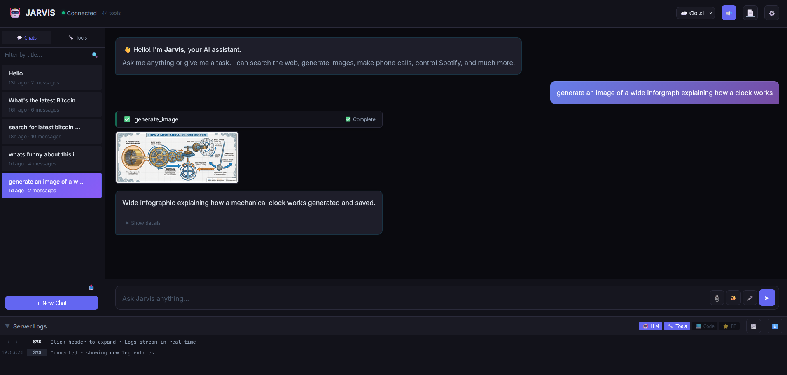
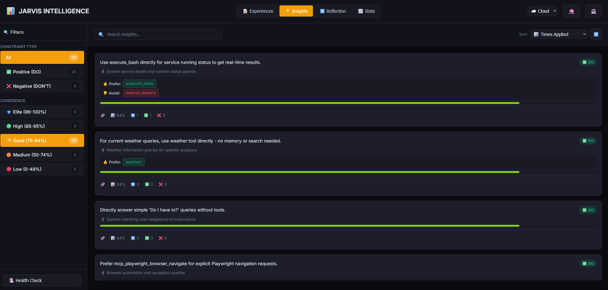
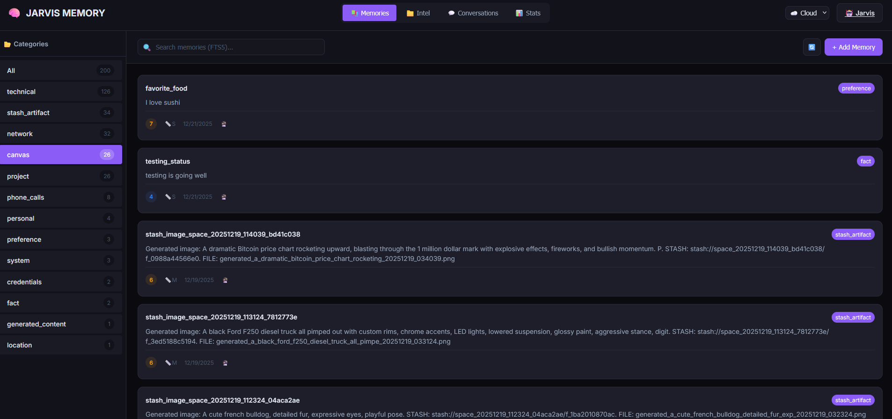

# Jarvis Voice Assistant

> **Heads up** — This is my personal AI voice assistant that I have been building for about four months now. I never planned to release it publicly. The codebase reflects that: there are hardcoded paths assume a user named "boss", and some things are wired together in ways that made sense for my setup but might confuse you.
>
> That said, if you want to run your own version, the [Install Guide](docs/INSTALL_GUIDE.md) walks through setting up a fresh Ubuntu 24.04 server from scratch. You'll need to change a few config values, but everything *should* work if you follow the steps. No promises, no support — just sharing what I built. If you care to support and cover some of the api costs, please consider donating.

## What is Jarvis?

A self-hosted voice assistant with rag based tool calling, mcp support, memory and autonomous coding capabilities in dedicated workspace to start.

Routes queries through Q&A, single tools, multi-tool pipelines, or autonomous workflows — all with persistent memory. Run via voice, CLI, or Web UI. Cloud LLMs or fully local. 

UI's include Chat, Canvas, Image Gallery, Video Gallery, Intellegence Dashboard, Memory Dashboard, full API, and more!

Deterministic = more reliable because the control flow is fixed by code.
You decide the steps, tool, order, retries, timeouts, and validation—so runs are predictable and failures are contained.


## ✨ Key Features



### Web Interface
- **Jarvis Web UI** - Full-featured chat interface at localhost:5001
  - Real-time WebSocket communication with tool streaming
  - Mode switching (cloud/local) with per-mode settings
  - **Audio playback controls**: Speaker button with pause/resume/stop
  - **Music generation**: ElevenLabs music plays inline in chat
  - **Server Logs Panel**: Real-time LLM + Tool log streaming (simpler than Grafana!)
  - **Workflow commands**: `/archive`, `/research`, `/note`, `/health` - deterministic multi-tool pipelines 
  - **Workflow hover tooltips**: Hover over `/` suggestions to see steps and descriptions 
  - **Prompt hover tooltips**: Hover over `@` suggestions to see key points 
  - **@prompts**: `@research`, `@quick`, `@compare`, `@generate_music`, `@email`, `@daily`
  - **Context-first injection**: Prompts inject BEFORE user message for better LLM context
  - **✨ Enhance with AI**: Magic button transforms input into optimal prompts
  - **Conversation search/export**: Filter, deep search, JSON/Markdown export
  - **Image upload**: Drag-drop/paste/click with vision analysis
  - **Mode-aware TTS/STT**: Cloud vs Local providers
  - Dynamic LLM/model switching on-the-fly
  - Launch: `./bin/jarvis-web`
  - See [`docs/JARVIS_WEB_UI.md`](docs/JARVIS_WEB_UI.md)


### Intelligence & Self-Learning
- **Intelligence Layer**: Self-learning system that improves over time
  - Learns from every interaction (what worked, what didn't)
  - **Positive constraints**: "Use mcp_fetch for server status checks"
  - **Negative constraints**: "Avoid search_memory for real-time data"
  - Generalizability filtering (only stores reusable insights)
  - **Insight tracking**: times_applied, times_helpful, times_failed
  - **Decay job**: Auto-prunes stale/failed insights
  - **Anomaly detection**: Flags unusual experiences
  - **Meta-cognition**: Analyzes learning health
  - Separate databases for cloud/local (1536 vs 768 dimensions)
  - See [`docs/INTELLIGENCE_LAYER.md`](docs/INTELLIGENCE_LAYER.md)



- **Intelligence Dashboard** at localhost:5003
  - Sort experiences by date, turns, tool count
  - Filter by success/fail, tool count, specific tool
  - Sort insights by applied, helpful, preferred/avoided tools
  - 5-tier confidence filtering (Elite/High/Good/Medium/Low)
  - Tool performance showing all tools with prefer/avoid stats
  - Launch: `./bin/jarvis-intelligence`

### Tool System
- **Tool RAG System**: Dynamic tool retrieval - loads only relevant tools for each query
  - Scales to 100+ tools without context flooding
  - Vector-based semantic search for tool discovery
  - "Ghost tools" always available for core functionality
  - See [`docs/TOOL_RAG_STRATEGY.md`](docs/TOOL_RAG_STRATEGY.md)
- **Advanced Tool Calling**: LLM-powered routing with 60+ skills
- **Multi-Turn Orchestration**: Chains multiple tools to complete complex tasks
- **Auto-Context System**: Automatic short-term memory of recent conversations
  - Remembers what you just discussed without needing explicit "remember" commands
  - Catches contradictions, continues workflows seamlessly, learns from failures
  - See [`docs/AUTO_CONTEXT_SYSTEM.md`](docs/AUTO_CONTEXT_SYSTEM.md)
- **Intelligent Memory**: Semantic search + conversation history with auto-save
- **OpenCode Integration**: Autonomous coding agent for building projects
- **MCP Support**: Extensible via Model Context Protocol servers

### Proactive System
- **Event-Driven API**: Receive webhooks from external systems (port 8880)
  - **Optional API Authentication**: Bearer token auth (`JARVIS_API_AUTH=true/false`)
  - Localhost whitelisted, public paths always accessible
  - See [`docs/SECURITY_HARDENING.md`](docs/SECURITY_HARDENING.md)
- **Auto-Resolve**: URL-based and agent-based automatic issue resolution
- **Background Services**: 24/7 daemons for follow-ups, healing, and reminders
- **Smart Reminders**: Time-based reminders with natural language parsing and recurring support
- **Remote Monitoring**: Deploy [Jarvis Monitor](https://github.com/bigsk1/jarvis-monitor) (Docker) anywhere to send health checks and alerts
- **Voice Notifications**: Jarvis speaks alerts and reminders via TTS

### Integrations & Automation
- **AI Phone Calls via Vapi.ai**: Outbound AI phone calls on your behalf
  - "Call Boss and ask if he wants to see Gladiator II tonight"
  - Multiple personas: Jarvis (default), James (professional), Jay (casual), Samantha (female)
  - Custom Vapi dashboard characters with dynamic variables (`{{owner}}`, `{{task}}`)
  - Voicemail detection and handling
  - Auto-save transcripts to Canvas and memory for later recall
  - Contact management: save numbers by name
  - See [`docs/tools/phone/PHONE_CALLS.md`](docs/tools/phone/PHONE_CALLS.md)
- **Spotify Integration**: Full music control via Spotify API
  - "Play Chill Vibes playlist", "Skip this song", "What's playing?"
  - Search your library first, then public Spotify
  - Multi-device support (Fire TV, Echo, phone, desktop)
  - Queue management, shuffle, repeat, volume control
  - Share what's playing via email with album art
  - See [`docs/tools/spotify/SPOTIFY.md`](docs/tools/spotify/SPOTIFY.md)
- **Modular Webhook System**: Named webhook registry for triggering external services
  - `send_email` - Send emails via SMTP with beautiful HTML templates
  - `send_webhook` - Trigger any webhook (Slack, Discord, APIs, custom endpoints)
  - Contact management with name resolution ("email Andrew" → looks up email)
  - Multiple auth methods (Bearer, Basic, API Key, JWT, custom headers)
  - Rate limiting to prevent duplicates
  - See [`docs/WEBHOOK_SYSTEM.md`](docs/WEBHOOK_SYSTEM.md)
- **Google Calendar Sync**: Bidirectional reminder ↔ calendar event sync via n8n
  - Create reminder in Jarvis → syncs to Google Calendar
  - Create event in Google Calendar → syncs to Jarvis
  - Full CRUD support (create, update, delete) with metadata tracking
  - Timezone handling (UTC normalization for correct comparison)
  - See [`docs/n8n/docs/GOOGLE_CALENDAR_SYNC.md`](docs/n8n/docs/GOOGLE_CALENDAR_SYNC.md)
- **n8n Workflow Engine**: Extensible automation workflows
  - Email sending with SMTP
  - Calendar sync orchestration
  - Custom webhook endpoints
  - OAuth2 handling and token refresh
  - See [`docs/n8n/docs/`](docs/n8n/docs/)
- **Samantha Multi-Agent Integration**: Secondary AI assistant on remote VPS
  - Real-time chat via `samantha` tool (OpenAI-compatible API)
  - Fire-and-forget webhooks for Discord/Telegram posting
  - Samantha can POST back to Jarvis API (intel, canvas, alerts, voice)
  - **Multi-agent voice**: Samantha speaks with her own voice through Jarvis's speakers
  - Priority levels (urgent/normal/background) and configurable timeouts
  - Division of labor: Jarvis = local/home, Samantha = web/social
- **Cloudflare Images CDN**: Permanent image hosting for multi-agent workflows
  - Upload from file, URL, base64, or stash reference
  - Organized paths: `{uploader}/{date}/{category}/{filename}`
  - Metadata storage (prompt, tags, provider) for tracking
  - Enables Samantha to share generated images via permanent URLs
  - API: `POST /api/images`, `POST /api/images/base64`
  - See [`docs/api/IMAGES.md`](docs/api/IMAGES.md)
- **Generated Images API**: Full management of AI-generated images
  - **3 providers**: Gemini (grounding), OpenAI (best text), xAI (fast & cheap!)
  - **Image-to-image editing**: Edit existing images via `reference_image` parameter
  - **Batch generation**: xAI supports `n=1-10` for multiple variations ($0.02/image!)
  - List, search, download, delete local images
  - Generate new images with optional `upload_to_cdn` for one-step CDN URL
  - CDN catalog (`cdn_catalog.json`) caches URLs - no re-uploads needed
  - API: `/api/generated-images/*`
  - See [`docs/api/GENERATED_IMAGES.md`](docs/api/GENERATED_IMAGES.md)
- **Feedback System**: LLM self-critique for continuous improvement
  - Per-query feedback: `--feedback` flag on orchestrator
  - Batch testing: `./bin/jarvis-feedback batch tests/queries.txt`
  - Cross-model grading via `FEEDBACK_PROVIDER`/`FEEDBACK_MODEL`
  - View issues: `./bin/jarvis-feedback issues --days 7`




### Memory System
- **Dual Database**: Separate DBs for cloud (OpenAI embeddings) and local (nomic embeddings)
- **Auto-Sync**: Bidirectional sync between modes on startup
- **FTS5 Full-Text Search**: SQLite FTS5 with BM25 ranking for fast, accurate keyword searches
- **Knowledge Base**: Facts, preferences, technical info with embeddings
- **Conversation History**: Full logging with metadata (cost, tokens, model)
- **Semantic Search**: AI embeddings with configurable similarity threshold (tune via .env)
- **Hybrid Search**: Combines keyword (FTS5) and semantic (embeddings) for comprehensive results
- **Auto-Save**: Automatically remembers project locations, commands, solutions
- **Tool Management**: Enable/disable tools per mode to optimize context window

### Dual Mode Operation
- **Cloud Mode**: **xAI Grok** (2M context, 10-15x cheaper!), Anthropic Claude, OpenAI GPT
- **Local Mode**: Ollama (qwen3-coder, mistral-nemo) + faster-whisper + Kokoro/Qwen3-TTS (free, offline)

### TTS Providers
| Provider | Mode | Quality | Cost | Notes |
|----------|------|---------|------|-------|
| **ElevenLabs** | Cloud | Excellent | Paid | Best quality, expressive voices |
| **Qwen3-TTS** | Both | Excellent | Free | 28 cloned voices (Jarvis, Samantha, etc.), local network |
| **Kokoro** | Local | Good | Free | Lightweight, fast, Nicole+Sarah voices |
| **OpenAI TTS** | Cloud | Good | Paid | alloy, echo, fable, onyx, nova, shimmer |

Configure via `TTS_PROVIDER` in `cloud.env` or `local.env`. Qwen3-TTS uses OpenAI-compatible API.
See: [`docs/qwen3-tts/QWEN3_TTS_INTEGRATION_GUIDE.md`](docs/qwen3-tts/QWEN3_TTS_INTEGRATION_GUIDE.md)

**Voice API** (`/api/voice/speak`): Supports per-request TTS provider/voice overrides for multi-agent voice identity.
See: [`docs/api/VOICES.md`](docs/api/VOICES.md)

**Recommended Cloud Provider**: **xAI Grok-4-fast** ($0.20/$0.50 per 1M tokens, 2M context window, automatic caching with 90% discount)

### Voice & Wake Word
- **Wake Detection**: "Hey Jarvis" using OpenWakeWord
- **Fine-tuned Audio**: Optimized for noisy environments + far-field mic
- **Smart Response Formatting**: Auto-condenses verbose outputs for voice
- **Status Updates**: Real-time voice progress during long tasks
  - "Searching the web", "Building with OpenCode", "Checking the weather"
  - LLM-generated dynamic summaries from tool output
  - Configurable phrases with humor/encouragement toggles
  - Phrase modes: `normal` or `unhinged` (chaotic/funny)
  - Audio caching for instant playback of repeated phrases
  - See [`docs/STATUS_UPDATES_DESIGN.md`](docs/STATUS_UPDATES_DESIGN.md)


### Developer Experience
- **Command Dashboard TUI**: Interactive terminal UI with 70+ commands
  - Browse, search, and run any Jarvis command from one place
  - Organized by category (Core, API, Memory, Intelligence, Tools, Logs, etc.)
  - Live system status (CPU, RAM, API health)
  - Launch: `./bin/jarvis-dashboard` or `jarvis-d` alias
- **Intelligence Dashboard**: Visual dashboard for self-learning at localhost:5003
  - Experience sorting (date, turns, tool count) and filtering (success/fail, tool count, specific tool)
  - Insight sorting (applied, helpful, preferred/avoided tools, confidence)
  - 5-tier confidence: Elite (96%+), High (85-95%), Good (75-84%), Medium (50-74%), Low (0-49%)
  - Tool performance showing ALL tools with prefer/avoid stats
  - **Feedback tab** - View all feedback logs with rating/time filters, expandable details, no terminal needed
  - Mobile responsive: hamburger menu at ≤730px
  - Launch: `./bin/jarvis-intelligence`
- **Memory Browser UI**: Web interface for memory management at localhost:5002
  - View, search, add, edit, delete memories from `knowledge_base`
  - Intel file manager (create, upload, edit, ingest `.md`/`.txt` files)
  - Conversation browser with full detail popup
  - FTS5 search, dual database (cloud/local), re-embed after edits
  - Mobile responsive: hamburger menu at ≤730px
  - Launch: `./bin/jarvis-memory`
- **Canvas Viewer**: Visual knowledge display at localhost:8890
  - Jarvis saves research results, code snippets, comparisons
  - Beautiful dark UI with Markdown rendering
  - Search, pin, edit, delete pages
  - Mobile responsive: hamburger menu at ≤730px
  - Launch: `./bin/jarvis-canvas`


---

- **Image Gallery UI**: Browse generated images in Canvas web UI
  - Grid view with thumbnails, search, sort options
  - Lightbox viewer, download, get CDN URL, delete
  - Access via "🖼️ Gallery" link in Canvas header


---

- **Video Gallery UI**: Browse generated videos in Canvas web UI (Feb 2026)
  - Grid view with hover preview, provider badges (xAI/OpenAI/Gemini)
  - Lightbox viewer with video controls
  - Search, sort by date/name/size/duration
  - Download and delete functionality
  - Access via "🎬 Videos" link in Canvas header


---

### Speech Modes - Smart Adaptive Response System


Jarvis adapts its response style based on your environment and task complexity:

**🎙️ Casual Mode** (Default for Voice)
- Concise responses with configurable word limits (75/50/35 words)
- Strips `stash://` refs, long URLs, file paths from speech
- Perfect for: Voice interactions, speakers, TTS

**🖥️ Detailed Mode** (Best for CLI/Debugging)
- Full LLM response with complete context
- Perfect for: CLI testing, debugging, logs
- Example: Full technical breakdown with file lists, URLs, next steps

**🤖 Auto Mode** ⭐ (Smart Adaptive)
- **Search tools** → Always formatted (removes URLs, summarizes)
- **Simple queries** → Keep short if already concise
- **Complex builds** → Detailed if >50 words (keeps technical context)
- **Multi-turn** → Formatted summary
- Perfect for: Mixed usage, general assistant work

**Configuration:**
```bash
# Set in config/cloud.env or config/local.env
JARVIS_RESPONSE_STYLE="auto"    # Smart adaptive (recommended)
JARVIS_RESPONSE_STYLE="casual"  # Always short (voice default)
JARVIS_RESPONSE_STYLE="detailed" # Always verbose (CLI)
```

See full guide: [`docs/AUTO_MODE_EXPLAINED.md`](docs/AUTO_MODE_EXPLAINED.md)

---

## 🔍 How It Works

**New to Jarvis?** See these comprehensive guides:

**Reactive Mode** (Current):
- 📊 **[Complete Workflow Guide](docs/JARVIS_WORKFLOW.md)** - How Jarvis processes your requests
  - Visual flowcharts, memory strategy, tool selection
  - Multi-turn orchestration, configuration impact
  - Real-world examples with thinking mode enabled

**Proactive Mode** (Current):
- 🔮 **[Proactive Assistant API](docs/api/API_OVERVIEW.md)** - Event-driven webhook system
  - Receives webhooks from any external system
  - Auto-resolves issues when services recover
  - Background services for follow-ups and reminders
  - Remote monitoring with agent templates
  - See also: [API Docs](docs/api/), [Service Docs](docs/service/)

**Quick Overview:**
```
User Query → Router (LLM analyzes) → Memory Check → Tool Selection → 
Execute Tool(s) → Multi-Turn if Needed → Format Response → User
```

Key decision points:
- **Memory First**: Always checks stored info before external calls
- **Thinking Mode**: See LLM's reasoning process (toggle via `--debug-thinking`)
- **Smart Tool Selection**: Keyword search vs semantic search vs direct tool call
- **Multi-Turn**: Chains tools automatically for complex tasks

---

## 📁 Project Structure

<details>
<summary><strong>Project Directory Structure (click to expand)</strong></summary>

```
jarvis-voice/
├── bin/                      # Executable scripts & utilities (40+)
│   ├── wake_jarvis.py        # Cloud wake word loop
│   ├── wake_jarvis_local.py  # Local wake word loop
│   ├── say.sh / say-local.sh # Text-to-speech
│   ├── jarvis-api            # Proactive API server (port 8880)
│   ├── jarvis-services       # Background services daemon
│   ├── jarvis-dashboard      # Command Dashboard TUI
│   ├── jarvis-web            # Web UI launcher (port 5001)
│   ├── jarvis-canvas         # Canvas & Gallery viewer (port 8890)
│   ├── jarvis-memory         # Memory Browser UI (port 5002)
│   ├── jarvis-intelligence   # Intelligence Dashboard (port 5003)
│   ├── jarvis-feedback       # Feedback system CLI
│   ├── build-tool            # Dynamic tool builder
│   ├── evolve-prompts        # Prompt evolution system
│   ├── manage-tools.py       # Enable/disable tools
│   ├── sync-memory-db.py     # Manual database sync
│   ├── sync_tools.py         # Sync tools to LLM context
│   ├── cleanup-intelligence.py # Clean false-positive experiences
│   ├── spotify-auth          # Spotify OAuth setup
│   ├── memory                # Memory CLI tool
│   └── question*.sh          # Q&A entry points
├── lib/                      # Core libraries (28+)
│   ├── config_loader.py      # Configuration management
│   ├── memory_db.py          # SQLite memory system
│   ├── llm_provider.py       # LLM provider abstraction (xAI/Anthropic/OpenAI/Ollama)
│   ├── intelligence.py       # Self-learning system
│   ├── intelligence_hooks.py # Experience recording
│   ├── tool_builder.py       # Dynamic tool creation
│   ├── prompt_evolution.py   # Self-evolving prompts
│   ├── prompt_versioning.py  # Prompt A/B testing
│   ├── stash_helper.py       # Artifact storage system
│   ├── embeddings.py         # Embedding management
│   ├── feedback.py           # LLM self-critique
│   ├── status_updater.py     # Voice status updates
│   ├── mcp_client.py         # MCP server integration
│   ├── opencode_client.py    # OpenCode API client
│   ├── cost_estimator.py     # Token cost calculation
│   ├── llm_logger.py         # LLM call logging
│   └── tool_logger.py        # Tool execution logging
├── orchestrator/             # Tool orchestration system
│   ├── orchestrator_v2.py    # Main orchestration logic
│   ├── router_v2.py          # LLM-based routing
│   ├── executor.py           # Tool execution engine
│   ├── tool_schema.py        # Tool discovery & validation
│   ├── workflow_loader.py    # Workflow JSON loader
│   └── pipeline_executor.py  # Deterministic pipeline execution
├── skills/                   # Tool scripts (60+)
│   ├── auto-tools/           # Auto-generated tools
│   │   ├── docker_control.*  # Docker management
│   │   ├── network_tools.*   # Network diagnostics
│   │   ├── system_monitor.*  # System resources
│   │   ├── text_summarizer.* # Text processing
│   │   └── youtube_transcript.* # YouTube transcripts
│   ├── ssh_remote.py         # Remote SSH execution
│   ├── deep_memory_search.py # Multi-source search
│   ├── generate_image.py     # AI image generation (Gemini/OpenAI/xAI)
│   ├── generate_video.py     # AI video generation (xAI Grok, Gemini Veo)
│   ├── generate_music.py     # AI music (ElevenLabs)
│   ├── analyze_image.py      # Vision analysis
│   ├── phone_call.py         # AI phone calls (Vapi.ai)
│   ├── samantha.py           # Delegate to Samantha AI assistant (openclaw)
│   ├── spotify.py            # Spotify music control
│   ├── canvas.py             # Canvas page management
│   ├── stash.py              # Artifact storage
│   ├── pdf_create.py         # PDF generation
│   ├── pdf_read.py           # PDF text extraction
│   ├── printer.py            # CUPS printing
│   ├── calculator.py         # Advanced math
│   ├── weather.py            # Weather forecasts
│   ├── crawl_url.py          # Web crawling (Crawl4AI)
│   ├── screenshot_url.py     # Website screenshots
│   ├── upload_cloudflare.py  # Cloudflare R2/CDN upload
│   ├── remember.py / recall.py / forget.py  # Memory tools
│   ├── search_memory.py      # FTS5 keyword search
│   ├── semantic_recall.py    # AI semantic search
│   ├── execute_bash.py       # Shell commands
│   ├── opencode.py           # Autonomous coding
│   ├── send_email.py         # Email with templates
│   ├── send_webhook.py       # Webhook triggers
│   ├── create_reminder.py    # Smart reminders
│   ├── crypto_price.py       # Crypto prices (CoinGecko)
│   ├── stock_price.py        # Stock prices
│   └── *.tool.json           # Tool definitions
├── config/                   # Configuration files
│   ├── cloud.env             # Cloud mode settings (gitignored)
│   ├── local.env             # Local mode settings (gitignored)
│   ├── cloud.env.example     # Template (safe for git)
│   ├── local.env.example     # Template (safe for git)
│   ├── ssh.json              # SSH host config (gitignored)
│   ├── contacts.json         # Contact book (gitignored)
│   ├── webhook_registry.json # Named webhooks
│   └── mcp-servers.json      # MCP server config
├── data/                     # Runtime data
│   ├── jarvis_memory.db      # Cloud mode DB (OpenAI 1536-dim)
│   ├── jarvis_memory_local.db # Local mode DB (nomic 768-dim)
│   ├── jarvis_intelligence.db # Intelligence layer (cloud)
│   ├── jarvis_intelligence_local.db # Intelligence layer (local)
│   ├── workflows/            # Workflow JSON definitions
│   │   ├── web_archive.json  # /archive command
│   │   ├── deep_research.json # /research command
│   │   ├── quick_note.json   # /note command
│   │   └── server_health_check.json # /health command
│   ├── canvas/               # Canvas pages (Markdown)
│   ├── stash/                # Artifact storage (7-day TTL)
│   ├── generated_images/     # AI-generated images
│   ├── generated_music/      # AI-generated music
│   ├── web_conversations/    # Web UI chat history
│   └── backups/              # Database backups
├── logs/                     # Execution logs
│   ├── tools/                # Tool call logs (JSONL)
│   ├── llm/                  # LLM call logs (JSONL)
│   ├── opencode/             # OpenCode session logs
│   ├── api/                  # API server logs
│   ├── services/             # Background services logs
│   ├── intelligence/         # Intelligence layer logs
│   └── tool-builder/         # Tool builder reports
├── jarvis-web/               # Web UI (Flask + WebSocket)
│   ├── client/               # Frontend (HTML/CSS/JS)
│   ├── server/               # Backend (Flask routes)
│   └── data/prompts/         # @prompt templates
├── jarvis-canvas/            # Canvas & Gallery Viewer (port 8890)
│   ├── client/               # Frontend
│   │   ├── static/css/       # Stylesheets (base, canvas, gallery, video)
│   │   ├── static/js/        # JavaScript (canvas, gallery, video-gallery)
│   │   └── templates/        # HTML templates
│   ├── server/               # Backend (Flask)
│   │   ├── app.py            # Main Flask app
│   │   ├── pages.py          # Canvas page storage
│   │   └── routes/           # API routes (gallery, video, stash, health)
│   └── config.py             # Configuration
├── jarvis-intelligence/      # Intelligence Dashboard
│   ├── client/               # Frontend (HTML/CSS/JS)
│   └── server/               # Backend (Flask routes)
├── jarvis-memory/            # Memory Browser UI
│   ├── client/               # Frontend (HTML/CSS/JS)
│   └── server/               # Backend (Flask routes)
├── jarvis-monitor/           # Remote Monitoring Agent
│   ├── monitor.py            # Health check daemon
│   ├── Dockerfile            # Docker image
│   ├── docker-compose.yml    # Compose config
│   └── README.md             # Agent documentation
├── jarvis-intel/             # Private knowledge base (gitignored)
├── services/                 # Background services
│   ├── api/                  # Proactive API server
│   └── background/           # Auto-resolve, reminders
├── monitoring/               # Grafana + Prometheus + Loki
│   ├── grafana/              # Dashboard configs
│   ├── prometheus/           # Metrics collection
│   └── loki/                 # Log aggregation
├── tests/                    # Test suites
│   ├── integration/          # Integration tests
│   │   ├── compare-models.sh # Model comparison
│   │   ├── test-memory-*.sh  # Memory system tests
│   │   └── logs/             # Test results
│   └── e2e/                  # End-to-end tests
├── docs/                     # Documentation (60+ files)
│   ├── api/                  # Proactive API docs
│   ├── service/              # Background services docs
│   ├── phone/                # AI phone calls (Vapi.ai)
│   ├── spotify/              # Spotify integration
│   ├── ssh/                  # SSH remote tool
│   ├── docker-tool/          # Docker control
│   ├── opencode/             # OpenCode integration
│   ├── n8n/                  # n8n workflows & calendar sync
│   ├── INTELLIGENCE_LAYER.md # Self-learning system
│   ├── TOOL_BUILDER.md       # Dynamic tool creation
│   ├── STASH_SYSTEM.md       # Artifact storage
│   ├── JARVIS_WEB_UI.md      # Web interface guide
│   └── *.md                  # Core system docs
├── jarvis                    # Launcher (cloud mode)
├── jarvis-local              # Launcher (local mode)
├── setup.sh                  # Initial setup script
├── requirements.txt          # Python dependencies
└── README.md                 # This file
```

</details>


---

## 🚀 Quick Start

<details>
<summary><strong>Quick Start (click to expand)</strong></summary>

### 1. Initial Setup

see [INSTALL_GUIDE.md](docs/INSTALL_GUIDE.md) for detailed instructions.
see [QUICKSTART.md](docs/QUICKSTART.md) for detailed instructions.

### 1.1. Clone the repository
```bash
git clone https://github.com/bigsk1/jarvis-voice.git
cd jarvis-voice
```

You need python 3.12 or higher.

```bash
cd /home/boss/jarvis-voice
./setup.sh
```

This will:
- Check dependencies
- Create directories
- Initialize git repository
- Create convenience symlinks

### 2. Configure

Copy and edit the example configs:

```bash
# For cloud mode (xAI/Anthropic/OpenAI)
cp config/cloud.env.example config/cloud.env
nano config/cloud.env  # Add your API keys

# Recommended cloud provider: xAI Grok
# LLM_PROVIDER="xai"
# XAI_API_KEY="xai-..."  # Get from https://console.x.ai
# XAI_MODEL="grok-4-1-fast-non-reasoning"  # 2M context, $0.20/$0.50, reasoning mode

# For local mode (Ollama)
cp config/local.env.example config/local.env
nano config/local.env  # Adjust Ollama endpoint
```

See [`config/README.md`](config/README.md) and [`docs/XAI_PROVIDER.md`](docs/XAI_PROVIDER.md) for detailed configuration options.

### 3. Install Dependencies

```bash
# Python environment
python3 -m venv ~/jarvis-venv
source ~/jarvis-venv/bin/activate
pip install -r requirements.txt

# System packages (Ubuntu/Debian)
sudo apt install sox ffmpeg jq sqlite3 traceroute inetutils-traceroute curl 

# See system-packages.txt for complete list of system dependencies

# Ollama (for local mode)
curl https://ollama.ai/install.sh | sh
ollama pull qwen3:14b
ollama pull nomic-embed-text

# OpenCode (optional, for coding tasks)
# See docs/opencode/OPENCODE.md for installation
```

</details>

### 4. Run Jarvis

```bash
source ~/jarvis-venv/bin/activate

# Cloud mode (Anthropic Claude)
./jarvis

# Local mode (Ollama)
./jarvis-local

# CLI mode (no voice)
./orchestrator/orchestrator_v2.py cloud "What time is it?"
./orchestrator/orchestrator_v2.py local "What time is it?"

# CLI mode with voice output (speaks result through speakers)
./orchestrator/orchestrator_v2.py cloud "What time is it?" --speak
./orchestrator/orchestrator_v2.py local "Turn up my volume" --speak

# Command Dashboard (all commands in one TUI!)
./bin/jarvis-dashboard
```
### Terminal Wake Word Mode


Say **"Hey Jarvis"** to wake it up!

### 5. Start All Services (Recommended)

Start everything with one command using tmux sessions (make sure they are all setup first):

```bash
# Start ALL services (API, background services, all UIs)
./bin/start

# Or start only what you need:
./bin/start --ui-only    # Just the web UIs (no API/services)
./bin/start --list       # Check status of all sessions
./bin/start --stop       # Stop everything
```

**Services started:**
| Session | Port | Description |
|---------|------|-------------|
| `jarvis-api` | 8880 | Proactive API (webhooks, reminders) |
| `jarvis-services` | - | Background services (auto-resolve) |
| `jarvis-web` | 5001 | Web UI chat interface |
| `jarvis-canvas` | 8890 | Canvas & Gallery viewer |
| `jarvis-memory` | 5002 | Memory Browser UI |
| `jarvis-intelligence` | 5003 | Intelligence Dashboard |

```bash
# Attach to any session to see logs
tmux attach -t jarvis-web

# Detach without stopping: Ctrl+B then D
```


### 6. Proactive API & Reminders

Enable event-driven alerts, notifications, and smart reminders:


If you prefer to start services individually (instead of `./bin/start`):

```bash
# Start API server (receives webhooks, processes reminders)
./bin/jarvis-api

# Start background services (auto-resolve, follow-ups, reminder scheduler)
./bin/jarvis-services
```

**Create reminders via voice:**
```bash
./jarvis
# Say: "Hey Jarvis, remind me in 4 hours to check dinner"
# Say: "Hey Jarvis, remind me every Friday at 5pm to submit timesheets"
# Say: "Hey Jarvis, what reminders do I have?"
```

**Supported time expressions:**
- "in 30 minutes", "in 4 hours", "in 2 days"
- "tomorrow at 3pm", "at 5pm", "on the 15th"
- "every Wednesday" (weekly, 10am default)
- "every Friday at 5pm" (weekly with time)
- "every month on the 10th" (monthly, 10am default)

See [Proactive API docs](docs/api/) and [Reminder System](docs/api/REMINDER_SYSTEM.md) for details.

### 7. Remote Monitoring Agent (Optional)

Deploy the **[Jarvis Monitor](./jarvis-monitor/README.md)** (Docker) on remote servers for health checks and alerts:


```bash
# On remote server (Docker required)
docker run -d \
  --name jarvis-monitor \
  --restart unless-stopped \
  -e JARVIS_API_URL="http://your-jarvis-server:8880/api/alerts" \
  -e MONITOR_URLS="MyApp|http://localhost:8080/health" \
  -e SOURCE_NAME="remote-server" \
  -e CHECK_INTERVAL=60 \
  bigsk1/jarvis-monitor:latest

# Monitor sends alerts to Jarvis API when issues detected
# Jarvis speaks alerts via voice TTS
# Auto-resolve when service recovers
```

See the [Jarvis Monitor repo](https://github.com/bigsk1/jarvis-monitor) for configuration options and Docker Compose examples.


---

## 🛠️ Tool System

### Available Skills (60+)

**Memory Management:**
- `remember` - Store facts, preferences, technical info
- `recall` - Retrieve specific memories by category/key
- `search_memory` - **FTS5 full-text search** with BM25 ranking (keyword/entity searches)
- `semantic_recall` - AI-powered conceptual search (natural language questions)
- `update_memory` - Modify existing memories
- `forget` - Delete memories
- `memory_deduper` - **Memory cleanup**: detect duplicates/conflicts, propose safe deletions (analyze first, apply when approved)
- `get_recent_conversations` - Access conversation history
- `search_conversations` - Search past interactions

**Action Tools:**
- `execute_bash` - Run shell commands
- `send_email` - Send emails with contact lookup and HTML templates
- `send_webhook` - Trigger named webhooks (Slack, n8n, APIs) with auth
- `api_call` - Generic HTTP API calls
- `crypto_price` - Get cryptocurrency prices
- `get_time` - Current time
- `calculator` - **Advanced math**: arithmetic, percentages, statistics, unit conversions, trig
- `canvas` - **Visual viewer**: save rich content (research, code, comparisons) to web UI
- `weather` - Weather forecasts with OpenWeatherMap
- `phone_call` - **AI Phone Calls**: outbound calls via Vapi.ai with personas, voicemail detection, transcripts
- `spotify` - **Music control**: play, pause, skip, queue, search, device switching, share via email
- `network_tools` - **Network diagnostics**: ping (with stats), DNS lookup, port checks, HTTP/HTTPS status, traceroute
- `system_monitor` - **System resources**: CPU, RAM, disk, processes, network I/O, uptime
- `text_summarizer` - **Text processing**: summarization, keyword extraction, word count, sentiment analysis
- `stock_price` - **Stock/futures prices**: stocks (TSLA, AAPL), futures (GC=F gold, SI=F silver), forex (EURUSD=X)
- `price_alert` - **Price alerts**: Create crypto/stock alerts monitored by n8n (above/below thresholds)
- `status_recap` - **Daily status**: aggregates weather, crypto, stocks, alerts, reminders, system health → Canvas + Stash
- `generate_music` - **AI Music**: ElevenLabs music generation with genres, moods, tempo, stash integration
- `generate_password` - **Password generation**: Secure passwords with length, complexity, memorable options
- `samantha` - **Multi-agent**: Chat with Samantha (moltbot) AI, delegate tasks, fire-and-forget webhooks
- `deep_memory_search` - **Comprehensive search**: Multi-source search across memory, conversations, intel, canvas, stash
- `search_docs` - **Internal knowledge Q&A**: Semantic search over Jarvis docs (capabilities, parameters, features)
- `ssh_remote` - **Remote execution**: SSH into remote hosts, run commands, apt management, multi-command sequences
- `docker_control` - **Docker management**: containers, compose, images, networks, volumes, exec, prune
- `youtube_transcript` - **YouTube transcripts**: Download video transcripts as .srt/.md files
- `youtube_video` - **YouTube download**: Download videos or audio-only via yt-dlp, save to stash
- `bookmark_search` - **Firefox bookmarks**: Search bookmark export (HTML) by keyword, tags, folders, domains (`*` in Web UI)
- `crawl_url` - **Web scraping**: Crawl4AI to extract markdown from any webpage (stealth mode, JS wait)
- `screenshot_url` - **Screenshot + vision**: Full-page capture with AI analysis (bypasses anti-bot)

**Artifact & Output Tools:**
- `convert_file` - **Local media conversion**: ImageMagick, FFmpeg, Potrace
  - Images: JPG ↔ PNG ↔ WebP ↔ GIF ↔ BMP ↔ TIFF ↔ ICO
  - Raster to vector: PNG/JPG → SVG (Potrace tracing for logos, line art)
  - Video: MP4 ↔ WebM ↔ MOV ↔ AVI ↔ MKV
  - Audio: MP3 ↔ WAV ↔ FLAC ↔ OGG ↔ AAC ↔ M4A
  - Extract audio from video (MP4 → MP3/WAV)
  - Advanced options: resize, quality, bitrate, FPS, threshold, speckle size
  - **Web UI 🔄 button** with format selector and inline results
  - No API costs - all processing local
- `generate_image` - **AI image generation & editing**: Gemini, OpenAI, or xAI
  - **3 providers**: Gemini (grounding), OpenAI (best text), xAI (fast & cheap - $0.02/image!)
  - **Image-to-image editing**: Upload an image + describe changes → edited image
  - **Batch generation**: xAI `n=1-10` for multiple variations in one request
  - Supports aspect ratios (1:1, 16:9, 9:16, etc.), styles, negative prompts
  - **Gemini Search Grounding** - Real-time data in images (weather, crypto prices, news)
  - Auto-saves to stash + memory for cross-session recall
- `generate_video` - **AI video generation**: xAI Grok, OpenAI Sora, or Gemini Veo
  - xAI: 1-15s duration, 7 aspect ratios, video editing ($0.05/s)
  - OpenAI: 4/8/12s, native audio, image-to-video, remix ($0.10-0.50/s)
  - Gemini: 4/6/8s, native audio, up to 4K resolution ($0.15/s)
  - Text-to-video and image-to-video modes (all providers)
  - Auto-saves to stash + memory for cross-session recall
- `analyze_image` - **Vision analysis**: Analyze images from URLs, files, or stash refs
  - Cloud=Grok/Claude/GPT-4o, Local=llava
  - SSRF protection (blocks private IPs), path traversal protection
  - Auto-stashes analyzed images + creates memory_db entry
  - Example: "Analyze this image https://example.com/chart.png"
- `stash` - **Artifact storage**: download URLs, store files/images/JSON for multi-step workflows
  - Central workshop for temporary files (7-day TTL)
  - `stash://` references work across tools (printer, email, pdf_create, analyze_image)
- `pdf_create` - **PDF generation**: create PDFs from stash files, images, or text
  - Now auto-saves to memory with stash reference for recall
- `pdf_read` - **PDF reading**: extract text, images, merge, split, search PDFs
  - Page range support, image extraction to stash, text search with context
- `printer` - **Print output**: print from stash refs, file paths, or Canvas pages (CUPS)
  - Accepts `stash://space_xxx/file_id` references directly
- `speaker_volume` - **Audio control**: get/set/adjust system speaker volume
- `upload_cloudflare` - **CDN upload**: Upload images to Cloudflare for permanent public URLs
  - Supports file, URL, base64, stash references
  - Metadata tracking (prompt, tags, provider)
- `qr_code_generator` - **QR codes**: Generate QR codes for URLs, text, WiFi, contacts; save PNG to stash

**Development:**
- `opencode` - Autonomous coding agent (builds apps, games, APIs)
- `check_opencode_sessions` - Monitor OpenCode progress
- `ingest_intel` - Bulk import knowledge from markdown files
- `git_release_notes` - **GitHub release notes**: Analyze releases, generate summaries with commit/PR/issue breakdown, risk flags
- `check_tool_logs` - View tool execution history

**Proactive System:**
- `list_alerts` - View active alerts
- `acknowledge_alerts` - Clear alerts
- `create_reminder` - Create time-based reminders (one-time or recurring)
- `list_reminders` - View scheduled/triggered reminders
- `acknowledge_reminders` - Clear/acknowledge reminders
- `query_service_logs` - Check background service status
- `manage_intel` - Create/manage intel files

**System:**
- MCP servers (DuckDuckGo search, web fetch, etc.)

### How Tool Calling Works

```
User: "Build a Flask API and test it"
  ↓
LLM Router: Analyzes request
  ↓
Turn 1: Call 'opencode' → Build Flask API
  ↓
Turn 2: Call 'api_call' → Test endpoint
  ↓
Turn 3: Q&A response → "Flask API running on port 8091"
```

**Features:**
- Multi-turn orchestration (chains tools automatically)
- Workflows (pre-determinded tools structure)
- Error recovery with retries
- Timeout handling
- Cost tracking (cloud mode)
- Metadata logging
- Permission system - for tools not implemented fully

### Managing Tools (Enable/Disable)


Control which tools are loaded to optimize context window and performance:

```bash
# List all tools and their status
./bin/manage-tools.py list

# Disable a tool
./bin/manage-tools.py disable crypto_price

# Enable a tool
./bin/manage-tools.py enable crypto_price

# Enable all tools
./bin/manage-tools.py enable-all

# Disable multiple tools for local mode (reduce context)
./bin/manage-tools.py disable opencode check_opencode_sessions ingest_intel
```

**Benefits:**
- Reduce token count for local models (Ollama has smaller context windows)
- Create tool profiles (development vs. production)
- Disable experimental/buggy tools without deleting code
- All tools auto-discovered on startup (only enabled ones load)

See [`docs/TOOL_MANAGEMENT.md`](docs/TOOL_MANAGEMENT.md) for details.

---

## 🔄 Workflow Orchestration


Workflows are deterministic multi-tool pipelines that execute predefined sequences of tools. Unlike normal LLM routing (where the LLM decides which tools to use), workflows guarantee consistent, repeatable execution.

### Two Ways Tools Execute

| Method | Trigger | Who Decides Tools | Use Case |
|--------|---------|-------------------|----------|
| **LLM Routing** | Any query | LLM analyzes and selects | General questions, flexible tasks |
| **Workflow Pipelines** | `/command` | Predefined in JSON recipe | Repeatable multi-step tasks |

### Available Workflows (10)

| Command | Description | Tools Used |
|---------|-------------|------------|
| `/crypto [coins]` | Crypto prices, news, analysis, email report | get_time, crypto_price, brave_search, crawl_url, stash, canvas, send_email |
| `/archive <url>` | Archive webpage to stash with Canvas summary | crawl_url, stash, canvas |
| `/research <topic>` | Multi-source research with Brave + crawling | brave_search, crawl_url, stash, remember, canvas |
| `/note <text>` | Save note to memory + Canvas | get_time, remember, canvas |
| `/health [host]` | SSH health check (default: vps2) | ssh_remote |
| `/url_ingest <url>` | Crawl URL, create intel file, ingest to memory | crawl_url, stash, text_summarizer, manage_intel, ingest_intel, search_memory |
| `/status` | Daily status briefing (weather, crypto, stocks, alerts) | get_time, weather, crypto_price, stock_price, list_alerts, list_reminders, system_monitor, canvas |
| `/status_visual` | Status briefing + AI-generated dashboard image | get_time, weather, crypto_price, stock_price, list_alerts, list_reminders, system_monitor, generate_image, canvas |
| `/deep_dive <url>` | Screenshot + crawl URL, comprehensive canvas summary | stash, screenshot_url, crawl_url, text_summarizer, canvas |
| `/youtube <url>` | Download transcript, summarize, create study notes | youtube_transcript, stash, text_summarizer, canvas |

### Workflow Features

- **Variable System**: Extract parameters from queries, pass data between steps
- **LLM Parameter Filling**: Dynamic parameter resolution via `llm_prompt`
- **Content Validation**: Heuristic validation with min_length, reject_patterns
- **Retry Logic**: Automatic retries with configurable limits
- **Bypass Intelligence**: Workflows skip intelligence layer (deterministic = no routing to learn)

### Token Efficiency

Workflows bypass the entire LLM routing overhead, making them ideal for local models with limited context:

| Execution Method | Orchestration Tokens | Savings |
|-----------------|---------------------|---------|
| Normal LLM Chat | ~35,000 tokens (system prompt + 57 tool definitions) | - |
| Workflow | ~0-500 tokens (only if using `llm_prompt`) | **99%+** |

For a 32K context local model, normal LLM routing exceeds the limit before you even ask a question. Workflows execute the same multi-tool tasks with near-zero token overhead.

### API Access

```bash
# List workflows
curl http://localhost:8880/api/workflows | jq

# Execute workflow
curl -X POST http://localhost:8880/api/workflows/crypto_market_report/execute

# View history
curl http://localhost:8880/api/workflows/history | jq
```

See:
- [`docs/WORKFLOW_ORCHESTRATION.md`](docs/WORKFLOW_ORCHESTRATION.md) - Full workflow system documentation
- [`docs/api/WORKFLOWS.md`](docs/api/WORKFLOWS.md) - Workflows API reference
- [`data/workflows/`](data/workflows/) - Workflow JSON definitions

---

## 🧠 Memory System

### Knowledge Base

Stores facts, preferences, and technical information with **hybrid search** (FTS5 + semantic):


```bash
# Store a fact
"Remember my WireGuard VPN is 192.168.70.0/24"

# Retrieve via keyword search (FTS5 with BM25 ranking)
"Search for VPN network"  # Uses FTS5 for fast, accurate results

# Retrieve via semantic search (AI embeddings)
"What's my VPN network?"  # Uses embeddings for conceptual matching

# View all memories
./bin/memory list

# Tune semantic search sensitivity (in config/cloud.env or local.env)
SEMANTIC_SIMILARITY_THRESHOLD=0.40  # Default: 0.40 (balanced)
# Lower (0.30-0.35) = more results, may include loosely related
# Higher (0.45-0.50) = fewer results, only close matches
```

**Search Strategy:**
- **Keyword/Entity searches** (1-3 words, technical terms): Use `search_memory` → FTS5
- **Natural language questions** (4+ words, conceptual): Use `semantic_recall` → Embeddings

See [`docs/FTS5_SEARCH_SYSTEM.md`](docs/FTS5_SEARCH_SYSTEM.md) and [`docs/SEMANTIC_THRESHOLD_TUNING.md`](docs/SEMANTIC_THRESHOLD_TUNING.md) for details.

### Auto-Save Memory

Jarvis automatically remembers:
- ✅ Project locations and run commands (after OpenCode builds)
- ✅ Working solutions (port conflicts, config changes)
- ✅ URLs and endpoints you create/use
- ✅ Technical facts from intel files
- ❌ Ephemeral data (current time, transient prices)

### Conversation History

Full conversation logging with metadata:
- User queries and responses
- Tools used per session
- Model, tokens, and cost tracking
- Session IDs for grouping

---

## 🧠 Intelligence Layer

The Intelligence Layer is Jarvis's self-learning system. It observes interactions, reflects on what worked and what didn't, and applies learned insights to improve future routing decisions.


**Key Principles**:
- Everything is continuous (vectors), not discrete rules
- Learning generalizes through semantic similarity
- Positive AND negative constraints (what to do AND what NOT to do)
- Fact vs Procedural classification (only skills stored, not facts)
- Generalizability filtering (low-value insights filtered out)

**Experience Recording**:
- Query (as embedding)
- Tools used (in order)
- Turns taken
- Success/failure
- User satisfaction signals
- LLM response & tool results (for content quality eval)

**Insights Generated**:
- Pattern: "Status queries need real-time tools"
- Applies to: "Server health, uptime checks"
- Preferred approach: "Use fetch tools directly"
- Confidence: 0.0-1.0
- Tracking: times_applied, times_helpful, times_failed

**Maintenance Jobs**:
```bash
# Run all maintenance (decay, anomaly, meta-cognition)
./bin/run-intelligence-maintenance.py --watch

# Or via API
curl -X POST http://localhost:8880/api/intelligence/maintenance/all
```

**How Insights Apply**:
When a new query comes in:
1. Generate query embedding
2. Find similar insights (cosine similarity)
3. Weight by confidence and relevance
4. Inject into routing context
5. Track which insights were applied
6. Update helpful/failed counts after interaction

See [`docs/INTELLIGENCE_LAYER.md`](docs/INTELLIGENCE_LAYER.md) for details.


---

## 🤖 OpenCode Integration

OpenCode is an autonomous coding agent that can build entire projects.


### Usage

```bash
# Via voice
"Use OpenCode to create a Flask API on port 8091"

# Via CLI
./orchestrator/orchestrator_v2.py cloud "Build a Tetris game"
```

### What OpenCode Can Do

- Build web apps (Flask, Express, React)
- Create games (Tetris, Snake, etc.)
- Write scripts and tools
- Install dependencies
- Test and verify builds

### Configuration

```bash
# In cloud.env or local.env
OPENCODE_MODEL="claude-sonnet-4-20250514"  # Or qwen2.5-coder:32b
OPENCODE_PROVIDER="anthropic"              # Or ollama
OPENCODE_BASE_URL="http://localhost:4096"
```

**Workspace:** All OpenCode projects go to `~/jarvis-workspace/projects/`

See [`docs/opencode/OPENCODE.md`](docs/opencode/OPENCODE.md) for details.

---

## 💾 Database & Costs

### Memory Database (Dual System)

Jarvis uses separate databases for cloud and local modes:


**Cloud Mode** - `data/jarvis_memory.db`:
- Uses OpenAI embeddings (1536 dimensions)
- Optimized for Claude/GPT

**Local Mode** - `data/jarvis_memory_local.db`:
- Uses nomic-embed-text (768 dimensions)
- Optimized for Ollama models

**Auto-Sync**: On startup, newer memories are synced between databases with re-embedded vectors for the target mode's model. See [`docs/DUAL_DATABASE_SYSTEM.md`](docs/DUAL_DATABASE_SYSTEM.md).

**Tables**:
- `knowledge_base` - Facts, preferences, embeddings
- `conversations` - Full conversation history with metadata

### Cost Tracking (Cloud Mode)

Every conversation logs:
- Model used
- Input/output tokens
- Cost in USD
- Tool count
- Execution time

View costs:
```bash
sqlite3 data/jarvis_memory.db "
SELECT 
  date(timestamp) as date,
  SUM(json_extract(metadata, '$.cost_usd')) as total_cost,
  COUNT(*) as conversations
FROM conversations
GROUP BY date(timestamp)
ORDER BY date DESC
LIMIT 7;"
```

---

## 📚 Documentation

### Key Documents

**Getting Started:**
- [`config/README.md`](config/README.md) - Configuration guide
- [`docs/QUICKSTART.md`](docs/QUICKSTART.md) - Quick setup guide
- [`docs/TOOL_CALLING_SYSTEM.md`](docs/TOOL_CALLING_SYSTEM.md) - How tools work
- [`docs/qwen3-tts/QWEN3_TTS_INTEGRATION_GUIDE.md`](docs/qwen3-tts/QWEN3_TTS_INTEGRATION_GUIDE.md) - **Qwen3-TTS** (28 cloned voices, local network)

**Proactive System:**
- [`docs/api/`](docs/api/) - **Proactive API** documentation (webhooks, alerts, monitoring)
- [`docs/api/API_OVERVIEW.md`](docs/api/API_OVERVIEW.md) - **FastAPI** (Memory, Query, Workflows, Stash, Canvas, Intel, Images, Conversations) ⭐ ENHANCED
- [`docs/api/INTEL.md`](docs/api/INTEL.md) - **Intel API** (CRUD for jarvis-intel files, ingestion, stats)
- [`docs/api/IMAGES.md`](docs/api/IMAGES.md) - **Images API** (Cloudflare CDN upload, multi-agent image sharing) 
- [`docs/api/WORKFLOWS.md`](docs/api/WORKFLOWS.md) - **Workflows API** (list, execute, history) 
- [`docs/service/`](docs/service/) - **Background Services** documentation (daemons, auto-resolve)
- **[Jarvis Monitor](https://github.com/bigsk1/jarvis-monitor)** - Docker agent for remote health checks

**Workflow Orchestration:** 
- [`docs/WORKFLOW_ORCHESTRATION.md`](docs/WORKFLOW_ORCHESTRATION.md) - **Full workflow system** (pipelines, variables, validation)
- [`docs/api/WORKFLOWS.md`](docs/api/WORKFLOWS.md) - **Workflows API** (programmatic execution)
- [`data/workflows/AGENTS.md`](data/workflows/AGENTS.md) - Workflow building guide
- [`data/workflows/README.md`](data/workflows/README.md) - Workflow recipes reference

**Core System:**
- [`docs/tools/phone/PHONE_CALLS.md`](docs/tools/phone/PHONE_CALLS.md) - **AI Phone Calls** (Vapi.ai, personas, transcripts, contacts)
- [`docs/tools/spotify/SPOTIFY.md`](docs/tools/spotify/SPOTIFY.md) - **Spotify Integration** (playback control, search, multi-device)
- [`docs/STASH_SYSTEM.md`](docs/STASH_SYSTEM.md) - **Artifact storage** (multi-step workflows, URL downloads, SSRF protection)
- [`docs/INTELLIGENCE_LAYER.md`](docs/INTELLIGENCE_LAYER.md) - **Self-learning system** (Phase 1: positive/negative constraints)
- [`docs/AUTO_CONTEXT_SYSTEM.md`](docs/AUTO_CONTEXT_SYSTEM.md) - Short-term conversation memory
- [`docs/JARVIS_WORKFLOW.md`](docs/JARVIS_WORKFLOW.md) - Complete request flow with examples
- [`docs/TOOL_CALLING_SYSTEM.md`](docs/TOOL_CALLING_SYSTEM.md) - How tool routing works

**Monitoring & Dashboards:**
- [`monitoring/README.md`](monitoring/README.md) - Grafana + Prometheus + Loki stack
- **Grafana Dashboards:**
  - `Jarvis Intelligence Layer` - Self-learning metrics, insights, confidence
  - `Jarvis - Conversation Audit v2` - Deep drill-down into LLM decisions
  - Plus: LLM Performance, Tool Analysis, API Performance

**Memory System (Updated Nov 2025):**
- [`docs/FTS5_SEARCH_SYSTEM.md`](docs/FTS5_SEARCH_SYSTEM.md) - **NEW**: FTS5 full-text search with BM25 ranking
- [`docs/DUAL_DATABASE_SYSTEM.md`](docs/DUAL_DATABASE_SYSTEM.md) - Cloud/local DB architecture with auto-sync
- [`docs/SEMANTIC_THRESHOLD_TUNING.md`](docs/SEMANTIC_THRESHOLD_TUNING.md) - How to tune similarity threshold
- [`docs/MEMORY_SYSTEM.md`](docs/MEMORY_SYSTEM.md) - Memory & knowledge base overview
- [`docs/MEMORY_SYSTEM_TUNING.md`](docs/MEMORY_SYSTEM_TUNING.md) - Memory system optimization
- [`docs/MEMORY_INTELLIGENCE_FIXES.md`](docs/MEMORY_INTELLIGENCE_FIXES.md) - Auto-save improvements

**Tool Management:**
- [`docs/TOOL_MANAGEMENT.md`](docs/TOOL_MANAGEMENT.md) - Enable/disable tools, create profiles
- [`docs/TOOL_CALLING_SYSTEM.md`](docs/TOOL_CALLING_SYSTEM.md) - How tool system works

**Features:**
- [`docs/opencode/OPENCODE.md`](docs/opencode/OPENCODE.md) - OpenCode integration
- [`docs/MULTI_TURN_ORCHESTRATION.md`](docs/MULTI_TURN_ORCHESTRATION.md) - How tool chaining works
- [`docs/METADATA_SYSTEM.md`](docs/METADATA_SYSTEM.md) - Cost tracking & metadata

**Advanced:**
- [`docs/opencode/OPENCODE_API_REFERENCE.md`](docs/opencode/OPENCODE_API_REFERENCE.md) - Full OpenCode API
- [`docs/opencode/OPENCODE_AGENTS.md`](docs/opencode/OPENCODE_AGENTS.md) - Agent system architecture
- [`docs/mcp/MCP_QUICKSTART.md`](docs/mcp/MCP_QUICKSTART.md) - MCP server integration
- [`docs/ERROR_RECOVERY.md`](docs/ERROR_RECOVERY.md) - Error handling

**Testing:**
- `tests/integration/compare-models.sh` - Model comparison framework
- `tests/integration/test-memory-tools.sh` - Memory tool selection tests
- `tests/integration/test-memory-real-world.sh` - Complex scenario tests

### Historical/Reference Docs

The following docs are kept for historical context but describe features that have been deprecated or improved:
- `CHANGELOG_2025-11-14.md` - Detailed change log
- `DATABASE_DEEP_DIVE.md` - Database evolution (mentions removed tables)
- `FIXES_2025-11-14.md` - Bug fix details
- `METADATA_POPULATION_STATUS.md` - Metadata implementation tracking

---

## 🔧 Development

<details>
<summary><strong>Adding a New Tool (click to expand)</strong></summary>

### Adding a New Tool

1. **Create the tool script:**
   ```bash
   nano skills/my_tool.py
   ```

2. **Follow the standard interface:**
   ```python
   #!/usr/bin/env python3
   import sys
   import json
   
   def main():
       args = json.loads(sys.argv[1]) if len(sys.argv) > 1 else {}
       
       # Your logic here
       result = do_something(args)
       
       # Return JSON
       print(json.dumps({
           "ok": True,
           "speech": "Task completed",
           "data": result
       }))
   
   if __name__ == "__main__":
       main()
   ```

3. **Create tool definition:**
   ```bash
   nano skills/my_tool.tool.json
   ```
   ```json
   {
     "name": "my_tool",
     "description": "What the tool does",
     "input_schema": {
       "type": "object",
       "properties": {
         "param": {"type": "string", "description": "Parameter description"}
       },
       "required": ["param"]
     }
   }
   ```

4. **Make it executable:**
   ```bash
   chmod +x skills/my_tool.py
   ```

5. **Test it:**
   ```bash
   ./orchestrator/orchestrator_v2.py cloud "use my_tool with X"
   ```

The tool will be auto-discovered!

</details>

### Tool Builder

- [Tool Builder](docs/TOOL_BUILDER.md) - Automatically create new tools when capability gaps are detected in feedback or you want a new tool


```bash
./bin/build-tool --mode cloud build "Tool description here"
```


### Testing

```bash
# Test all tools (cloud)
./test-all-tools.sh

# Test all tools (local)
./test-all-tools-local.sh

# Test memory system (principle-based)
./tests/integration/test-memory-tools.sh

# Test real-world complex scenarios
./tests/integration/test-memory-real-world.sh

# Compare two models side-by-side (creates backups!)
./tests/integration/compare-models.sh local qwen3-vl qwen2.5:7b
./tests/integration/compare-models.sh cloud claude-sonnet-4-5 gpt-4o

# Test specific tool
./orchestrator/orchestrator_v2.py cloud "remember test fact"
```

**Note**: The model comparison script backs up your database before testing. Results are saved to `tests/integration/logs/` with AI-generated analysis.


---

## 🐛 Troubleshooting

<details>
<summary><strong>Troubleshooting (click to expand)</strong></summary>

### Common Issues

**"OpenCode server not reachable"**
```bash
systemctl --user start opencode
# or
cd ~/opencode && npm start
```

**"Ollama connection failed"**
```bash
curl http://localhost:11434
ollama serve
```

**"Model not found"**
```bash
ollama pull qwen3-vl
ollama pull nomic-embed-text
```

**"Permission denied on skills/tool.py"**
```bash
chmod +x skills/*.py
```

**Database issues**
```bash
# Check database
sqlite3 data/jarvis_memory.db ".tables"

# Backup before experiments
cp data/jarvis_memory.db data/jarvis_memory.db.backup
cp data/jarvis_memory_local.db data/jarvis_memory_local.db.backup

# Manual sync between cloud and local databases
./bin/sync-memory-db.py cloud  # Sync from local → cloud
./bin/sync-memory-db.py local  # Sync from cloud → local

# Restore from backup (after compare-models.sh tests)
mv data/jarvis_memory_local.db.backup-compare-models data/jarvis_memory_local.db
```

### Logs

Check logs for debugging:
```bash
# Tool execution logs
cat logs/tools/tool-calls-$(date +%Y-%m-%d).jsonl

# OpenCode logs
cat logs/opencode/opencode-$(date +%Y-%m-%d).jsonl

# View recent tool calls
./orchestrator/orchestrator_v2.py cloud "show recent tool logs"
```

</details>

---

## 🎯 Roadmap

**Completed (February 2026):**
- ✅ **ElevenLabs v3 TTS** - Upgraded to latest TTS model 
  - 68% error reduction for numbers, scores, times, symbols
  - Configurable voice settings via `ELEVENLABS_TTS_STABILITY`, `_SIMILARITY_BOOST`
  - v3 requires stability 0.0/0.5/1.0; v2 settings preserved for fallback
  - TTS cache key includes voice settings (auto-invalidates on change)
- ✅ **Server-side Tools Notification** - Toast when provider uses native search
  - Shows "🔍 Server-side: X Search" when xAI/Anthropic use built-in tools
  - No more digging in logs to see if native search was used
- ✅ **Speech Formatting Improvements** - Cleaner voice output
  - `stash://` references stripped from casual/auto mode speech
  - Long URLs (>30 chars) removed or simplified
  - File paths simplified to just filename
  - Technical refs preserved in `detailed` mode and internal LLM processing
- ✅ **TTS Cache Management** - Granular cache control
  - `./bin/status-cache clear cloud` - clear cloud cache only
  - `./bin/status-cache clear local` - clear local cache only
  - Dashboard TUI updated with new cache commands
- ✅ **Dashboard Security & Features** - Safer config viewing
  - Removed commands that exposed API keys
  - Added Port Check (shows ✅/❌ for all Jarvis services)
  - Added View Crontab, DB Sizes, Ghost Tools, MCP Servers
- ✅ **xAI Image Generation** - Fast & cheap image generation
  - Added `xai` provider to `generate_image` tool (grok-imagine-image model)
  - **$0.02/image** - 10x cheaper than alternatives!
  - **Batch generation**: `n=1-10` for multiple variations in one request
  - All batch images saved to same stash space with individual refs
  - Works with all existing tools (canvas, email, gallery, CDN upload)
  - Set `IMAGE_TOOL_PROVIDER=xai` or use `provider: "xai"` per-request
  - See: [`docs/api/GENERATED_IMAGES.md`](docs/api/GENERATED_IMAGES.md)
- ✅ **Real-time Progress Events** - See tool execution as it happens
  - WebUI shows "Using weather...", "Using brave_search..." during processing
  - Tool cards appear with status (pending → complete with duration)
  - Toggle in Settings → "Progress Events"
- ✅ **Stop Button** - Graceful cancellation of long-running tasks
  - Red stop button appears during processing
  - Returns partial results instead of full abort
- ✅ **Mobile Layout Fixes** - WebUI works on small screens (iPhone 13 Pro, etc.)
  - Action buttons (upload, enhance) remain visible at 428px width
  - Native mobile keyboard provides mic functionality
- ✅ **Voice Compression Fix** - Named entities preserved in spoken summaries
  - Movie titles, restaurant names no longer stripped from voice output
  - Configurable word limit via `JARVIS_MULTI_TURN_WORD_LIMIT`
- ✅ **System Prompt Refinements** - LLM self-review improvements
  - Fixed tool name mismatches (`mcp_fetch` → `mcp_fetch_fetch`)
  - Consolidated reminder/alert rules
  - Clarified memory fallback and native search behavior

**Completed (January 2026):**
- ✅ **Optional API Authentication** - Bearer token auth for Jarvis API 
  - Toggle via `JARVIS_API_AUTH=true/false` in cloud.env/local.env
  - Localhost always whitelisted, public paths always accessible
  - API keys never logged, remote services (jarvis-monitor, unifi-protect-webhook) updated
  - See: [`docs/SECURITY_HARDENING.md`](docs/SECURITY_HARDENING.md)
- ✅ **Docker Monitoring Fixes** - `host.docker.internal` for container-to-host connectivity
- ✅ **UFW Firewall Documentation** - Essential ports added to INSTALL_GUIDE.md
- ✅ **Generated Images API** - Full management of local generated images 
  - List, search, download, delete, generate images via API
  - `upload_to_cdn` parameter for one-step generate + CDN upload
  - CDN catalog caches URLs for instant retrieval (no re-uploads)
  - Image Gallery UI in Canvas for visual browsing
  - See: [`docs/api/GENERATED_IMAGES.md`](docs/api/GENERATED_IMAGES.md)
- ✅ **Service Resilience** - Daemon crash prevention ⭐ ENHANCED
  - Retry logic with exponential backoff for database locks
  - Self-healing daemon monitors systemd services and sibling daemons
  - PID + cmdline verification prevents false positives
- ✅ **Log Management** - Automated cleanup for logs, audio, images, stash
  - `cleanup-logs`, `cleanup-audio`, `cleanup-all` scripts
  - API request logging with `jq` analysis commands
  - See: [`docs/api/LOGGING.md`](docs/api/LOGGING.md)
- ✅ **Canvas Pin → Stash Pin Sync** - Image preservation
  - Pinning canvas page auto-pins referenced stash spaces
  - Prevents image breakage from stash TTL expiration
- ✅ **Cloudflare Images API** - Permanent CDN hosting for images
  - Upload from file, URL, base64, or stash reference
  - Organized paths with metadata tracking
  - Multi-agent support for Samantha image sharing
  - See: [`docs/api/IMAGES.md`](docs/api/IMAGES.md)
- ✅ **Samantha Multi-Agent Integration** - Secondary AI assistant on VPS
  - `samantha` tool for real-time chat via OpenAI-compatible API
  - Fire-and-forget webhooks for Discord/Telegram posting
  - Samantha can POST back to Jarvis API (intel, canvas, alerts, voice)
  - Priority levels (urgent/normal/background) and configurable timeouts
- ✅ **Voice API Multi-Agent Support** - Per-request TTS provider/voice override
  - `/api/voice/speak` accepts `tts_provider` and `voice` parameters
  - Jarvis uses ElevenLabs, Samantha uses Qwen3-TTS "Samantha" voice
  - See: [`docs/api/VOICES.md`](docs/api/VOICES.md)
- ✅ **Qwen3-TTS Integration** - Local network TTS with 28 cloned voices
  - OpenAI-compatible API (free, fast, high quality)
  - Custom voices: Jarvis, Paddington, Professor, Victoria, Samantha, and more
  - Works in both cloud and local modes
  - See: [`docs/qwen3-tts/QWEN3_TTS_INTEGRATION_GUIDE.md`](docs/qwen3-tts/QWEN3_TTS_INTEGRATION_GUIDE.md)
- ✅ **Orchestrator `--speak` Flag** - CLI voice output without wake word
  - `./orchestrator/orchestrator_v2.py cloud "query" --speak`
  - Uses appropriate TTS script based on mode
- ✅ **Intel API** - Full CRUD for jarvis-intel knowledge files
  - `GET /api/intel/stats`, `GET /api/intel`, `POST /api/intel`, `PUT/DELETE /api/intel/{filename}`
  - Auto-ingest option, sync/async ingestion modes
  - See: [`docs/api/INTEL.md`](docs/api/INTEL.md)
- ✅ **URL Ingest Workflow** - `/url_ingest <url>` to crawl any URL, create intel file, ingest to memory for RAG
- ✅ **System Prompt Validator** - LLM-powered debugging tool for prompt engineering
  - `./bin/validate-system-prompt --tools --issue "..."` - Root cause analysis for unexpected Jarvis behavior
  - Supports Anthropic, xAI, OpenAI providers
  - Outputs recommended fixes with diff format
  - See: [`docs/SYSTEM_PROMPT_VALIDATOR.md`](docs/SYSTEM_PROMPT_VALIDATOR.md)
- ✅ **Meta-Response Fix** - Synthesizes actual answers instead of "I used X tools"
- ✅ **System Prompt Improvements** - Memory-first exceptions, redundancy rule clarification, music playback guidance
- ✅ **Feedback Tab in Intelligence Dashboard** - View all feedback logs in a friendly UI
  - Filter by rating (All, Issues 1-3, Good 4-5) and time range (7, 30, 90 days)
  - Stats bar with average rating, total count, and issue rate percentage
  - Expandable feedback cards with detailed issues, suggestions, tool ratings
  - No more terminal/log file browsing required
- ✅ **Workflow Orchestration System** - Deterministic multi-tool pipelines ⭐ MAJOR
  - **Explicit command triggers**: `/archive`, `/research`, `/note`, `/health`
  - **Pipeline executor**: Executes workflow steps deterministically (bypasses LLM tool selection)
  - **Variable system**: Extract from query, step results, nested paths (`${article.url}`)
  - **LLM parameter filling**: `llm_prompt` for dynamic parameter resolution
  - **Content validation**: Heuristic validation with min_length, reject_patterns
  - **WebUI integration**: Hover tooltips for workflows/prompts, tool cards, server logs
  - **Replaced /commands**: Workflows are the new standard for multi-tool tasks
  - Pre-built workflows: web_archive, deep_research, quick_note, server_health_check
  - See: [`docs/WORKFLOW_ORCHESTRATION.md`](docs/WORKFLOW_ORCHESTRATION.md), [`data/workflows/`](data/workflows/)
- ✅ **Comprehensive FastAPI Expansion** - Full programmatic access ⭐ MAJOR
  - Memory API (CRUD, keyword/semantic search, stats)
  - Query/Chat API (POST /api/query/quick)
  - Conversations API (read-only history)
  - Stash API (read-only artifacts)
  - Canvas API (read-only pages)
  - Intelligence API (reflection management)
  - Dark mode Swagger UI at /docs/dark
- ✅ **Canvas Tool Read Action** - Read pages for verification/troubleshooting
- ✅ **Intelligence Interval Protection** - Prevents decay job compounding
- ✅ **Multi-day Reminders** - "Set reminder for next 5 days at 2pm"
- ✅ **Dashboard API Commands** - 27 API commands (was 6)
- ✅ **Stock Price Tool** - Stock, futures, and commodity prices via yfinance
  - Supports tickers (TSLA, AAPL) and company names (Tesla, Apple)
  - Futures: GC=F (gold), SI=F (silver), CL=F (oil), NG=F (natural gas)
  - Forex pairs: EURUSD=X, USDJPY=X, etc.
  - Uses LOCAL_PROXY for network connectivity
- ✅ **Status Recap Tool v1.4** - Comprehensive daily status aggregator
  - Weather, crypto (BTC, SOL), stocks/futures (TSLA, gold, silver defaults)
  - Alerts, reminders, system health (CPU, RAM, disk, uptime)
  - Saves full report to Canvas + Stash for follow-up queries
  - Optional AI-generated dashboard image (Gemini)
  - Native grounding search for news when enabled
  - Direct speech mode prevents LLM price mangling
  - See: [`docs/tools/status-tool/README.md`](docs/tools/status-tool/README.md)
- ✅ **Tool Builder v2.0** - Network/proxy auto-fix enhancement
  - Auto-detects network errors during tool verification
  - Injects proxy configuration instructions on retry
  - Three proxy patterns: requests proxies, env vars, http_client
  - See: [`docs/TOOL_BUILDER.md`](docs/TOOL_BUILDER.md)

**Completed (December 2025):**
- ✅ **Deep Memory Search** - Multi-source search across all Jarvis data repositories
  - Searches memory, conversations, web conversations, intel files, canvas pages, stash artifacts
  - Uses ripgrep for blazing-fast file content searches with JSON output
  - Unified results with source labels, deduplication, date filtering
  - "Find everything I know about Python" → searches everywhere at once
- ✅ **ElevenLabs Music Generation** - AI music creation
  - Genre, mood, tempo, instrumental mode, 30-300 second duration
  - Auto-saves to stash + memory for recall
  - Web UI inline audio playback
- ✅ **Audio Playback Controls** - Enhanced TTS in Web UI
  - Speaker button with pause/resume (click), stop (double-click)
  - Progress animation, 10-second visibility after playback
  - Auto-hides when typing new message
- ✅ **New @prompts** - Context-first prompt injection
  - `@generate_music` - ElevenLabs best practices for music prompts
  - `@email` - Professional email composition with send_email format
  - `@daily` - Daily briefing (time, weather, reminders, crypto)
  - Prompts now inject BEFORE user message for better LLM context
- ✅ **Intelligence Dashboard** - Visual dashboard for self-learning
  - Experience sorting (date, turns, tool count) & filtering (success/fail, tool count, specific tool)
  - Insight sorting (times applied, helpful, preferred/avoided tools, confidence, updated)
  - 5-tier confidence filtering: Elite (96%+), High (85-95%), Good (75-84%), Medium (50-74%), Low (0-49%)
  - Differentiated confidence bars: green shades for DO, red/orange for DON'T
  - Tool visibility on cards: shows preferred (👍) and avoided (👎) tools inline
  - Tool performance table showing ALL tools with prefer/avoid counts and net score
  - Mobile responsive at ≤730px: hamburger menu, slide-out sidebar
  - Launch: `./bin/jarvis-intelligence` (localhost:5003)
- ✅ **Memory Browser UI** - Web interface for memory management
  - View, search, add, edit, delete memories from `knowledge_base`
  - Intel file manager: create, upload, edit, delete, ingest `.md`/`.txt` files
  - Conversation browser with full detail popup
  - Statistics dashboard with category breakdown and embedding health
  - FTS5 search (no LLM required), dual database (cloud/local) switching
  - Memory health indicators: size badges (S/M/L/XL), missing embedding warnings
  - Re-embed button: regenerate embeddings after manual text edits
  - Mobile responsive at ≤730px: hamburger menu, slide-out sidebar
  - Cross-UI navigation: 🧠 Memory and 📊 Intelligence links in all dashboard headers
  - Launch: `./bin/jarvis-memory` (localhost:5002)
- ✅ **Canvas Mobile Responsive** - Hamburger menu and slide-out sidebar at ≤730px
- ✅ **Jarvis Web UI v2.0** - Full-featured web interface
  - **Audio playback controls**: Speaker button with pause/resume/stop
  - **Music playback**: ElevenLabs generated music plays inline
  - **New @prompts**: `@generate_music`, `@email`, `@daily` with context-first injection
  - **Server Logs Panel**: Real-time LLM + Tool streaming at bottom of UI
  - **Color-coded logs**: LLM (purple), Tools (green), with success/error status
  - **Expandable details**: Click log entry to see full parsed JSON
  - **Slash commands**: `/canvas`, `/search`, `/recall`, `/detailed` - modify behavior
  - **@prompts**: `@research`, `@quick`, `@compare` - inject methodologies
  - **✨ Enhance with AI**: Magic button transforms rough input into optimal prompts
  - **Conversation search**: Quick filter + deep search across all messages
  - **Export/Import**: Download as JSON/Markdown, restore from JSON
  - **Image upload**: Drag-drop/paste/click with vision analysis
  - Real-time WebSocket chat with tool streaming
  - See: [`docs/JARVIS_WEB_UI.md`](docs/JARVIS_WEB_UI.md)
- ✅ **AI Image Generation & Editing (Gemini/OpenAI/xAI)** - Multi-provider image generation ⭐ ENHANCED
  - **3 providers**: Gemini (grounding), OpenAI (best text), xAI (fast & cheap!)
  - **Image-to-image editing**: Upload image → describe changes → edited image (all 3 providers)
  - **Image Action Modal**: Upload image → choose Analyze, Image-to-Image, or Image-to-Video
  - **xAI Grok Imagine**: $0.02/image, batch generation `n=1-10` for variations
  - "Generate a bitcoin infographic with current price" → Gemini creates with real data
  - Aspect ratios (1:1, 16:9, 9:16, 3:4, etc.), styles, negative prompts
  - **Gemini Search Grounding** - Images can include real-time data (weather, prices, news)
  - Auto-saves to stash + memory for cross-session recall
  - Multi-tool workflows: generate → email, generate → print, generate → canvas
  - See: `skills/generate_image.py`, [`docs/tools/generate-image-tool/README.md`](docs/tools/generate-image-tool/README.md)
- ✅ **AI Video Generation (xAI Grok + Gemini Veo)** - Dual-provider video generation
  - "Generate a video of a cat playing with a ball" → xAI/Gemini creates video
  - xAI: 1-15s, 7 aspect ratios, video editing | Gemini: 4/6/8s, native audio, 4K
  - Text-to-video, image-to-video, video editing modes
  - Video player in jarvis-web chat, API endpoints for management
  - See: [`docs/tools/video/README.md`](docs/tools/video/README.md)
- ✅ **Stash + Memory Architecture** - Unified artifact workflow
  - **Stash** = Workshop (temporary files, 7-day TTL, `stash://` references)
  - **Memory** = Index (permanent entries pointing to stash locations)
  - `safe_resolve_file()` gracefully handles expired stash with fallbacks
  - All artifact tools now: save to stash → create memory entry → enable multi-tool
- ✅ **AI Phone Calls via Vapi.ai** - Outbound AI phone calls
  - "Call Boss and ask about dinner plans" → Jarvis calls, has conversation, reports back
  - Multiple personas: Jarvis (default), James (professional), Jay (casual), Samantha (female)
  - Custom Vapi dashboard assistants with `{{owner}}`, `{{task}}`, `{{reason}}` variables
  - Voicemail detection: hangup, leave message, or disabled
  - Sync mode (wait 60s for result) or async mode (check later)
  - Auto-save transcripts to Canvas (`Phone Calls/` folder) and memory
  - Contact book: "Save Andrew's number as +15551234567"
  - See: [`docs/tools/phone/PHONE_CALLS.md`](docs/tools/phone/PHONE_CALLS.md)
- ✅ **Spotify Integration** - Full music playback control
  - "Play my Chill Vibes playlist", "Skip", "What's playing?", "Pause"
  - Searches your saved playlists/library first, then public Spotify
  - Multi-device support (Fire TV, Echo, phone, desktop, etc.)
  - Queue songs, shuffle, repeat, volume control
  - Share currently playing via email with album art and Spotify link
  - OAuth setup via `./bin/spotify-auth`
  - See: [`docs/tools/spotify/SPOTIFY.md`](docs/tools/spotify/SPOTIFY.md)
- ✅ **Native Web Search** - Built-in real-time search for cloud providers
  - `XAI_SEARCH=true`: Grok live search (web + X posts, auto mode)
  - `ANTHROPIC_SEARCH=true`: Claude's web search tool with citations
  - No external tool calls - cleaner context, faster responses
- ✅ **Network Tools** - Network diagnostics (ping, DNS, port, HTTP/HTTPS, traceroute)
  - Enhanced ping with min/avg/max/loss statistics
  - HTTP/HTTPS checks with SSL verification and response times
  - Port connectivity with latency measurement
  - Cross-platform traceroute support
- ✅ **System Monitor** - Real-time system resource monitoring
  - CPU usage (total + per-core), memory (RAM + swap)
  - Disk usage per mount point, process list (sortable)
  - Network I/O stats, system uptime with boot time
- ✅ **Text Summarizer** - Text processing and analysis
  - Extractive summarization, keyword extraction
  - Word/character/sentence counting, sentiment analysis
- ✅ **Prompt Evolution System** - Self-evolving prompts ⭐ MAJOR
  - Auto-improves tool descriptions based on feedback (1-5 rating scale)
  - System prompt suggestions saved to Canvas for manual review
  - A/B testing, versioning, auto-rollback on degradation
  - Random feedback collection (`FEEDBACK_RANDOM_ENABLED=true`)
  - `./bin/evolve-prompts check cloud` - See what needs improvement
  - `./bin/evolve-prompts auto cloud` - Generate and deploy
  - See: [`docs/ADVANCED_AI_TECHNIQUES.md`](docs/ADVANCED_AI_TECHNIQUES.md)
- ✅ **Dynamic Tool Builder** - Autonomous tool creation ⭐ MAJOR
  - Creates new tools when capability gaps detected
  - **Duplicate detection** - Checks ALL existing tools (local + MCP + auto-tools)
  - **Ouroboros Research** 🐍 - Tool Builder calls Jarvis for live API research!
  - API key awareness (flags tools needing new credentials)
  - Syntax verification, import checks, runtime testing
  - Dependency gating (new packages require human approval)
  - Full audit trail with report cards + Grafana dashboard
  - `./bin/build-tool --mode cloud build "Check URL accessibility"`
  - See: [`docs/TOOL_BUILDER.md`](docs/TOOL_BUILDER.md)
- ✅ **Canvas System** - Visual knowledge viewer
  - Beautiful dark web UI at localhost:8890
  - Jarvis saves research, comparisons, code to visual pages
  - Evolution suggestions now auto-create Canvas pages
  - Markdown rendering, syntax highlighting, live reload
  - Search, pin, edit, delete - all auto-saved to memory
  - Launch: `./bin/jarvis-canvas`
- ✅ **Calculator Tool** - Advanced calculations
  - Arithmetic, percentages (15% of 200), statistics (mean, stdev)
  - Unit conversions (miles↔km, °F↔°C, GB↔TB, cups↔ml)
  - Trig (sin, cos, tan with degree variants), logarithms, factorials
- ✅ **Feedback System** - LLM self-critique
  - `--feedback` flag for per-query feedback
  - `./bin/jarvis-feedback` CLI (run, batch, summary, issues)
  - Cross-model grading (FEEDBACK_PROVIDER/FEEDBACK_MODEL)
  - Per-tool rating attribution (multi-tool fairness)
  - Full context analysis (system prompt, tools, intelligence)
- ✅ **Dashboard Enhancements** - 70+ commands
  - Evolution commands (check, list versions, auto, history)
  - Tool builder commands (list pending, approve, reject)
  - Canvas, feedback, monitoring commands
  - Unique tmux sessions per service

**Completed (November 2025):**
- ✅ **Command Dashboard TUI** - Interactive terminal UI for all Jarvis commands
  - 60+ commands organized by category
  - Search/filter, tab navigation, live system status
  - Run any command with Enter, view output in real-time
  - Launch: `./bin/jarvis-dashboard` or `jarvis-d` alias
- ✅ **Status Updates System** - Real-time voice progress during tasks ⭐ MAJOR
  - LLM dynamic summaries (gpt-4o-mini/qwen3 generates natural phrases)
  - Tool-aware updates (opencode, search, weather, fetch)
  - Rate limiting, error deduplication, collision prevention
  - Cloud (ElevenLabs/OpenAI) + Local (Kokoro) TTS support
  - Phrase modes (`normal` / `unhinged`), audio caching, silence padding
  - Cache management: `./bin/status-cache clear [cloud|local|all]`
- ✅ **Weather Tool** - OpenWeatherMap with geocoding for accurate locations
- ✅ **Intelligence Layer Phase 1.5** - Full insight lifecycle ⭐ MAJOR
  - Positive AND negative constraints (what to do AND what NOT to do)
  - Fact vs Procedural knowledge classification
  - Generalizability filtering, confidence decay tracking
  - **Insight tracking**: times_applied, helpful, failed now active
  - **Decay job**: Auto-prunes stale insights (<0.15 confidence)
  - **Anomaly detection**: Flags unusual experiences (high turns)
  - **Meta-cognition**: Detects blind spots, learning issues
  - **13 log events** for full Grafana/Loki visibility
  - Grafana dashboard with real-time metrics
  - API endpoints for debugging (`/api/intelligence/*`)
  - Maintenance CLI (`./bin/run-intelligence-maintenance.py`)
  - Health check and sync tools
- ✅ **Conversation Audit v2 Dashboard** - Deep drill-down into LLM decisions
  - Tools selected vs executed comparison
  - Activity timeline (LLM + Tool logs interleaved)
  - Cost/token tracking over time
- ✅ Multi-turn tool orchestration
- ✅ **xAI Grok integration** (2M context, 10-15x cheaper, automatic caching, reasoning mode)
- ✅ **Google Calendar bidirectional sync** (reminders ↔ events via n8n workflows)
- ✅ **Monitoring Stack** (Grafana + Prometheus + Loki for real-time observability)
- ✅ **LLM Call Logging** (comprehensive telemetry: cost, latency, tokens, multi-turn analysis)
- ✅ **Modular webhook system** (send_email, send_webhook with auth support)
- ✅ **Email tool** (contact management, HTML templates, SMTP via n8n)
- ✅ **Ghost tools pattern** (critical tools always available, bypasses semantic search)
- ✅ **Disaster recovery guide** (complete system rebuild documentation)
- ✅ **FTS5 full-text search** with BM25 ranking (faster, more accurate keyword searches)
- ✅ **Auto-context system** (short-term conversation memory across wake word cycles)
- ✅ **Comprehensive burn test** (modular test suite for all features)
- ✅ Intelligent memory system with **hybrid search** (FTS5 + semantic embeddings)
- ✅ **Proactive API & Background Services** (webhooks, auto-resolve, monitoring)
- ✅ **Dual database system** (cloud/local with auto-sync)
- ✅ **Tool management** (enable/disable per mode)
- ✅ **Model comparison framework** with AI analysis
- ✅ **Configurable semantic threshold** tuning
- ✅ **Dynamic wake word greetings** for personality
- ✅ **Voice timeout system** for noisy environments
- ✅ OpenCode integration
- ✅ Cost tracking and metadata logging
- ✅ MCP server support (with snake_case enforcement)
- ✅ Auto-save intelligence
- ✅ Conversation history

**Planned (Advanced AI - See [`docs/ADVANCED_AI_TECHNIQUES.md`](docs/ADVANCED_AI_TECHNIQUES.md)):**
- ✅ **Phase 3: Self-Evolving Prompts** - COMPLETE! Auto-improve prompts, A/B testing, rollback
- ✅ **Phase 4: Dynamic Tool Creation** - COMPLETE! In-house tool builder with safety checks
- **Phase 5: Parallel Subagents** - Concurrent execution for multi-part queries (3x speedup)
- **Phase 6: Self-Play Optimization** - Nightly simulation to discover better routing strategies
- ✅ **Phase 7: Versioned Prompts** - COMPLETE! Auto-rollback on performance degradation

**Other Planned:**
- **Intelligence Layer Phase 2** - Implicit failure detection, tool trashing detection, conflict resolution
- **Intelligence Layer Phase 3** - User profile learning (communication style, shortcuts, preferences)
- ✅ ~~Web UI for memory management and system health~~ - **DONE! Memory Browser UI**
- Home automation integrations (Home Assistant, MQTT)
- Multi-user support with isolated memory contexts
- Tool profiles for local vs cloud modes
- Single start / stop script for api, services, jarvis
- Custom wake word training
- Mobile app for remote control
- Additional n8n workflows to integrate features
- Test webhook system for universal effectiveness

---

## 📝 License

Source Available — free for personal use, modification, and non-commercial redistribution with attribution. Commercial use requires permission. See [LICENSE](LICENSE) for details.


**Current Version:** v2.43.0 (February 2026)  
**Status:** Production Ready ✅  
**Latest Features:** OpenAI Sora Video + Image-to-Image Editing (all 3 providers) + Image Action Modal
