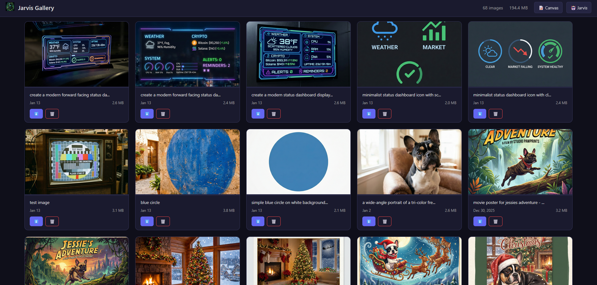

# Jarvis Canvas System

A visual viewer for rich content that Jarvis populates. Think of it as a personal wiki/knowledge canvas that Jarvis writes to when displaying complex information.

**Includes:** Canvas Pages + Image Gallery + Video Gallery

## Overview


## Quick Start

### 1. Start the Canvas Server

```bash
# Basic start
./bin/jarvis-canvas

# Custom port
./bin/jarvis-canvas --port 8890

# Debug mode
./bin/jarvis-canvas --debug
```

### 2. Open in Browser

Navigate to: `http://localhost:8890`

### 3. Ask Jarvis to Save Content

```
You: "Research the top 3 databases for time series data and save to canvas"
You: "Put my server IPs in the canvas"
You: "Save that code snippet to my canvas"
```

Canvas pages support embedded images. Jarvis can now pass an explicit `image_url` (including normal `https://` URLs and `stash://` refs) when creating or updating a page, and the Canvas tool will insert the markdown image block automatically at the top of the page. If a tool or model only includes a plain text line such as `Image: https://...`, the Canvas tool will now recover that inline URL and convert it into a real embedded image block automatically.

## Architecture

```
┌─────────────┐     ┌──────────────┐     ┌─────────────┐
│   Jarvis    │────▶│ Canvas Tool  │────▶│   Canvas    │
│ Orchestrator│     │ (canvas.py)  │     │   Server    │
└─────────────┘     └──────────────┘     └─────────────┘
                           │                    │
                           ▼                    ▼
                    ┌─────────────┐     ┌─────────────┐
                    │   Memory    │     │ data/canvas │
                    │   Database  │     │  (JSON)     │
                    └─────────────┘     └─────────────┘
```

### Components

| Component | Location | Purpose |
|-----------|----------|---------|
| **Canvas Server** | `bin/jarvis-canvas` | Flask web server with dark UI |
| **Canvas Tool** | `skills/canvas.py` | Tool for Jarvis to create/manage pages |
| **Page Storage** | `data/canvas/*.json` | JSON files for each page |
| **Memory Integration** | Automatic | Pages saved to Jarvis memory for recall |

## Configuration

### Default Settings

| Setting | Value | Description |
|---------|-------|-------------|
| Port | `8890` | Web server port |
| Host | `0.0.0.0` | Bind address |
| Data Dir | `data/canvas/` | Page storage location |

### Environment Variables

None required. Canvas uses defaults.

---

## Sidebar: Hierarchical Tree View

The sidebar renders pages as a collapsible tree, parsing `/` in page titles to build nested folders.

### How it works

Pages with titles like `Workflows/Research/Claude 4 release date` produce a tree:

```
▸ Workflows (29)
  ▸ Crypto (2)
  ▸ Daily Status (10)
  ▸ Research (13)
    Claude 4 release date
    openclaw ai assistant app...
```

The tree is built entirely client-side from the flat page list returned by `GET /api/pages`. The backend stores titles as-is and has no concept of folders.

### Key behaviors

- **Expand/collapse** -- click a folder to toggle. SVG chevron rotates smoothly.
- **Auto-expand** -- ancestor folders of the active page expand automatically.
- **Smart folder parsing** -- only segments under 50 characters are treated as folder names. This prevents slashes in page titles (like "3/4 ft" or fractions) from creating spurious sub-folders.
- **Pinned pages** -- shown in a separate "Pinned" section at the top, removed from the tree to avoid duplication.
- **Search** -- hides the tree and shows flat results matching the query. Clearing the search restores the tree with folder states preserved.
- **Live updates** -- polling every 2 seconds compares a hash of page IDs + titles + pin states, so renames and moves trigger re-renders (not just count changes).
- **Folder counts** -- badge next to each folder shows total pages underneath (recursive).
- **Title truncation** -- long page titles truncate with ellipsis in the sidebar. Full title shown on hover via tooltip.
- **Connector lines** -- subtle vertical lines at each nesting level show parent/child relationships. Deeper levels get progressively fainter lines.

### Breadcrumb titles

When viewing a page, the header shows:
1. A breadcrumb path in small muted text (e.g., `Workflows / Research`)
2. The page's display name as the h1 (e.g., `Claude 4 release date`)

This replaces the old behavior of dumping the full path as the title, which wrapped badly on mobile.

### Implementation files

| File | What changed |
|------|-------------|
| `jarvis-canvas/client/static/js/canvas.js` | `buildTree()`, `renderTreeNode()`, updated `renderSidebar()`, breadcrumb in `selectPage()` |
| `jarvis-canvas/client/static/css/canvas.css` | `.tree-children` nesting, `.folder-icon` SVG, `.page-breadcrumb`, mobile layout fixes |
| `jarvis-canvas/client/templates/canvas.html` | No changes -- JS generates all sidebar DOM |

---

## Workflow Title Summarization

The research workflow (`/research`) used to set page titles to the user's raw query verbatim. A 100-word question became a 100-word title. Now the pipeline executor can generate short titles using the LLM.

### How it works

The `deep_research.json` workflow uses a `short_title` variable extraction type:

```json
"variables": {
  "topic": {"from": "query", "extract": "short_title"}
}
```

The pipeline executor's `_generate_short_title()` method sends the raw query to the LLM with a system prompt requesting a 5-8 word title. If the LLM call fails, it falls back to the first 8 words of the query.

**Before:** `Workflows/Research/i need to get a breakdown of my truck for fair market value, 2017 Ford F250 Super Duty Crew Cab Lariat Pickup 4D 6 3/4 ft 45,506 miles...`

**After:** `Workflows/Research/2017 Ford F250 Fair Market Value`

### Implementation files

| File | What changed |
|------|-------------|
| `orchestrator/pipeline_executor.py` | Added `_generate_short_title()` method and `short_title` extraction type in `_extract_variables()` |
| `data/workflows/deep_research.json` | Changed topic extract from `main_subject` to `short_title` |

The `short_title` extraction type is available to any workflow that needs concise LLM-generated titles.

---



## Image Gallery

The canvas server includes an integrated image gallery for browsing generated images.

### Access
- **URL:** `http://localhost:8890/gallery`
- **Navigation:** Click "Gallery" in canvas header, or "Canvas" in gallery header

### Features
- Thumbnail grid with lazy loading
- Lightbox view with click-to-enlarge
- Search by filename
- Sort by date, name, or size
- Download images locally
- CDN Upload for Cloudflare CDN URL sharing
- Convert to Video (AI video from image)
- Delete unwanted images
- Keyboard shortcuts: `Escape` close, `←` / `→` navigate

### Image to Video Conversion

Convert any gallery image to AI video with the video button:

1. Click the video icon on any image
2. Configure animation prompt, provider (xAI Grok or Gemini Veo), duration, aspect ratio, resolution
3. Click "Generate Video"
4. Video saves to `data/generated_videos/`

```bash
POST /api/gallery/images/{filename}/to-video
Content-Type: application/json

{
  "prompt": "Gentle zoom with clouds moving slowly",
  "provider": "xai",
  "duration": 8,
  "aspect_ratio": "16:9",
  "resolution": "720p"
}
```

### Source Directory
Images are served from: `data/generated_images/`

---

## Video Gallery


### Access
- **URL:** `http://localhost:8890/video-gallery`
- **Navigation:** Click "Videos" in any canvas header

### Features
- Video grid with hover preview
- Lightbox view with playback controls
- Search by filename
- Sort by date, name, size, or duration
- Download and delete
- Provider badges (xAI/Gemini)
- Duration display
- Keyboard shortcuts: `Escape` close, `←` / `→` navigate, `Space` play/pause

### Source Directory
Videos are served from: `data/generated_videos/`

### API Endpoints

```bash
GET /api/gallery/videos          # List all videos
GET /api/gallery/videos/<name>   # Get video file
DELETE /api/gallery/videos/<name> # Delete video
```

---

## API Reference

### Health Check

```bash
curl http://localhost:8890/api/health
```

```json
{
  "status": "healthy",
  "service": "jarvis-canvas",
  "pages": 5,
  "timestamp": "2026-02-01T14:30:22Z"
}
```

### List Pages

```bash
curl http://localhost:8890/api/pages
```

### Create Page

```bash
curl -X POST http://localhost:8890/api/pages \
  -H "Content-Type: application/json" \
  -d '{
    "title": "My Research",
    "content": "## Results\n\n- Item 1\n- Item 2",
    "tags": ["research", "reference"],
    "source_query": "research databases"
  }'
```

### Update Page

```bash
curl -X PUT http://localhost:8890/api/pages/page_20241201_143022 \
  -H "Content-Type: application/json" \
  -d '{
    "title": "Updated Title",
    "pinned": true
  }'
```

### Delete Page

```bash
curl -X DELETE http://localhost:8890/api/pages/page_20241201_143022
```

### Download Page

Export a page as JSON or Markdown:

```bash
# Download as JSON (default)
curl http://localhost:8890/api/pages/{id}/download

# Download as Markdown with frontmatter
curl "http://localhost:8890/api/pages/{id}/download?format=markdown"
```

### Upload/Import Page

```bash
curl -X POST http://localhost:8890/api/pages/upload \
  -H "Content-Type: application/json" \
  -d '{
    "title": "Imported Page",
    "content": "## Imported Content\n\nHello world!",
    "tags": ["imported"]
  }'
```

---

## Tool Usage

### Actions

| Action | Description | Required Params |
|--------|-------------|-----------------|
| `create` | New page | `title`, `content` |
| `update` | Modify existing | `page_id` |
| `delete` | Remove page | `page_id` |
| `list` | Show all pages | None |
| `open` | Get canvas URL | None |
| `read` | Get page content | `page_id` or `search` |

### Read Action

```json
// Read most recent page
{"action": "read"}

// Read by page ID
{"action": "read", "page_id": "page_20260115_175126"}

// Search by keyword
{"action": "read", "search": "bitcoin"}
```

Falls back to direct file access if the canvas server is down.

---

## Page Data Structure

```json
{
  "id": "page_20241201_143022",
  "title": "Top 3 Movies - Dec 2024",
  "content": "## Movies\n\n### 1. Movie Name\n...",
  "content_type": "markdown",
  "tags": ["movies", "entertainment"],
  "source_query": "Find the top 3 movies right now",
  "created": "2024-12-01T14:30:22Z",
  "updated": "2024-12-01T15:45:00Z",
  "pinned": false
}
```

---

## UI Features

### Dark Theme
- Space Grotesk font for UI
- JetBrains Mono for code
- GitHub Dark syntax highlighting

### Sidebar

The sidebar has three sections:

1. **Pinned** -- important pages pinned to the top (hidden when empty)
2. **Folders** -- hierarchical tree view of pages grouped by `/` in their titles
3. **Pages** -- ungrouped pages (no `/` in title)

Search with `Ctrl+K`. Results show as a flat list; clearing the search restores the tree.

### Folder Organization

Pages are grouped into folders by splitting their title on `/`:
- `Phone Calls/2025-12-14...` goes under **Phone Calls**
- `Workflows/Research/Claude 4` goes under **Workflows** > **Research**
- `System Prompt Suggestion...` has no folder (no `/`)

**URL safety:** Titles containing `://` (URLs) are never treated as folders.

**Smart segment detection:** Segments over 50 characters are not treated as folder names. This prevents page titles that happen to contain slashes (like "6 3/4 ft" or date fractions) from creating broken folder structures.

**Workflow organization:**

| Workflow | Canvas Title Pattern |
|----------|---------------------|
| `/archive` | `Workflows/Archive/{domain}` |
| `/research` | `Workflows/Research/{short_title}` |
| `/crypto` | `Workflows/Crypto/{date}` |
| `/status` | `Workflows/Daily Status/{date}` |
| `/dive` | `Workflows/Deep Dive/{domain}` |
| `/youtube_research` | `Workflows/YouTube/{video_title}` |

### Page View
- Breadcrumb path above the title (e.g., `Workflows / Research`)
- Markdown rendering with syntax highlighting
- Source query display
- Edit, delete, pin, download, print buttons
- Image lightbox on click

### Pinning and Image Preservation

Pinning a canvas page automatically pins any stash images referenced in that page. This prevents images from being cleaned up by stash TTL expiration (default 7 days).

How it works:
- Canvas pages embed images as ``
- Clicking pin extracts all `stash://` references and pins those stash spaces
- Pinned stash spaces never expire

Unpinning a page does NOT auto-unpin stash spaces (other pages might reference them).

### Print Support
Click the print button for clean black-on-white output. Hides sidebar, header, and action buttons.

### Live Reload
Pages auto-refresh every 2 seconds. The polling compares a hash of all page IDs, titles, and pin states, so it catches renames and moves, not just additions and deletions.

---

## Integration with Jarvis

### When Jarvis Uses Canvas

1. Research results and multi-item comparisons
2. Code snippets with syntax highlighting
3. Server/network info and IP tables
4. Reference material and documentation
5. Explicit requests ("save to canvas", "put in viewer")

### Memory Integration

Every canvas page is saved to Jarvis memory:
- Key: `canvas_page_{id}`
- Category: `canvas`
- Importance: 6

This lets Jarvis recall pages later:
```
You: "What's in my canvas about databases?"
Jarvis: [searches memory, finds canvas_page_xxx]
        "You have a comparison of time-series databases saved."
```

### Fallback Behavior

If the canvas server is down, the tool returns an error gracefully. No crash, no hang. User gets told to start canvas.

---

## Two API Systems

Canvas has two separate API systems for different purposes.

### 1. Canvas Server API (Port 8890)

Internal Flask server for the web UI and tool operations.

```bash
curl http://localhost:8890/api/health
curl http://localhost:8890/api/pages
POST/PUT/DELETE http://localhost:8890/api/pages/{id}
```

**Used by:** Canvas tool (`skills/canvas.py`), Canvas web viewer

### 2. Jarvis FastAPI (Port 8880)

Read-only API for external integrations and scripts.

```bash
curl http://localhost:8880/api/canvas/stats
curl "http://localhost:8880/api/canvas?limit=20&tag=status"
curl "http://localhost:8880/api/canvas/search?q=bitcoin"
curl "http://localhost:8880/api/canvas/recent?limit=5"
curl http://localhost:8880/api/canvas/tags
curl http://localhost:8880/api/canvas/tools
curl http://localhost:8880/api/canvas/page_20260115_175126
```

**Used by:** n8n workflows, external scripts, Dashboard TUI, monitoring

### When to Use Which

| Use Case | API | Port |
|----------|-----|------|
| Canvas web viewer | Canvas Server | 8890 |
| Create/update/delete pages | Canvas Server | 8890 |
| `canvas` tool (skills/canvas.py) | Canvas Server | 8890 |
| External integrations (n8n) | FastAPI | 8880 |
| Programmatic queries | FastAPI | 8880 |
| Monitoring/debugging | FastAPI | 8880 |

See `docs/api/CANVAS.md` for full FastAPI documentation.

---

## Running as Service

### Manual Start
```bash
./bin/jarvis-canvas &
```

### With tmux
```bash
tmux new-session -d -s jarvis-canvas "./bin/jarvis-canvas"
tmux attach -t jarvis-canvas
# Detach: Ctrl+B, then d
```

### Dashboard Integration

```python
Command("Start Canvas", "./bin/jarvis-canvas", "Visual knowledge viewer", "Services", interactive=True),
Command("Canvas Health", "curl -sf http://localhost:8890/api/health | jq", "Canvas status", "Monitor"),
```

---

## File Locations

### Application structure

```
jarvis-canvas/
├── __init__.py
├── config.py                      # Configuration (paths, ports)
├── client/
│   ├── static/
│   │   ├── css/
│   │   │   ├── base.css           # Shared styles (dark theme, fonts)
│   │   │   ├── canvas.css         # Canvas pages + tree view
│   │   │   ├── gallery.css        # Image gallery
│   │   │   └── video-gallery.css  # Video gallery
│   │   ├── stash-viewer.html      # Markdown/text viewer for stash artifacts
│   │   └── js/
│   │       ├── canvas.js          # Canvas pages + tree builder
│   │       ├── gallery.js         # Image gallery logic
│   │       └── video-gallery.js   # Video gallery logic
│   └── templates/
│       ├── base.html              # Shared layout (header, nav)
│       ├── canvas.html            # Canvas pages view
│       ├── gallery.html           # Image gallery view
│       └── video-gallery.html     # Video gallery view
└── server/
    ├── __init__.py
    ├── app.py                     # Flask app factory + run_server()
    ├── pages.py                   # Page storage functions
    ├── utils.py                   # Utility functions
    └── routes/
        ├── __init__.py            # Blueprint registration
        ├── auth.py                # Authentication
        ├── health.py              # /api/health
        ├── pages.py               # /api/pages/*
        ├── gallery.py             # /api/gallery/images/*
        ├── video_gallery.py       # /api/gallery/videos/*
        ├── stash.py               # /api/stash/*, /stash/view/<space>/<file>
        └── views.py               # / and /gallery, /video-gallery
```

### Related files

| File | Purpose |
|------|---------|
| `bin/jarvis-canvas` | Entry point script (thin wrapper) |
| `skills/canvas.py` | Tool implementation |
| `skills/canvas.tool.json` | Tool definition |
| `data/canvas/*.json` | Page storage |
| `data/generated_images/` | Image gallery source |
| `data/generated_videos/` | Video gallery source |
| `api/routes/canvas.py` | FastAPI routes (port 8880) |
| `orchestrator/pipeline_executor.py` | Workflow title generation (`short_title`) |
| `data/workflows/deep_research.json` | Research workflow (uses `short_title`) |

---

## Stash Integration

Canvas pages can include stash-hosted images:

```markdown

```

The canvas server resolves `stash://` URLs to **API** endpoints at render time (`GET /api/stash/<space_id>/<file_id>`). Pinning a page pins its stash references to prevent TTL expiration.

### Stash viewer (transcripts and text artifacts)

Jarvis Web UI (port `5001`) and **Canvas** (default `8890`) both expose a read-only **stash viewer** for Markdown and text files in stash:

| | |
|--|--|
| **URL** | `/stash/view/<space_id>/<file_id>` (same host as the app you are using) |
| **Raw file** | `GET /api/stash/<space_id>/<file_id>` (used by the viewer and for binary download) |

On Canvas, `jarvis-canvas/client/static/js/canvas.js` rewrites stash references when rendering page markdown: **links and prose** point at `/stash/view/...` so you can open transcripts in the viewer; **Markdown images** stay on `/api/stash/...` so images and other binaries still load correctly. The client also normalizes common LLM glitches (e.g. stray `%60`, broken inline-code backticks around paths) so transcript lines stay readable and clickable.

Implementation: `jarvis-canvas/server/routes/stash.py` (route + file serving), `jarvis-canvas/client/static/stash-viewer.html`. Cross-cutting design notes: `docs/STASH_SYSTEM.md` (*Stash viewer (Jarvis Web UI)* and Canvas note).

---

## Troubleshooting

### Canvas won't start

```bash
lsof -i :8890              # Check if port is in use
./bin/jarvis-canvas --debug # Check for Python errors
```

### Pages not appearing

```bash
ls -la data/canvas/                          # Check data directory
curl http://localhost:8890/api/pages | jq    # Check API directly
```

### Memory not saving

```bash
sqlite3 data/jarvis_memory.db "SELECT * FROM knowledge_base WHERE category='canvas'"
```

---

**Version:** 2.3
**Last Updated:** 2026-04-17

### Changelog

- **v2.3** (Apr 2026): Stash viewer on Canvas (`/stash/view/...`), markdown pipeline for viewer vs `/api/stash` for media, pin sync recognizes viewer/API paths; see *Stash viewer* under Stash Integration
- **v2.2** (Apr 2026): Explicit `image_url` support for page create/update plus inline `Image: https://...` auto-conversion so Amazon/product pages can reliably save with embedded images
- **v2.1** (Feb 2026): Hierarchical tree view sidebar, breadcrumb titles, LLM title summarization for research workflow, smart folder segment detection, hash-based polling
- **v2.0** (Feb 2026): Modular architecture refactor (monolith to Flask blueprints) + Video Gallery
- **v1.4** (Feb 2026): Image-to-video conversion
- **v1.3** (Jan 2026): Download/upload API, nested folders, URL-aware folder parsing
