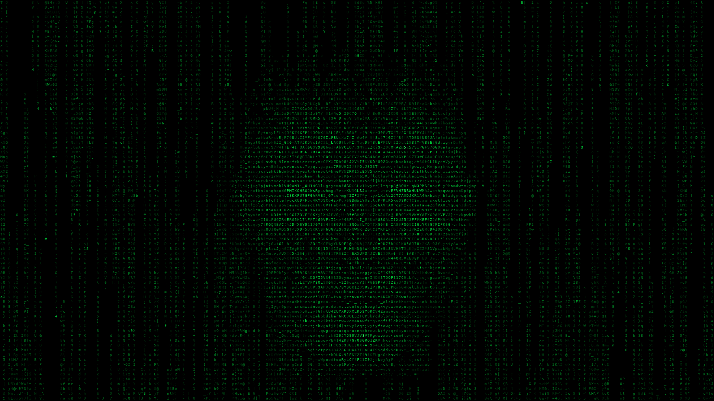

# Jarvis Head (matrix kiosk)



**Status:** Phases 0–7 accepted on the panel (Phase 7 framebuffer renderer live-tested 2026-09-01: smaller font, CPU under the curses baseline, console returned on stop). Phase 8 (Tier 2 choreography on the fb renderer) implemented and offscreen-verified the same day, awaiting panel acceptance. Optional host display, not part of install or Docker.

**Startup policy:** Manual only for v1, including Phase 5. Nothing starts the head from an existing tmux session, `start-all`, the Jarvis dashboard, an installer, an enabled systemd unit, or the wake process. Hooks only send optional datagrams; they never launch or supervise the display. `bin/kiosk.sh start` creates a bounded **transient** systemd service only when explicitly requested; it is never installed or enabled at boot.

A fullscreen terminal on a monitor plugged into the Jarvis host. Idle is matrix rain. Wake word coalesces a face out of the rain. Blink and a little drift while listening. Mouth tracks TTS while `aplay` runs.

Maintainer-local look references (gitignored and not shipped in clones):

- `docs/personal/talking-head/matrix-idea.png` — the real matrix-crypto rain (Windows screenshot). Green columns, black gutters. That is the engine.
- `docs/personal/talking-head/matrix-face-idea.jpg` — rain that *is* a face. Drop the CRT bezel. The panel *is* the object.

This is not a 3D hologram, not SadTalker, not a browser kiosk, and not an LLM tool.

Rain code comes from [bigsk1/matrix-crypto](https://github.com/bigsk1/matrix-crypto) (same author). Adapt the column loop. Do not submodule it. Do not keep CoinGecko.

## Why this shape

TTS is already a wav on disk, then `aplay` on this host. The display is an independent process on a second TTY. Wake stays in its tmux session. The head never owns or launches wake, TTS, `aplay`, the orchestrator, or the API. The remaining latency is TTS generation, same as today.

## Non-goals (v1)

- Photoreal skin, 3D tilt, arc-reactor bust, hologram hardware
- Chromium kiosk, WebSocket to a phone, GPU talking-head generators
- Blocking `aplay` while an envelope or visemes compute
- A skill the model can call
- Web-UI-only TTS (`POST /api/tts` in the browser)
- Shipping this in Docker or `install.sh`
- Positioning a window onto a panel from the app (`DISPLAY=:0` is an X server, not a monitor)

## Layout

Application directory, same idea as `jarvis-canvas/`: `bin/jarvis-head` puts that directory on `sys.path` and imports `app`, `rain`, `mask`. It is **not** an importable package named `jarvis-head` (hyphens). Do not add a decorative `__init__.py` that pretends otherwise. The publisher lives in `lib/` so wake and TTS never import curses.

```
bin/jarvis-head              # display, demo, emit
bin/kiosk.sh                 # manual Linux-VT start / stop / status wrapper
lib/head_events.py           # fire-and-forget Unix datagram send
jarvis-head/                 # application directory (not a Python package)
  app.py                     # HeadScene simulation + curses renderer + renderer dispatch
  fb_render.py               # framebuffer renderer: numpy glyph compose, loop, --snapshot
  fbdev.py                   # /dev/fb0 ioctl/mmap, KD_GRAPHICS console mode, raw quit keys
  glyphs.py                  # monospace TrueType glyph atlas (Pillow), font discovery
  display_errors.py          # operator-facing setup errors shared by renderers
  head_protocol.py           # bounded JSON validation
  head_socket.py             # singleton lock + secure datagram lifecycle
  head_state.py              # base state + speech overlay
  rain.py                    # MatrixColumn, adapted from matrix-crypto
  palette.py                 # curses-free tonal ramp + role → shade mapping
  mask.py                    # authored masks → cell intensities (aspect-corrected)
  visemes.py                 # wav → mouth timeline (four-aperture envelope first)
  assets/
    face.png                 # authored semantic mask: 0 outside the head
    face-blink.png           # authored eyes-closed control
    mouth-rest.png           # authored four-aperture controls
    mouth-ae.png
    mouth-o.png
    mouth-closed.png
```

Core display and event commands:

```bash
./bin/jarvis-head                    # kiosk preset (solid field)
./bin/jarvis-head --preset reference # original guttered density
./bin/jarvis-head --fps 45           # optional 1–120 FPS cap (default 30)
./bin/jarvis-head --seed 42           # fixed visual sequence for comparisons
./bin/jarvis-head --demo-face         # force the authored face, no wake/events
./bin/jarvis-head --demo-face --cell-aspect 0.4
./bin/jarvis-head --demo-wav PATH     # looping visual envelope; never plays audio
./bin/jarvis-head emit listen
./bin/jarvis-head emit think
./bin/jarvis-head emit speak --wav PATH --playback-id ID --t0 EPOCH
./bin/jarvis-head emit speak_end --playback-id ID --ok true|false
./bin/jarvis-head emit sleep
```

The emit commands support isolated testing and are now used by the default-off Phase 4 TTS/wake hooks. They never launch the display.

Python callers (wake scripts) import `lib/head_events.py`. Bash callers use `emit`. If nothing is bound, emit is a silent no-op. TTS never depends on the display being up. The `emit` CLI path must lazy-import only configuration and `head_events`; it must not import curses, Pillow, masks, or the display application.

## Event protocol

Unix datagram socket.

Default path: `/tmp/jarvis-head-$UID/head.sock` (compute the uid with `os.getuid()`, not an assumed exported `$UID`). Its per-user directory is private (`0700`) and remains available if the launching SSH/logind session ends; this keeps the independently running display, wake, and TTS processes on one endpoint. Override with an absolute `JARVIS_HEAD_SOCKET`; relative paths are rejected so processes with different working directories cannot split across sockets.

For the default, create the leaf runtime directory mode `0700`; socket mode `0600`. For a custom path, do not chmod an arbitrary existing parent directory: require a safe writable parent or create only the missing leaf directory.

Bind rules:

- Before touching the socket, acquire and hold a nonblocking advisory lock in the same private runtime directory for the display's lifetime. If the lock is held, another display is active: refuse to start. A second display must never unlink and steal the active display's socket.
- After acquiring the lock, if the path exists, require that it is a socket owned by the current uid before unlinking it as stale. Refuse to unlink a regular file, symlink, device, or another user's socket.
- Unlink the socket and release the lock on SIGINT / SIGTERM / normal exit. SIGKILL may leave the socket inode, but releases the kernel lock; the next start removes the owned stale socket after acquiring that lock.
- Bound datagram size (drop anything over a few KiB). Bound WAV size before the display reads it.
- Validate the wav path: regular file, readable, RIFF/WAVE header. Reject missing, empty, directories, and device nodes. On reject, ignore that `speak` (do not crash the rain).

JSON one datagram per event:

| type | when | payload |
|------|------|---------|
| `listen` | wake word accepted, before greeting TTS | `{}` |
| `think` | question capture / orchestrator running (optional) | `{}` |
| `speak` | **inside the playback lock**, immediately before each `aplay` attempt | `{playback_id, wav, t0}` |
| `speak_end` | that attempt finished | `{playback_id, ok}` |
| `sleep` | wake loop re-armed | `{}` |

`playback_id` is unique per `aplay` attempt (not per wav). A retry is a new id. The display ignores `speak_end` whose id is not the active overlay. `t0` is unix epoch with fraction (`date +%s.%N` / `time.time()`). Align the mouth to `t0`, not packet arrival.

`say.sh` and `say-local.sh` intentionally pad ~200ms of silence with sox before play so the beginning of wake-triggered speech is not clipped. Status TTS uses its configured `STATUS_SILENCE_PAD_MS` (250ms by default). The envelope includes this audio; these pads are separate from the smaller enabled-emitter startup overhead immediately before `aplay`.

Status scripts may delete a temp wav after play. On `speak`, load the wav (or its envelope) into memory immediately. Cached status files under `~/.cache/jarvis/status-tts/` are not deleted; still copy or parse before `aplay` returns.

WAV duration is the display fail-safe: if `speak_end` never arrives, end the overlay when `t0 + duration + slack` elapses.

## Hook points

**Implemented in Phase 4** (one helper, not a UniFi-specific hook): every script that plays through `bin/tts-common.sh` → `jarvis_tts_play_audio` → `aplay`. That is `say.sh`, `say-local.sh`, `say-status.sh`, `say-status-local.sh`, and everything that calls those: wake greetings, question-orchestrator answers, UniFi alerts via `alert_manager`, follow-up daemon, reminder scheduler, self-healing, in-task status phrases.

**Out of scope until explicitly hooked:** leftover scripts that call `aplay` themselves (`bin/question.sh`, `bin/question-local.sh`, `bin/question-mic.sh`). Browser `POST /api/tts`. Docker proactive speech.

Do not hook the orchestrator, Web Socket.IO, or the LLM.

### Speak emit lives inside the lock

`jarvis_tts_play_audio` can block up to `TTS_PLAYBACK_LOCK_TIMEOUT` (default 30s) on `flock`. Emitting at function entry would start the mouth while another utterance still holds the speaker.

Phase 4 emits in `jarvis_tts_play_audio_once`, **after** the lock is held, immediately before each `aplay`. It generates a unique `playback_id` for that attempt. After `aplay` returns, it emits `speak_end` with that id and success/failure. The enabled playback attempt has a scoped `EXIT` cleanup, so terminating a status-TTS process group during `aplay` emits a failed `speak_end` instead of relying on the WAV-duration fail-safe. It never waits on the display.

If flock is missing, the retry loop still emits per attempt the same way.

Keep emit behind `JARVIS_HEAD_ENABLED` (default off). Python callers return immediately from `head_events.emit` when unset or false. `tts-common.sh` must perform the same cheap truthy check **before launching the Python CLI**, so disabled installations pay no per-utterance Python startup cost.

The publisher uses a nonblocking Unix datagram socket and a bounded payload. Missing socket, stale receiver, full receive queue, malformed override path, and all other send failures are silent by default. They must not delay playback, change the `aplay` exit status, or affect retry behavior. Optional diagnostics require `JARVIS_HEAD_DEBUG=true`.

Wake scripts still emit `listen` / `sleep`. While the Q&A child process is alive, they renew `listen` every 30 seconds so a long recording, transcription, or tool-heavy orchestrator run cannot age out the default 120-second face lease. The keepalive stops before re-arm or exit cleanup. Alerts do not need it: a `speak` while asleep is enough.

## Failure boundary: the head cannot take Jarvis down

The display is an optional peer process, not a child service that Jarvis supervises and not a library loaded by wake, TTS, the API, or the orchestrator. Events travel one way. There is no acknowledgment or health dependency in the Jarvis path.

If the head crashes, is killed, loses its TTY, rejects a wav, or is not running at all, the only loss is the visual. Wake capture, TTS generation, the playback lock, `aplay`, alerts, and re-arm continue exactly as they do with `JARVIS_HEAD_ENABLED=false`. Every emitter call is fail-open (`|| true` or equivalent) while preserving the real playback status.

Process separation does not prevent resource contention, so the display also has hard bounds:

- Frame rate is capped; animation uses monotonic delta time rather than running as fast as possible.
- Terminal-sized rain/mask arrays and WAV reads are bounded. No unbounded event queue, retry queue, log, or decoded-audio cache.
- Render or decode exceptions terminate or reset only the display. Do not catch an exception and spin a hot restart loop inside `app.py`.
- Keep systemd out of v1. If supervision is added later, use delayed/rate-limited restart and optional CPU/memory controls; never rapid `Restart=always`.

## State: base + speech overlay

Speech is not a third peer of sleep/listen. Status TTS arrives with no preceding `listen`.

```
base_state     = SLEEP | LISTEN | THINK
speech_overlay = inactive | playback(playback_id, t0, duration)
```

| Situation | What the screen does |
|-----------|----------------------|
| `SLEEP` + overlay inactive | Rain only |
| `SLEEP` + `speak` | Face materializes, mouth follows that `playback_id`, dissolve back to rain when overlay ends |
| `LISTEN` / `THINK` + overlay inactive | Face, blink, 1–2 cell drift |
| `LISTEN` / `THINK` + `speak` | Same face, mouth follows `playback_id`, return to listen/think (do not dissolve) |
| `sleep` event | Set base state to `SLEEP`; an active speech overlay finishes normally, then dissolve to rain |
| Retry `speak` with a new id | Switch overlay to the new id; ignore later `speak_end` for the old id |
| Stale `speak` (old `t0`, or overlay already on a newer id) | Ignore |
| No events while `LISTEN`/`THINK` for `JARVIS_HEAD_IDLE_TIMEOUT` | Force `SLEEP` so a crashed wake process cannot leave the face up |

`LISTEN` stays up across greeting TTS + Q&A + answer so the face does not dissolve between “yes?” and the reply. Overlay is the mouth. UniFi / reminders never set `LISTEN`.

Idle motion:

- Glyph texture: mutate a scattered subset on a slower cadence than the rain. The semantic intensities and facial coordinates stay fixed, so the face remains readable without looking frozen.
- Keep glyph state independent from expression and pose. A blink or drift must not rerandomize the full face; glyph mutation continues naturally underneath both.
- Blink: swap only the `face-blink.png` eye ROI values for 2–3 frames, random 2–6s. Preserve the current glyph field.
- Drift: do not rotate glyphs or regenerate the mask. Apply a 0–2-cell draw offset to the composed face, including its current glyph field and active eye/mouth values.

## Rain density (the screenshot)

`matrix-idea.png` is the current look: one stream per column, black alleys between them. That is `BACKGROUND_PATTERN` (`[1, 2, 3, 1]` means draw one column, skip 1–3 cells). Columns are also short (`BACKGROUND_COLUMN_LENGTH_RANGE` about 0.3–0.6 of height), so the field never fills.

Matrix Crypto took repeated tuning to make its column lifecycle stable. Preserve that work deliberately:

- Start from the offline `MatrixColumn` initialization/update/reset mechanics and record the exact upstream commit in `rain.py`.
- Separate the proven column model from Jarvis's curses renderer, mask, and event loop. Do not rewrite column movement and face composition at the same time.
- Give `RainField` an injectable `random.Random` instance. Demos and tests can use a fixed seed; normal display startup uses a fresh seed.
- First reproduce the known guttered Matrix Crypto look as a `reference` preset. Only after that matches should a separate `kiosk` preset change gaps, lengths, and speed for the solid field. The stable mechanics stay the same.

Kiosk idle should be a solid field. Same class, different numbers:

- `BACKGROUND_PATTERN = [0]` (or skip the gap loop): a column on every x
- Longer streams, closer to full height, so vertical holes close
- Slightly faster `BACKGROUND_FALL_SPEED_RANGE` if it still feels sparse
- Opaque terminal. The Windows shot shows chat UI through the glass. The head monitor is black.

Crypto tickers in matrix-crypto were a second *pass* in the same loop. The face replaces that pass. It does not replace the rain. No compositor overlay.

## Rain + face

A face-shaped hole in the rain reads as a black blob. Keep raining everywhere. The mask is a per-cell multiplier:

| Mask region | What the cell does |
|-------------|--------------------|
| Outside the head (value 0) | Normal rain |
| Within ~4 columns / 2 rows of the silhouette | Rain drops one shade (contrast halo) |
| Skin / skull | Denser, brighter, glyphs change less often (rain “locks”); luminance also picks the glyph weight band |
| Eyes / nose highlights | Top of the tonal ramp; rain leads are demoted below skin so the eyes are always the brightest cells |
| Mouth | The only real negative space: which aperture PNG is active |

One `addstr` loop. After drawing a rain cell, if the mask says so, change intensity / hold the char / skip drawing (mouth hole).

### Tonal ramp (Phase 6)

Three attributes (dim / normal / bold) shared with the rain flatten the authored shading into noise. `palette.py` builds a single-hue ramp from near-black through the base hue to a pale tint and maps roles onto it by fraction: rain body in the bottom ~40%, the lead at ~58%, skin from ~34% upward by mask luminance, and value 255 on the top shade. How many shades exist depends on the terminal:

| Terminal | Shades | How |
|----------|--------|-----|
| Linux console (`TERM=linux`, the kiosk) | 14 | `init_color` redefines slots 1–7 via `initc`; slots 9–15 are set with raw `ESC ] P n rrggbb` so `A_BOLD` selects the bright half of the same ramp. `ESC ] R` restores the console palette on every exit path |
| 256-color terminal | ~10 | Ramp snapped to the xterm 6×6×6 cube; the gray strip is only a candidate for near-neutral colors and index 16 (black) is dropped |
| Other 8-color `ccc` terminal | 7 | `init_color` on slots 1–7 only |
| No color change support | 3 | Original dim / normal / bold fallback |

Mask luminance is compressed before it hits the ramp (`FACE_GAMMA = 2.2`). The authored head has forehead and cheek highlights near 195 and a nose specular near 250 against eye whites at 255; a linear map put all of them in the same pale tint, which read as "too much" on the panel. With the curve, 195 lands three shades below the eyes on the console ramp and stays in saturated hue. Rain body sits at ~8–28% of the ramp, the lead at 45%, skin from 36% upward.

Face glyphs are a second luminance channel, in four disjoint bands of `BACKGROUND_CHARS`: below 70 `.,:;-_=`, below 150 lowercase, below 230 uppercase/digits, and only eye whites and speculars (≥ 230) use `@#%&MWBQNH$`. An expression swap only re-picks a glyph when the cell crosses a band or leaves the mouth hole; same-band cells keep their glyph so blinks and mouth shapes still do not rerandomize the face.

### Framebuffer renderer (Phase 7)

`--renderer fb` keeps the cell-grid-of-glyphs look and swaps only how a cell becomes pixels. `HeadScene` in `app.py` owns rain, face, motion, state, and transitions for both renderers; the curses loop and the framebuffer loop each call `scene.step(dt)` and read the same four things (field, drawn face layer, offset, progress). Nothing in the rain model, masks, visemes, state machine, socket, hooks, or `kiosk.sh` changes.

Pixels come from a pre-rendered glyph atlas: `glyphs.py` rasterizes every `BACKGROUND_CHARS` glyph once with Pillow at `JARVIS_HEAD_FONT_PX` (default 10) from a monospace TrueType font (DejaVu Sans Mono by default, `JARVIS_HEAD_FONT` to override). `fb_render.py` packs that atlas for all 256 ramp brightnesses at startup (~11 MB), so a frame is two grid fills, one two-index gather of per-cell blocks, and one copy into `/dev/fb0`. Rain fills come from `RainField.visible_spans()`, a slice view of the same geometry `visible_cells()` walks; a test holds the two equal. The fitted mask uses the font's own cell width/height ratio, so `JARVIS_HEAD_CELL_ASPECT` (a console-font number) is ignored unless `--cell-aspect` is passed explicitly.

What it buys, at 1080p: 10 px DejaVu gives 7×13 px cells, 83×274 (the console font is 8×16, 67×240); 8 px gives 108×384 and noticeably more face detail. Brightness is a 256-level ramp instead of 14 shades. Compose cost measured on the host: about 3 ms per frame plus the device copy before Phase 8, about 4 ms with the choreography below; scene step about 1 ms.

### Choreography (Phase 8)

Phase 8 is what the framebuffer renderer was built for: the face stops being a print and the transition stops reading as smoke. Everything the eye sees as motion is a brightness offset on the 256-level ramp, computed per cell in numpy on top of the Phase 7 grids, so it costs about a millisecond and nothing about the cell-grid look changes. The scene-side inputs live in `HeadScene`/`FaceGlyphLayer` and are renderer-agnostic; the curses renderer inherits the eyes-first ordering and ignores the rest.

- **Features first, then the head.** Each face cell's reveal threshold mixes its distance from the nearest anchor (65%) with jitter (35%). Anchors are the centroids of the left and right eye whites plus the mouth, found as the centroid of the cells that differ between the `rest` and `ae` expression masks, so the mask itself says where the features are. Brightness alone does not find the eyes: the nose specular is as bright (≥ 230) as the eye whites, so `eye_clusters()` groups bright cells into 8-connected components, takes every component within 1.5 rows of the topmost one, splits that band at the face's center column, and accepts the pair only if the two halves are at least 20% of the face's width apart (`EYE_MIN_SEPARATION`; the authored eyes are ~45% apart, the nose strip under 10% wide). That last test is what keeps the nose out: on fine grids its centroid sits 5+ rows below the eye band, and on coarse grids where the downsample drops the eye whites but keeps the specular, a strip straddling the center column fails the separation test. If exactly one eye survives, well off center, its mirror across the center column stands in for the other. Anything else, including a nose-only strip, yields no clusters and the face anchors on its center; bright cells outside the top band are never used. Measured on the authored mask: pairs on 1080p at 8/10/12 px and 720p at 12/15/17 px, center fallback on 720p at 20 px and on 40-, 30-, and 24-row curses grids, with no anchor on the nose anywhere. Coalesce grows outward from the eyes and mouth; dissipate releases the skull first and the features last. `visible_cells()` uses the same thresholds, so curses gets the ordering too.
- **Brightness lerp, not a pop.** On fb each cell ramps from the rain level under it to its face level across a window of the eased progress (`REVEAL_WIDTH = 0.35`). The glyph switches from the rain's to the face's halfway through the ramp, or at once where there was no rain glyph to hand over from, so nothing appears at half brightness. This is the fix for the Phase 6 "smoke" note: the head condenses out of the field instead of scattering in.
- **Breathing.** `IdleFaceMotion` carries a 4.2 s sine; the face moves ±6 levels with it.
- **Rain passes through skin.** Rain keeps falling under the face (it always did; the face just drew over it). Now a lead crossing a lit face cell lights that cell +48 levels and the glow decays 22% per frame: a raindrop on a hologram. The face is made of the matrix rather than pasted on it.
- **Phosphor trail.** The cell a rain lead just vacated holds +36 levels and decays 45% per frame, so streams leave a short tail instead of stepping.
- **THINK scanline.** In `THINK` a ±2.5-row bright band (+72 levels at its center) sweeps top to bottom once every 1.2 s. `LISTEN` and `THINK` no longer look identical. `--demo-think` shows it without a wake.
- **Speech energy.** `visemes.py` now keeps the per-frame RMS it already computed, normalized to the clip's peak (`VisemeTimeline.levels`, 0 in silence). `HeadStateMachine.mouth_energy()` and the demo player expose it; the lower 45% of the face pulses up to +40 levels with loudness, ramping in over the top 15% of that region so there is no seam. The aperture mask still shapes the mouth; energy adds the jaw. Timelines without levels (empty tuple) animate aperture only.
- **Face brightness knob.** `JARVIS_HEAD_FACE_BRIGHTNESS` / `--face-brightness` (0.2–1.5, default 1.0) scales the face's height above the ramp floor, so the darkest skin stays put and highlights move; the mouth hole stays a hole. The floor was lowered from 0.5 after panel testing: the physical panel renders the ramp noticeably brighter than a PNG of the same frame. Note what the gain does not change: the glyph band is chosen by mask value, so the eye whites and the nose specular (mask ≈ 250) keep their dense `@#%&MW` glyphs at any gain and still read as a strip. Gain is what dims the strip; presence (below) veils the skull around it but the nose lies between the eye and mouth anchors, so its upper end resolves with them at any presence (about 60–70% of the strip's cells at 0.45).
- **Face presence knob.** `JARVIS_HEAD_FACE_PRESENCE` / `--face-presence` (0.3–1.0, default 1.0) caps how far the coalesce goes while the face is up. At 1.0 the whole head resolves. Around 0.45 the face holds mid-condensation for as long as it is visible: the eyes and mouth are fully resolved (they are the anchors), the nose bridge between them mostly so, the surrounding skull is a partial lerp still showing the rain's glyphs and shimmering as leads pass, and the forehead, ears, and chin never leave the rain. It is the 0.45 s coalesce frame made a steady state: features peeking through the field rather than a detailed overlay. Blink, mouth shapes, breath, ripple, scanline, and speech energy all still apply to whatever is resolved. Both renderers honor it (curses via `visible_cells()`); `kiosk.sh` forwards and preflights it like brightness.

Not in Phase 8: saccades (the mask has no pupil data), dissipate-as-falling-glyphs (the reversed lerp already reads as release), and pixel-level bloom (a separable blur on the frame would cost real milliseconds; the cell-level ripple and scanline cover the glow beat for now).

Deferred-until-panel tuning knobs are all module constants at the top of `fb_render.py` (`REVEAL_WIDTH`, `BREATH_LEVELS`, `RIPPLE_LEVELS`, `SKIN_GLOW_DECAY`, `AFTERGLOW_LEVELS`, `RAIN_AFTERGLOW_DECAY`, `SCAN_*`, `SPEECH_*`) and `app.py` (`EYE_DISTANCE_WEIGHT`, `BREATH_PERIOD_SECONDS`). Decay factors are per frame and tuned at 30 FPS. The two operator-facing knobs are brightness and presence; the panel-tuned veiled look is `--face-presence 0.45 --face-brightness 0.4`.

The authored masks end under the chin. The original head carried a neck stump (mask rows 424–478 of 512), which on the panel read as a mannequin head rather than a face in the rain; all six assets now fade to zero across rows 418–432 (smoothstep) so the chin has a soft underside and nothing below it. Because `fit()` scales the lit bounding box, the face is about 10% larger on the same grid than before.

`fbdev.py` reads geometry with `FBIOGET_VSCREENINFO`/`FBIOGET_FSCREENINFO`, memory-maps the visible page from byte zero, and switches the VT to `KD_GRAPHICS` through the inherited stdin descriptor so fbcon stops drawing its cursor and text over the frame. That descriptor matters: under `openvt … setpriv` the display user holds the VT as fds 0–2 but may not be allowed to reopen `/dev/ttyN` by path. Without a virtual console on stdin (an SSH terminal, a pty) the fb renderer refuses with a message pointing at `bin/kiosk.sh` or `--snapshot`, because writing `/dev/fb0` from SSH would paint over whatever VT the monitor is showing.

The device description fails closed on anything the compositor does not literally handle, because a plausible-looking device would otherwise draw wrong colors or the wrong page: 32 bpp; three distinct 8-bit channels (`length == 8`, `msb_right == 0`) at bit offsets 0/8/16 in any order (the host's amdgpu device is `8/16,8/8,8/0`, BGRX; RGBX also passes); no pan (`xoffset == yoffset == 0`); virtual size at least the resolution; and `stride × yres` within `smem_len`. A larger virtual area (double buffering) is accepted as long as the visible page starts at byte zero.

Exit paths: `q`, Escape, Ctrl+C, SIGTERM from `kiosk.sh stop`, and SIGHUP all unwind the same way, in this order: restore terminal attributes, blank the framebuffer, restore the previous console mode, close the device. The order matters: leaving `KD_GRAPHICS` makes fbcon redraw the text console, so the blank has to come first or it wipes that redraw and the panel sits black until a key is pressed. The first stop signal raises `KeyboardInterrupt`; the handler then sets SIGTERM/SIGHUP/SIGINT to ignore so a duplicate arriving mid-unwind (anything between systemd and Python may forward the group-wide SIGTERM again) cannot abort the restore halfway. The handlers are installed for every long-running display, demo modes included; only `--snapshot` leaves them alone. Before the post-review fix, `--demo-face` and `--demo-wav` kept SIGTERM's default action, so a `kiosk.sh stop` of a demo would have killed Python without running cleanup and left the VT black in `KD_GRAPHICS`.

`--snapshot PNG [--snapshot-at SECONDS]` runs the same scene and compositor offscreen with a fixed 1/fps step and writes one 1920×1080 frame. It needs no device, no VT, and no root; with `--seed` it is byte-for-byte deterministic. This is how the look is reviewed and tested without walking to the monitor.

Host requirements for `fb` (curses needs none of these):

- The kiosk user in the `video` group: `sudo usermod -aG video "$USER"`, then log in again (or `newgrp video` for the current shell). `/dev/fb0` is `root:video 660` on Ubuntu.
- A monospace TrueType font: `sudo apt install fonts-dejavu-core` on Debian/Ubuntu, or set `JARVIS_HEAD_FONT` to any monospace `.ttf`.
- A 32 bpp framebuffer. `sudo fbset -i` (package `fbset`, optional) or `cat /sys/class/graphics/fb0/bits_per_pixel` shows it.
- NumPy and Pillow, both already in `pyproject.toml` and `requirements.txt`.

If the display is killed with SIGKILL rather than SIGTERM, that VT can be left in `KD_GRAPHICS` (black, no text). It is per-VT, so `Ctrl+Alt+F1` still works; the next fb start on the same VT sets and then restores text mode on its own exit.

Do **not** derive `face.png` by cropping the idea JPEG to grayscale. Author semantic masks: zero outside the head, calibrated eye highlights, separate mouth apertures. The JPEG is a look reference, not the asset pipeline.

Terminal cells are taller than they are wide. Mapping a square mask 1:1 onto (cols, rows) stretches the face. `mask.py` applies a configurable cell-aspect correction (`JARVIS_HEAD_CELL_ASPECT`, default `0.4` = cell width/height in pixels, accepted on the dedicated panel) when fitting the mask into the terminal grid. Recompute on `KEY_RESIZE`.

Curses on a real monitor is ~200×50 to 240×70 cells. Pores will not survive. Eyes as the brightest cells will. The tonal ramp above is what makes the cheek and jaw shading survive; the three-attribute fallback exists only for terminals that cannot redefine or select colors.

`BACKGROUND_CHARS` can add half-width katakana later if the kiosk font has them. ASCII is enough for the first rain on the panel.

The 10ms sleep in matrix-crypto is a visual reference, not a kiosk contract. A 200×70 terminal redrawn at 100 FPS can waste a CPU core while the panel displays 60 FPS or less. Use `time.monotonic()` for delta time and target roughly 30–60 FPS. Phase 0 chooses the lowest rate that still looks fluid on the real panel and verifies that the display does not create sustained CPU pressure on Jarvis.

Pillow is already in `pyproject.toml` and `requirements.txt`.

## Mouth

The implemented first mouth uses 50ms RMS and spectral windows quantized to four apertures: rest, closed, AE/open, and O/round. Analysis happens once before curses starts. It streams through the WAV and retains only the small aperture timeline, not decoded audio.

`--demo-wav` accepts bounded uncompressed PCM WAV files (8/16/24/32-bit, 8–96kHz, up to 8 channels), with limits of 64 MiB and 300 seconds. It loops the visual timeline with a short neutral pause and never calls `aplay` or another player. Silence uses rest, low relative energy uses closed, strong low-centroid voiced frames use O/round, and the remaining strong frames use AE/open. Single-frame classification spikes are smoothed.

Rhubarb (or any viseme map) has to earn its way in with a side-by-side demo against that envelope. Do not add it in the first playback hook. If it ships later, compute on the display from the wav in `speak`, never delay `aplay`.

Never drive the jaw from live microphone volume.

## Dedicated monitor (Linux virtual terminal)

Wake tmux and the head do not share a terminal.

The supported Phase 5 target is a systemd-based Linux host with kernel virtual consoles and the `kbd`/`util-linux` commands `openvt`, `chvt`, `fgconsole`, and `setpriv`. This is normal on headless Ubuntu and broadly reproducible across comparable Linux servers. Systems without `/dev/ttyN`, systemd, or these commands can still run `bin/jarvis-head` directly in an attached terminal, but cannot use this wrapper.

`bin/kiosk.sh start` captures the currently active VT, refuses `tty1`, refuses a target with an active getty, and launches the head on `JARVIS_HEAD_KIOSK_VT` (`tty8` by default). It uses `openvt -s -w` inside a manually created transient systemd service. The service survives loss of the launching SSH connection, has one control group for reliable stop, and is constrained to 50% of one CPU and 256 MiB by default. The wrapper itself runs with console privileges, but uses `setpriv --reuid … --regid … --init-groups` so the display runs as the invoking non-root user (with its supplementary groups, `video` included) and therefore shares the same UID-owned event socket as wake and TTS. `setpriv` execs the launcher directly; `runuser` was dropped because it sits between systemd and the display, catches the group-wide SIGTERM itself, forwards a second SIGTERM to the display while it is restoring the console, sleeps two seconds, SIGKILLs, and prints `Session terminated, killing shell... ...killed.` on the panel. That was the 2 s gap between `session closed` and `Deactivated` in the journal on every stop, and the source of the intermittent traceback.

Stop ordering: `systemctl stop` signals every process in the control group at once, so the session shell's `chvt` back to the return VT runs while the display is still restoring `KD_TEXT` a few milliseconds later. The kernel refuses to switch away from a console that is still in graphics mode (`set_console()` returns `EINVAL` for a `VT_AUTO` console), which is why a stop could leave the panel on `tty8` and the next `start` complain that the return VT equals the kiosk VT. The session cleanup now retries `chvt` every 50 ms for up to 4 s (`JARVIS_HEAD_KIOSK_RETURN_VT_ATTEMPTS`, `JARVIS_HEAD_KIOSK_RETURN_VT_RETRY_SECONDS`), inside the unit's 5 s `TimeoutStopSec`, and preserves the head's own exit status. Neither restore step fails silently: if every `chvt` attempt is refused the session prints a `WARNING:` with the last `chvt` error and the Ctrl+Alt+Fn to press on the unit's stderr (the system journal), and if the display cannot put the console back into `KD_TEXT` it reports the ioctl error on stderr and to syslog (`fbdev.report_restore_failure`), so `sudo journalctl -u jarvis-head-kiosk.service -e` explains a stranded panel instead of showing a clean stop. Running `start` again while the unit is active switches the physical panel back to its configured kiosk VT without creating a second unit.

Normal exits (`q`, Escape, or Ctrl+C), failures, and `bin/kiosk.sh stop` return the monitor to the captured VT. If curses stops responding, Linux handles `Ctrl+Alt+F1` below the application and returns to the primary login console. Keep `getty@tty1.service` enabled; an optional second getty is additional recovery, not a kiosk dependency.

`DISPLAY=:0` names an X server, not a monitor. This headless-host wrapper does not install a GUI terminal, window-manager rule, compositor, persistent service, or autostart. Do not add it to existing Jarvis tmux sessions, `bin/start`, or the dashboard. A future persistent service or explicit `bin/start --with-head` remains an opt-in follow-up after live acceptance.

## Config keys

The same commented examples live in `config/cloud.env.example` and `config/local.env.example`:

```bash
# Optional matrix face kiosk on a host monitor. Emit is a no-op unless enabled
# and bin/jarvis-head is bound to the socket.
# JARVIS_HEAD_ENABLED=false
# JARVIS_HEAD_SOCKET=   # optional absolute path; otherwise use the private default
# JARVIS_HEAD_CELL_ASPECT=0.4
# JARVIS_HEAD_IDLE_TIMEOUT=120
# JARVIS_HEAD_KIOSK_VT=8
# JARVIS_HEAD_RETURN_VT=   # default: active VT when kiosk.sh starts
# JARVIS_HEAD_KIOSK_USER=  # default: invoking non-root user
# JARVIS_HEAD_KIOSK_CPU_QUOTA=50%
# JARVIS_HEAD_KIOSK_MEMORY_MAX=256M
# Renderer: curses draws terminal cells; fb draws pixels straight to the VT
# framebuffer (needs the kiosk user in the 'video' group and a monospace
# TrueType font, e.g. fonts-dejavu-core). --snapshot renders a PNG offscreen.
# JARVIS_HEAD_RENDERER=curses
# JARVIS_HEAD_FRAMEBUFFER=/dev/fb0
# JARVIS_HEAD_FONT=  # default: DejaVu Sans Mono if installed
# JARVIS_HEAD_FONT_PX=10  # 6-24; smaller = more cells = more face detail
# JARVIS_HEAD_FACE_BRIGHTNESS=1.0  # 0.2-1.5; fb face gain above the rain floor
# JARVIS_HEAD_FACE_PRESENCE=1.0  # 0.3-1.0; 1.0 = whole head, ~0.45 = features visible/skull veiled
```

`bin/kiosk.sh` forwards explicit `JARVIS_HEAD_RENDERER`, `JARVIS_HEAD_FRAMEBUFFER`, `JARVIS_HEAD_FONT`, `JARVIS_HEAD_FONT_PX`, `JARVIS_HEAD_FACE_BRIGHTNESS`, and `JARVIS_HEAD_FACE_PRESENCE` from the launching shell into the clean session environment and otherwise lets the launcher hydrate them from the selected mode file. Head flags after `--` still win over both. Preflight resolves the *effective* renderer, device, brightness, and presence the same way the launcher will (the head flag in either spelling, `--face-brightness 0.6` or `--face-brightness=0.6`, then environment/config, then the default) and refuses to create the unit when the fb renderer is selected but the device is not a character device, when the renderer name is unknown, when `--snapshot` is passed, or when the effective face brightness is outside 0.2–1.5 or the effective presence outside 0.3–1.0. So `JARVIS_HEAD_FACE_BRIGHTNESS=2 ./bin/kiosk.sh start -- --face-brightness 1.0` starts (the valid flag wins) and `./bin/kiosk.sh start -- --face-brightness 2` is refused here rather than dying after "started". The failure is printed synchronously where the operator can read it instead of the transient unit dying after "started".

Do not invent a new mode. Cloud vs local already chooses `say.sh` vs `say-local.sh`. The head does not care which LLM ran.

## Phases and done checks

Stop after any phase if the look is wrong; later phases will not save a bad mask. Envelope first; Rhubarb only after a side-by-side on the panel.

| Phase | Ship | Done when |
|-------|------|-----------|
| 0 | Adapted rain engine + `reference` / `kiosk` presets + `bin/jarvis-head` | Fixed-seed `reference` reproduces Matrix Crypto's known guttered behavior; `kiosk` is fullscreen with **no gutters**, opaque black, and fluid at a measured 30–60 FPS without sustained CPU pressure; Ctrl+C restores cursor and terminal cleanly |
| 1 | Authored semantic face mask + aspect correction + `--demo-face` | On the **actual panel**, it reads as a face from across the room. Eyes brightest. Not a bright rectangle. Not a stretched oval |
| 2 | Blink, 1–2 cell drift, `--demo-wav` four-aperture envelope | Idle looks alive. Mouth tracks a canned wav without `aplay` or wake |
| 3 | Socket + state machine **tests** (no live TTS required) | Speech-from-sleep, retry ids, stale events, missing/malformed wavs, malformed datagrams, idle timeout, singleton lock, stale-socket recovery, clean socket unlink |
| 4 | Live hooks: emit inside `jarvis_tts_play_audio_once`, both wake scripts | UniFi / `say-status` / wake greeting move the mouth. TTS still plays with a missing, crashed, or failing head. Shell tests prove emit happens **after** flock and cannot change playback status |
| 5 | Manual `bin/kiosk.sh` + transient systemd unit + dedicated Linux VT | One explicit command switches the physical monitor to an unused VT; every stop/exit path restores the prior console. No tmux, boot, login, persistent-service, or `bin/start` integration |
| 6 | Tonal ramp palette, glyph weight bands, demoted rain leads, contrast halo | On the panel the head reads as a shaded form, not a denser patch of noise: cheek/jaw shading visible, eyes the brightest cells, no white leads competing. Console palette restored on exit. CPU within a few points of Phase 5 |
| 7 | `--renderer fb`: shared `HeadScene`, glyph atlas, numpy compose to `/dev/fb0`, `KD_GRAPHICS`, `--snapshot` | Visual parity with the curses look on the panel at a finer grid, launched by the same `kiosk.sh`; every exit path restores console mode and blanks the device; refuses without a VT; deterministic offscreen PNG for review; curses remains the default and untouched |
| 8 | Choreography on fb: features-first brightness-lerp coalesce, breathing, rain-through-skin ripple, phosphor trail, THINK scanline, speech-energy jaw pulse, `--face-brightness`, `--face-presence` | On the panel the face condenses out of the rain around the eyes and releases eyes-last, with no scattered pop; idle has visible breath; leads crossing the face light it; think and listen are distinguishable; loud speech moves the jaw; compose stays within ~1 ms of Phase 7; curses unchanged except reveal order |

Phase 0 automated verification (2026-09-01): fixed-seed model tests pass; ruff passes; kiosk `q` exit and reference Ctrl+C exit both returned 0 in a 200×50 pseudo-TTY. At 30 FPS that harness measured approximately 13% CPU and 16 MiB RSS. The dedicated host monitor was visually accepted; Termius is known to wash out the black background and is not the acceptance target.

Phase 1 automated verification (2026-09-01): the authored grayscale mask is fitted from its active silhouette rather than its square image canvas, terminal cell width/height is corrected with the panel-accepted default of `0.4`, and resize rebuilds the fitted mask. Unit tests cover aspect fitting, zero-valued exterior, non-rectangular coverage, eye-highlight range, an internal dark aperture, and deterministic scattered glyph mutation. In a paired 200×50 pseudo-TTY sample at 30 FPS, rain-only used about 21% of one CPU core and the face used about 22%, with roughly 22 MiB RSS; `q`, Ctrl+C, and live resize all exited cleanly and restored the cursor. The dedicated-panel face and glyph motion were accepted before Phase 2.

Phase 2 automated verification (2026-09-01): 21 focused Phase 0–2 tests pass and cover expression-region isolation, glyph preservation across expression swaps, fixed-seed blink/drift, two-cell motion bounds, demo looping, four-aperture quantization, invalid WAVs, and file/duration limits. In 200×50 pseudo-TTY smoke tests, blink/drift and WAV-mouth demos used about 22% of one CPU core; lazy audio imports kept face-only RSS near 26 MiB, while the NumPy-backed WAV demo peaked near 40 MiB. `q`, Ctrl+C, and live resize exited cleanly and restored the cursor. Blink, drift, dynamic face glyphs, and WAV mouth motion were accepted on the dedicated panel before Phase 3.

Phase 3 automated verification (2026-09-01): 44 focused Phase 0–3 tests pass, including disabled and unavailable publishers, nonblocking queue failure, debug-only diagnostics, a real datagram round-trip, bounded malformed input, singleton refusal, owned stale-socket recovery, file/symlink protection, private modes, speech from sleep/listen, sleep during speech, retry and stale ids, invalid WAVs, idle timeout, and duration fallback. A full pseudo-TTY smoke sequence sent `listen`, `think`, `speak` with a real cached status WAV, matching `speak_end`, and `sleep`; every emit and the display returned 0 without playing audio, and the socket was removed. A separate SIGTERM run also returned 0 and removed its socket. No TTS, wake, playback-lock, or `aplay` path is changed in this phase.

Phase 4 automated verification (2026-09-01): 64 focused Phase 0–4 tests pass. The wake and playback test files also pass in both collection orders, proving their standard-library mocks are restored between tests. Shell tests prove disabled mode never invokes the emitter; each retry emits a unique id after the playback lock, followed by a matching success/failure end; terminating a blocked playback process group emits its matching failed end; a queued waiter emits nothing until it owns the lock; and an emitter failure cannot change retry count or playback success. Behavioral cloud/local wake tests cover normal re-arm, voice exit, question-process failure, long-Q&A keepalive, Ctrl+C, and startup failure, with every path returning the head to `SLEEP`. A pseudo-TTY display accepted the real emitter around a real cached WAV while a fake `aplay` returned success; no audio played, both processes returned 0, and the socket was cleaned up. The face palette test keeps all mask intensities in the selected color while reserving white for rain leads. No startup, tmux, dashboard, installer, or service file is changed.

Phase 5 verification and operator acceptance (2026-09-01): six fake command/config tests plus an absolute-socket regression bring the focused Phase 0–5 suite to 71 tests. They cover selected-mode head-only config hydration with explicit-override preservation, repo/legacy venv selection, a logout-stable private socket, relative-socket rejection, transient-unit construction, CPU/memory limits, head argument forwarding, non-root display ownership, active-start VT switching, `start`/`stop`/`status`, primary-console protection, active-getty refusal, and return-VT cleanup after display exit. On the real headless host, the transient unit switched the attached monitor to `tty8`, stopped cleanly, and allowed a direct SSH-terminal launch afterward; attempting that launch while the kiosk held the singleton produced the expected warning. Red and green palettes were accepted. On the small panel, reducing the explicit cap from 30 to 20 FPS looked the same while observed CPU fell from approximately 42% to 30.5%. The default remains 30 FPS; 20 FPS is an available operator tuning choice. No persistent unit, alias, tmux session, dashboard action, boot hook, or `bin/start` change is installed.

Phase 6 automated verification (2026-09-01): 95 focused Phase 0–6 tests pass, adding ramp monotonicity per hue, exact base-hue inclusion, role ordering (rain body < lead < skin < eyes) at 3/7/14/15 shades, xterm snapping that keeps dark saturated colors out of the gray strip and never yields black, console `ESC ] P` / `ESC ] R` sequence shapes, disjoint glyph bands inside `BACKGROUND_CHARS`, band-preserving expression swaps, halo geometry, and one-step halo dimming that stops at the darkest shade. A 200×50 pseudo-TTY `--demo-face` run under `TERM=linux` emitted palette slots 1–7 through ncurses and 9–F raw, emitted `ESC ] R` on exit, used no white foreground, and exited 0 on `q`; under `TERM=xterm-256color` it used ten cube greens (22–194) and no palette OSCs. Same harness at 30 FPS: 22% of one core before, 24% after, 27 MiB RSS both. Panel acceptance of the new look is the operator's call.

Phase 6 panel acceptance (2026-09-01): the head reads as a face in front of the rain with visible blinking; demo CPU on the panel fell from about 42% to 15.5% of one core (rain under the face is skipped instead of overdrawn). Two corrections came back: forehead, nose, and cheekbone highlights were as bright as the eye whites, and the brighter face made the scattered coalesce/dissipate read as smoke rather than as the face coming through the rain. The highlight curve fixes the first in both renderers; the second is deferred to Tier 2 on the framebuffer renderer rather than being written twice.

Phase 7 automated verification (2026-09-01): 133 head, playback, alias, and kiosk tests pass. New coverage: `fb_var_screeninfo`/`fb_fix_screeninfo` parsing from packed structs, rejection of 16 bpp, bad stride, and unsupported channel offsets, font resolution with an install hint, atlas coverage of the whole alphabet with a blank zero glyph and a plausible cell aspect, centered grid fitting, a composed frame whose eye cell hits green 255 and whose face averages more than 1.5× the lit rain, a dark mouth hole and a black empty grid, per-cell halo dimming equal to one console step, span/cell equivalence for both presets across 60 ticks, byte-identical snapshots from two CLI runs with the same seed, refusal without a virtual console, `--snapshot` rejecting curses, and `kiosk.sh` forwarding explicit renderer settings as validated `--env` pairs while rejecting non-head keys. The curses pty smoke under `TERM=linux` and `xterm-256color` still exits 0 on `q` with the palette reset. Compose benchmarks on the host at 1080p: a four-index pixel gather cost 9–10 ms; the two-index block gather into a preallocated scanline buffer costs 2.6–2.9 ms at every font size, so that is what ships. Offscreen 1080p snapshots at 8, 10, and 12 px, mid-coalesce, resting, and with an `AE` aperture from a cached status WAV were reviewed before hand-off.

Phase 7 panel acceptance and review (2026-09-01): live on the dedicated monitor via `kiosk.sh`, including a smaller font, CPU under the curses baseline, and the console returned to the panel on stop. The review found three gaps, all fixed the same day and covered by 15 additional test cases (148 total): SIGTERM cleanup was only installed for socket-driven mode (now every long-running display; verified by delivering a real SIGTERM to a demo `run_display` under both renderers and by driving `run_framebuffer_display` with fakes through a KeyboardInterrupt to assert `KD_TEXT`, termios restore, blank, and close in order); kiosk preflight only read `JARVIS_HEAD_RENDERER` (now resolves CLI flags, covers both flag spellings, device overrides in both directions, `--renderer curses` beating an fb config, unknown renderer, and `--snapshot`, with `/dev/null` as the character-device fixture so nothing skips); and layout validation kept only channel offsets (now lengths, `msb_right`, distinct offsets, pan, virtual size, and `smem_len`, with ten fail-closed cases and the host layout, RGBX, and a double-buffered virtual area accepted).

Phase 8 automated verification (2026-09-01): 161 head, playback, alias, and kiosk tests pass (13 new). New coverage: eye anchors are two clusters at the same height with eye thresholds averaging under 0.25 and jaw thresholds over 0.6, so 80%+ of eye cells and under 20% of jaw cells are visible at progress 0.4; the center fallback when a mask has no eye whites; breath is a bounded sine with no per-frame jump; WAV analysis keeps relative loudness (silence 0, quiet ≈ 0.13, loud 1.0) with one level per shape and validation of alignment and range; the state machine reports energy only for the active overlay and 0 for level-less timelines; the demo player exposes energy alongside the shape; on the compositor, vacated lead cells sit strictly between plain body and lead brightness and decay to nothing; the eye cell is past half brightness at progress 0.45 while the jaw is still rain; a lead under a face cell lights it above its plain level and decays back within 24 frames; breath shifts a mid row by ±6, the scan band brightens only the rows it crosses, energy brightens the chin and not the forehead, and the `AE` mouth hole stays 0 under all of them together; face brightness gain keeps the floor and the 255 ceiling, stays monotonic, orders 0.6 < 1.0 < 1.3, and rejects 1.6; `kiosk.sh` forwards `JARVIS_HEAD_FACE_BRIGHTNESS` as an `--env` pair and refuses `2`, `0.4`, `bright`, and `1.2.3` before creating the unit. Compose on the host at 83×274 with live glyph churn: 3.9 ms (Phase 7: 2.6–2.9 ms); the per-span `np.clip` became `take(mode="clip")`, the afterglow is whole-array arithmetic, and face value/glyph arrays are cached behind a `FaceGlyphLayer.version` counter that moves only when glyphs or expressions change. Offscreen 1080p snapshots at 0.25/0.45/0.65/0.85 s of coalesce, resting, `--demo-think`, `--face-brightness 1.3`, and loud vs quiet `--demo-wav` frames were reviewed: the scan band measured +62 gray over ten rows against the same-time rest frame, and the loud frame's lower face measured +2.3 gray with the upper face unchanged. One test-hygiene fix rode along: the launcher config-hydration test used `monkeypatch.delenv(raising=False)` on absent keys, which records nothing to restore, so hydrated keys leaked into later kiosk tests; it now sets then deletes each key.

Stop-path fix (2026-09-01, after Phase 8 panel testing): about half of `kiosk.sh stop` runs left the panel black on `tty8` with a Python traceback and "Session terminated, killing shell... ...killed." on it; recovery needed Ctrl+Alt+F1, and `start` then refused with "return VT must differ from kiosk tty8". The journal showed the same two-second gap between `runuser` closing its PAM session and the unit deactivating on every stop. Three interacting causes, all fixed: the display blanked the framebuffer *after* restoring `KD_TEXT` (wiping fbcon's redraw; now blank first), a duplicate SIGTERM forwarded by `runuser` could raise a second `KeyboardInterrupt` mid-unwind (the handler now ignores further stop signals after the first, and `setpriv` replaces `runuser` so nothing forwards at all), and the session's `chvt` ran while the console was still in graphics mode and was refused by the kernel (now retried for up to 4 s). Tests: the fake-driven unwind asserts the order termios → clear → `KD_TEXT` → close; a real SIGTERM followed by a second SIGTERM and a SIGHUP delivered inside the `KeyboardInterrupt` handler under both renderers must not interrupt a 50 ms cleanup, with all three handlers restored afterwards; a fake `chvt` that refuses three times is retried until it succeeds and a fake that never succeeds is retried exactly `ATTEMPTS` times with the head's exit status preserved; the session line is `openvt -c 8 -s -w -- setpriv --reuid UID --regid GID --init-groups -- env -i …` with no `runuser`. 164 tests total.

Panel tuning and review follow-ups (2026-09-01): on the panel the face read too bright even at the 0.5 gain floor, and the nose specular stayed a solid pale strip because its glyph band is chosen by mask value, not gain; the look the operator wanted was the mid-coalesce frame, features peeking through the rain. That became `--face-presence` / `JARVIS_HEAD_FACE_PRESENCE` (a cap on the coalesce progress, both renderers), with the mouth added as a third reveal anchor so a veiled face still shows its mouth moving, and the brightness floor dropped to 0.2. Offscreen 0.35/0.45/0.6 snapshots confirmed eyes and mouth resolved with the skull in rain at 0.45 and a near-full head by 0.6. The review's two findings were fixed: the kiosk preflight only validated `JARVIS_HEAD_FACE_BRIGHTNESS` and ignored the head flag (now resolves the effective value from `--face-brightness VALUE` / `--face-brightness=VALUE`, same for presence, so a valid flag rescues a bad config value and a bad flag is refused before "started"), and a permanently failed `chvt` or `KD_TEXT` restore was silent (now a `WARNING:` with the last `chvt` error on the unit's stderr, and the display reports a failed `KDSETMODE` on stderr and to syslog). Tests (168 head, playback, alias, and kiosk): presence caps and re-caps the transition and rejects 0.2/1.1; the scene layer has three anchors with the mouth well below the eyes, and at presence 0.45 under 75% of lit cells are shown while over 80% of highlight cells and over 80% of mouth cells are; the fb lerp test now picks the cell with the highest threshold rather than assuming the jaw; gain 0.2 keeps the floor and sits under 0.6; a failed text-mode restore prints the console path and errno and hits `syslog` at `LOG_WARNING`; kiosk accepts the valid flag over `JARVIS_HEAD_FACE_BRIGHTNESS=2` in both spellings, refuses `--face-brightness 2`, `--face-brightness=0.1`, `--face-presence 0.2`, and `--face-presence=1.5` without creating the unit, forwards `JARVIS_HEAD_FACE_PRESENCE` as an `--env` pair alongside a `--face-presence=` flag, and the exhausted `chvt` loop prints the warning naming the attempts and the key chord.

Second review pass (2026-09-01): `--face-presence 0.45 --face-brightness 0.4` accepted on the panel. Two fixes from the review and one from the panel: (1) `_eye_anchors` had taken every cell ≥ 230 as an eye and split them at the center column, which pulled the anchors down onto the nose specular (row ~39 instead of the eye row ~34.5 on the 10 px grid) and made the earlier test lock the nose in as an "eye"; eyes are now found as connected components on the top bright row band (see the Phase 8 section), the scene test asserts eye anchors within a row of the top bright row and 3+ rows above the nose centroid, eyes over 90% resolved at presence 0.45 and the nose strictly between 30% and 80%, and a synthetic-mask test pins the component logic and both fallbacks. (2) The kiosk preflight treated an empty value as "unset", so `--face-presence=`, a trailing `--face-presence`, and the brightness twins printed "started" and then died in the launcher; the scanner now records that a flag was given and an empty or non-numeric value is refused synchronously (including `--face-presence --renderer curses`, where the next flag is swallowed as the value), and the conventional number grammar accepts decimal/scientific forms including `.45`, `5e-1`, and `1E0`. (3) The neck was removed from the assets (above). The fb eye-pixel test, which had asserted an exact 255 that depended on which dense glyph the RNG picked, now asserts the eye level sits in the pale tint segment and the cell reaches the ramp color within two levels. 169 tests.

Third review pass (2026-09-01): the one-sided fallback in `eye_clusters()` still split *all* bright cells, so on 720p at 20 px (and, with contamination, at 15 and 17 px) the surviving nose strip became the anchor; a strip straddling the center column could also pass the two-sided test outright. Fixed with the separation rule and mirror/center fallbacks described in the Phase 8 section, never using bright cells outside the top band. A parametrized test now fits the authored mask on ten grids (1080p at 8/10/12 px, 720p at 12/15/17/20 px, 40/30/24-row curses) and asserts, with the nose defined independently as bright cells within 8% of the face's width of the center column, that no cluster contains a nose cell, pairs are 20%+ of the width apart on the top bright rows, and otherwise the anchor is exactly the face center; synthetic cases cover the mirror, the straddling strip, the center-hugging strip, and the nose-only mask. The fb lerp test moved from a 40-row grid (no eye whites survive there; it had been probing the nose as the "eye") to 60 rows and probes a cell from the eye clusters. The kiosk number grammar also accepts a leading sign (`+.45` passes like the launcher; `-0.5` fails the range synchronously), and `tests/test_jarvis_head_rain.py` was run through the formatter so the whole changed Python set is format-clean. 179 tests.

Optional later: Rhubarb vs envelope side-by-side. Hook `question.sh` / `question-local.sh` / `question-mic.sh` only if those leftover `aplay` paths still matter.

## Manual command reference

Run these from the repository root. The head always starts manually; emit, TTS, and wake commands never launch it.

### Start on the dedicated physical monitor

Stop any copy of `bin/jarvis-head` already running directly on the local console, then run from SSH:

```bash
./bin/kiosk.sh start
./bin/kiosk.sh status
./bin/kiosk.sh stop
```

`start` may request sudo authentication for VT control. It returns after creating the transient unit; losing SSH does not stop the kiosk. On the physical keyboard, use `q`, Escape, or Ctrl+C for a clean exit, or `Ctrl+Alt+F1` to switch directly to the primary login console. Starting again while active switches the panel back to the kiosk VT without creating another unit.

Pass display arguments after `--`:

```bash
./bin/kiosk.sh start -- --fps 45 --color green --cell-aspect 0.4
```

Useful kiosk recipes:

```bash
# Lower-redraw mode accepted on the small VT panel.
./bin/kiosk.sh start -- --fps 20

# Lower-redraw red variant with the accepted panel geometry.
./bin/kiosk.sh start -- --fps 20 --color red --cell-aspect 0.4

# Original guttered Matrix density instead of the solid kiosk field.
./bin/kiosk.sh start -- --preset reference --fps 20

# Repeatable visual sequence for comparisons and screenshots.
./bin/kiosk.sh start -- --seed 42 --fps 20

# Framebuffer pixels instead of console cells (see host requirements above).
./bin/kiosk.sh start -- --renderer fb
./bin/kiosk.sh start -- --renderer fb --font-px 8      # finer grid, more face detail
JARVIS_HEAD_RENDERER=fb ./bin/kiosk.sh start           # same, via environment

# Panel-tuned framebuffer look in normal, event-driven mode.
./bin/kiosk.sh start -- --renderer fb --face-presence 0.45 --face-brightness 0.4
```

The last command is the normal receiver used with wake and TTS events. Do not add `--demo-face`, `--demo-think`, or `--demo-wav`: demo modes intentionally show a forced visual state and do not bind the event socket.

An active kiosk keeps its original arguments; another `start` only switches the panel back to its VT. To apply different flags, stop it first and start it again:

```bash
./bin/kiosk.sh stop
./bin/kiosk.sh start -- --fps 20 --color red
```

Choose another unused VT or an explicit return console when needed:

```bash
JARVIS_HEAD_KIOSK_VT=9 JARVIS_HEAD_RETURN_VT=1 ./bin/kiosk.sh start
JARVIS_MODE=local ./bin/kiosk.sh start  # read optional head settings from local.env
```

The wrapper reads optional settings from the selected `cloud.env` or `local.env`; explicit command-environment values win. It refuses `tty1` and a target with an active getty. It does not enable itself at boot.

### Start and tune the display

```bash
./bin/jarvis-head                              # normal rain + event receiver
./bin/jarvis-head --cell-aspect 0.4            # accepted dedicated-panel geometry
./bin/jarvis-head --preset reference           # original guttered Matrix look
./bin/jarvis-head --fps 45 --color green       # render cap and color
./bin/jarvis-head --seed 42                    # repeatable visual sequence
./bin/jarvis-head --help                       # all display options
```

Color choices are `green`, `cyan`, `blue`, `red`, `yellow`, `magenta`, and `white`. Press `q`, Escape, or Ctrl+C to exit.

Color examples for a direct terminal launch:

```bash
./bin/jarvis-head --color green
./bin/jarvis-head --color cyan
./bin/jarvis-head --color blue
./bin/jarvis-head --color red
./bin/jarvis-head --color yellow
./bin/jarvis-head --color magenta
./bin/jarvis-head --color white
```

### Visual-only face and WAV demos

```bash
./bin/jarvis-head --demo-face --cell-aspect 0.4
./bin/jarvis-head --demo-wav /absolute/path/to/speech.wav
./bin/jarvis-head --renderer fb --demo-think                    # THINK scanline on the VT
./bin/jarvis-head --renderer fb --demo-face --face-brightness 0.6
./bin/jarvis-head --renderer fb --demo-face --face-presence 0.45 --face-brightness 0.4   # eyes and mouth, skull in rain
```

`--demo-wav` loops the mouth animation and never plays the WAV. `--demo-think` is `--demo-face` in the `THINK` state.

### Offscreen snapshots (framebuffer compositor, no monitor needed)

```bash
./bin/jarvis-head --snapshot /tmp/head.png                          # resting face at 4 s
./bin/jarvis-head --snapshot /tmp/head.png --snapshot-at 0.5        # mid-coalesce
./bin/jarvis-head --snapshot /tmp/head.png --font-px 8 --seed 42    # finer grid, repeatable
./bin/jarvis-head --snapshot /tmp/head.png --demo-wav /abs/speech.wav --snapshot-at 1.6
./bin/jarvis-head --snapshot /tmp/head.png --demo-think --snapshot-at 6.3     # scan band mid-face
./bin/jarvis-head --snapshot /tmp/head.png --face-brightness 1.3
./bin/jarvis-head --snapshot /tmp/head.png --face-presence 0.45 --snapshot-at 6
```

`--snapshot` implies `--renderer fb` and demo mode, runs from any terminal or SSH session, and writes one 1920×1080 PNG. The same seed and arguments produce identical bytes.

### Send state events manually

Leave the normal display running, then use another terminal. Enabling the publisher in the sender terminal does not start the display.

```bash
export JARVIS_HEAD_ENABLED=true

./bin/jarvis-head emit listen                  # show listening face
./bin/jarvis-head emit think                   # show thinking face
./bin/jarvis-head emit sleep                   # return to rain
./bin/jarvis-head emit --help
```

Test the speech overlay without playing audio:

```bash
WAV=/absolute/path/to/speech.wav
ID="manual-$(date +%s%N)"

./bin/jarvis-head emit speak \
  --wav "$WAV" \
  --playback-id "$ID" \
  --t0 "$(date +%s.%N)"

# Optional: end it early. Otherwise WAV duration + slack ends it.
./bin/jarvis-head emit speak_end --playback-id "$ID" --ok true
```

### Exercise the live Phase 4 hooks

With the head already running, these commands generate and play real TTS while driving the mouth. They use the configured provider and may make a billable API request when the phrase is not cached.

```bash
JARVIS_HEAD_ENABLED=true ./bin/say-status.sh "Jarvis Head cloud test" true
JARVIS_HEAD_ENABLED=true ./bin/say-status-local.sh "Jarvis Head local test" true
```

For a full wake test, stop any existing wake listener first so two processes do not compete for the microphone, then start one manually:

```bash
JARVIS_HEAD_ENABLED=true ./bin/wake-jarvis.py
JARVIS_HEAD_ENABLED=true ./bin/wake-jarvis-local.py  # local alternative; do not run both
```

### Runtime overrides

```bash
# Keep listen/think visible for five minutes instead of the 120-second default.
JARVIS_HEAD_IDLE_TIMEOUT=300 ./bin/jarvis-head --cell-aspect 0.4

# Show bounded publisher failures while testing.
JARVIS_HEAD_ENABLED=true JARVIS_HEAD_DEBUG=true ./bin/jarvis-head emit listen

# Use one explicit private socket directory in every participating terminal.
install -d -m 700 /tmp/jarvis-head-manual
export JARVIS_HEAD_SOCKET=/tmp/jarvis-head-manual/head.sock
```

When overriding the socket, export the same `JARVIS_HEAD_SOCKET` before starting the display and before running emit, TTS, or wake commands.

## Troubleshooting

- Check whether the transient service is active with `./bin/kiosk.sh status`. Its logs are in the system journal: `sudo journalctl -u jarvis-head-kiosk.service -e`.
- If the framebuffer panel is black or stranded on the kiosk VT, press Ctrl+Alt+F1 locally, run `./bin/kiosk.sh stop` from that console or SSH, and inspect the journal for the `chvt` or `KD_TEXT` warning. A later clean start/stop on the same kiosk VT also restores text mode.
- If `start` reports success and the service immediately disappears, inspect the journal. Common preflight/runtime causes are a missing `/dev/fb0`, missing `video` group access, or no usable monospace TrueType font. Group changes apply to new logins; the kiosk initializes the configured user's supplementary groups itself.
- If manual `listen`/`think`/`speak` events do nothing, run the normal display without any `--demo-*` flag, set `JARVIS_HEAD_ENABLED=true` in the sending environment, and confirm the sender and display use the same absolute `JARVIS_HEAD_SOCKET`. Demo modes intentionally do not receive events.
- A second `start` while the unit is active only switches the panel back to the kiosk VT; it does not replace the running arguments. Use `./bin/kiosk.sh stop`, then start again to apply new flags.
- For the framebuffer renderer, the fitted font's real cell ratio controls head width. `JARVIS_HEAD_CELL_ASPECT` is ignored unless `--cell-aspect` is passed explicitly; a lower explicit value makes the head wider.

## Tests

CI has no TTY worth driving curses on. Do not add Playwright. Do not call real `aplay` in unit tests. Extend the existing fake-`aplay` pattern in `tests/test_tts_playback_scripts.py` for the lock/emit shell test.

Required:

- `rain.py` fixed-seed column lifecycle/reset behavior, resize bounds, and separate reference/kiosk presets
- `palette.py` ramp monotonicity per hue, role ordering at every shade count, highlight curve keeping ~195 out of the eye tint, xterm snapping without gray or black, console OSC shapes
- `fbdev.py` / `glyphs.py` / `fb_render.py` screeninfo parsing and layout rejection, font resolution, atlas coverage, grid fitting, composed-frame brightness ordering, mouth hole, halo step, deterministic `--snapshot`, VT refusal (all without a device)
- `rain.py` `visible_spans()` reproduces `visible_cells()` exactly
- Phase 8: eye anchors and eyes-first thresholds, breath bounds, `VisemeTimeline.levels` extraction and validation, `mouth_energy`, and on the compositor the lerp ordering, phosphor trail, skin ripple decay, breath/scan/energy placement with the mouth hole intact, and the face-brightness gain bounds; the presence cap and the mouth anchor; `kiosk.sh` forwarding and preflight of `JARVIS_HEAD_FACE_BRIGHTNESS` and `JARVIS_HEAD_FACE_PRESENCE` with head flags winning; the `chvt` and `KD_TEXT` restore-failure warnings
- `mask.py` resize, zero-outside-head, cell-aspect correction on a tiny fixture PNG
- `visemes.py` envelope length vs wav duration, including a 200ms leading pad
- `head_events.emit` when the socket is missing (no exception, no hang)
- `head_events.emit` is nonblocking when the receiver is stale or unavailable; send failures are silent unless debug is enabled
- Round-trip with a bound test socket
- A second display cannot steal an active socket; an owned stale socket is recovered after the singleton lock is free; regular files and symlinks are never unlinked
- State transitions: `speak` from `SLEEP` (face then rain); `speak` from `LISTEN` (face stays); `sleep` changes the base without cancelling active speech; retry `playback_id`; stale `speak` / `speak_end`; missing wav; non-wav path; oversized / malformed datagram
- Idle timeout forces `SLEEP` after a listen with no further events
- Shell test: `jarvis_tts_play_audio` holds flock, **then** emit `speak`, then fake `aplay`; a second waiter does not see `speak` until the lock is held
- Shell test: disabled mode never invokes the emitter; emitter failure before/after fake `aplay` cannot suppress playback, change its exit status, or prevent retry
- Kiosk shell tests: transient unit is manual and bounded; `tty1` and active gettys are refused; stop uses the unit control group; session exit restores the captured VT
- Wake tests: normal re-arm, voice exit, exception, and Ctrl+C/finally paths all leave the display's base state at `SLEEP`

## What not to copy from the old talking-head notes

`docs/personal/talking-head/README.md` (Dec 2025, gitignored) recommended a web kiosk, Live2D, VRM, SadTalker. That path looked cheap on a flat panel. This doc replaces it for v1. Keep the personal folder for stills and private notes.

## Implementation notes when coding

- Python 3.12 annotations; `get_config_value` not raw `os.environ.get` for Jarvis keys.
- Version: do not hardcode; unused in the display besides an optional startup line from `lib/version.py`.
- Emit is silent by default. `JARVIS_HEAD_DEBUG=true` may log bounded diagnostics; never log phrase text or spam every status event.
- Wake scripts renew `listen` while their Q&A child is alive, then emit `sleep` on normal re-arm, before the voice-exit return, and from `main()` cleanup so a clean shutdown does not wait for the idle timeout.
- Run curses through `curses.wrapper`; use `finally` for socket/lock cleanup. An unexpected render exception restores the terminal and exits only the head process.
- `stdscr.nodelay(1)` already exists in matrix-crypto; keep nonblocking input, use monotonic frame pacing, and do not require its original 10ms sleep. Resize: rebuild columns and rescale mask.
- Origin comment at the top of `rain.py` points at matrix-crypto and records the source commit. Same author; no additional license plumbing is needed in Jarvis.
