# Jarvis Voice Assistant - Complete Workflow Guide

> **Visual guide to understanding how Jarvis processes queries, makes decisions, and executes tasks**

This document provides a comprehensive overview of Jarvis's internal workflow, from receiving a user query to delivering the final response. It includes flowcharts, decision trees, and real-world examples showcasing the full feature set.

---

## Table of Contents

1. [High-Level Architecture](#high-level-architecture)
2. [Main Processing Flow](#main-processing-flow)
3. [Memory-First Strategy](#memory-first-strategy)
4. [Tool Selection & Execution](#tool-selection--execution)
5. [Multi-Turn Orchestration](#multi-turn-orchestration)
6. [Configuration Impact](#configuration-impact)
7. [Real-World Examples](#real-world-examples)

---

## High-Level Architecture

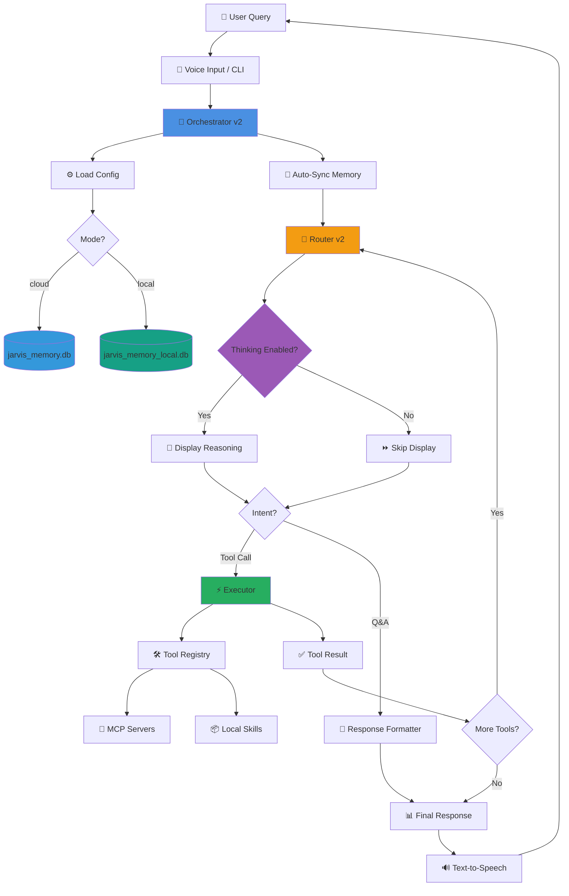

---

## Main Processing Flow

### Complete Request Lifecycle

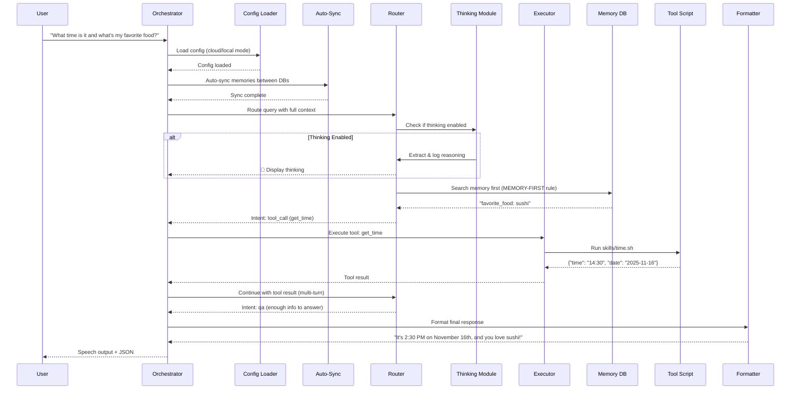

---

## Memory-First Strategy

Jarvis follows a **MEMORY-FIRST RULE**: Always check memory before making assumptions or asking for clarification.

### Memory Lookup Flow

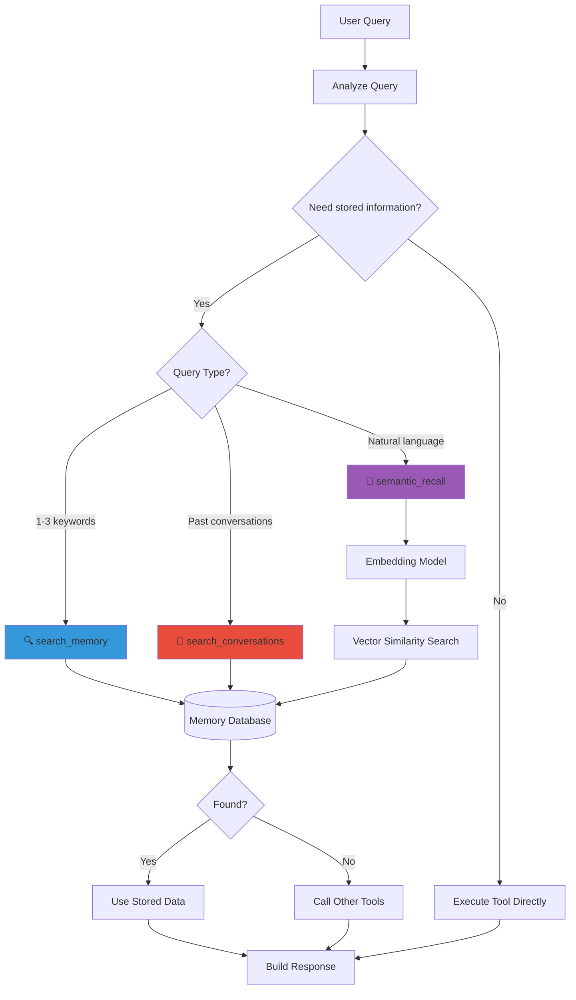

**Tool Details:**
- **search_memory**: FTS5 full-text search with BM25 ranking for 1-3 keywords (fast, accurate, relevance-scored)
- **semantic_recall**: AI embedding search for natural language (4+ words, sentence structure)
- **search_conversations**: Historical context from past interactions
- **Similarity Threshold**: Default 0.40 (configurable in `.env`)

### Memory Tool Selection Examples

| Query | Tool Used | Why |
|-------|-----------|-----|
| "pizza" | `search_memory` | Single keyword → FTS5 with BM25 ranking |
| "webhook url" | `search_memory` | 2 keywords → FTS5 full-text search |
| "server IP" | `search_memory` | Technical entity → FTS5 keyword search |
| "Where is my Flask app?" | `semantic_recall` | Natural language question → AI embeddings |
| "What did I say about John?" | `semantic_recall` | Contextual question → AI understanding |
| "What did I ask yesterday?" | `search_conversations` | Historical lookup → conversation log |

---

## Tool Selection & Execution

### Tool RAG System (Dynamic Tool Retrieval)

Jarvis uses **Tool RAG** (Retrieval Augmented Generation for Tools) to dynamically load only relevant tools for each query, enabling infinite scalability. The routing LLM still sees the full prompt; Tool RAG embeds a compact current-request signal plus structured tool hints so long memory/intel blocks do not dilute retrieval.

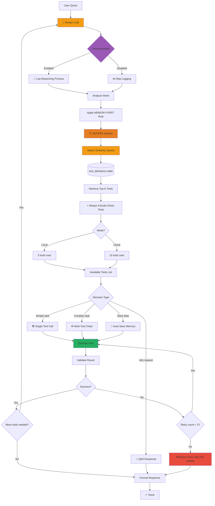

**Tool RAG Benefits:**
- ⚡ **Scalability**: Can handle 100+ tools without context flooding
- 🎯 **Relevance**: Only loads tools semantically relevant to the query
- 💰 **Efficiency**: Reduces token usage by 60-80% (local models especially benefit)
- 👻 **Ghost Tools**: Core functionality prioritized inside the final schema cap (memory, logs, time)
- 🔎 **Discovery Option**: `tool_search` can inspect enabled tools by summary first when the initial shortlist is not enough

**Decision Types:**
- **Single Tool**: Simple tasks (e.g., "What time is it?")
- **Multi-Tool Chain**: Complex tasks requiring multiple steps
- **Q&A Response**: Information requests that don't need tools
- **Auto-Save**: Automatically saves important info to memory

### Tool RAG Configuration

**Ghost Tools** (priority candidates, configurable via `.env`):
```bash
# In config/cloud.env or config/local.env
GHOST_TOOLS="search_memory,semantic_recall,remember,check_tool_logs,get_recent_conversations,get_time"
```

`tool_search` is injected as a mandatory discovery candidate in code rather than configured through `GHOST_TOOLS`. The final Tool RAG cap still applies, with explicit hints and `tool_search` prioritized before ranked non-ghost tools.

**Similarity Thresholds and compact retrieval** (filter retrieved tools before top-K):
```bash
# In config/cloud.env or config/local.env
TOOL_SIMILARITY_THRESHOLD=0.23      # Base threshold for compact/current request queries
TOOL_SIMILARITY_THRESHOLD_FULL=0.40 # Optional: stricter threshold for true full_fallback

# If TOOL_SIMILARITY_THRESHOLD_FULL is unset/blank:
# - full_fallback and compact paths both use TOOL_SIMILARITY_THRESHOLD
#
# Practical tuning notes:
# - Cloud mode: TOOL_SIMILARITY_THRESHOLD_FULL around 0.40 is a good safety net
#   when no clean current request can be extracted.
# - Local/Gemma mode: 0.35-0.45 often behaves like a no-op because scores skew higher
#   and local only retrieves 5 tools; leave FULL unset unless you tune it separately.

TOOL_RAG_COMPACT_QUERY_ENABLED=true
TOOL_RAG_CURRENT_QUERY_MAX_CHARS=1200
TOOL_RAG_CONTEXT_QUERY_MAX_CHARS=500
TOOL_RAG_APPEND_POSITIVE_SIGNALS=true
TOOL_RAG_EXCLUDE_NEGATIVE_SIGNALS=true
TOOL_RAG_MIN_LEARNED_PREFER_BIAS=0.40
TOOL_RAG_MEMORY_TOOL_SIGNALS_ENABLED=false
```

**Sync Tool Definitions** (required after adding/modifying tools):
```bash
# Sync tool embeddings to database
./bin/sync-tools.py cloud  # For cloud mode
./bin/sync-tools.py local  # For local mode
```

**Debug Tool Retrieval**:
```bash
# Activate the Jarvis venv first so embedding generation matches production
source ~/jarvis-venv/bin/activate

# See exactly what tools are retrieved for a query
./bin/debug-tool-rag.py cloud "What is the price of Bitcoin?"

# Compare a plain user string with a real full prompt captured from logs/debug
./bin/debug-tool-rag.py cloud "and Boston too" \
  --full-transcript-file /tmp/captured_turn_input.txt \
  --stripped-threshold 0.23 \
  --full-threshold 0.40

# Shows:
# - Production-style signal_source and compact query
# - Similarity scores and active threshold
# - Ghost tools, exact positive/negative signals, and final tools
# - Recommendations for tuning
```

**Live Tool RAG Trace Logs**:
```bash
TOOL_RAG_TRACE_ENABLED=true
TOOL_RAG_TRACE_TOP_N=25
TOOL_RAG_TRACE_QUERY_CHARS=1200
TOOL_RAG_TRACE_SCHEMA_TOP_N=10
```

Writes `logs/tool-rag/tool-rag-YYYY-MM-DD.jsonl` with `signal_source`, `similarity_threshold`, `ranked_tools`, `final_tools`, `final_tool_count`, and rough schema size estimates (`tool_schema_chars`, `tool_schema_est_tokens`, `tool_schema_top`).

### Tool Registry & Enable/Disable

```bash
# List all tools (enabled and disabled)
./bin/manage-tools.py list

# Disable a tool (removes from vector search)
./bin/manage-tools.py disable crypto_price

# Enable a tool (includes in vector search)
./bin/manage-tools.py enable crypto_price

# Enable all tools
./bin/manage-tools.py enable-all
```

**In `skills/*.tool.json`:**
```json
{
  "enabled": true,  // Set to false to disable (won't be indexed)
  "name": "get_time",
  "description": "..."
}
```

---

## Tool RAG Deep Dive

### How Dynamic Tool Retrieval Works

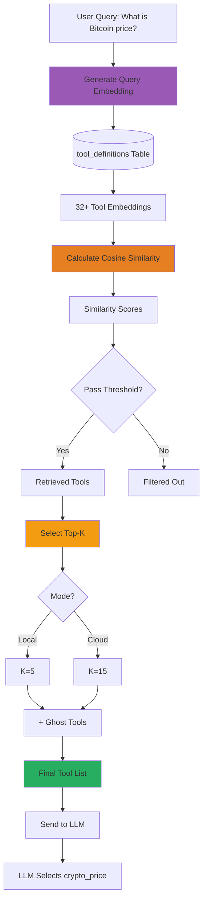

**Example for "What is Bitcoin price?":**

1. **Query Embedding**: Vector representation of the query
2. **Vector Search**: Compare against all tool embeddings in database
3. **Top Results**:
   - `crypto_price` (similarity: 0.92) ✅
   - `api_call` (similarity: 0.68) ✅
   - `send_webhook` (similarity: 0.45) ✅
   - `get_time` (similarity: 0.12) ❌
   - ... (27 other tools filtered out)
4. **Ghost Tools Added**: `search_memory`, `semantic_recall`, `remember`, `check_tool_logs`, `get_recent_conversations`, `get_time`, `tool_search`
5. **Final Context**: 10 tools sent to LLM (3 retrieved + 7 ghost)
6. **LLM Decision**: Selects `crypto_price` (highest relevance)

### Tool RAG vs. Traditional Approach

| Aspect | Traditional (Pre-RAG) | Tool RAG (Current) |
|--------|----------------------|-------------------|
| **Tools Loaded** | Full 78-manifest catalog every query | 5-15 relevant tools |
| **Context Size** | ~15K tokens | ~3K tokens (80% reduction) |
| **Scalability** | Limited (context window fills) | Unlimited (100+ tools possible) |
| **Local Models** | Struggles with the full tool catalog | Thrives with 5-9 tools |
| **Selection Accuracy** | Good | Excellent (pre-filtered) |
| **Cost** | High (more tokens) | Low (fewer tokens) |

### Ghost Tools Strategy

**What are Ghost Tools?**
Tools that are prioritized regardless of the query before the final Tool RAG cap. These give core functionality first chance when semantic retrieval misses.

**Default Configurable Ghost Tools:**
- `search_memory` - FTS5 keyword search
- `semantic_recall` - AI embedding search
- `remember` - Save new memories
- `check_tool_logs` - Debug failed tool calls
- `get_recent_conversations` - Context from past interactions
- `get_time` - Basic utility (often needed as context)

**Mandatory Discovery Ghost Tool:**
- `tool_search` - Search or browse non-ghost enabled tools by summary first, then follow exact tool-name hints on the next turn; exact inspection can still look up a ghost tool by name

**Why Ghost Tools?**
1. **Memory Access**: LLM must always be able to check/save memories
2. **Error Recovery**: Can check logs after tool failures for self-healing
3. **Context Building**: Can retrieve conversation history when confused
4. **Baseline Utility**: Time is often needed as reference

**Customizing Ghost Tools:**
```bash
# In config/cloud.env or config/local.env
GHOST_TOOLS="search_memory,semantic_recall,remember,my_custom_tool"
```

`tool_search` does not need to be added to `GHOST_TOOLS`; it is hardcoded as a mandatory discovery candidate and prioritized inside the final Tool RAG cap.

### Tool Sync Workflow


**When to Sync:**
- After adding new tools (`skills/*.py` + `*.tool.json`)
- After modifying tool descriptions
- After fresh database creation
- Startup scripts (`jarvis-services`, `jarvis-api`) auto-sync

**Manual Sync:**
```bash
./bin/sync-tools.py cloud  # Syncs to jarvis_memory.db
./bin/sync-tools.py local  # Syncs to jarvis_memory_local.db
```

---

## Current Request Pipeline (Detailed)

This section documents the **actual** orchestrator path in `orchestrator/orchestrator_v2.py`, `router_v2.py`, `context_assembler.py`, and `response_formatter.py`. Use it when debugging routing, turn limits, or provider continuation.

### End-to-end flow

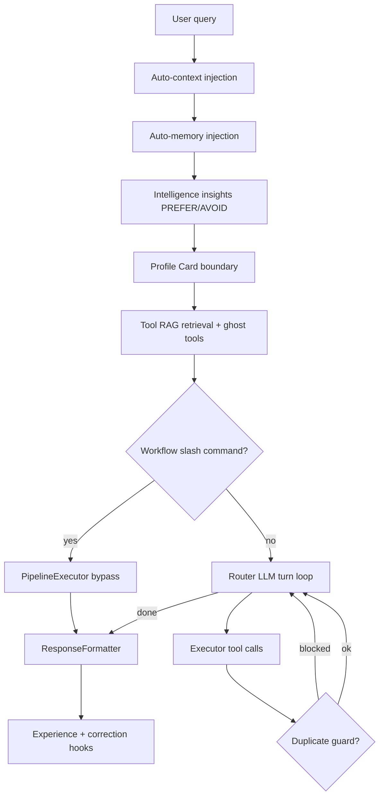

### Pre-router context stack (order matters)

Before the first router call, context is assembled in this order:

| Step | Module | What it injects |
|------|--------|-----------------|
| 1 | `ContextAssembler.build_conversation_context()` | Recent wake-word / web session turns |
| 2 | Auto-memory (`Orchestrator._get_memory_context()` in `orchestrator/orchestrator_v2.py`) | FTS5 + semantic hits for the query |
| 3 | `lib/intelligence_hooks.py` | Top matching insights (preferred/avoided tools, negative constraints) |
| 4 | `lib/user_profile.py` | **Profile Card** — stable user prefs from memory DB `user_model` table |
| 5 | Tool RAG | Embeddings + ghost tools + `tool_search` discovery |
| 6 | Router system prompt | Mode, freshness rules, duplicate guard text, memory-first |

See [USER_PROFILE_SYSTEM.md](USER_PROFILE_SYSTEM.md) and [INTELLIGENCE_LAYER.md](INTELLIGENCE_LAYER.md) for Profile Card and insight injection details.

### Workflow bypass (slash commands)

`WorkflowLoader` (`orchestrator/workflow_loader.py`, `explicit_only=True`) matches commands like `/research`, `/code`, `/summarize`. When matched, **`PipelineExecutor`** runs a fixed step pipeline instead of open-ended multi-turn routing. The orchestrator still records experiences and applies formatting via `ResponseFormatter`.

### Direct speech bypass tools

These tools return spoken output without a second LLM synthesis pass (`DIRECT_SPEECH_TOOLS` in `orchestrator_v2.py`):

- `status_recap` — session/status summary
- `generate_music` — music generation with immediate playback path
- `phone_call` — telephony bridge
- `create_reminder` — reminder confirmation speech

### Multi-turn limits and retries (code defaults)

| Setting | Env var | Code default | Typical cloud.env | Typical local.env |
|---------|---------|--------------|-------------------|-------------------|
| Max tool turns | `MAX_TOOL_TURNS` | **15** | 12 | 8 |
| Max retries per failed tool | *(hardcoded)* | **1** | 1 | 1 |
| xAI server-side cap | `XAI_SERVER_SIDE_MAX_TOOL_TURNS` | 0 (unlimited) | varies | — |
| OpenAI Responses server-side cap | `OPENAI_RESPONSES_SERVER_SIDE_MAX_TOOL_CALLS` | 0 | varies | — |

**Note:** Older docs referenced `MAX_ORCHESTRATION_TURNS=10` and `max_retries=3`. The v2 orchestrator uses **`MAX_TOOL_TURNS`** (default 15) and **`self.max_retries = 1`** in `orchestrator_v2.py`.

When `turns_remaining <= 5`, the orchestrator injects a turn-budget warning so the LLM prioritizes canvas/remember before hitting the cap.

### Duplicate tool guard

Prevents runaway loops within a **single request**:

1. **Exact-arg blocking** — Same tool + identical JSON args cannot run twice in one request.
2. **Single-call caps** — Tools tagged `@TOOL_CONFIG: single-call` (e.g. `generate_video`, `generate_image`, `generate_music`) limited to one successful call per request.
3. **Freshness TTL** — Router prompt + `ContextAssembler` inject `FRESHNESS RULES`; stale cached tool output should not be re-fetched without user intent.
4. **Blocked-call feedback** — When blocked, the next turn input includes `DUPLICATE TOOL GUARD:` with the blocked signatures; repeating triggers synthesis fallback.

Trace logs: `logs/tool-rag/` (retrieval signals, PREFER/AVOID hints, typo corrections).

### Provider continuation (xAI + OpenAI Responses)

**xAI structural continuation** (when both enabled):

```bash
XAI_STORE_MESSAGES=true
XAI_NATIVE_CONTINUATION=true
```

Uses `previous_response_id` from the xAI Responses API so multi-turn tool loops do not resend full history each turn. Requires compatible xAI models (see [XAI_PROVIDER.md](XAI_PROVIDER.md)).

**OpenAI Responses routing** (`lib/openai_responses_adapter.py`):

```bash
OPENAI_RESPONSES_CONTINUATION_DELTA_MESSAGE=false   # default
OPENAI_RESPONSES_RESULT_MAX_CHARS=6000              # min enforced 800
OPENAI_RESPONSES_SERVER_SIDE_TOOLS=false              # optional native search/tools
OPENAI_RESPONSES_DISABLE_SERVER_SIDE_TOOLS=true       # set transiently when budget exhausted
```

When native server-side tools are enabled, `OPENAI_RESPONSES_SERVER_SIDE_MAX_TOOL_CALLS` caps provider-side tool calls per request.

### Native search budget

Per-request cap on provider-native web/X search (when server-side tools are on). When exhausted or when the user selects a client-side search tool in the web UI, the orchestrator injects `[NATIVE SEARCH DISABLED]` and sets `OPENAI_RESPONSES_DISABLE_SERVER_SIDE_TOOLS` / clears xAI server-side caps for remaining turns.

### Web UI vs CLI differences

| Feature | CLI / wake word | Web UI (`api/routes/query.py`) |
|---------|-----------------|--------------------------------|
| Conversation history | Auto-context + session | Explicit `conversation_history` array |
| Tool overrides | Env + ghost tools | `tool_overrides`, `excluded_tools` |
| Search provider hint | Env | UI can force client-side search → disables native search |
| Mode | `--mode cloud\|local` | Request `mode` + `JARVIS_OVERRIDE_*` |

### Modular orchestrator split (2.50)

| Module | Responsibility |
|--------|----------------|
| `context_assembler.py` | Conversation context, tool result truncation, freshness excerpts, provider result messages |
| `response_formatter.py` | Final speech/text shaping, canvas hooks, thinking strip |
| `executor.py` | Tool invocation, MCP bridging, error surfaces |
| `router_v2.py` | LLM routing, server-side tool orchestration, prompt assembly |
| `orchestrator_v2.py` | Turn loop, duplicate guard, continuation, experience recording |

### Post-response hooks

After a successful or failed run:

- **Experience recording** — `lib/intelligence_hooks.record_experience()` when `JARVIS_INTELLIGENCE=true`
- **Correction learning** — `USER_CORRECTION_LEARNING_MODE=shadow|apply` detects user corrections across turns; see [INTELLIGENCE_LAYER.md](INTELLIGENCE_LAYER.md#cross-turn-correction-learning-2026)
- **Feedback bridge** — Low ratings retroactively mark experiences failed (see intelligence doc)

### Key env vars (orchestration)

```bash
# Turns (code fallback 15; shipped cloud=12, local=6)
MAX_TOOL_TURNS=12

# xAI continuation
XAI_STORE_MESSAGES=true
XAI_NATIVE_CONTINUATION=true
XAI_SERVER_SIDE_MAX_TOOL_TURNS=0

# OpenAI Responses
OPENAI_RESPONSES_SERVER_SIDE_TOOLS=false
OPENAI_RESPONSES_SERVER_SIDE_MAX_TOOL_CALLS=0
OPENAI_RESPONSES_RESULT_MAX_CHARS=6000

# Intelligence + profile
JARVIS_INTELLIGENCE=true
USER_CORRECTION_LEARNING_MODE=shadow   # or apply

# Debug
JARVIS_DEBUG=1
--debug-thinking                        # CLI: log thinking blocks
```

---

## Multi-Turn Orchestration

Jarvis can chain multiple tools in sequence to complete complex tasks.

### Multi-Turn Flow Example

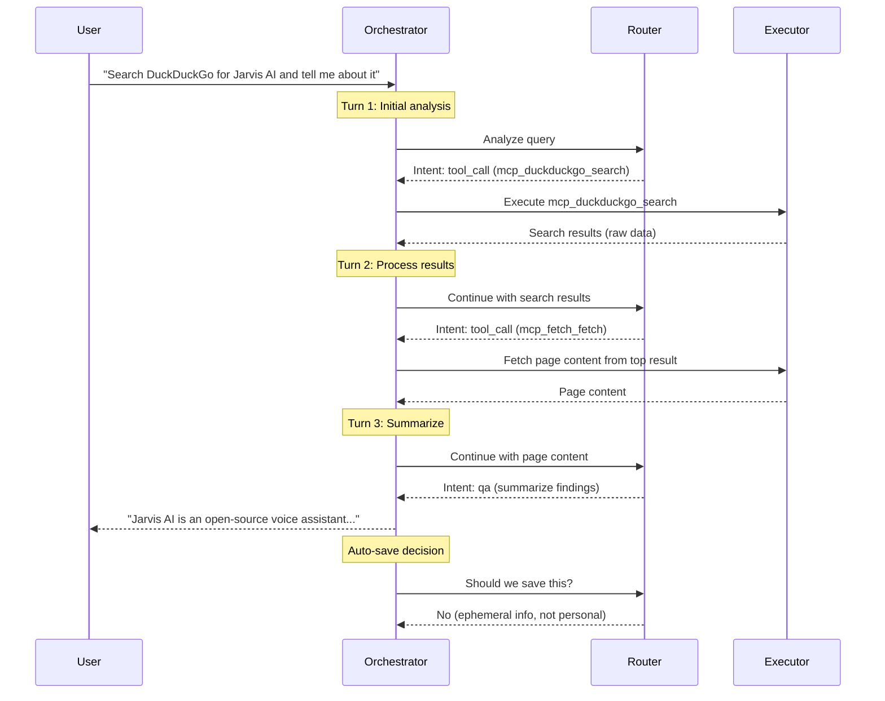

**Max turns**: Default **15** (`MAX_TOOL_TURNS`; cloud example 12, local example 8)
**Max retries**: **1** per failed tool (`orchestrator_v2.py`)

---

## Configuration Impact

### Mode Selection (Cloud vs Local)

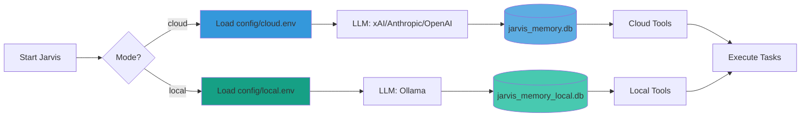

**Database Details:**
- **Cloud**: OpenAI text-embedding-3-small (1536 dimensions) + FTS5 full-text search
- **Local**: nomic-embed-text (768 dimensions) + FTS5 full-text search
- **Search**: Hybrid (FTS5 for keywords, embeddings for concepts)
- **Models**: xAI Grok 4.5 / grok-4.3 / grok-build-0.1 ⭐, Claude Sonnet 5, GPT-4o (cloud) | gemma4 ⭐, qwen3.5:latest, qwen3-coder (local)

### Key Configuration Variables

| Variable | Impact | Example Values |
|----------|--------|----------------|
| `LLM_PROVIDER` | Which LLM to use | `xai`, `anthropic`, `openai`, `ollama` |
| `XAI_MODEL` | xAI Grok model | `grok-4.5` ⭐ (default); `grok-4.3` for 1M context or `reasoning_effort=none`; `grok-build-0.1` for coding-heavy |
| `ANTHROPIC_MODEL` | Cloud model selection | `claude-sonnet-5` |
| `OLLAMA_MODEL` | Ollama model used in local mode | `gemma4` ⭐, `qwen3.5:latest`, `qwen3-coder`, `deepseek-r1` |
| `OLLAMA_CLOUD_MODEL` | Cloud-tagged Ollama model used in cloud mode | `minimax-m3:cloud`, `gpt-oss:120b-cloud` |
| `JARVIS_DEBUG_THINKING` | Show LLM reasoning | `true`, `false` |
| `SEMANTIC_SIMILARITY_THRESHOLD` | Memory search sensitivity | `0.40` (default), `0.30-0.50` range |
| `JARVIS_RESPONSE_STYLE` | Output formatting | `casual`, `detailed`, `auto` |
| `OPENCODE_ENABLED` | Enable autonomous coding | `true`, `false` |

### Response Style Impact

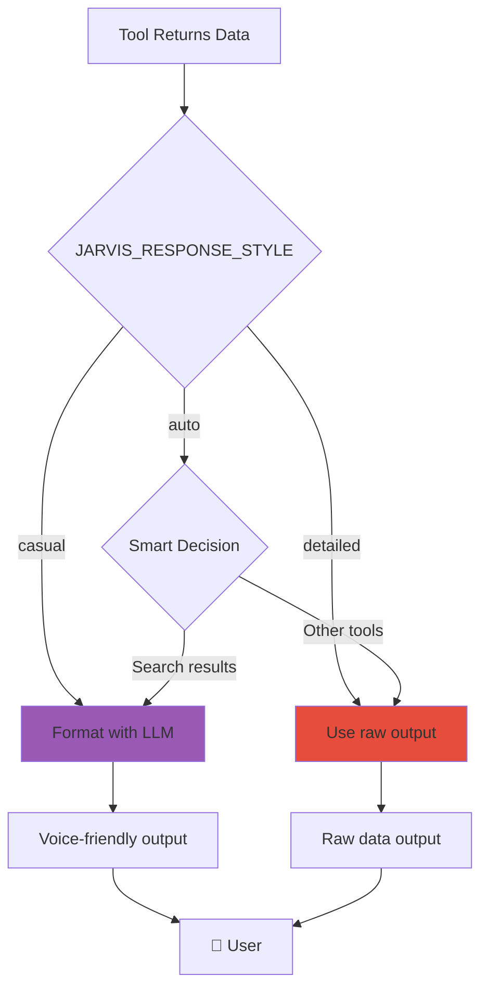

**Examples:**
- **casual**: "It's 2:30 PM on November 16th"
- **detailed**: `{"time": "14:30", "date": "2025-11-16"}`
- **auto**: Smart decision (LLM format for search, raw for others)

---

## Real-World Examples

### Example 1: Simple Tool Call (Time Query)

**User**: "What time is it?"

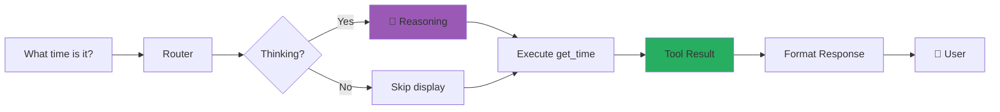

**Thinking Output** (if enabled):
```
🧠 Reasoning: Need current time → Use get_time tool → No parameters needed
```

**Final Output:**
```
✅ It's 2:30 PM on November 16th, 2025.
```

**With Thinking Enabled:**
```
🧠 LLM Thinking:
   Okay, the user is asking "What time is it?"
   I need to check the current time. The available tools include
   get_time, which returns date and time. The parameters for
   get_time are empty, so I just need to call that tool.

🗣️ Speech Output: It's 2:30 PM on November 16th, 2025.
```

---

### Example 2: Memory-First Lookup (Personal Data)

**User**: "What's my favorite food?"

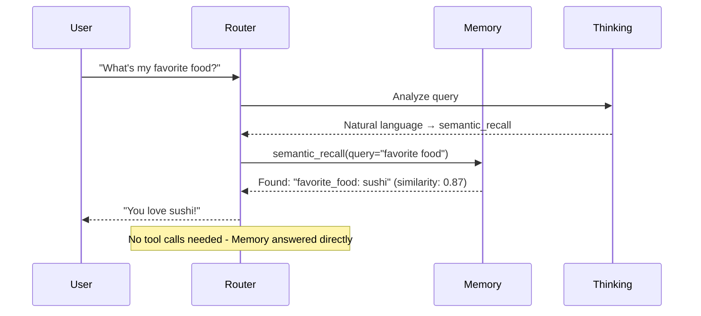

**Flow:**
1. Router recognizes this is a question about stored info
2. Applies MEMORY-FIRST rule
3. Uses `semantic_recall` (natural language query)
4. Finds stored memory: `favorite_food: sushi`
5. Responds directly with Q&A intent

---

### Example 3: Multi-Tool Complex Task (Web Search + Memory)

**User**: "Search for Python tutorials and remember that I'm learning Python"

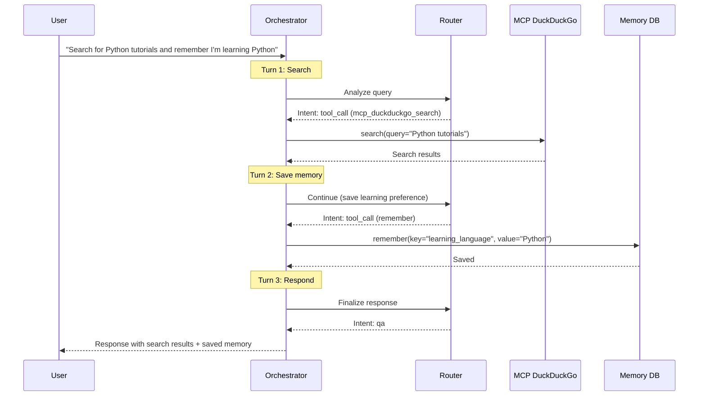

**Tools Used:**
1. `mcp_duckduckgo_search` - Web search
2. `remember` - Save to memory
3. Q&A - Final response

**Auto-Save Decision:**
- "I'm learning Python" → Personal, persistent info
- Category: `learning`, Importance: `8`
- Router intelligently saves this automatically

---

### Example 4: MCP Server Integration (Fetch URL)

**User**: "Fetch the content from example.com"

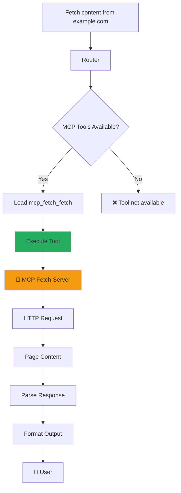

**MCP Server Tools:**
- `mcp_duckduckgo_search` - Web search
- `mcp_fetch_fetch` - HTTP fetch
- Auto-discovered on startup
- Prefixed with `mcp_<server>_<tool>`

---

### Example 5: OpenCode Integration (Complex Coding Task)

**User**: "Build a Flask API for managing todos"

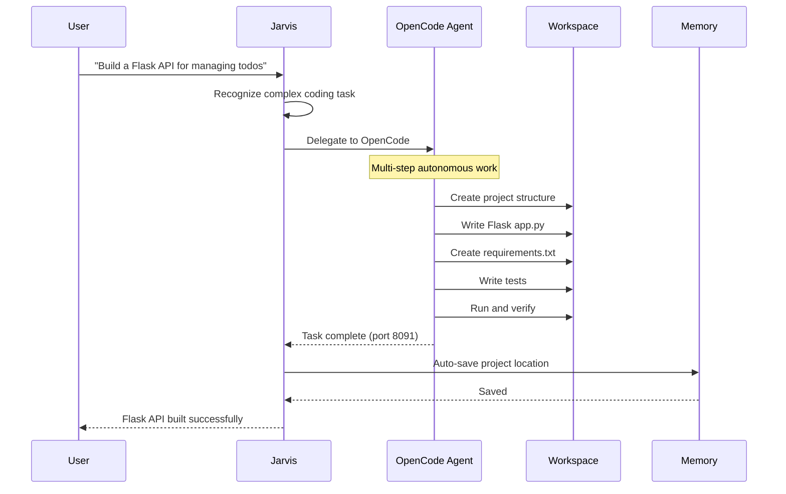

**Response:**
```
Flask API built at ~/jarvis-workspace/projects/flask-todo-api
Running on http://localhost:8091
```

**OpenCode Features:**
- Autonomous coding (multi-step tasks)
- Workspace isolation (`~/jarvis-workspace`)
- Auto-save project location to memory
- Uses dedicated LLM (shipped: cloud `xai`/`grok-build-0.1`, local `ollama`/`gemma4`)

---

### Example 6: Thinking Mode Deep Dive

**User**: "Should I invest in Bitcoin?"

**With Thinking Enabled (`--debug-thinking`):**

```
🧠 LLM Thinking:
   The user is asking about Bitcoin investment. This is a complex
   financial question. Let me consider:

   1. Do I have stored preferences about their risk tolerance?
      → Check memory first (MEMORY-FIRST rule)
      → No memories found about investment preferences

   2. Should I provide financial advice?
      → Financial advice requires disclaimers
      → I should be cautious and informative

   3. Tool selection:
      → crypto_price to get current BTC price
      → Then provide balanced information, not advice

   4. Auto-save decision:
      → This is a one-time query, not persistent info
      → Don't save unless they express ongoing interest

🗣️ Speech Output: Bitcoin is currently at $95,822. However, I can't
provide investment advice. Consider your risk tolerance and consult
a financial advisor for personalized guidance.
```

**Thinking Log Saved To:**
`logs/thinking/2025-11-16_decisions.jsonl`

**Benefits:**
- Transparency in decision-making
- Debugging tool selection
- Understanding auto-save logic
- Model accountability

---

## Configuration Flags & Toggles

### CLI Flags

```bash
# Enable thinking mode (overrides .env)
./orchestrator/orchestrator_v2.py cloud "query" --debug-thinking

# JSON-only output (no pretty formatting)
./orchestrator/orchestrator_v2.py cloud "query" --json

# Specify mode
./orchestrator/orchestrator_v2.py cloud "query"   # Cloud mode
./orchestrator/orchestrator_v2.py local "query"   # Local mode
```

### Environment Variables (`.env` files)

**Memory System:**
- `SEMANTIC_SIMILARITY_THRESHOLD` - Search sensitivity (0.30-0.50)

**Thinking Mode:**
- `JARVIS_DEBUG_THINKING` - Enable thinking display (`true`/`false`)

**Response Style:**
- `JARVIS_RESPONSE_STYLE` - Output format (`casual`/`detailed`/`auto`)

**OpenCode:**
- `OPENCODE_ENABLED` - Enable autonomous coding (`true`/`false`)
- `OPENCODE_MODEL` - Model for coding tasks
- `OPENCODE_PROVIDER` - Provider (Anthropic recommended)

**Model Selection:**
- `LLM_PROVIDER` - Main LLM (`xai`, `anthropic`, `openai`, `ollama`)
- `XAI_MODEL` - xAI API-key Grok model (`grok-4.5` recommended; see `XAI_PROVIDER.md` for OAuth/API-key boundaries and alternatives)
- `ANTHROPIC_MODEL` - Claude model
- `OLLAMA_MODEL` - Local-mode Ollama model (`gemma4` in `local.env.example`; alternatives include `qwen3.5:latest`)
- `OLLAMA_CLOUD_MODEL` - Cloud-mode Ollama model; signed-daemon mode requires a cloud tag, while direct API mode accepts canonical ollama.com IDs
- `ALLOW_OLLAMA_CLOUD` - Local-mode opt-in for signed-daemon cloud cards; defaults to `false` and never enables direct API routing

---

## Decision Matrix

### When Does Jarvis Choose Each Path?

| Scenario | Memory Check | Tool(s) Used | Multi-Turn | Auto-Save |
|----------|--------------|--------------|------------|-----------|
| "What time is it?" | No | `get_time` | No | No |
| "What's my name?" | ✅ Yes | `semantic_recall` | No | No |
| "Remember I love pizza" | No | `remember` | No | ✅ Yes |
| "Search and summarize OpenAI" | No | `mcp_duckduckgo_search` → Q&A | ✅ Yes | No |
| "Build a Flask API" | No | `opencode` | ✅ Yes | ✅ Yes (location) |
| "What's Bitcoin price?" | No | `crypto_price` | No | No |
| "Update my favorite food to sushi" | ✅ Yes | `semantic_recall` → `update_memory` | ✅ Yes | ✅ Yes |

---

## Performance Characteristics

### Cloud Mode (xAI/Anthropic/OpenAI/Ollama Cloud)

- **Speed**: Provider, model, network, and tool dependent
- **Cost**: Provider/model dependent; Ollama Cloud subscription compute is recorded as unknown rather than `$0`
  - **xAI Grok 4.3**: $1.25 input / $2.50 output per 1M tokens ⭐
  - **Claude**: $3.00 input / $15.00 output per 1M tokens
  - **GPT-5.4 Nano**: $0.20 input / $1.25 output per 1M tokens
- **Capabilities**: Extended thinking, prompt caching, native tool calling, reasoning models
- **Context Window**:
  - **xAI Grok 4.3**: 1M tokens; curated Grok 4.20 models: 1M
  - **Claude Sonnet 4.5**: 1M tokens
  - **GPT-5.4 Nano**: 400K tokens

`lib/model_catalog.py` is the source of truth for Jarvis' curated cloud model
metadata. Provider pricing can change independently; verify it before making
budget decisions.

### Local Mode (normally local Ollama)

- **Speed**: ⚡ Moderate (3-10 seconds, model-dependent)
- **Cost**: 💰 Free (runs locally)
- **Capabilities**: Structured prompting, offline operation
- **Context Window**: 32K-256K tokens (model-dependent)
- **VRAM**: 8-16GB GPU recommended

---

## Summary

Jarvis is a **multi-modal, memory-aware, tool-orchestrating voice assistant** with the following key capabilities:

✅ **Tool RAG System** - Dynamic tool retrieval scales to 100+ tools without context flooding
✅ **Memory-First Strategy** - Always checks stored info before asking
✅ **Hybrid Search System** - FTS5 full-text search + AI embeddings for comprehensive results
✅ **Intelligent Tool Selection** - LLM-based routing across 78 registered tool manifests
✅ **Pre-router stack** - Auto-context, memory, intelligence insights, Profile Card
✅ **Duplicate tool guard** - Exact-arg blocking, single-call caps, freshness rules
✅ **Provider continuation** - xAI `previous_response_id`, OpenAI Responses routing
✅ **Multi-Turn Orchestration** - Chains tools to complete complex tasks
✅ **MCP Server Integration** - Extensible via Model Context Protocol
✅ **Dual-Database System** - Cloud/local modes with auto-sync
✅ **Auto-Context System** - Short-term conversation memory across wake word cycles
✅ **Thinking Mode** - Transparent LLM reasoning for debugging
✅ **OpenCode Integration** - Autonomous coding for complex tasks
✅ **Configurable Behavior** - Fine-tune via `.env` and CLI flags

---

## Next Steps

- **For Users**: See [QUICKSTART.md](QUICKSTART.md) to get started
- **For Search System**: See [FTS5_SEARCH_SYSTEM.md](FTS5_SEARCH_SYSTEM.md) for FTS5 details
- **For Memory Tuning**: See [SEMANTIC_THRESHOLD_TUNING.md](SEMANTIC_THRESHOLD_TUNING.md)
- **For Auto-Context**: See [AUTO_CONTEXT_SYSTEM.md](AUTO_CONTEXT_SYSTEM.md)
- **For Tool Development**: See [TOOL_MANAGEMENT.md](TOOL_MANAGEMENT.md)
- **For OpenCode**: See [opencode/OPENCODE.md](opencode/OPENCODE.md)
- **For Intelligence / Profile**: See [INTELLIGENCE_LAYER.md](INTELLIGENCE_LAYER.md), [USER_PROFILE_SYSTEM.md](USER_PROFILE_SYSTEM.md)
- **For Extended thinking**: See [EXTENDED_THINKING.md](EXTENDED_THINKING.md)

---

**Last Verified**: 2026-06-29
**Version**: 2.53.0 (mode-safe providers, Tool RAG, native continuation, Profile Card)
