# Jarvis Voice Assistant - Complete Workflow Guide

> **Visual guide to understanding how Jarvis processes queries, makes decisions, and executes tasks**

This document provides a comprehensive overview of Jarvis's internal workflow, from receiving a user query to delivering the final response. It includes flowcharts, decision trees, and real-world examples showcasing the full feature set.

---

## Table of Contents

1. [High-Level Architecture](#high-level-architecture)
2. [Main Processing Flow](#main-processing-flow)
3. [Memory-First Strategy](#memory-first-strategy)
4. [Tool Selection & Execution](#tool-selection--execution)
5. [Multi-Turn Orchestration](#multi-turn-orchestration)
6. [Configuration Impact](#configuration-impact)
7. [Real-World Examples](#real-world-examples)

---

## High-Level Architecture

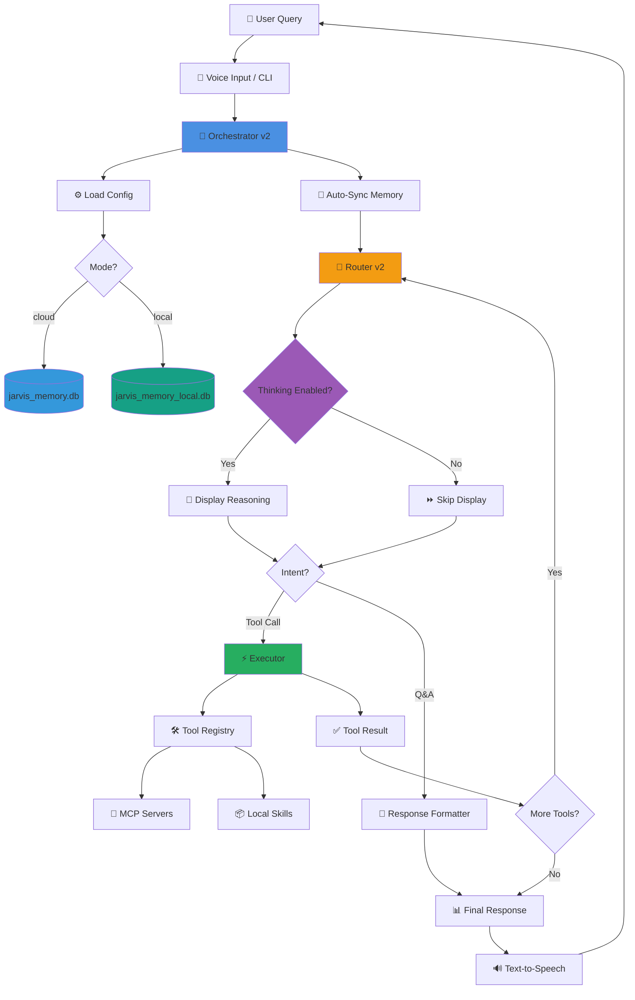

---

## Main Processing Flow

### Complete Request Lifecycle

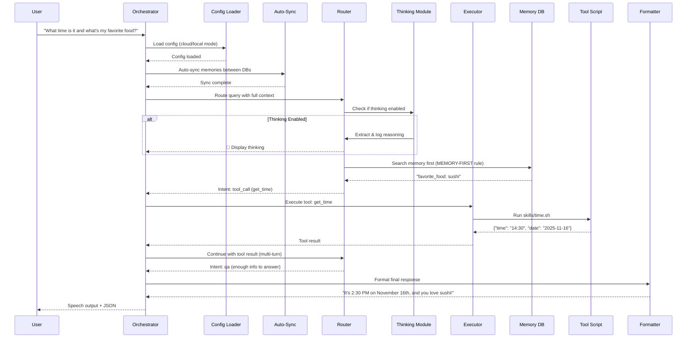

---

## Memory-First Strategy

Jarvis follows a **MEMORY-FIRST RULE**: Always check memory before making assumptions or asking for clarification.

### Memory Lookup Flow

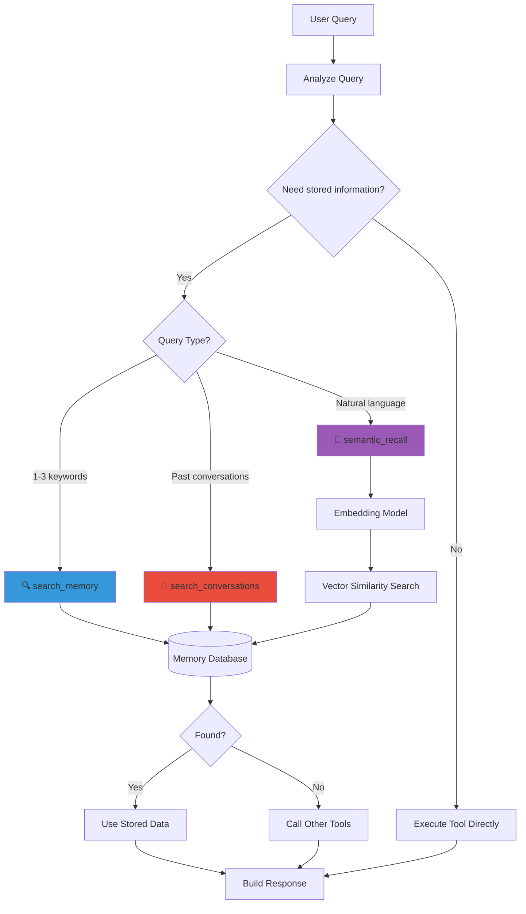

**Tool Details:**
- **search_memory**: SQL LIKE fuzzy matching for 1-3 keywords
- **semantic_recall**: AI embedding search for natural language (4+ words, sentence structure)
- **search_conversations**: Historical context from past interactions
- **Similarity Threshold**: Default 0.40 (configurable in `.env`)

### Memory Tool Selection Examples

| Query | Tool Used | Why |
|-------|-----------|-----|
| "pizza" | `search_memory` | Single keyword → SQL LIKE |
| "webhook url" | `search_memory` | 2 keywords → SQL LIKE |
| "Where is my Flask app?" | `semantic_recall` | Natural language question → AI embeddings |
| "What did I say about John?" | `semantic_recall` | Contextual question → AI understanding |
| "What did I ask yesterday?" | `search_conversations` | Historical lookup → conversation log |

---

## Tool Selection & Execution

### Router Decision Process

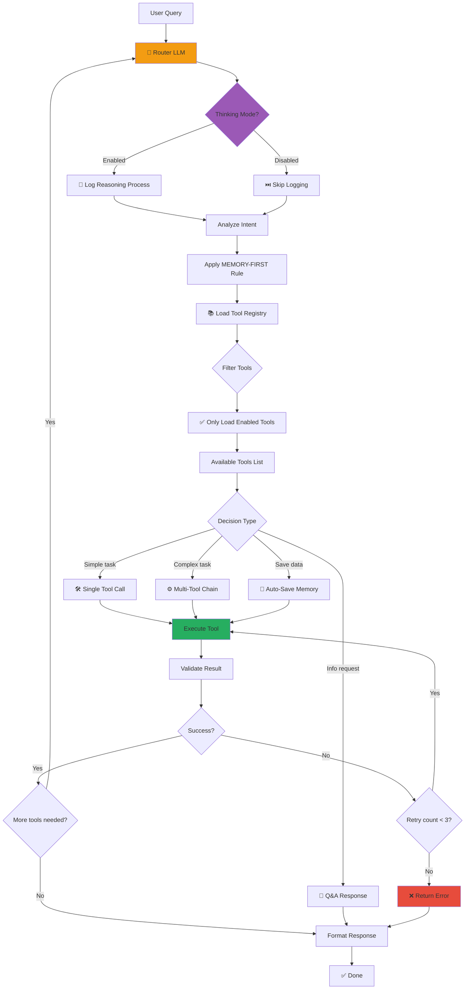

**Decision Types:**
- **Single Tool**: Simple tasks (e.g., "What time is it?")
- **Multi-Tool Chain**: Complex tasks requiring multiple steps
- **Q&A Response**: Information requests that don't need tools
- **Auto-Save**: Automatically saves important info to memory

### Tool Registry & Enable/Disable

```bash
# List all tools (enabled and disabled)
./bin/manage-tools.py list

# Disable a tool (reduces token count)
./bin/manage-tools.py disable crypto_price

# Enable a tool
./bin/manage-tools.py enable crypto_price

# Enable all tools
./bin/manage-tools.py enable-all
```

**In `skills/*.tool.json`:**
```json
{
  "enabled": true,  // Set to false to disable
  "name": "get_time",
  "description": "..."
}
```

---

## Multi-Turn Orchestration

Jarvis can chain multiple tools in sequence to complete complex tasks.

### Multi-Turn Flow Example

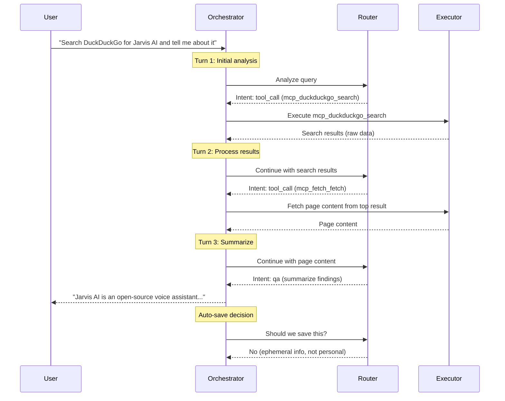

**Max turns**: 10 (configurable via `MAX_ORCHESTRATION_TURNS`)  
**Max retries**: 3 per tool

---

## Configuration Impact

### Mode Selection (Cloud vs Local)

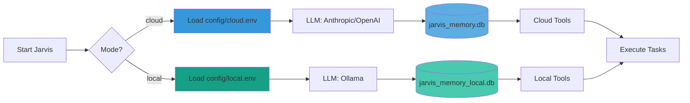

**Database Details:**
- **Cloud**: OpenAI text-embedding-3-small (1536 dimensions) 
- **Local**: nomic-embed-text (768 dimensions)
- **Models**: Claude Sonnet 4.5, GPT-4o (cloud) | qwen3:14b, qwen3-vl (local)

### Key Configuration Variables

| Variable | Impact | Example Values |
|----------|--------|----------------|
| `LLM_PROVIDER` | Which LLM to use | `anthropic`, `openai`, `ollama` |
| `ANTHROPIC_MODEL` | Cloud model selection | `claude-sonnet-4-5-20250929` |
| `OLLAMA_MODEL` | Local model selection | `qwen3:14b`, `qwen3-vl`, `deepseek-r1` |
| `JARVIS_DEBUG_THINKING` | Show LLM reasoning | `true`, `false` |
| `SEMANTIC_SIMILARITY_THRESHOLD` | Memory search sensitivity | `0.40` (default), `0.30-0.50` range |
| `JARVIS_RESPONSE_STYLE` | Output formatting | `casual`, `detailed`, `auto` |
| `OPENCODE_ENABLED` | Enable autonomous coding | `true`, `false` |

### Response Style Impact

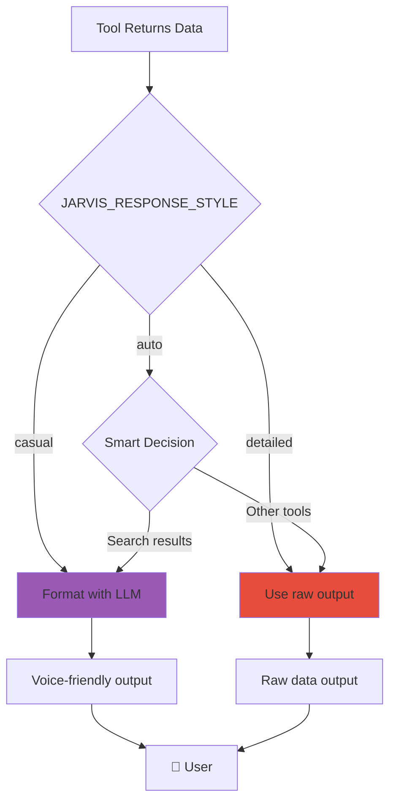

**Examples:**
- **casual**: "It's 2:30 PM on November 16th"
- **detailed**: `{"time": "14:30", "date": "2025-11-16"}`
- **auto**: Smart decision (LLM format for search, raw for others)

---

## Real-World Examples

### Example 1: Simple Tool Call (Time Query)

**User**: "What time is it?"

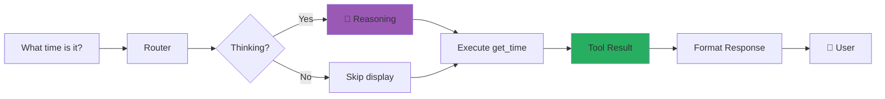

**Thinking Output** (if enabled):
```
🧠 Reasoning: Need current time → Use get_time tool → No parameters needed
```

**Final Output:**
```
✅ It's 2:30 PM on November 16th, 2025.
```

**With Thinking Enabled:**
```
🧠 LLM Thinking:
   Okay, the user is asking "What time is it?" 
   I need to check the current time. The available tools include 
   get_time, which returns date and time. The parameters for 
   get_time are empty, so I just need to call that tool.

🗣️ Speech Output: It's 2:30 PM on November 16th, 2025.
```

---

### Example 2: Memory-First Lookup (Personal Data)

**User**: "What's my favorite food?"

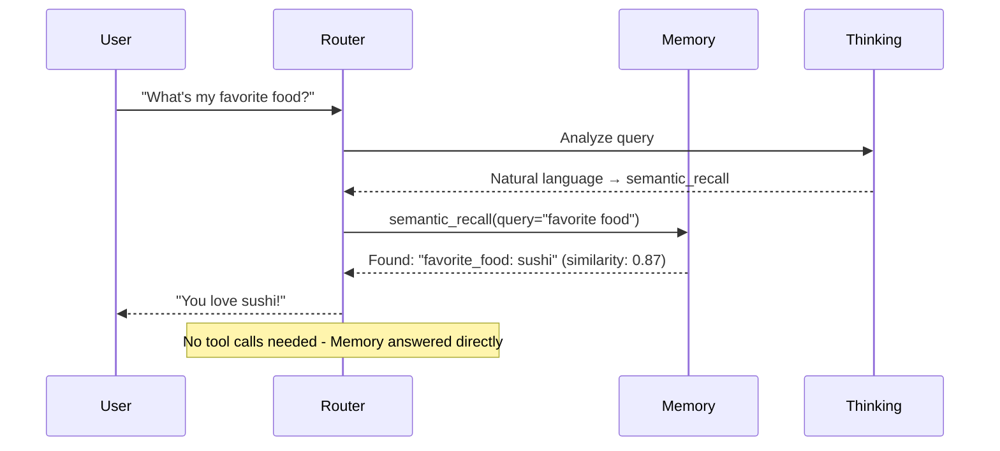

**Flow:**
1. Router recognizes this is a question about stored info
2. Applies MEMORY-FIRST rule
3. Uses `semantic_recall` (natural language query)
4. Finds stored memory: `favorite_food: sushi`
5. Responds directly with Q&A intent

---

### Example 3: Multi-Tool Complex Task (Web Search + Memory)

**User**: "Search for Python tutorials and remember that I'm learning Python"

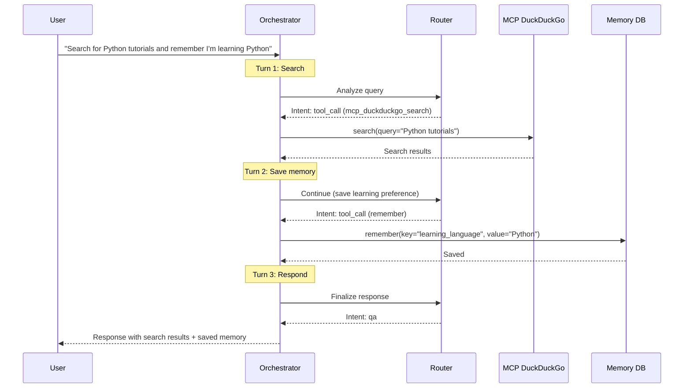

**Tools Used:**
1. `mcp_duckduckgo_search` - Web search
2. `remember` - Save to memory
3. Q&A - Final response

**Auto-Save Decision:**
- "I'm learning Python" → Personal, persistent info
- Category: `learning`, Importance: `8`
- Router intelligently saves this automatically

---

### Example 4: MCP Server Integration (Fetch URL)

**User**: "Fetch the content from example.com"

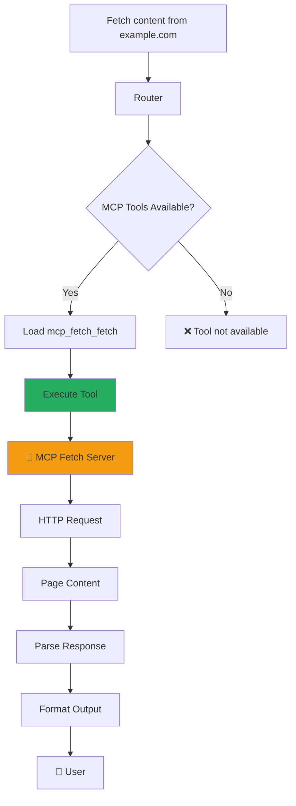

**MCP Server Tools:**
- `mcp_duckduckgo_search` - Web search
- `mcp_fetch_fetch` - HTTP fetch
- Auto-discovered on startup
- Prefixed with `mcp_<server>_<tool>`

---

### Example 5: OpenCode Integration (Complex Coding Task)

**User**: "Build a Flask API for managing todos"

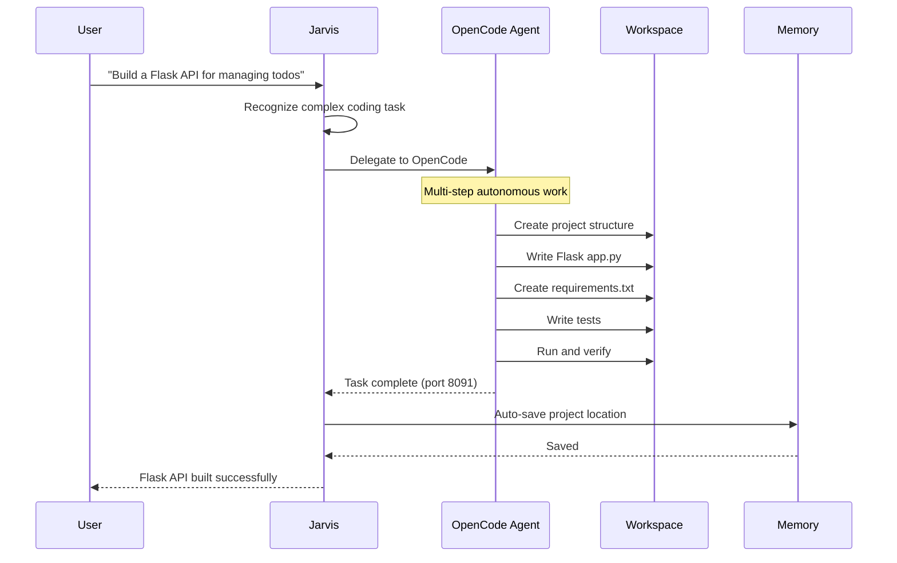

**Response:**
```
Flask API built at ~/jarvis-workspace/projects/flask-todo-api
Running on http://localhost:8091
```

**OpenCode Features:**
- Autonomous coding (multi-step tasks)
- Workspace isolation (`~/jarvis-workspace`)
- Auto-save project location to memory
- Uses dedicated LLM (Claude Sonnet 4.5 recommended)

---

### Example 6: Thinking Mode Deep Dive

**User**: "Should I invest in Bitcoin?"

**With Thinking Enabled (`--debug-thinking`):**

```
🧠 LLM Thinking:
   The user is asking about Bitcoin investment. This is a complex 
   financial question. Let me consider:
   
   1. Do I have stored preferences about their risk tolerance?
      → Check memory first (MEMORY-FIRST rule)
      → No memories found about investment preferences
   
   2. Should I provide financial advice?
      → Financial advice requires disclaimers
      → I should be cautious and informative
   
   3. Tool selection:
      → crypto_price to get current BTC price
      → Then provide balanced information, not advice
   
   4. Auto-save decision:
      → This is a one-time query, not persistent info
      → Don't save unless they express ongoing interest

🗣️ Speech Output: Bitcoin is currently at $95,822. However, I can't 
provide investment advice. Consider your risk tolerance and consult 
a financial advisor for personalized guidance.
```

**Thinking Log Saved To:**
`logs/thinking/2025-11-16_decisions.jsonl`

**Benefits:**
- Transparency in decision-making
- Debugging tool selection
- Understanding auto-save logic
- Model accountability

---

## Configuration Flags & Toggles

### CLI Flags

```bash
# Enable thinking mode (overrides .env)
./orchestrator/orchestrator_v2.py cloud "query" --debug-thinking

# JSON-only output (no pretty formatting)
./orchestrator/orchestrator_v2.py cloud "query" --json

# Specify mode
./orchestrator/orchestrator_v2.py cloud "query"   # Cloud mode
./orchestrator/orchestrator_v2.py local "query"   # Local mode
```

### Environment Variables (`.env` files)

**Memory System:**
- `SEMANTIC_SIMILARITY_THRESHOLD` - Search sensitivity (0.30-0.50)

**Thinking Mode:**
- `JARVIS_DEBUG_THINKING` - Enable thinking display (`true`/`false`)

**Response Style:**
- `JARVIS_RESPONSE_STYLE` - Output format (`casual`/`detailed`/`auto`)

**OpenCode:**
- `OPENCODE_ENABLED` - Enable autonomous coding (`true`/`false`)
- `OPENCODE_MODEL` - Model for coding tasks
- `OPENCODE_PROVIDER` - Provider (Anthropic recommended)

**Model Selection:**
- `LLM_PROVIDER` - Main LLM (`anthropic`, `openai`, `ollama`)
- `ANTHROPIC_MODEL` - Claude model
- `OLLAMA_MODEL` - Local model

---

## Decision Matrix

### When Does Jarvis Choose Each Path?

| Scenario | Memory Check | Tool(s) Used | Multi-Turn | Auto-Save |
|----------|--------------|--------------|------------|-----------|
| "What time is it?" | No | `get_time` | No | No |
| "What's my name?" | ✅ Yes | `semantic_recall` | No | No |
| "Remember I love pizza" | No | `remember` | No | ✅ Yes |
| "Search and summarize OpenAI" | No | `mcp_duckduckgo_search` → Q&A | ✅ Yes | No |
| "Build a Flask API" | No | `opencode` | ✅ Yes | ✅ Yes (location) |
| "What's Bitcoin price?" | No | `crypto_price` | No | No |
| "Update my favorite food to sushi" | ✅ Yes | `semantic_recall` → `update_memory` | ✅ Yes | ✅ Yes |

---

## Performance Characteristics

### Cloud Mode (Anthropic/OpenAI)

- **Speed**: ⚡⚡⚡ Very fast (1-3 seconds)
- **Cost**: 💰 Pay per token (~$0.01-0.10 per query)
- **Capabilities**: Extended thinking, prompt caching, native tool calling
- **Context Window**: 200K tokens (Claude Sonnet 4.5)

### Local Mode (Ollama)

- **Speed**: ⚡ Moderate (3-10 seconds, model-dependent)
- **Cost**: 💰 Free (runs locally)
- **Capabilities**: Structured prompting, offline operation
- **Context Window**: 32K-256K tokens (model-dependent)
- **VRAM**: 8-16GB GPU recommended

---

## Summary

Jarvis is a **multi-modal, memory-aware, tool-orchestrating voice assistant** with the following key capabilities:

✅ **Memory-First Strategy** - Always checks stored info before asking  
✅ **Intelligent Tool Selection** - LLM-based routing with 50+ tools  
✅ **Multi-Turn Orchestration** - Chains tools to complete complex tasks  
✅ **MCP Server Integration** - Extensible via Model Context Protocol  
✅ **Dual-Database System** - Cloud/local modes with auto-sync  
✅ **Thinking Mode** - Transparent LLM reasoning for debugging  
✅ **OpenCode Integration** - Autonomous coding for complex tasks  
✅ **Configurable Behavior** - Fine-tune via `.env` and CLI flags  

---

## Next Steps

- **For Users**: See [QUICKSTART.md](QUICKSTART.md) to get started
- **For Developers**: See [AGENTS.md](../AGENTS.md) for coding guidelines
- **For Memory Tuning**: See [SEMANTIC_THRESHOLD_TUNING.md](SEMANTIC_THRESHOLD_TUNING.md)
- **For Tool Development**: See [TOOL_MANAGEMENT.md](TOOL_MANAGEMENT.md)
- **For OpenCode**: See [opencode/OPENCODE.md](opencode/OPENCODE.md)

---

**Last Updated**: 2025-11-16  
**Version**: 2.0 (Multi-turn orchestration with thinking mode)

