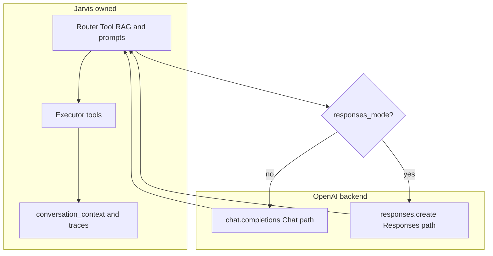

# OpenAI provider in Jarvis

This document describes how Jarvis uses OpenAI today: **Chat Completions** (default) for most cloud text + tool routing, and the optional **Responses API** (`/v1/responses`) path when you explicitly enable it. For design rationale, phases, and non-goals, see [OPENAI_RESPONSES_ADAPTER_PLAN.md](archive/OPENAI_RESPONSES_ADAPTER_PLAN.md).

## Where OpenAI fits in Jarvis

Jarvis is the orchestrator: Tool RAG, memory, intelligence, completion guard, Web UI history, and tool execution remain **Jarvis-owned**. OpenAI is only one possible **execution backend** for the routing LLM when `LLM_PROVIDER=openai`.

Code entry points:

| Area | Primary code |
|------|----------------|
| Routing LLM (`chat_with_tools`) | [`lib/llm_provider.py`](../lib/llm_provider.py) — `OpenAIProvider` |
| Responses helpers (tool shaping, parsing, hosted tools) | [`lib/openai_responses_adapter.py`](../lib/openai_responses_adapter.py) |
| Router payloads + continuation extras | [`orchestrator/router_v2.py`](../orchestrator/router_v2.py) — `ProviderRouteInput`, `LLMRouter.route` |
| In-flight continuation state | [`orchestrator/orchestrator_v2.py`](../orchestrator/orchestrator_v2.py) |

**Not migrated to Responses in this layer** (unchanged endpoints): Whisper STT, TTS, image/video APIs, embeddings, and other callers that hit OpenAI separately from `OpenAIProvider.chat_with_tools`. Simple `chat()` on `OpenAIProvider` always uses Chat Completions.

## Chat Completions (default)

When responses mode is **not** active for a tool-capable turn, `OpenAIProvider.chat_with_tools` calls:

```http
POST /v1/chat/completions
```

### Requests

- **Messages**: Jarvis sends a combined list: optional `system` (from router), then caller `messages` (typically role/content chat rows).
- **Tools**: Definitions come from the tool registry via `ToolSchema.to_openai_format()` — nested Chat Completions shape:

```text
{"type":"function","function":{"name","description","parameters"}}
```

`parameters` are passed through `_sanitize_schema_for_openai`; see [`tests/test_openai_tool_schema.py`](../tests/test_openai_tool_schema.py).

- **Tool choice**: `tool_choice="auto"` when tools are present.
- **Reasoning-capable models** (`gpt-5*`, `o1`, `o3`, `o4`): optional `reasoning_effort` from **`OPENAI_REASONING_EFFORT`** (`config_loader` / env). Older models omit it.
  - Special case: **`gpt-5.4-mini` + tools on Chat Completions** — OpenAI rejects `reasoning_effort` together with tools; Jarvis skips `reasoning_effort` on that combination for the Chat path. On the Responses path (`use_responses_path=True`), reasoning may be supplied again according to config.

### Responses returned to Jarvis

- **Text QA**: `(text, None, usage_info, None)`.
- **Tool call**: `(None, tool_call_dict, usage_info, None)` with at least `name`, `arguments`, and when the API supplies them **`id`** / **`tool_call_id`** so the router can propagate ids into the routing result for continuation metadata.

Usage is summarized with [`lib/cost_estimator.py`](../lib/cost_estimator.py) (`prompt_tokens`, `completion_tokens`).

## Responses API (optional)

Enabling Responses does **not** replace Jarvis memory or workflows. It only changes **how** the routing model is called when the gates below are satisfied.

### When `chat_with_tools` uses Responses

`OpenAIProvider` switches to **`client.responses.create`** (`/v1/responses`) if **either**:

1. **Structural in-flight continuation** is attempted: `previous_response_id` **and** `responses_continuation_input` are both set (filled by the orchestrator for OpenAI-only continuation turns), **or**
2. **Configured tool-capable routing mode**: `OPENAI_API_MODE=responses`, **`OPENAI_RESPONSES_TOOLS=true`**, **and** the `tools` list is **non-empty**.

Important nuance: this means the provider call is **tool-capable**, not that the model ultimately calls a tool. Jarvis normally sends ghost tools such as memory/canvas/tool search on routing turns, so even a casual prompt that the model answers directly can still use `/v1/responses` when Responses mode is armed. In that case the result is still a Q&A/direct answer; no `previous_response_id` continuation is used unless the model actually asks Jarvis to run a client-side tool and the orchestrator enters an in-flight continuation loop.

If the orchestrator sends continuation handles but **`OPENAI_RESPONSES_INFLIGHT_CONTINUATION`** is false or ids are incomplete, Jarvis **drops** structural continuation for that call and rebuilds `input` from normal chat-shaped messages (see stderr `JARVIS_DEBUG` message in code).

### Request shape vs Chat Completions

- **`input`**: Either:
  - **First / text-fallback turns**: chat-compatible rows from `build_responses_input_from_chat` (system + user/assistant `role` / `content`), or
  - **Continuation turns**: list of Responses items, including `{"type":"function_call_output","call_id":...,"output":...}` (and optionally a trailing user `role` line if `OPENAI_RESPONSES_CONTINUATION_DELTA_MESSAGE` is enabled in the orchestrator).
- **`tools`**: Chat-style tools are converted in-process to Responses’ flatter function tool shape (`type: function`, `name`, `description`, `parameters`, **`strict: false`** to stay closer to Chat Completions’ non-strict defaults). See `chat_tools_to_responses_tools` in [`lib/openai_responses_adapter.py`](../lib/openai_responses_adapter.py).
- **Hosted tools** (optional): If `OPENAI_RESPONSES_SERVER_SIDE_TOOLS=true`, additional built-in tools may be appended (`web_search`, `file_search`, `code_interpreter`) per env — same module, `build_openai_builtin_responses_tools`.
- **`previous_response_id`**: Set only when **structural continuation** is fully enabled and valid.
- **`store`**: Controlled by `openai_responses_storage_flag` — generally prefers **stateless** (`store=false`) unless in-flight continuation expects chainable stored responses; see env section below.
- **`parallel_tool_calls`**: From **`OPENAI_RESPONSES_PARALLEL_TOOL_CALLS`**. If the model returns multiple `function_call` items and parallel is disallowed, Jarvis **picks the first** and logs.
- **`max_tool_calls`**: Passed when **`OPENAI_RESPONSES_SERVER_SIDE_MAX_TOOL_CALLS`** &gt; 0.
- **`include`**: Optional `web_search_call.action.sources` when **`OPENAI_RESPONSES_INCLUDE_WEB_SEARCH_SOURCES`** is true.
- **`reasoning`**: For supported models, `reasoning_effort` may be passed on the Responses path even when Chat Completions + tools blocked it (e.g. `gpt-5.4-mini`).
- **`prompt_cache_key` / `prompt_cache_retention`**: Set on Responses calls per OpenAI [prompt caching](https://platform.openai.com/docs/guides/prompt-caching). Jarvis sends `prompt_cache_key` when **`OPENAI_PROMPT_CACHE_KEY`** is set, otherwise (by default **`OPENAI_PROMPT_CACHE_ENABLED=true`**) derives `jarvis_router_<hash>` from **`OPENAI_PROMPT_CACHE_NAMESPACE`** and the configured API key so similar router-shaped requests bucket together without sending the secret in plain form. **`OPENAI_PROMPT_CACHE_RETENTION`** is optional (`in-memory` | `24h`). Normal logs expose only **`openai_prompt_cache_key_set`**, not the key string.

### Parsing the Responses object

`parse_responses_result` in the adapter:

- Reads **assistant text** from `output_text` or from `message` items with `output_text` blocks.
- Detects **client tool calls** from `function_call` items; attaches **`response_id`** from the top-level response `id` and **`call_id`** as `tool_call_id` / `id` for router compatibility.
- Merges **usage** into the same cost style as Chat Completions where possible, plus **cached input** (`usage.input_tokens_details.cached_tokens`, logged as `openai_cached_input_tokens`) and **reasoning tokens** when present.
- Counts **hosted** activity into `usage_info["server_side_tools"]` using the same normalized keys as other providers where applicable, e.g. `SERVER_SIDE_TOOL_WEB_SEARCH`, `SERVER_SIDE_TOOL_FILE_SEARCH`, `SERVER_SIDE_TOOL_CODE_INTERPRETER` (from output types `web_search_call`, `file_search_call`, `code_interpreter_call`).

### Diagnostics

After each Responses call, `OpenAIProvider` fills **`_openai_responses_diag_holder`** (counts by output type, whether `previous_response_id` was used, fallback reason, etc.). The router merges **`openai_*`** fields into **`continuation_meta` / `provider_route`** for LLM logs (see [`lib/llm_logger.py`](../lib/llm_logger.py)). OpenAI continuation state is logged under `openai_responses_*` and generic `provider_*` fields; xAI-specific aliases are reserved for xAI calls. Raw ids should only appear in debug-oriented logs unless you widen logging policy.

### Fallback rule (critical)

Jarvis **does not** take a failing Responses continuation and blindly send Responses-only payload shapes (e.g. `function_call_output`) through **Chat Completions**. On structural failure the router returns **`openai_continuation_error`**; the orchestrator retries once with normal **local text context** (`turn_input` string) and no structural continuation payloads.

This matches the separation described in [OPENAI_RESPONSES_ADAPTER_PLAN.md](archive/OPENAI_RESPONSES_ADAPTER_PLAN.md): structural provider payloads are not mixed into incompatible APIs.

## Orchestrator: in-flight continuation (OpenAI)

Parallel to xAI stored continuation:

- **`openai_provider_continuation`** mirrors the xAI continuation dict shape but with **`provider`: `"openai"`** and **`OPENAI_RESPONSES_RESULT_MAX_CHARS`** / **`OPENAI_PREVIOUS_RESPONSE_MAX_AGE_DAYS`** guarding reuse.
- Next router turn within the **same user request** may use **`ProviderRouteInput`** with **`responses_continuation_input`** plus **`previous_response_id`**, while Tool RAG still uses the original enhanced request string as **`tool_retrieval_query`**.
- **`OPENAI_RESPONSES_CONTINUATION_DELTA_MESSAGE`** appends an extra user-shaped input item after `function_call_output` when enabled (parallel idea to **`XAI_CONTINUATION_DELTA_MESSAGE`**).

Continuation is **not** for normal Q&A/direct-answer turns or for persisted Web UI follow-up threads; Jarvis reconstructs later turns from local history and tools, not OpenAI stored conversation ids. A Q&A/direct-answer turn may still be generated by `/v1/responses` if it was a tool-capable routing call; the thing that stays out of Q&A is provider-native continuation state.

## Native (hosted) tools vs orchestrator budgets

When `LLM_PROVIDER=openai` and Responses routing knobs are armed, **`native_search_request_budget`** for disabling “native search” overlays can come from **`OPENAI_RESPONSES_SERVER_SIDE_MAX_TOOL_CALLS`** instead of xAI-specific env vars, so OpenAI-hosted tool budgets do not silently piggyback on **`XAI_*`**. Hosted tools themselves still require **`OPENAI_RESPONSES_SERVER_SIDE_TOOLS`** and the per-capability toggles (`WEB_SEARCH`, `FILE_SEARCH`, `CODE_INTERPRETER`). When Jarvis disables native tools for a specific router call, it sets a transient **`OPENAI_RESPONSES_DISABLE_SERVER_SIDE_TOOLS=true`** guard so the adapter does not attach hosted OpenAI tools for that call.

## Configuration reference

Authoritative commented defaults live next to **`OPENAI_API_KEY`** in **[`config/cloud.env.example`](../config/cloud.env.example)** (section “OpenAI Responses API”). Highlights:

| Variable | Role |
|---------|------|
| `OPENAI_API_MODE` | `chat` (default) or `responses` |
| `OPENAI_RESPONSES_TOOLS` | Enables Responses for tool-capable routing calls with non-empty tool lists when mode is `responses` |
| `OPENAI_RESPONSES_INFLIGHT_CONTINUATION` | Allows `previous_response_id` + `function_call_output` chain |
| `OPENAI_RESPONSES_STORE` / `OPENAI_RESPONSES_STORE_CONTINUE` | `/v1/responses` **`store`** behavior |
| `OPENAI_RESPONSES_RESULT_MAX_CHARS` | Serialized provider tool result bound |
| `OPENAI_PREVIOUS_RESPONSE_MAX_AGE_DAYS` | Continuation TTL guard |
| `OPENAI_RESPONSES_PARALLEL_TOOL_CALLS` | Multiple parallel `function_call` items from API |
| `OPENAI_RESPONSES_SERVER_SIDE_TOOLS` | Master switch for hosted tools |
| `OPENAI_RESPONSES_SERVER_SIDE_MAX_TOOL_CALLS` | Passed through; interacts with orchestrator native budget |
| `OPENAI_RESPONSES_WEB_SEARCH` / domains | Hosted web search |
| `OPENAI_RESPONSES_FILE_SEARCH` / vector store IDs | Hosted file search |
| `OPENAI_RESPONSES_CODE_INTERPRETER` / memory limit | Hosted code interpreter |
| `OPENAI_RESPONSES_INCLUDE_WEB_SEARCH_SOURCES` | Extra `include` payload for auditing |
| `OPENAI_REASONING_EFFORT` | Chat + Responses reasoning models (Chat has the `gpt-5.4-mini` + tools caveat above) |
| `OPENAI_PROMPT_CACHE_KEY` | Explicit Responses `prompt_cache_key` (omit to use derived key) |
| `OPENAI_PROMPT_CACHE_ENABLED` | When no explicit key: enable derived cache key (`true` default) |
| `OPENAI_PROMPT_CACHE_NAMESPACE` | Salt for derived key |
| `OPENAI_PROMPT_CACHE_RETENTION` | Optional `in-memory` or `24h` |

## SDK version

Jarvis declares a lower bound compatible with **`client.responses.create`** in **`pyproject.toml`** (`openai>=2.14.0,<3` at time of writing). Use a matching venv in CI and on hosts.

## Quick mental model



- **Chat path**: Familiar messages + nested function tools.
- **Responses path**: Typed `input` + flatter tools + optional hosted tools + optional `previous_response_id` chain inside one task.

For acceptance-style checks and smoke-test ideas, see the checklist in [OPENAI_RESPONSES_ADAPTER_PLAN.md](archive/OPENAI_RESPONSES_ADAPTER_PLAN.md).
