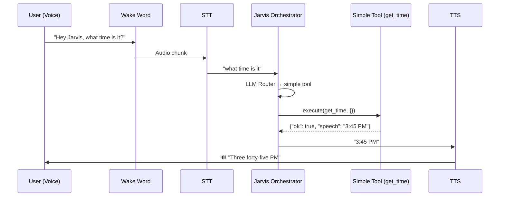
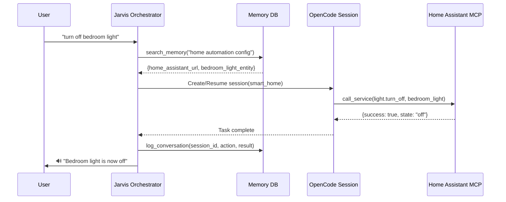
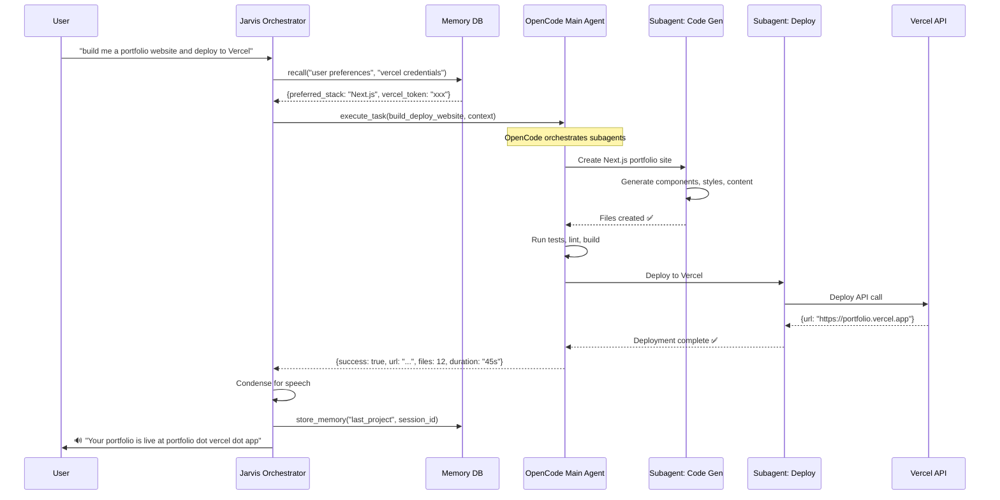
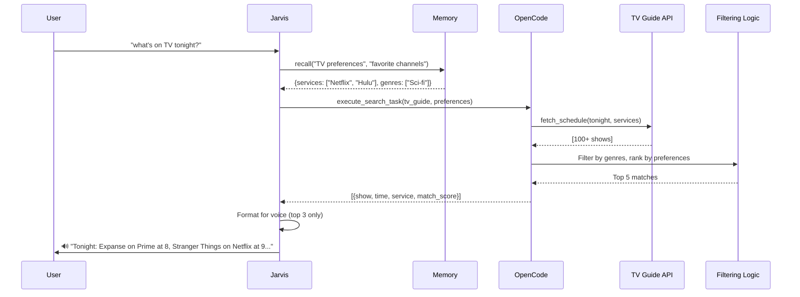
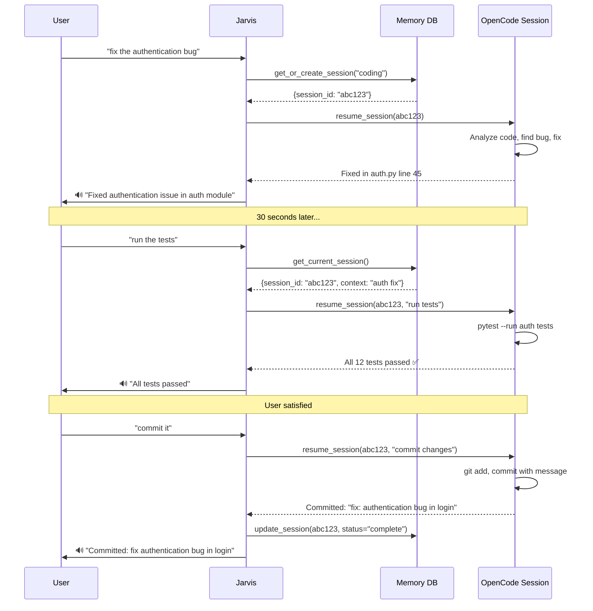

# 🤖 OpenCode + Jarvis Integration Master Plan
**Real-life Iron Man Jarvis with OpenCode Intelligence**

---

## 🎯 **Vision: The Ultimate AI Assistant**

Transform Jarvis from a voice-controlled tool executor into a **true autonomous assistant** that can:
- Control smart home devices ("turn off bedroom light")
- Manage entertainment ("what's on TV tonight")
- Build and deploy software ("build me a website and deploy to Vercel")
- Execute complex multi-step workflows autonomously
- Maintain conversation context across sessions
- Remember everything and learn from interactions

**Key Insight**: OpenCode provides **autonomous task execution with subagents**, Jarvis provides **voice interface + memory persistence**. Together = Iron Man's Jarvis.

---

## 🏗️ **System Architecture Overview**

### Current State
```
Voice → Wake Word → STT → Jarvis Orchestrator → Simple Tool → TTS → Voice
                              ↓
                        LLM Router (Claude/GPT)
                              ↓
                        15+ Python/Bash Tools
                              ↓
                        Memory DB (SQLite + Vectors)
```

### Target State
```
Voice → Wake Word → STT → Jarvis Orchestrator → OpenCode Server → TTS → Voice
                              ↓                      ↓
                        LLM Router            Autonomous Subagents
                              ↓                      ↓
                        Memory + Context      Files/Git/Bash/MCP
                              ↓                      ↓
                        Session Tracking ←────→ Task Results
                              ↓
                        Condensed Speech Output
```

---

## 📊 **Integration Architecture: Three-Tier Approach**

### **Tier 1: Core Integration (Week 1-2)**
OpenCode as intelligent tool executor alongside existing Jarvis tools

### **Tier 2: Autonomous Agent Layer (Week 3-4)**
OpenCode subagents for complex multi-step tasks with session persistence

### **Tier 3: Full Symbiosis (Month 2+)**
Bidirectional context sharing, real-time progress updates, unified memory

---

## 🔄 **Flow Diagrams**

### **Flow 1: Simple Command ("Hey Jarvis, what time is it?")**



**Decision**: Simple queries stay with existing Jarvis tools (fast, voice-optimized)

---

### **Flow 2: Smart Home Control ("Hey Jarvis, turn off bedroom light")**



**Key Innovation**: 
- Home Assistant config stored in Jarvis memory
- OpenCode uses MCP server for Home Assistant
- Session ID stored for context ("turn it back on" = same session)

---

### **Flow 3: Complex Task ("Build me a website and deploy to Vercel")**



**Key Innovation**:
- OpenCode spawns specialized subagents (code gen, deploy)
- Jarvis memory provides context (preferences, credentials)
- Result condensation for voice output
- Session persisted for follow-ups ("add a contact form")

---

### **Flow 4: Entertainment Query ("What's on TV tonight?")**



**Key Innovation**:
- OpenCode handles API calls + complex filtering
- Jarvis provides preference context from memory
- Smart condensation (100+ shows → 3 spoken)

---

### **Flow 5: Multi-Turn Coding ("Fix the bug", "Run tests", "Commit it")**



**Key Innovation**:
- Session persistence across multiple voice commands
- Context maintained in both Jarvis memory AND OpenCode session
- Natural conversation flow without repeating context

---

## 🗄️ **Memory Integration Strategy**

### **Jarvis Memory DB Schema Extensions**

```sql
-- New table: OpenCode sessions
CREATE TABLE opencode_sessions (
    id INTEGER PRIMARY KEY AUTOINCREMENT,
    session_id TEXT UNIQUE NOT NULL,        -- OpenCode session ID
    jarvis_session_id TEXT,                  -- Jarvis conversation session
    task_type TEXT,                          -- "coding", "smart_home", "general"
    created_at TIMESTAMP DEFAULT CURRENT_TIMESTAMP,
    last_accessed TIMESTAMP,
    status TEXT DEFAULT 'active',            -- active, paused, completed
    context_summary TEXT,                    -- Voice-friendly summary
    full_context TEXT,                       -- JSON dump of full context
    result_summary TEXT,                     -- Condensed result for TTS
    embedding BLOB                           -- Vector for semantic search
);

-- New table: Task templates
CREATE TABLE task_templates (
    id INTEGER PRIMARY KEY AUTOINCREMENT,
    template_name TEXT UNIQUE,
    description TEXT,
    opencode_prompt TEXT,                    -- Prompt template for OpenCode
    required_context TEXT,                   -- JSON: what context is needed
    subagent_config TEXT,                    -- JSON: subagent specifications
    success_pattern TEXT,                    -- How to recognize success
    voice_response_template TEXT             -- How to speak the result
);

-- Example templates
INSERT INTO task_templates VALUES (
    null,
    'deploy_website',
    'Build and deploy a website to Vercel',
    'Build a {{framework}} website with {{features}}. Deploy to Vercel using credentials from context.',
    '{"required": ["vercel_token", "preferred_framework"]}',
    '{"subagents": ["code_generator", "deployer"]}',
    '{"success": "url"}',
    'Your {{project_type}} is live at {{url}}'
);
```

### **Memory Bridge: Jarvis ↔ OpenCode**

```python
# lib/opencode_bridge.py

class OpenCodeMemoryBridge:
    """Bidirectional context sharing between Jarvis and OpenCode."""
    
    def inject_context_into_opencode(self, session_id: str, jarvis_context: dict):
        """
        Inject Jarvis memory context into OpenCode session.
        
        Example context:
        {
            "user_preferences": {...},
            "recent_conversations": [...],
            "relevant_memories": [...],
            "active_projects": [...]
        }
        """
        # Use OpenCode SDK to inject context without triggering AI
        await opencode_client.session.prompt({
            "path": {"id": session_id},
            "body": {
                "noReply": True,  # Context only, no AI response
                "parts": [{
                    "type": "text",
                    "text": f"# Jarvis Context\n{json.dumps(jarvis_context, indent=2)}"
                }]
            }
        })
    
    def extract_condensed_result(self, opencode_result: dict) -> str:
        """
        Convert OpenCode result into voice-friendly speech.
        
        Uses LLM to condense:
        - File changes → "Modified 3 files"
        - URLs → Domain only
        - Technical details → User-friendly summary
        """
        # Use Claude to condense
        prompt = f"""
        Convert this technical result into a natural voice response (max 2 sentences):
        
        {json.dumps(opencode_result, indent=2)}
        
        Rules:
        - No URLs unless critical
        - No file paths
        - Focus on what was accomplished
        - Speak naturally
        """
        
        condensed = llm_call(prompt)
        return condensed
```

---

## 🚀 **Startup Architecture**

### **Option A: OpenCode Always Running (Recommended)**

```bash
# systemd service: opencode-jarvis.service
[Unit]
Description=OpenCode Server for Jarvis
After=network.target

[Service]
Type=simple
User=boss
WorkingDirectory=/home/boss/jarvis-voice
ExecStart=/usr/local/bin/opencode serve --port 4096 --hostname 127.0.0.1
Restart=always

[Install]
WantedBy=multi-user.target
```

**Advantages**:
- ✅ Instant response (no startup delay)
- ✅ Session persistence across Jarvis restarts
- ✅ Independent process (more stable)
- ✅ Can interact with OpenCode outside of Jarvis

**Jarvis Integration**:
```python
# lib/opencode_client.py
class OpenCodeClient:
    def __init__(self, base_url="http://localhost:4096"):
        self.sdk = createOpencodeClient(baseUrl=base_url)
        self._verify_connection()
    
    def _verify_connection(self):
        """Verify OpenCode is running, auto-start if not."""
        try:
            self.sdk.app.get()
        except ConnectionError:
            print("⚠️  OpenCode not running, starting server...")
            subprocess.Popen(["opencode", "serve", "--port", "4096"])
            time.sleep(3)  # Wait for startup
```

### **Option B: On-Demand Startup**

Only start OpenCode when needed (complex tasks).

**Advantages**:
- ✅ Lower resource usage when idle
- ✅ Fresh session each time

**Disadvantages**:
- ❌ 2-3 second startup delay
- ❌ No session persistence across restarts

**Recommendation**: Use **Option A** for production, but support on-demand as fallback.

---

## 🛠️ **Tool Architecture**

### **Tiered Tool System**

```
┌─────────────────────────────────────────────────┐
│           Jarvis Orchestrator                   │
│   (LLM Router: Fast vs Complex decision)        │
└──────────────┬──────────────────────────────────┘
               │
       ┌───────┴───────┐
       │               │
┌──────▼──────┐ ┌─────▼──────────────────────────┐
│ Tier 1:     │ │ Tier 2: OpenCode Agent         │
│ Fast Tools  │ │                                │
│             │ │ ┌────────────────────────────┐ │
│ • get_time  │ │ │ Subagent: Code Generator   │ │
│ • recall    │ │ └────────────────────────────┘ │
│ • remember  │ │ ┌────────────────────────────┐ │
│ • webhook   │ │ │ Subagent: Smart Home       │ │
│             │ │ └────────────────────────────┘ │
│ < 1s resp   │ │ ┌────────────────────────────┐ │
│             │ │ │ Subagent: Web Search+Parse │ │
│             │ │ └────────────────────────────┘ │
│             │ │                                │
│             │ │ Multi-step, autonomous         │
└─────────────┘ └────────────────────────────────┘
```

### **Decision Logic**

```python
class SmartRouter:
    def should_use_opencode(self, query: str, context: dict) -> bool:
        """
        Decide: Fast tool vs OpenCode?
        
        OpenCode for:
        - Multi-file operations
        - Complex logic/filtering
        - API orchestration
        - Git operations
        - Smart home sequences
        
        Fast tools for:
        - Single fact lookup
        - Simple memory operations
        - Single API call
        - Time/date
        """
        complexity_signals = [
            "build", "create", "deploy", "fix bug", "refactor",
            "schedule", "automation", "workflow", "complex",
            "multiple", "all", "every"
        ]
        
        return any(signal in query.lower() for signal in complexity_signals)
```

---

## 📝 **Implementation Roadmap**

### **Phase 1: Foundation (Week 1)**

**Goal**: OpenCode as a tool, basic integration

- [ ] Install OpenCode SDK: `npm install @opencode-ai/sdk`
- [ ] Create `lib/opencode_client.py` - SDK wrapper
- [ ] Create `skills/opencode.py` - Simple tool interface
- [ ] Create `skills/opencode.tool.json` - Tool schema
- [ ] Test: "Hey Jarvis, use OpenCode to list files in the project"
- [ ] Setup systemd service for OpenCode server

**Success Criteria**: Can execute simple OpenCode tasks via voice

---

### **Phase 2: Memory Integration (Week 2)**

**Goal**: Context sharing between systems

- [ ] Extend `memory_db.py` with opencode_sessions table
- [ ] Create `lib/opencode_bridge.py` - Memory bridge
- [ ] Implement context injection (Jarvis → OpenCode)
- [ ] Implement result condensation (OpenCode → Voice)
- [ ] Test: Context persists across multiple commands

**Success Criteria**: Can say "build a website" then "deploy it" (context maintained)

---

### **Phase 3: Smart Home Integration (Week 3)**

**Goal**: Real-world device control

- [ ] Setup Home Assistant MCP server in OpenCode
- [ ] Store HA config in Jarvis memory
- [ ] Create subagent config for smart home operations
- [ ] Test: "turn off bedroom light", "set living room to 72 degrees"

**Success Criteria**: Voice control of physical devices

---

### **Phase 4: Autonomous Workflows (Week 4)**

**Goal**: Complex multi-step tasks

- [ ] Create task templates in memory DB
- [ ] Implement OpenCode subagent spawning
- [ ] Add progress monitoring via event stream
- [ ] Voice progress updates: "Building... Testing... Deploying..."
- [ ] Test: "Build and deploy a blog", "Setup my development environment"

**Success Criteria**: Can complete 30+ minute tasks autonomously

---

### **Phase 5: Intelligence Layer (Month 2)**

**Goal**: Learning and optimization

- [ ] Track which tasks work best with OpenCode vs tools
- [ ] Learn user patterns (prefers React vs Vue, etc.)
- [ ] Proactive suggestions: "I noticed you often deploy to Vercel, should I save that token?"
- [ ] Context prediction: Auto-inject relevant memories

**Success Criteria**: System gets smarter over time

---

## 🧪 **Testing Strategy**

### **Test Suite Structure**

```bash
tests/
├── integration/
│   ├── test_simple_command.sh      # "what time is it"
│   ├── test_smart_home.sh          # "turn off lights"
│   ├── test_coding_workflow.sh     # "fix bug" → "test" → "commit"
│   └── test_deployment.sh          # "build and deploy"
├── unit/
│   ├── test_opencode_client.py
│   ├── test_memory_bridge.py
│   └── test_result_condensation.py
└── e2e/
    └── test_full_voice_pipeline.sh
```

### **Key Test Cases**

```bash
# Test 1: Simple pass-through
./jarvis-test.sh "use OpenCode to list Python files"
# Expected: Lists .py files, < 3s response

# Test 2: Context persistence
./jarvis-test.sh "create a React app called portfolio"
sleep 2
./jarvis-test.sh "add a contact form to it"
# Expected: Adds to same project, doesn't create new app

# Test 3: Memory integration
./jarvis-test.sh "remember my Vercel token is xyz123"
./jarvis-test.sh "deploy my project to Vercel"
# Expected: Uses stored token, no prompt

# Test 4: Result condensation
./jarvis-test.sh "search for best pizza places nearby"
# Expected: Voice output is 2-3 sentences, not 50 results

# Test 5: Smart routing
./jarvis-test.sh "what time is it"
# Expected: Uses fast tool, not OpenCode (< 500ms)
```

---

## 🎓 **Usage Examples: Real-World Scenarios**

### **Example 1: Morning Routine**

```
User: "Hey Jarvis, good morning routine"

Jarvis: [Recalls "morning routine" automation]
  1. Turn on bedroom lights (Home Assistant MCP)
  2. Start coffee maker (IFTTT webhook)
  3. Read calendar (Google Calendar MCP)
  4. Get weather (DuckDuckGo search)
  5. Summarize news (OpenCode: fetch + parse + summarize)

🔊 "Good morning! Lights on, coffee brewing. You have a meeting at 10.
     It's 65 degrees and sunny. Top news: ..."

[All in 5 seconds]
```

---

### **Example 2: Development Workflow**

```
User: "Hey Jarvis, fix the login bug and deploy to staging"

Jarvis:
  1. Check git status (OpenCode)
  2. Analyze auth code (OpenCode subagent: debugger)
  3. Fix issue (OpenCode: edit files)
  4. Run tests (OpenCode: bash execution)
  5. Commit with message (OpenCode: git)
  6. Deploy to staging (OpenCode: Vercel API)
  7. Store session in memory

🔊 "Fixed authentication issue in auth module line 47. 
     All tests passed. Deployed to staging at staging-app.vercel.app"

[40 seconds, fully autonomous]
```

---

### **Example 3: Content Research**

```
User: "Hey Jarvis, research AI agents and write a blog post"

Jarvis:
  1. Search "AI agents 2024" (DuckDuckGo MCP)
  2. Fetch top 10 articles (OpenCode: parallel fetching)
  3. Extract key points (OpenCode subagent: analyzer)
  4. Generate outline (OpenCode: writing agent)
  5. Write blog post (OpenCode: content generator)
  6. Save to blog repo (OpenCode: git)

🔊 "Researched 10 sources and wrote a 1200-word post on AI agents.
     Saved to your blog repository as ai-agents-2024.md"

[2 minutes, fully autonomous]
```

---

### **Example 4: Smart Home Automation**

```
User: "Hey Jarvis, movie mode"

Jarvis: [Recalls "movie mode" = stored automation]
  1. Dim living room lights to 20% (HA MCP)
  2. Turn on TV (HA MCP)
  3. Close blinds (HA MCP)
  4. Set surround sound (HA MCP)
  5. Check what's playing (TMDB API)

🔊 "Movie mode activated. Lights dimmed, TV on. 
     Avengers is available on Disney Plus"

[3 seconds]
```

---

### **Example 5: Learning & Adaptation**

```
User: "Hey Jarvis, I prefer TypeScript over JavaScript"

Jarvis: [Stores in memory]

[Week later]

User: "Hey Jarvis, create a new web project"

Jarvis:
  1. Recall preference: TypeScript
  2. OpenCode creates TypeScript + React project
  3. Stores session for follow-ups

🔊 "Created TypeScript React project with Vite. 
     Ready in the projects folder"

[No need to specify TypeScript - learned preference]
```

---

## ⚠️ **Critical Design Decisions**

### **Decision 1: When to use OpenCode vs Simple Tools**

**Rule**: Use OpenCode for multi-step OR requires reasoning
- ✅ OpenCode: "Build a website" (10+ steps)
- ❌ OpenCode: "What time is it" (1 function call)
- ✅ OpenCode: "Turn off all lights in bedroom" (needs to know which lights)
- ❌ OpenCode: "Turn off bedroom light" (single entity)

**Implementation**: Router LLM decides based on complexity signals

---

### **Decision 2: Session Persistence Strategy**

**Approach**: Hybrid memory

- **Short-term** (5 min): Keep OpenCode session active for follow-ups
- **Long-term**: Store session summary in Jarvis memory DB
- **Rehydration**: Can resume old sessions if context needed

```python
if last_interaction < 5_minutes_ago:
    session_id = active_sessions.get(task_type)
else:
    session_id = memory_db.get_relevant_session(context)
    
if session_id:
    opencode.resume_session(session_id)
else:
    session_id = opencode.create_session()
```

---

### **Decision 3: Voice Response Strategy**

**Challenge**: OpenCode returns technical details, voice needs simplicity

**Solution**: Three-tier condensation

1. **Raw**: Full OpenCode response (logged)
2. **Summary**: LLM-condensed (1-2 sentences)
3. **Voice**: Optimized for TTS (spoken)

```python
def condense_for_voice(opencode_result: dict) -> str:
    """
    OpenCode: {files: [...12 files...], commits: [...], duration: 45s}
    Voice: "Modified 12 files and committed changes"
    """
    # Use Claude to intelligently summarize
    # Focus on accomplishments, not mechanics
    pass
```

---

### **Decision 4: Error Handling**

**Philosophy**: Graceful degradation

```python
try:
    result = await opencode_client.execute(task)
except OpencodeTimeout:
    # Fall back to simpler approach
    result = await jarvis_tool.execute(simplified_task)
except OpencodeError as e:
    # Explain to user
    speak(f"I had trouble with that complex task: {e.message}. Let me try a simpler approach.")
    # Retry with constraints
```

---

## 📈 **Success Metrics**

Track these to measure integration success:

1. **Task Success Rate**: % of complex tasks completed successfully
2. **Response Time**: Avg time from voice command to completion
3. **Context Retention**: % of follow-up commands that use correct context
4. **User Satisfaction**: Fewer "that's not what I meant" responses
5. **Autonomy Level**: % of tasks completed without human intervention
6. **Learning Curve**: System gets faster/better over time

**Target**: 90% success rate, < 5s for simple, < 60s for complex

---

## 🔐 **Security Considerations**

1. **OpenCode Permissions**: Map to Jarvis permission system
2. **Credential Storage**: Use Jarvis encrypted memory, inject into OpenCode
3. **Sandbox Mode**: Option to run OpenCode in restricted container
4. **Audit Trail**: Log ALL OpenCode actions in Jarvis memory
5. **Voice Confirmation**: For dangerous operations ("Delete all files" → confirm)

---

## 🎯 **Next Steps**

1. **Approve this plan** → Move to implementation
2. **Setup Phase 1** (this week):
   - Install OpenCode SDK
   - Create basic tool integration
   - Test simple voice commands
3. **Iterate based on real usage**
4. **Build out smart home** (most impressive demo)
5. **Add autonomous coding** (most practical)

---

## 💬 **Open Questions**

1. Should OpenCode server start with Jarvis or run independently?
   - **Recommendation**: Independent (systemd service)

2. How to handle long-running tasks (5+ minutes)?
   - **Recommendation**: Background execution + voice notification when done

3. Should we expose OpenCode TUI to user?
   - **Recommendation**: Yes, for debugging/power users

4. Cost management for API calls?
   - **Recommendation**: Track in memory DB, set limits

---

## 🎬 **Conclusion**

This plan transforms Jarvis from a **tool executor** to an **autonomous assistant**. OpenCode provides the intelligence layer for complex tasks, while Jarvis provides the voice interface and memory persistence.

**The result**: A true Iron Man Jarvis that can control your home, write code, manage workflows, and learn from every interaction.

**Timeline**: 4-6 weeks to full implementation
**Effort**: Medium (leverages existing systems)
**Impact**: **Transformative** ✨

Ready to build? Let's start with Phase 1! 🚀
# OpenCode Integration - Critical Refinements

## 🔐 **Security & Credentials Management**

### **Issue**: Storing credentials in memory DB vs environment variables

**DECISION**: 
- ❌ **Never store actual credentials in memory DB**
- ✅ **Store credential variable names/references only**
- ✅ **Actual secrets stay in environment or encrypted vault**

### **Implementation**:

```python
# lib/opencode_bridge.py

class CredentialManager:
    """Manages credentials without exposing secrets."""
    
    def store_credential_reference(self, service: str, var_name: str):
        """
        Store reference to credential, not the actual value.
        
        Example:
            store_credential_reference("vercel", "VERCEL_TOKEN")
            # Memory DB stores: {"service": "vercel", "env_var": "VERCEL_TOKEN"}
            # Actual token stays in config/cloud.env or ~/.bashrc
        """
        memory_db.remember(
            category="credentials",
            key=service,
            value=f"ENV:{var_name}",  # Reference, not actual value
            importance=10
        )
    
    def get_credential(self, service: str) -> str:
        """
        Retrieve credential from environment.
        
        Returns actual value by looking up env var reference.
        """
        ref = memory_db.recall(f"credentials.{service}")
        if ref.startswith("ENV:"):
            var_name = ref[4:]
            return os.environ.get(var_name)
        return None
    
    def inject_into_opencode(self, session_id: str, service: str):
        """
        Inject credential into OpenCode session securely.
        
        OpenCode never sees the credential in plaintext context.
        Uses OpenCode's auth API instead.
        """
        cred = self.get_credential(service)
        if cred:
            # Use OpenCode's secure auth endpoint
            opencode_client.auth.set({
                "path": {"id": service},
                "body": {"type": "api", "key": cred}
            })
```

### **Example Usage**:

```python
# User says: "Remember my Vercel token"
# Jarvis responds: "What's the environment variable name?"
# User: "VERCEL_TOKEN"
# Jarvis stores: {"service": "vercel", "env_var": "VERCEL_TOKEN"}

# Later...
# User: "Deploy to Vercel"
# Jarvis:
#   1. Recalls: vercel credentials = "ENV:VERCEL_TOKEN"
#   2. Reads actual value from os.environ["VERCEL_TOKEN"]
#   3. Injects into OpenCode via auth API
#   4. Executes deployment
```

---

## 📁 **Workspace Management**

### **Issue**: Where does OpenCode build projects? How to prevent pollution of jarvis-voice root?

**SOLUTION**: Dedicated workspace structure with permission-based access

### **Directory Structure**:

```bash
/home/boss/
├── jarvis-voice/              # Jarvis codebase (READ-ONLY for builds)
│   ├── skills/
│   ├── orchestrator/
│   └── ...
│
├── jarvis-workspace/          # Workspace for OpenCode builds
│   ├── projects/              # User projects (full access)
│   │   ├── websites/
│   │   ├── scripts/
│   │   └── experiments/
│   ├── temp/                  # Temporary builds (auto-cleanup)
│   └── deployments/           # Ready-to-deploy artifacts
│
└── Documents/                 # User files (conditional access)
    └── code/
```

### **Workspace Rules**:

```python
# lib/workspace_manager.py

class WorkspaceManager:
    """Manages OpenCode working directories with permissions."""
    
    JARVIS_ROOT = "/home/boss/jarvis-voice"
    WORKSPACE_ROOT = "/home/boss/jarvis-workspace"
    
    # Permission levels for different task types
    PERMISSIONS = {
        "build_website": {
            "allowed_dirs": [f"{WORKSPACE_ROOT}/projects/websites"],
            "can_create": True,
            "can_delete": True,
            "can_access_jarvis": False
        },
        "fix_bug": {
            "allowed_dirs": ["$CURRENT_PROJECT"],  # Git repo being worked on
            "can_create": False,
            "can_delete": False,
            "can_access_jarvis": True  # Can read Jarvis code as reference
        },
        "experiment": {
            "allowed_dirs": [f"{WORKSPACE_ROOT}/temp"],
            "can_create": True,
            "can_delete": True,
            "auto_cleanup": "24h"
        },
        "analyze_code": {
            "allowed_dirs": ["$ANY"],  # Read-only anywhere
            "can_create": False,
            "can_delete": False,
            "can_access_jarvis": True
        }
    }
    
    def get_workspace_for_task(self, task_type: str, task_name: str) -> str:
        """
        Determine appropriate workspace directory for task.
        
        Examples:
            get_workspace_for_task("build_website", "portfolio")
            → /home/boss/jarvis-workspace/projects/websites/portfolio
            
            get_workspace_for_task("experiment", "test_api")
            → /home/boss/jarvis-workspace/temp/test_api_20251111_1234
        """
        perms = self.PERMISSIONS.get(task_type, self.PERMISSIONS["experiment"])
        
        if task_type == "build_website":
            project_dir = f"{self.WORKSPACE_ROOT}/projects/websites/{task_name}"
            os.makedirs(project_dir, exist_ok=True)
            return project_dir
        
        elif task_type == "experiment":
            temp_dir = f"{self.WORKSPACE_ROOT}/temp/{task_name}_{timestamp()}"
            os.makedirs(temp_dir, exist_ok=True)
            # Schedule cleanup if needed
            if perms.get("auto_cleanup"):
                schedule_cleanup(temp_dir, perms["auto_cleanup"])
            return temp_dir
        
        elif task_type == "fix_bug":
            # Use current git repository
            git_root = subprocess.check_output(
                ["git", "rev-parse", "--show-toplevel"],
                cwd=os.getcwd()
            ).decode().strip()
            return git_root
        
        else:
            # Default to safe temp location
            return f"{self.WORKSPACE_ROOT}/temp/{task_name}"
    
    def inject_workspace_context(self, session_id: str, task_type: str, task_name: str):
        """
        Tell OpenCode where it can work.
        
        Injects context:
        - Working directory
        - Permission boundaries
        - Related files/projects
        """
        workspace = self.get_workspace_for_task(task_type, task_name)
        perms = self.PERMISSIONS[task_type]
        
        context = f"""
# Workspace Configuration

**Working Directory**: {workspace}
**Task Type**: {task_type}
**Permissions**:
- Allowed directories: {perms['allowed_dirs']}
- Can create files: {perms['can_create']}
- Can delete files: {perms['can_delete']}
- Access to Jarvis codebase: {perms['can_access_jarvis']}

**Guidelines**:
- All generated files go in: {workspace}
- Do NOT modify files in: {self.JARVIS_ROOT}
- Read-only access to Jarvis code for reference only
"""
        
        # Inject via OpenCode SDK
        opencode_client.session.prompt({
            "path": {"id": session_id},
            "body": {
                "noReply": True,
                "parts": [{"type": "text", "text": context}]
            }
        })
        
        # Also set OpenCode's working directory
        return workspace
```

### **Example: "Build me a website"**

```python
# User says: "Hey Jarvis, build me a portfolio website"

# Jarvis orchestrator:
1. Recognizes: build_website task
2. Calls workspace_manager.get_workspace_for_task("build_website", "portfolio")
   → Returns: /home/boss/jarvis-workspace/projects/websites/portfolio
3. Creates OpenCode session with working_dir set to that path
4. OpenCode builds everything in that isolated directory
5. Jarvis speaks: "Portfolio website built in workspace/projects/websites/portfolio"

# User says: "Deploy it to Vercel"
6. Same session, same workspace
7. OpenCode deploys from that directory
8. Workspace is preserved for future edits
```

---

## 🎛️ **OpenCode Configuration Management**

### **Issue**: How does Jarvis control OpenCode settings (models, providers, etc.)?

**SOLUTION**: Dynamic configuration via OpenCode API

### **OpenCode Config Discovery**:

```python
# lib/opencode_configurator.py

class OpenCodeConfigurator:
    """Manages OpenCode configuration dynamically."""
    
    def __init__(self, opencode_url="http://localhost:4096"):
        self.client = createOpencodeClient(baseUrl=opencode_url)
        self.spec = self._fetch_openapi_spec()
    
    def _fetch_openapi_spec(self):
        """Fetch OpenCode's OpenAPI spec for available options."""
        import requests
        response = requests.get(f"{self.opencode_url}/doc")
        return response.json()
    
    def get_available_providers(self):
        """Get list of available LLM providers from OpenCode."""
        config = self.client.config.providers()
        return {
            "providers": config["providers"],
            "defaults": config["default"]
        }
    
    def set_provider_for_task(self, session_id: str, task_complexity: str):
        """
        Choose optimal provider based on task complexity.
        
        Strategy:
        - Simple tasks: Use cheaper/faster models
        - Complex tasks: Use powerful models
        - Code generation: Use specialized coding models
        """
        providers = self.get_available_providers()
        
        # Decision matrix
        if task_complexity == "simple":
            # Use fast, cheap model for simple tasks
            model = {
                "providerID": "openai",
                "modelID": "gpt-4o-mini"
            }
        elif task_complexity == "coding":
            # Use coding-optimized model
            model = {
                "providerID": "anthropic",
                "modelID": "claude-3-5-sonnet-20241022"
            }
        elif task_complexity == "complex":
            # Use most powerful model
            model = {
                "providerID": "anthropic",
                "modelID": "claude-sonnet-4-5-20250929"
            }
        else:
            # Default to balanced model
            model = {
                "providerID": "openai",
                "modelID": "gpt-4o"
            }
        
        return model
    
    def check_opencode_health(self):
        """
        Check if OpenCode server is running and healthy.
        
        Returns:
            {
                "status": "running" | "stopped" | "error",
                "uptime": seconds,
                "active_sessions": count
            }
        """
        try:
            app_info = self.client.app.get()
            sessions = self.client.session.list()
            
            return {
                "status": "running",
                "version": app_info.get("version"),
                "active_sessions": len(sessions),
                "healthy": True
            }
        except Exception as e:
            return {
                "status": "error",
                "error": str(e),
                "healthy": False
            }
    
    def restart_opencode_if_needed(self):
        """
        Check systemd service status and restart if needed.
        
        Jarvis has full control over OpenCode lifecycle.
        """
        health = self.check_opencode_health()
        
        if not health["healthy"]:
            print("⚠️  OpenCode unhealthy, restarting...")
            
            # Check systemd status
            result = subprocess.run(
                ["systemctl", "--user", "status", "opencode-jarvis"],
                capture_output=True,
                text=True
            )
            
            if "inactive" in result.stdout or "failed" in result.stdout:
                # Restart service
                subprocess.run(
                    ["systemctl", "--user", "restart", "opencode-jarvis"],
                    check=True
                )
                time.sleep(3)  # Wait for startup
                
                # Verify restart
                new_health = self.check_opencode_health()
                if new_health["healthy"]:
                    print("✅ OpenCode restarted successfully")
                    return True
                else:
                    print("❌ OpenCode restart failed")
                    return False
        
        return True  # Already healthy
```

### **Task Complexity Router**:

```python
# orchestrator/opencode_router.py

class OpenCodeTaskRouter:
    """Intelligently routes tasks to appropriate OpenCode configurations."""
    
    def classify_task_complexity(self, query: str, context: dict) -> str:
        """
        Classify task complexity to choose right model.
        
        Returns: "simple" | "coding" | "complex"
        """
        # Simple tasks (use cheap/fast models)
        simple_signals = [
            "list files", "show", "read", "what is",
            "search", "find", "check"
        ]
        
        # Coding tasks (use coding-optimized models)
        coding_signals = [
            "build", "create", "refactor", "fix bug",
            "add feature", "deploy", "commit", "test"
        ]
        
        # Complex tasks (use most powerful models)
        complex_signals = [
            "analyze", "research", "compare", "evaluate",
            "design architecture", "optimize", "multi-step"
        ]
        
        query_lower = query.lower()
        
        if any(sig in query_lower for sig in simple_signals):
            return "simple"
        elif any(sig in query_lower for sig in coding_signals):
            return "coding"
        elif any(sig in query_lower for sig in complex_signals):
            return "complex"
        else:
            return "coding"  # Default to coding (safest choice)
```

---

## 🔍 **Path Context Resolution**

### **Issue**: "list Python files" - which path?

**SOLUTION**: Intelligent context resolution

```python
# lib/context_resolver.py

class ContextResolver:
    """Resolves ambiguous commands using conversation context."""
    
    def resolve_path(self, query: str, context: dict) -> str:
        """
        Determine which path user is referring to.
        
        Priority:
        1. Explicit path in query ("list files in /home/boss/myproject")
        2. Current OpenCode session workspace
        3. Recent conversation context
        4. Current shell working directory
        5. Jarvis workspace default
        """
        
        # 1. Explicit path?
        import re
        path_match = re.search(r'in ([/~][\w/.-]+)', query)
        if path_match:
            return os.path.expanduser(path_match.group(1))
        
        # 2. Active OpenCode session?
        if context.get("opencode_session_id"):
            session_info = opencode_client.session.get({
                "path": {"id": context["opencode_session_id"]}
            })
            if session_info.get("workspace"):
                return session_info["workspace"]
        
        # 3. Recent conversation mentions a project?
        recent_convos = memory_db.get_recent_conversations(limit=5)
        for convo in recent_convos:
            if "working on" in convo["user_query"].lower():
                # Extract project name
                project = extract_project_name(convo["user_query"])
                if project:
                    return f"/home/boss/jarvis-workspace/projects/{project}"
        
        # 4. Current directory?
        current_dir = os.getcwd()
        if current_dir != "/home/boss/jarvis-voice":
            return current_dir
        
        # 5. Default to workspace
        return "/home/boss/jarvis-workspace"
    
    def should_use_current_directory(self, query: str) -> bool:
        """
        Determine if query refers to "current" location.
        
        Signals: "here", "this", "current", no path specified
        """
        current_signals = ["here", "this directory", "current", "in this"]
        return any(sig in query.lower() for sig in current_signals)
```

### **Example: Context-Aware Path Resolution**

```bash
# Scenario 1: User in jarvis-voice directory
User: "Hey Jarvis, list Python files"
Jarvis: [Resolves to /home/boss/jarvis-voice]
Output: Lists skills/*.py, lib/*.py, orchestrator/*.py

# Scenario 2: User just built a website
User: "Build a portfolio website"
Jarvis: [Creates /home/boss/jarvis-workspace/projects/websites/portfolio]
User: "List the files"  # (no path specified)
Jarvis: [Resolves to last workspace used]
Output: Lists files in portfolio project

# Scenario 3: Explicit path
User: "List Python files in /home/boss/Documents/code"
Jarvis: [Resolves to /home/boss/Documents/code]
Output: Lists files in that directory

# Scenario 4: Ambiguous but conversational
User: "I'm working on my blog project"
Jarvis: "Got it" [stores context]
User: "Show me the posts"
Jarvis: [Resolves to /home/boss/jarvis-workspace/projects/blog]
```

---

## 🎯 **Updated Tool Interface**

```python
# skills/opencode.py

def main():
    """Execute OpenCode task with full context awareness."""
    
    # Get task
    input_data = json.loads(sys.argv[1])
    task = input_data.get("task")
    explicit_path = input_data.get("path")  # Optional
    task_type = input_data.get("task_type", "general")
    model_preference = input_data.get("model")  # Optional override
    
    # Initialize managers
    workspace_mgr = WorkspaceManager()
    config_mgr = OpenCodeConfigurator()
    context_resolver = ContextResolver()
    cred_mgr = CredentialManager()
    
    # Health check
    if not config_mgr.restart_opencode_if_needed():
        return return_error("OpenCode service unavailable")
    
    # Resolve working directory
    if explicit_path:
        workspace = explicit_path
    else:
        workspace = workspace_mgr.get_workspace_for_task(
            task_type,
            task_name=input_data.get("name", "unnamed")
        )
    
    # Choose optimal model
    if model_preference:
        model = model_preference
    else:
        complexity = OpenCodeTaskRouter().classify_task_complexity(task, input_data)
        model = config_mgr.set_provider_for_task(None, complexity)
    
    # Create/resume session
    session = opencode_client.session.create({
        "body": {"title": f"Jarvis: {task[:50]}"}
    })
    
    # Inject context
    workspace_mgr.inject_workspace_context(session.id, task_type, workspace)
    
    # Inject any needed credentials
    if "deploy" in task.lower():
        cred_mgr.inject_into_opencode(session.id, "vercel")
    
    # Execute task
    result = opencode_client.session.prompt({
        "path": {"id": session.id},
        "body": {
            "model": model,
            "parts": [{"type": "text", "text": task}]
        }
    })
    
    # Condense for voice
    speech = condense_for_voice(result)
    
    return {
        "ok": True,
        "speech": speech,
        "data": {
            "session_id": session.id,
            "workspace": workspace,
            "model_used": model
        }
    }
```

---

## 📋 **Updated Tool Schema**

```json
{
  "name": "opencode",
  "description": "Execute complex tasks using OpenCode: coding, building, deploying, analysis",
  "parameters": {
    "type": "object",
    "properties": {
      "task": {
        "type": "string",
        "description": "Detailed task description"
      },
      "task_type": {
        "type": "string",
        "enum": ["build_website", "fix_bug", "experiment", "analyze_code", "deploy"],
        "description": "Type of task (determines workspace and permissions)"
      },
      "path": {
        "type": "string",
        "description": "Optional: explicit path to work in (otherwise auto-determined)"
      },
      "name": {
        "type": "string",
        "description": "Project/task name (for workspace creation)"
      },
      "model": {
        "type": "object",
        "description": "Optional: override model selection",
        "properties": {
          "providerID": {"type": "string"},
          "modelID": {"type": "string"}
        }
      }
    },
    "required": ["task"]
  },
  "permissions": {
    "dangerous": true,
    "filesystem": true,
    "network": true,
    "auto_approve": false
  }
}
```

---

## 🎬 **Complete Example Flow**

```python
# User: "Hey Jarvis, build me a blog and deploy it to Vercel"

# Step 1: Jarvis Router
- Recognizes: complex task, needs OpenCode
- Classifies: task_type="build_website"
- Extracts: name="blog"

# Step 2: Workspace Setup
workspace = "/home/boss/jarvis-workspace/projects/websites/blog"
os.makedirs(workspace, exist_ok=True)

# Step 3: Credential Check
if "vercel" in memory:
    vercel_var = "VERCEL_TOKEN"  # Retrieved from memory
else:
    # Ask user
    speak("What's your Vercel token environment variable?")
    vercel_var = listen()  # User: "VERCEL_TOKEN"
    memory_db.remember("credentials", "vercel", f"ENV:{vercel_var}")

# Step 4: Model Selection
complexity = "complex"  # Build + Deploy
model = {
    "providerID": "anthropic",
    "modelID": "claude-sonnet-4-5-20250929"
}

# Step 5: OpenCode Execution
session = opencode.create_session(
    workspace=workspace,
    model=model,
    context={
        "vercel_token": os.environ[vercel_var],
        "task_type": "build_website"
    }
)

result = session.execute("Build a blog with Next.js and deploy to Vercel")

# Step 6: Voice Response
speech = f"Your blog is live at {extract_url(result)}"
speak(speech)

# Step 7: Memory Storage
memory_db.store_opencode_session(
    session_id=session.id,
    task_type="build_website",
    workspace=workspace,
    result_summary=speech
)
```
