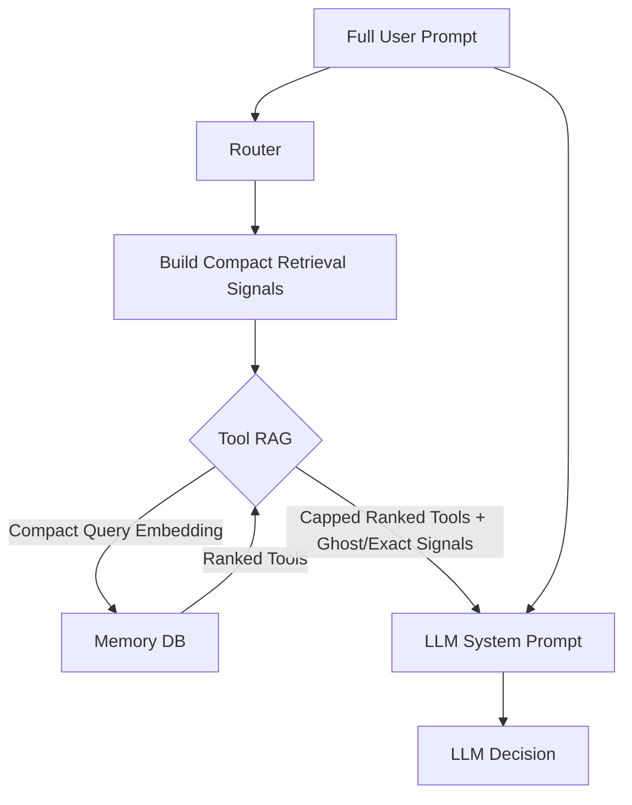

# Tool RAG Strategy (Dynamic Dispatch)

> **Status**: ✅ Implemented & Verified
> **Goal**: Reduce context window usage by dynamically retrieving only relevant tools for each user query.
> **Impact**: Enables scaling to 100+ tools while improving accuracy for local models (Ollama) and reducing costs for cloud models.

---

## 1. The Problem: Context Flooding

Previously, `ToolRegistry` loaded **ALL** enabled tools into the LLM's system prompt every time a user sent a message.

-   **Cloud Models (Claude/GPT-4)**: High cost, potential confusion with similar tools.
-   **Local Models (Ollama)**: **CRITICAL FAILURE POINT**. Small context windows (8k-32k) get filled with tool definitions, leaving no room for conversation history or reasoning.

**Solution**: Treat "Tools" like "Memories". Store them in a vector database, retrieve the most relevant tools for the current request, then merge prioritized ghost tools and exact tool preferences before applying the final schema cap.

---

## 2. Architecture Overview

We leveraged the existing `MemoryDB` infrastructure to store tool definitions as vector embeddings.



The important split: the routing LLM still sees the full prompt, including learned strategies, memory context, recent conversation, and tool results. Tool RAG usually embeds a much smaller request-focused query so long memory/intel blocks do not dilute tool similarity.

---

## 3. Database Schema Integration

We extended `lib/memory_db.py` to support a specialized "Tool Knowledge" store.

### Table Schema (`tool_definitions`)

```sql
CREATE TABLE IF NOT EXISTS tool_definitions (
    name TEXT PRIMARY KEY,          -- e.g., "weather_check"
    description TEXT NOT NULL,      -- "Check current weather for a location..."
    schema_json TEXT NOT NULL,      -- Full JSON schema for the tool
    embedding BLOB,                 -- Vector embedding of name + description
    enabled BOOLEAN DEFAULT 1,
    updated_at TIMESTAMP DEFAULT CURRENT_TIMESTAMP,
    embedding_input_hash TEXT       -- SHA-256 of embedding inputs; skip re-embed when unchanged (see SYNC_ARCHITECTURE.md)
);
```

**Implementation Notes:**
-   Embeddings are stored as binary blobs (Pickled python lists for OpenAI, or JSON for others).
-   The system is robust enough to handle different serialization formats.
-   `embedding_input_hash` is populated by `MemoryDB.upsert_tool()` / `sync-tools.py`; existing DBs get the column via `ALTER TABLE` on open.

---

## 4. The "Just-in-Time" Registry

We modified `lib/tool_schema.py` to support retrieval.

### Workflow
1.  **User speaks**: "What is the price of Bitcoin?"
2.  **Router**: Calls `registry.find_tools("price of Bitcoin")`.
3.  **Vector Search**: DB finds `crypto_price` (high similarity).
4.  **Ghost Prioritization**: Registry merges critical "Ghost Tools" (Time, Memory, Logs) before the final schema cap is applied.
5.  **LLM Prompt**: Receives `[crypto_price, get_time, search_memory, ...]`.

### The "Ghost Tool" Pattern
These tools are priority candidates, ensuring basic functionality gets first chance inside the final schema cap when retrieval misses:
-   `search_memory` / `semantic_recall` (Memory access)
-   `remember` (Saving info)
-   `check_tool_logs` (Self-debugging)
-   `get_recent_conversations` (Context)
-   `get_time` (Basic utility)
-   `tool_search` (Summary-first discovery across the live enabled tool set)
-   `workflow` (Compact discovery and foreground execution of eligible deterministic recipes)

`tool_search` and `workflow` are special:
-   `tool_search` discovers tools from the **current live registry** rather than treating the database as the capability authority
-   `workflow` searches the shared/personal workflow loaders and checks each recipe against that same registry
-   both respect manifest/profile enablement, active-mode availability, and request-scoped exclusions
-   `tool_search` returns **tool summaries first**, then surfaces exact tool-name hints
-   `workflow` returns compact runnable workflow metadata, then accepts an exact workflow id for `describe` or synchronous `run`
-   both are mandatory discovery candidates in code, so neither needs to be added to `GHOST_TOOLS`
-   “mandatory” means prioritized **when present in the effective registry**, not force-enabled; a manifest, profile, or Web/request block can remove either one
-   final schema caps prioritize explicit positive signals first, then `tool_search` and `workflow`

---

## 5. Implementation Details

### A. Sync Script (`bin/sync-tools.py`)
**CRITICAL COMPONENT**: This script iterates through all local and MCP tools, generates embeddings, and saves them to the DB.

**Usage**:
```bash
# Must run in the environment where 'openai' package is installed!
source ~/jarvis-venv/bin/activate

# Sync Cloud Tools (OpenAI Embeddings - 1536 dim)
./bin/sync-tools.py cloud

# Sync Local Tools (Nomic Embeddings - 768 dim)
./bin/sync-tools.py local
```

### B. Router Logic (`orchestrator/router_v2.py`)
-   **Local Mode**: Defaults to a final schema cap of **6** tools (`LOCAL_TOOL_RAG_LIMIT`).
-   **Cloud Mode**: Defaults to a final schema cap of **15** tools (`CLOUD_TOOL_RAG_LIMIT`).
-   **Ghost tools**: Merged before the final cap so core memory/log/time/artifact tools are prioritized without bypassing the tool budget.
-   **Positive tool signals**: UI-selected hints and high-confidence learned `PREFER: tool (+score)` lines can append an enabled non-ghost tool even if vector search missed it.
-   **Negative tool signals**: `DO NOT use: tool` / `AVOID: tool` style signals can exclude non-ghost tools from the semantic result. If the same tool is both preferred and avoided in the same structured signal set, the conflict is neutralized.
-   **Memory/intel tool-name signals**: Exact-match extraction from general memory/intel prose is experimental and disabled by default because that prose is noisier than explicit learned strategy lines.
-   **Threshold selection**:
    - `TOOL_SIMILARITY_THRESHOLD` is the base cutoff for compact/current/raw/original-tail/trailing request queries.
    - `TOOL_SIMILARITY_THRESHOLD_FULL` is used only for true `full_fallback`, even when that fallback string is capped before embedding.
    - If `TOOL_SIMILARITY_THRESHOLD_FULL` is unset or blank, both paths use `TOOL_SIMILARITY_THRESHOLD`.

### C. `tool_search` discovery mode

`tool_search` intentionally reuses the same tool embedding index instead of maintaining a second discovery metadata system.

Current behavior:
-   semantic discovery queries use the live tool registry plus request exclusions
-   semantic and browse discovery focus on non-ghost tools because Tool RAG already considers ghost tools during routing
-   exact inspection still allows ghost tools by exact name, except `tool_search` itself
-   discovery ranking uses a zero-threshold semantic pass with a wider raw candidate pool than normal routing
-   results are summary-first by default, with optional schema expansion for exact tool-name inspection
-   invalid `limit` values safely fall back to the default instead of failing the tool call

Current caveats:
-   discovery still depends on synced tool embeddings, so brand-new or changed tools need `./bin/sync-tools.py`
-   discovery is wider than the normal router shortlist, but it is still bounded by a raw top-K pool
-   the next routing turn still runs normal Tool RAG plus exact positive hints; it is **not** true exact hydration yet

### C.1 `workflow` discovery mode

`workflow` is the workflow equivalent of summary-first tool discovery. It
searches shared and personal workflow definitions, but returns only recipes
whose complete component-tool set is runnable in the current mode, profile, and
request surface.

- `search` returns compact workflow metadata without component schemas.
- `describe` returns compact step labels for one exact workflow id.
- `run` rechecks availability and waits for `PipelineExecutor` to finish.
- A profile or manifest can disable the meta-tool normally.
- Web/request exclusions remove it from routing and are enforced again by `ToolExecutor`.
- Disabling the meta-tool does not disable direct slash or scheduled workflow entry points.

The router's Intelligence insight filter also uses
`ToolRegistry.list_tools()` minus request exclusions. This is the effective live
registry, not the database's enabled-name list, so a stale Tool RAG row cannot
cause an insight to mention a disabled `tool_search`, `workflow`, or component
tool.

## Final Schema Caps

Tool RAG now treats the mode limits as final schema caps, not merely vector
retrieval limits:

```bash
CLOUD_TOOL_RAG_LIMIT=15
LOCAL_TOOL_RAG_LIMIT=6
```

The router retrieves candidates, merges ghost tools and exact positive signals,
then caps the final tool schema list. Priority is:

1. explicit positive signals such as UI-selected tool hints
2. mandatory discovery tools `tool_search` and `workflow`, when enabled
3. retrieved non-ghost tools in rank order
4. remaining ghost tools only if room remains

Request surfaces can pass a one-turn lower cap for tightly scoped work. The Web
UI's Send-to-Canvas action uses this to keep the schema list small. Explicit
positive hints are placed first, so an unusually small one-request cap can still
leave only part of the discovery pair.

Possible future evolution:
-   if token pressure becomes the main concern, a later optimization could switch the turn after `tool_search` into a true exact-hydration mode that exposes only ghost tools plus the selected exact tool names

### D. Dual-threshold tuning

Long routing prompts can inflate similarity scores and cause Tool RAG to hit the retrieval cap with weak matches. Jarvis now avoids that in the normal path by building compact retrieval signals. The stricter full threshold still matters as a safety net when no clean current request can be extracted.

```bash
# Base threshold used for compact/current/raw/trailing/original-tail query retrieval
# Shipped: cloud/cloud.openai=0.29, local=0.27
TOOL_SIMILARITY_THRESHOLD=0.29

# Optional stricter cutoff only for true full_fallback
# Shipped: cloud=0.43, cloud.openai=0.45; local often leaves this unset
TOOL_SIMILARITY_THRESHOLD_FULL=0.43

# Compact retrieval keeps the rich prompt for the LLM but embeds a smaller query
TOOL_RAG_COMPACT_QUERY_ENABLED=true
TOOL_RAG_CURRENT_QUERY_MAX_CHARS=1200
TOOL_RAG_CONTEXT_QUERY_MAX_CHARS=500
TOOL_RAG_APPEND_POSITIVE_SIGNALS=true
TOOL_RAG_EXCLUDE_NEGATIVE_SIGNALS=true
# Shipped: cloud/cloud.openai=0.50, local=0.60
TOOL_RAG_MIN_LEARNED_PREFER_BIAS=0.50
TOOL_RAG_MEMORY_TOOL_SIGNALS_ENABLED=false
```

**Observed behavior (`2026-04-12`; thresholds below are historical tuning notes—prefer shipped values above):**
-   **Cloud mode**: `TOOL_SIMILARITY_THRESHOLD_FULL` around `0.40`-`0.45` was a good starting point in realistic follow-up prompts. It often reduced a noisy 15-tool shortlist down to the one or two tools that actually mattered.
-   **Local / Gemma mode**: `0.35`-`0.45` often had little effect because local only retrieves 5 tools and long-prompt similarities skewed much higher. Local needed much higher values before behavior changed, and those changes were cliff-like.
-   **Practical read**: keep cloud and local tuning separate. A cloud-friendly full threshold does not automatically transfer to local.

### E. Retrieval Signal Sources

When `TOOL_RAG_COMPACT_QUERY_ENABLED=true`, the router tries to extract a clean current request from the full routing prompt before embedding. The source label is logged as `signal_source` in Tool RAG traces.

| `signal_source` | What it means | Normal threshold |
| --- | --- | --- |
| `user_request` | Extracted from an explicit `User's request:` marker, commonly used in web tool-hint contexts. | `TOOL_SIMILARITY_THRESHOLD` |
| `current_request` | Extracted from `Current request:` in web conversation context. | `TOOL_SIMILARITY_THRESHOLD` |
| `legacy_history_strip` | Extracted from the older `=== RECENT CONVERSATION HISTORY ===` plus `Instructions:` auto-context shape. This is the path to watch when testing `AUTO_CONTEXT_ENABLED=true` in CLI/TUI flows. | `TOOL_SIMILARITY_THRESHOLD` |
| `trailing_request` | No explicit request marker was found, but the prompt has prepended learned/memory context followed by a plain current user request at the end. Tool RAG embeds that trailing user request. | `TOOL_SIMILARITY_THRESHOLD` |
| `original_user_request_tail` | A later tool-routing turn wrapped the original prompt as `Original user request:`. The extractor strips the wrapper and prepended context, then embeds the final plain user request from that original prompt. | `TOOL_SIMILARITY_THRESHOLD` |
| `original_user_request` | The `Original user request:` wrapper was found, but no cleaner tail could be isolated. | `TOOL_SIMILARITY_THRESHOLD` |
| `raw_request` | The transcript was already a simple request without known context wrappers. | `TOOL_SIMILARITY_THRESHOLD` |
| `full_fallback` | No reliable request shape was found. Tool RAG embeds a capped fallback string using `TOOL_RAG_CONTEXT_QUERY_MAX_CHARS`. | `TOOL_SIMILARITY_THRESHOLD_FULL` |

Example live trace pattern:

```text
03:22:46 signal_source=trailing_request
03:22:59 signal_source=original_user_request_tail
```

That usually means two separate routing turns for one user task. The first route selected a tool from the current request. After the tool result came back, the next route received a larger turn input containing `Original user request:` plus prior tool context, so the extractor reported `original_user_request_tail`. The LLM did not see two different tool lists at the same moment; it saw the result of each route at its own step.

Do not expect every `logs/llm-calls-*.jsonl` row to contain `User's request:`. That marker appears only when a prompt/tool-hint wrapper explicitly added it, such as Web UI prompt metadata, selected tool hints, or CLI `--prompt` context. A normal web request with learned strategies prepended can look like:

```text
=== LEARNED STRATEGIES (WHAT TO DO) ===
...
can you find the best breakfast around me?
```

In that case the LLM-call log correctly stores the full routing prompt, while the Tool RAG trace should show `signal_source=trailing_request`, `query=can you find the best breakfast around me?`, and `full_transcript_embedding=false`.

### F. Debugging with real prompts

Use `bin/debug-tool-rag.py` to compare the plain user string against a real captured full prompt:

```bash
source ~/jarvis-venv/bin/activate

./bin/debug-tool-rag.py cloud "and Boston too" \
  --full-transcript-file /tmp/captured_turn_input.txt \
  --stripped-threshold 0.23 \
  --full-threshold 0.40
```

The script now includes production-style retrieval blocks that show the compact signal source, threshold, structured notes, ghost merge, and final tool list. This is the closest offline view of what the router will make available to the LLM.

### G. Typo hints (embedding query only)

`lib/tool_rag_typo_hints.py` runs inside `ToolRegistry.find_tools()` **before** `MemoryDB.search_tools()`.

Production behavior:
- the orchestrator/router pass `typo_hint_source=<raw user request>`
- typo/segment scanning is done only on that user text
- the selected Tool RAG retrieval query is still embedded as normal; typo hints only append canonical tool names to that query
- any resolved canonical tool names are appended only to the embedding string

This avoids scanning:
- learned strategies
- auto-memory/intelligence blocks
- prior tool results
- turn wrapper text

Matching behavior:
- **URL-like spans** (`https?://…`, `www.…`) are removed before tokenization so host/path fragments are not typo-matched
- remaining tokens are compared to each enabled tool's **full name**
- they are also compared to **distinctive** snake_case / hyphen segments long enough (`TOOL_RAG_TYPO_MIN_TOKEN_LEN`, default **4**)
- distance uses **optimal string alignment** (Damerau-style adjacent transpositions)
- per tool, the **minimum** full-name/segment distance is used
- if the global minimum is in `1 … TOOL_RAG_TYPO_MAX_DISTANCE` (default **1**) and **exactly one** tool achieves it, that canonical tool name is appended
- **exact** token matches (full name or segment, distance **0**) add **no** hint
- **ties** (multiple tools at the same minimum distance) add **no** hint
- hints are capped per query (`TOOL_RAG_TYPO_MAX_HINTS`, default **5**)

Practical notes:
- segment matching intentionally ignores generic nouns like `tool`, `tools`, `doc`, `docs`, `search`, and `logs` so typo hints behave more like typo correction than noun hunting
- segment matching is limited to one-edit near misses; longer-distance segment guesses are skipped even if full-name typo matching allows a wider threshold

Debugging note:
- `bin/debug-tool-rag.py` now uses the same typo-hint expansion path for regime 1, so the plain-query debug view is much closer to live routing behavior

Disable with `TOOL_RAG_TYPO_ENABLED=false`.

### H. Web UI, Auto-Context, And Thresholds

The two threshold env vars are not split by "CLI vs web" or "one tool vs many tools." They track the shape of the string embedded for Tool RAG.

**`TOOL_SIMILARITY_THRESHOLD` (e.g. 0.23)**  
Used when Tool RAG has a clean compact request signal: `user_request`, `current_request`, `legacy_history_strip`, `trailing_request`, `original_user_request_tail`, `original_user_request`, or `raw_request`.

**`TOOL_SIMILARITY_THRESHOLD_FULL` (e.g. 0.40)**  
Used only when Tool RAG cannot isolate a reliable current request and falls back to `full_fallback`. That remains true even though the fallback string is capped by `TOOL_RAG_CONTEXT_QUERY_MAX_CHARS`; it is still semantically the "full prompt fallback" path.

Current expectations:
- **Web UI**: Usually emits `user_request`, `current_request`, `trailing_request`, or `original_user_request_tail`, depending on whether it is the first route or a later tool-result route.
- **CLI/TUI with `AUTO_CONTEXT_ENABLED=true`**: May emit `legacy_history_strip` when `_build_conversation_context()` prepends `=== RECENT CONVERSATION HISTORY ===` and `Instructions:`. That should keep the embedding close to the current user line instead of the whole auto-context block.
- **Fallback**: If logs show `signal_source=full_fallback`, check `similarity_threshold`; it should show the `TOOL_SIMILARITY_THRESHOLD_FULL` value when that env var is set.

Auto-context test recipe:
1. Set `AUTO_CONTEXT_ENABLED=true` and `TOOL_RAG_TRACE_ENABLED=true`.
2. Run a CLI/TUI query after at least one recent conversation row exists inside `AUTO_CONTEXT_MINUTES`.
3. Inspect the newest `logs/tool-rag/tool-rag-YYYY-MM-DD.jsonl` row.
4. Expected good path: `signal_source=legacy_history_strip`, `compact_query` is the current user line, and `similarity_threshold` is `TOOL_SIMILARITY_THRESHOLD`.
5. If it shows `full_fallback`, the auto-context wrapper shape changed or no clean request line was found.

### I. Live Trace Logs

Enable Tool RAG tracing while tuning:

```bash
TOOL_RAG_TRACE_ENABLED=true
TOOL_RAG_TRACE_TOP_N=25
TOOL_RAG_TRACE_QUERY_CHARS=1200
TOOL_RAG_TRACE_SCHEMA_TOP_N=10
```

Traces are written to:

```text
logs/tool-rag/tool-rag-YYYY-MM-DD.jsonl
```

Useful fields:
- `signal_source`: Which extraction path was used.
- `similarity_threshold`: The threshold active for that route.
- `retrieval_limit` / `final_schema_limit`: `LOCAL_TOOL_RAG_LIMIT` or `CLOUD_TOOL_RAG_LIMIT`; the same value is used for vector retrieval and the final post-merge schema cap.
- `compact_query`: The query embedded for retrieval, capped for log readability.
- `ranked_tools`: Similarity-ranked candidates from the trace search.
- `final_tools` / `final_tool_count`: The actual tool names made available to the LLM after merging ghost tools and structured signals, then applying the final schema cap.
- `tool_schema_chars` / `tool_schema_est_tokens`: Rough size of the schemas sent to the LLM. Token estimate is `chars / 4`, useful for tuning but not an exact provider bill.
- `tool_schema_top`: Largest schema contributors in the final tool list.
- `positive_tool_signals`, `negative_tool_signals`, and `excluded_tools`: Why exact signals changed the final list.

Tracing intentionally runs an extra ranking search so the log can show near misses and scores. Leave it on while tuning live behavior, then disable it if the extra embedding call or JSONL noise is not useful.

---

## 6. Findings & troubleshooting

### Critical: Virtual Environment
We discovered that running `sync-tools.py` outside the virtual environment resulted in **0 embeddings** because the `openai` package wasn't found. The script would fail silently (printing a warning) and store the tool *without* an embedding.
**Fix**: The script now refuses to run outside the configured Jarvis venv. It
also rejects provider fallback vectors even inside the correct venv, retries
changed embeddings with bounded backoff, and preserves the previous vector and
`embedding_input_hash` if the provider remains unavailable.

### Critical: Serialization
The database stores embeddings as BLOBs.
-   **OpenAI**: Often stores as Pickled Python lists.
-   **Other**: May store as JSON strings.
**Fix**: `memory_db.py` implements a robust double-try mechanism (Pickle first, then JSON) to decode the BLOBs correctly during search.

### Verification
To verify tools are indexed correctly:
```bash
# Check database count
sqlite3 data/jarvis_memory.db "SELECT count(*) FROM tool_definitions WHERE embedding IS NOT NULL;"
```

---

## 7. Maintenance

**When to run `sync-tools.py`?**
1.  **New Tool Added**: You create a new `my_tool.py` and `.json`.
2.  **Description Changed**: You update the description in a `.tool.json` (this changes the embedding).
3.  **MCP Config Changed**: You add/remove servers in `mcp-servers.json`.

**Naming Conventions**
-   Ensure tool descriptions are **rich** and **descriptive**.
-   BAD: "Search web"
-   GOOD: "Search the internet using Brave Search for real-time information, news, and facts not in memory."

---

## 8. Conclusion

This architecture decouples **Intelligence** (the LLM) from **Knowledge** (the Tools). It allows you to install 1000+ tools (n8n workflows, specialized scripts) without ever confusing the local model or overflowing the context window.
