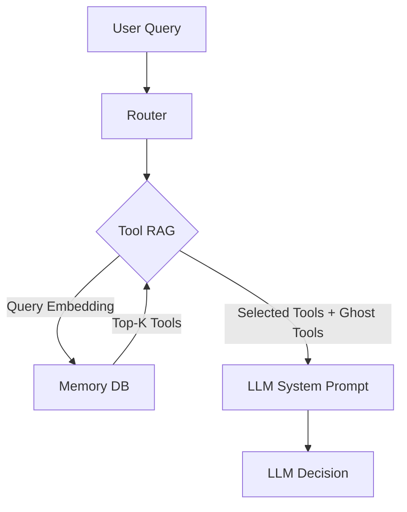

# Tool RAG Strategy (Dynamic Dispatch)

> **Status**: ✅ Implemented & Verified
> **Goal**: Reduce context window usage by dynamically retrieving only relevant tools for each user query.
> **Impact**: Enables scaling to 100+ tools while improving accuracy for local models (Ollama) and reducing costs for cloud models.

---

## 1. The Problem: Context Flooding

Previously, `ToolRegistry` loaded **ALL** enabled tools into the LLM's system prompt every time a user sent a message.

-   **Cloud Models (Claude/GPT-4)**: High cost, potential confusion with similar tools.
-   **Local Models (Ollama)**: **CRITICAL FAILURE POINT**. Small context windows (8k-32k) get filled with tool definitions, leaving no room for conversation history or reasoning.

**Solution**: Treat "Tools" like "Memories". Store them in a vector database and only retrieve the top 3-5 most relevant tools for the current query.

---

## 2. Architecture Overview

We leveraged the existing `MemoryDB` infrastructure to store tool definitions as vector embeddings.



---

## 3. Database Schema Integration

We extended `lib/memory_db.py` to support a specialized "Tool Knowledge" store.

### Table Schema (`tool_definitions`)

```sql
CREATE TABLE IF NOT EXISTS tool_definitions (
    name TEXT PRIMARY KEY,          -- e.g., "weather_check"
    description TEXT NOT NULL,      -- "Check current weather for a location..."
    schema_json TEXT NOT NULL,      -- Full JSON schema for the tool
    embedding BLOB,                 -- Vector embedding of name + description
    enabled BOOLEAN DEFAULT 1,
    updated_at TIMESTAMP DEFAULT CURRENT_TIMESTAMP
);
```

**Implementation Notes:**
-   Embeddings are stored as binary blobs (Pickled python lists for OpenAI, or JSON for others).
-   The system is robust enough to handle different serialization formats.

---

## 4. The "Just-in-Time" Registry

We modified `lib/tool_schema.py` to support retrieval.

### Workflow
1.  **User speaks**: "What is the price of Bitcoin?"
2.  **Router**: Calls `registry.find_tools("price of Bitcoin")`.
3.  **Vector Search**: DB finds `crypto_price` (high similarity).
4.  **Ghost Injection**: Registry adds critical "Ghost Tools" (Time, Memory, Logs).
5.  **LLM Prompt**: Receives `[crypto_price, get_time, search_memory, ...]`.

### The "Ghost Tool" Pattern
These tools are **ALWAYS** available, ensuring basic functionality never fails even if retrieval misses:
-   `search_memory` / `semantic_recall` (Memory access)
-   `remember` (Saving info)
-   `check_tool_logs` (Self-debugging)
-   `get_recent_conversations` (Context)
-   `get_time` (Basic utility)

---

## 5. Implementation Details

### A. Sync Script (`bin/sync_tools.py`)
**CRITICAL COMPONENT**: This script iterates through all local and MCP tools, generates embeddings, and saves them to the DB.

**Usage**:
```bash
# Must run in the environment where 'openai' package is installed!
source ~/jarvis-venv/bin/activate

# Sync Cloud Tools (OpenAI Embeddings - 1536 dim)
./bin/sync_tools.py cloud

# Sync Local Tools (Nomic Embeddings - 768 dim)
./bin/sync_tools.py local
```

### B. Router Logic (`orchestrator/router_v2.py`)
-   **Local Mode**: Retrieves top **5** tools (Strict context limit).
-   **Cloud Mode**: Retrieves top **15** tools (Broader context).
-   **Threshold selection**:
    - `TOOL_SIMILARITY_THRESHOLD` is the base cutoff.
    - `TOOL_SIMILARITY_THRESHOLD_FULL` is used only when Tool RAG embeds the full routing prompt (`tool_search_query == transcript`).
    - If `TOOL_SIMILARITY_THRESHOLD_FULL` is unset or blank, both paths use `TOOL_SIMILARITY_THRESHOLD`.

### C. Dual-threshold tuning

Long routing prompts can inflate similarity scores and cause Tool RAG to hit the retrieval cap with weak matches. To counter that, Jarvis supports an optional stricter cutoff for the full-prompt path.

```bash
# Base threshold used for stripped/short query retrieval
TOOL_SIMILARITY_THRESHOLD=0.23

# Optional stricter cutoff when the full routing string is embedded
TOOL_SIMILARITY_THRESHOLD_FULL=0.40
```

**Observed behavior (`2026-04-12`):**
-   **Cloud mode**: `TOOL_SIMILARITY_THRESHOLD_FULL=0.40` was a good starting point in realistic follow-up prompts. It often reduced a noisy 15-tool shortlist down to the one or two tools that actually mattered.
-   **Local / Gemma mode**: `0.35`-`0.45` often had little effect because local only retrieves 5 tools and long-prompt similarities skewed much higher. Local needed much higher values before behavior changed, and those changes were cliff-like.
-   **Practical read**: keep cloud and local tuning separate. A cloud-friendly full threshold does not automatically transfer to local.

### D. Debugging with real prompts

Use `bin/debug_tool_rag.py` to compare the plain user string against a real captured full prompt:

```bash
source /home/boss/jarvis-venv/bin/activate

./bin/debug_tool_rag.py cloud "and Boston too" \
  --full-transcript-file /tmp/captured_turn_input.txt \
  --stripped-threshold 0.23 \
  --full-threshold 0.40
```

This is the most reliable way to tune `TOOL_SIMILARITY_THRESHOLD_FULL`, because synthetic long prompts can be harsher than production.

---

## 6. Findings & troubleshooting

### Critical: Virtual Environment
We discovered that running `sync_tools.py` outside the virtual environment resulted in **0 embeddings** because the `openai` package wasn't found. The script would fail silently (printing a warning) and store the tool *without* an embedding.
**Fix**: Always ensure `openai` is installed and venv is active when syncing.

### Critical: Serialization
The database stores embeddings as BLOBs.
-   **OpenAI**: Often stores as Pickled Python lists.
-   **Other**: May store as JSON strings.
**Fix**: `memory_db.py` implements a robust double-try mechanism (Pickle first, then JSON) to decode the BLOBs correctly during search.

### Verification
To verify tools are indexed correctly:
```bash
# Check database count
sqlite3 data/jarvis_memory.db "SELECT count(*) FROM tool_definitions WHERE embedding IS NOT NULL;"
```

---

## 7. Maintenance

**When to run `sync_tools.py`?**
1.  **New Tool Added**: You create a new `my_tool.py` and `.json`.
2.  **Description Changed**: You update the description in a `.tool.json` (this changes the embedding).
3.  **MCP Config Changed**: You add/remove servers in `mcp-servers.json`.

**Naming Conventions**
-   Ensure tool descriptions are **rich** and **descriptive**.
-   BAD: "Search web"
-   GOOD: "Search the internet using Brave Search for real-time information, news, and facts not in memory."

---

## 8. Conclusion

This architecture decouples **Intelligence** (the LLM) from **Knowledge** (the Tools). It allows you to install 1000+ tools (n8n workflows, specialized scripts) without ever confusing the local model or overflowing the context window.
