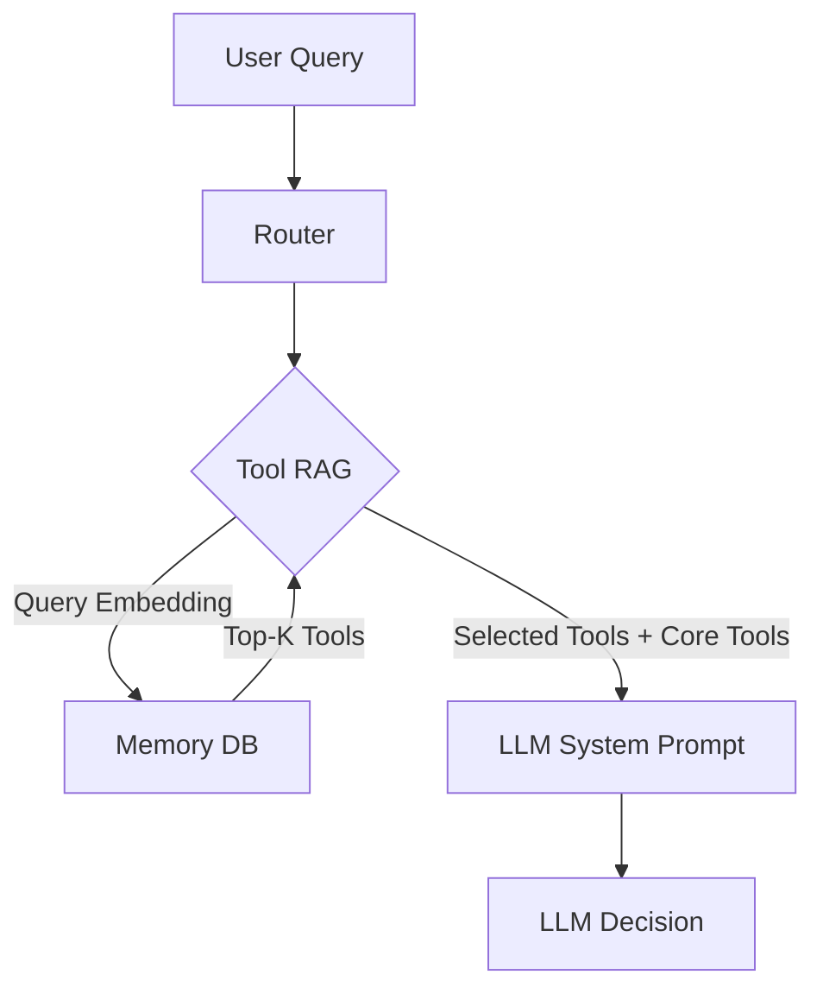

# Tool RAG Strategy (Dynamic Dispatch)

> **Status**: Technical Specification
> **Goal**: Reduce context window usage by dynamically retrieving only relevant tools for each user query.
> **Impact**: Enables scaling to 100+ tools while improving accuracy for local models (Ollama) and reducing costs for cloud models.

---

## 1. The Problem: Context Flooding

Currently, `ToolRegistry` loads **ALL** enabled tools into the LLM's system prompt every time a user sends a message.

-   **Cloud Models (Claude/GPT-4)**: High cost, potential confusion with similar tools.
-   **Local Models (Ollama)**: **CRITICAL FAILURE POINT**. Small context windows (8k-32k) get filled with tool definitions, leaving no room for conversation history or reasoning.

**Solution**: Treat "Tools" like "Memories". Store them in a vector database and only retrieve the top 3-5 most relevant tools for the current query.

---

## 2. Architecture Overview

We will leverage the existing `MemoryDB` infrastructure to store tool definitions as vector embeddings.



---

## 3. Database Schema Integration

We will extend `lib/memory_db.py` to support a specialized "Tool Knowledge" store. We can reuse the existing `knowledge_base` table by using a reserved category, or ideally, create a dedicated lightweight table for cleaner separation.

**Recommendation**: Use a dedicated `tool_definitions` table to avoid polluting user memories.

### New Table Schema (`lib/memory_db.py`)

```sql
CREATE TABLE IF NOT EXISTS tool_definitions (
    name TEXT PRIMARY KEY,          -- e.g., "weather_check"
    description TEXT NOT NULL,      -- "Check current weather for a location..."
    schema_json TEXT NOT NULL,      -- Full JSON schema for the tool
    embedding BLOB,                 -- Vector embedding of name + description
    enabled BOOLEAN DEFAULT 1,
    updated_at TIMESTAMP DEFAULT CURRENT_TIMESTAMP
);
```

### Why specific table?
-   **Performance**: Separate from thousands of user memories.
-   **Management**: Easy to `TRUNCATE` and rebuild when tools change.
-   **Versioning**: Tools update frequently; memories don't.

---

## 4. The "Just-in-Time" Registry

We need to modify `lib/tool_schema.py` to support retrieval.

### Current Flow
```python
# orchestrator/router_v2.py
tools = registry.to_openai_format() # Returns ALL tools
```

### New Flow
```python
# orchestrator/router_v2.py
relevant_tools = registry.find_tools(user_query, limit=5) 
# Returns Core Tools + Top 5 Relevant Tools
```

### Implementation Details (`lib/tool_schema.py`)

1.  **`sync_to_db()`**: A method to scan `skills/` and populate the `tool_definitions` table with embeddings.
    -   Run this on startup or via a management script (`bin/sync_tools.py`).
    -   Computes embedding for: `f"{tool_name}: {tool_description}"`.

2.  **`find_tools(query)`**:
    -   Embeds the user query.
    -   Performs vector search on `tool_definitions`.
    -   **Critical**: ALWAYS include "Core Tools" (Ghost Pattern).

### The "Ghost Tool" Pattern
Some tools must **ALWAYS** be available, regardless of the query:
-   `search_memory` / `semantic_recall` (Memory access)
-   `remember` (Saving info)
-   `speak` (If used as a tool)
-   `ask_user` (Clarification)

**Resulting Tool Set**: `[Core Tools] + [Top-K Retrieved Tools]`

---

## 5. System Prompt & Routing Logic

### Cloud vs. Local Optimization

| Feature | Cloud Mode (Anthropic/OpenAI) | Local Mode (Ollama) |
| :--- | :--- | :--- |
| **Retrieval Limit** | Top 10-15 tools | **Top 3-5 tools** |
| **Context** | 200k tokens (Loose) | 8k-32k tokens (Strict) |
| **Selection** | Can handle "maybe relevant" tools | Needs "highly relevant" only |

### Router Logic (`orchestrator/router_v2.py`)

```python
def route(self, transcript):
    # 1. Retrieve relevant tools
    limit = 5 if self.mode == 'local' else 15
    tools = self.registry.find_tools(transcript, limit=limit)
    
    # 2. Construct System Prompt
    # Tell LLM it has access to a *subset* of tools
    system_prompt = f"""
    You are Jarvis. You have access to the following tools:
    {tools_list}
    
    Note: If you need a tool that isn't listed, ask the user to clarify 
    so we can load the correct capabilities.
    """
    
    # 3. Call LLM
    ...
```

---

## 6. Implementation Roadmap

### Phase 1: Infrastructure (The "Plumbing")
1.  **Update `MemoryDB`**: Add `tool_definitions` table and methods (`upsert_tool`, `search_tools`).
2.  **Create `bin/sync_tools.py`**: Script to iterate `ToolRegistry` and populate the DB.
    -   Needs to handle `mcp_` tools dynamically!

### Phase 2: Registry Logic (The "Brain")
3.  **Update `ToolRegistry`**:
    -   Add connection to `MemoryDB`.
    -   Implement `find_tools(query)`.
    -   Define `CORE_TOOLS` constant list.

### Phase 3: Router Integration (The "Switch")
4.  **Update `LLMRouter`**:
    -   Switch from `to_openai_format()` to `find_tools()`.
    -   Add logging to see *which* tools were retrieved (crucial for debugging).

### Phase 4: Handling "Misses" (The "Safety Net")
5.  **Fallback Mechanism**:
    -   If LLM says "I don't have a tool for that", trigger a **Re-Rank**.
    -   Or, if `confidence` is low, load a broader set of tools for a second attempt.

---

## 7. Special Considerations for Your Setup

### MCP Tools
MCP tools are dynamic. They must be synced to the DB effectively.
-   **Strategy**: On startup, after MCP discovery, run `sync_to_db()` to ensure new MCP tools are vector-indexed.

### Naming Conventions
-   Ensure tool descriptions are **rich** and **descriptive**.
-   BAD: "Search web"
-   GOOD: "Search the internet using Brave Search for real-time information, news, and facts not in memory."

---

## 8. Conclusion

This architecture decouples **Intelligence** (the LLM) from **Knowledge** (the Tools). It allows you to install 1000+ tools (n8n workflows, specialized scripts) without ever confusing the local model or overflowing the context window.

