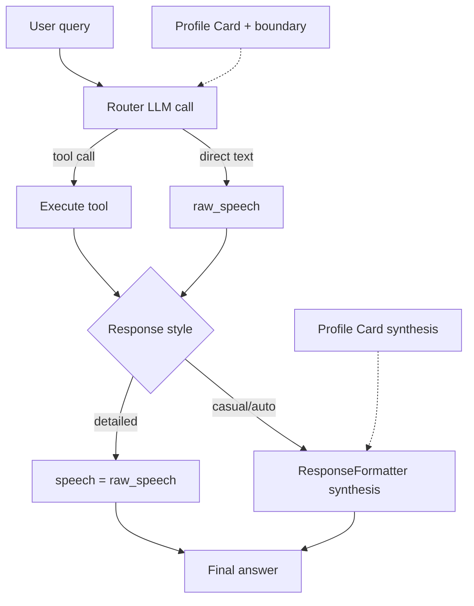

# User Profile System

Last updated: 2026-05-21

## Overview

Jarvis uses a **tiered profile model** — not one blob, not LLM-maintained markdown, not parallel DB trait sliders.

The live contract is the **Profile Card** at the top of `jarvis-intel/user-profile.md`. Code reads it directly and injects it at **user-facing answer boundaries**:

- **Router** — direct-text answers plus lightweight tool-behavior nudges from profile constraints
- **ResponseFormatter** — synthesis passes (casual/auto condensation, multi-turn summaries, duplicate-prevented synthesis)

Router injection does not affect Tool RAG retrieval. It can still nudge the routing LLM through normal system prompting when profile constraints are relevant, such as research-first repo changes or asking before destructive actions.

The `user_model` table stores a **cache** of the compiled card (`profile_card_cache`: text + source hash + `last_reconciled_at`), not `verbosity` / `technical_depth` scalars.

---


---

## Conflict resolution (Tier 0 → 3)

When guidance conflicts, **higher tier wins**:

| Tier | Source | Examples | Wins over |
|------|--------|----------|-----------|
| **0 — Runtime session** | env / web UI | `LLM_PROVIDER`, cloud vs local, `JARVIS_RESPONSE_STYLE`, model prompt overrides | Everything below |
| **1 — Explicit pinned prefs** | `remember` + auto-memory always-include | "call me sir", addressing, discrete prefs | Profile card, semantic memory |
| **2 — Profile Card** | `user-profile.md` → `## Profile Card` | execution style, constraints, output contract | Learned lessons, semantic recall |
| **3 — On-demand depth** | semantic / tools | full `user-profile.md` reference, `network.md`, `jarvis-learned-lessons.md`, `jarvis-tool-knowledge.md` | — |

**Rules:**
- Profile Card must **not** hardcode "use xAI" or "use Ollama" — say *use configured provider*.
- Provider/tool quirks belong in **`jarvis-tool-knowledge.md`**, not Profile Card.
- Operational discoveries belong in **`jarvis-learned-lessons.md`** (Jarvis append / code-triggered), not silent Profile Card edits.

---

## Profile Card (Tier 2)

### What it is (and isn't)

The Profile Card is **not** a duplicate system prompt. Router instructions already cover tools, response style, OpenCode scope, and provider behavior.

It is **not** a memory file. Discrete facts ("French bulldog named Jessi", "call me sir", webhook URLs) belong in **`remember`** — Tier 1 pinned prefs auto-inject; other facts surface via semantic auto-memory when relevant.

The Profile Card is a **short, human-edited lens**: who you are to Jarvis, how to interpret you, and cross-cutting habits that should shape **every** answer without re-stating tool mechanics.

| Layer | Example content |
|-------|-----------------|
| **System prompt** | Tool calling, JARVIS_RESPONSE_STYLE, native search, completion guard hints |
| **Profile Card (Tier 2)** | "Advanced engineer; homelab context; self-hosted bias; direct communication" |
| **remember (Tier 1)** | "Call me sir", addressing, explicit one-line prefs |
| **remember + semantic (Tier 3-ish)** | Jessi, favorite color, project-specific facts — when query matches |
| **Profile Reference / intel** | GPU lists, network tables, long philosophy — on-demand only |

### Location

`jarvis-intel/user-profile.md` → section `## Profile Card` (~15 lines)

**Fresh install:** file is gitignored. Copy the tracked starter and edit:

```bash
cp jarvis-intel/user-profile.md.example jarvis-intel/user-profile.md
```

No file → no error; injection is skipped until you create it. The `.example` template is not ingested (`ingest_intel` only picks up `*.md` and `*.txt`).

Everything under `## Profile Reference` is **Tier 3** (on-demand via search/intel read).

### Injection

- Enabled: `USER_PROFILE_CARD_ENABLED=true` (default)
- Loaded by: `lib/user_profile.py` → cached in `user_model.profile_card_cache`
- Applied in:
  - `orchestrator/router_v2.py` → router system prompt (direct answers + tool-behavior nudging)
  - `orchestrator/response_formatter.py` → synthesis passes (condensation, multi-turn summaries)
- **Not** applied to `@TOOL_CONFIG` direct-speech bypass (tool output used verbatim)

### Tool RAG vs system prompt

Tool RAG embedding search uses the **user transcript** (`build_tool_retrieval_signals(transcript)`), not the router system prompt. Profile Card lives only in the system prompt, so it **does not change** tool similarity scoring or top-K retrieval.

It can still nudge the routing LLM on tool choice and arguments via normal system prompting — e.g. "research before repo changes" or "ask before destructive actions". That is intentional Tier 2 behavior, not a retrieval leak.

Hard isolation (separate final-answer LLM call with zero profile on tool turns) is possible but adds latency/cost; current design accepts prompt-level influence on the same router call.

### Updates (human-in-the-loop)

| Who | How |
|-----|-----|
| **You** | Edit `## Profile Card` → ingest intel |
| **You** | "update my profile with X" → `manage_intel` on `user-profile.md` |
| **Jarvis** | Append **`jarvis-learned-lessons.md`** only (apply-mode corrections, tool discoveries) |
| **Jarvis** | Suggest profile edits — **never** auto-edit Profile Card |

---

## Explicit prefs (Tier 1)

Unchanged from before:

- `remember` / `forget` for discrete preferences
- Auto-memory always-include for addressing/tone keys (`AUTO_MEMORY_ALWAYS_INCLUDE_LIMIT`)

Do not duplicate Profile Card content in profile memories unless it is a short-lived override.

---

## Correction learning → lessons (not profile)

When `USER_CORRECTION_LEARNING_MODE=apply`:

- Previous experience downgraded via `update_experience_from_user_correction()`
- If `USER_CORRECTION_APPEND_LESSONS=true`, code appends to `jarvis-learned-lessons.md` and ingests

Shadow mode records candidates only — no lesson append, no experience downgrade.

---

## Monthly reconcile (human review)

```bash
./bin/reconcile-profile
```

Prints:

- Current Profile Card
- Recent learned-lessons tail
- High-importance profile/preference memories

**No auto-write.** You merge what belongs in Profile Card vs tool-knowledge vs memories.

---

## Config

```bash
USER_PROFILE_CARD_ENABLED=true
USER_CORRECTION_LEARNING_MODE=shadow   # or apply
USER_CORRECTION_APPEND_LESSONS=false   # opt in only to tracked system-wide lesson append
```

---

## What we deliberately do NOT do

- LLM-maintained `user-profile.md` without explicit request
- Parallel `user_model` scalar traits duplicating `JARVIS_RESPONSE_STYLE`
- Always injecting the full 160-line profile (reference stays Tier 3)
- Provider-specific stack in Profile Card (runtime + tool-knowledge instead)

---

## Related docs

- [JARVIS_INTEL_SYSTEM.md](JARVIS_INTEL_SYSTEM.md)
- [AUTO_MEMORY_INJECTION_FEATURE.md](AUTO_MEMORY_INJECTION_FEATURE.md)
- [FUTURE_ENHANCEMENTS.md](FUTURE_ENHANCEMENTS.md) — Phase 2 strategic direction
