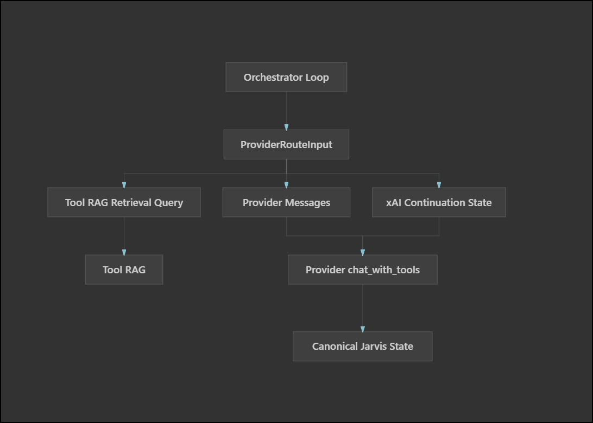

# xAI (Grok) Provider - The Best Cloud Option for Jarvis

> **TL;DR**: xAI Grok offers strong agentic tool calling. **`grok-4.5`** is the recommended default (500K context, vision, function calling, configurable reasoning effort). **`grok-4.3`** remains available when you need the `none` reasoning-effort value, and **`grok-build-0.1`** is available for coding-heavy workloads (256K context). See [Available Models](#available-models) and `lib/model_catalog.py` for the full curated list.

---




## Table of Contents

1. [Why xAI Grok?](#why-xai-grok)
2. [Pricing Comparison](#pricing-comparison)
3. [Key Features](#key-features)
4. [xAI Text-to-Speech](#xai-text-to-speech)
5. [Configuration](#configuration)
6. [Available Models](#available-models)
7. [Automatic Caching](#automatic-caching)
8. [Reasoning Mode](#reasoning-mode)
9. [Performance Characteristics](#performance-characteristics)
10. [Cost Examples](#cost-examples)
11. [Migration Guide](#migration-guide)
12. [Change Log / Handoff](#change-log--handoff)

---

## Why xAI Grok?

xAI's Grok models offer the **best value proposition** for Jarvis:

| Feature | xAI Grok | Anthropic Claude | OpenAI GPT |
|---------|----------|------------------|------------|
| **Context Window** | **256K-1M tokens** | 200K-1M tokens | 128K-1M+ tokens |
| **Input Cost** | **$1.00-$2.00/1M** | $3.00/1M | varies by model |
| **Output Cost** | **$2.50-$6.00/1M** | $15.00/1M | varies by model |
| **Caching** | **Cached input from $0.20/1M** | 90% discount | model-dependent |
| **Reasoning Mode** | ✅ Configurable on Grok 4.5 and Grok 4.3 | ✅ $3/$15 | model-dependent |
| **Function Calling** | ✅ Native | ✅ Native | ✅ Native |
| **Typical Query Cost** | Competitive | Medium | varies |

**Bottom Line**: xAI provides large-context Grok models, native tools, and competitive cached-input pricing for Jarvis's tool-heavy workload.

---

## Pricing Comparison

### Per 1M Tokens (USD)

```
┌─────────────────────────────────────────────────────────────────┐
│ MODEL                              INPUT    OUTPUT   CONTEXT    │
├─────────────────────────────────────────────────────────────────┤
│ xAI grok-4.5                       $2.00    $6.00    500K  🏆  │
│ xAI grok-4.3                       $1.25    $2.50    1M        │
│ xAI grok-build-0.1                 $1.00    $2.00    256K       │
│ xAI grok-4.20 non-reasoning        $1.25    $2.50    1M        │
│ xAI grok-4.20 reasoning            $1.25    $2.50    1M        │
│                                                                 │
│ Anthropic Claude Sonnet 4.5        $3.00    $15.00   1M        │
│ OpenAI GPT-5.1                     $1.25    $10.00   128K      │
│ OpenAI GPT-4o                      $3.00    $12.00   128K      │
└─────────────────────────────────────────────────────────────────┘
```

### Real-World Cost Example

**Query**: "What time is it?" (typical Jarvis request with full tool context)
- **Input**: ~26,000 tokens (system prompt + tools + query)
- **Output**: ~30 tokens (response)

| Provider | Cost per Query | Monthly Cost (1000 queries) |
|----------|---------------|----------------------------|
| **xAI Grok-4.3** | **$0.0325** | **$32.50** |
| Anthropic Claude | $0.0646 | $64.60 |
| OpenAI GPT-5.1 | $0.0308 | $30.80 |

**Savings**: Grok 4.3 is roughly half the uncached input/output cost of Claude in this example; actual Jarvis cost depends heavily on prompt-cache hits, server-side tool calls, and reasoning tokens.

---

## Key Features

### 1. **Large Context Windows (up to 1M)**

- Handle large tool catalogs and retrieved context
- Include entire conversation history
- Pass large documents without chunking
- Perfect for Jarvis's 24+ tools with detailed descriptions

**Example**: Jarvis system prompt + 24 tools = ~25K tokens. With 1M+ context, you can include:
- Full tool context: 25K tokens
- Recent conversations: 10K tokens
- Long documents: 100K+ tokens
- Still have substantial headroom for multi-step work

### 2. **Automatic Prompt Caching (75–84% Discount)**

Unlike Anthropic (requires explicit `cache_control`), xAI caching is **automatic**:

- Caches repeated prompt prefixes automatically
- Jarvis keeps cache-affinity enabled by default with `XAI_PROMPT_CACHE_ENABLED=true`
- Cache hits can be **75–84%** for Jarvis (repeated system prompt + tools), depending on model
- Cached input pricing from `lib/model_catalog.py`: grok-4.5 **$0.50/1M** (75% off $2.00), grok-4.3 and grok-build-0.1 **$0.20/1M** (80–84% off $1.00–$1.25)

**Jarvis Benefit** (example with grok-4.3: $1.25/1M input, $0.20/1M cached):
- First request: 26K tokens × $1.25/1M ≈ **$0.033**
- Subsequent requests: 25K cached + 1K new ≈ **$0.006**
- **~81% cost reduction** after the first query

### 3. **Configurable Reasoning Effort**

- Reasoning model: `grok-4.3`
- `XAI_REASONING_EFFORT=low|medium|high` controls latency/reasoning depth
- Better decision-making for complex tasks
- Reasoning is integrated into response (not exposed separately like Claude)

**Comparison**:
- xAI: Grok 4.3 exposes `reasoning_effort` and bills reasoning tokens as part of usage
- Claude: Thinking mode can expose thinking blocks through a separate field
- OpenAI: Reasoning effort is model/API dependent

### 4. **Native Function Calling**

- OpenAI-compatible tool format
- Supports multiple tool calls in sequence
- Structured outputs
- Works perfectly with Jarvis's tool registry

### 5. **Built-in Server-Side Tools (Agent Tools API)**

Enable Grok's native tools via `XAI_SEARCH=true`:

```bash
# In config/cloud.env
XAI_SEARCH=true   # Enable live search (default: true)
```

**How It Works** (Updated May 2026):
- Uses xAI's **Agent Tools API** with server-side tools
- Model autonomously decides when to use each tool
- Server-side tools execute automatically on xAI servers (no round-trip!)
- Client-side tool results can stay on the xAI SDK path via `tool_result(...)`
- Returns synthesized answers with citations from web + X posts
- **Hybrid approach**: Combines with your custom client-side tools seamlessly
- OpenAI-compatible SDK fallback remains as a reliability escape hatch for xAI SDK/gRPC failures

**Server-Side Tools Available**:
| Tool | Description | Features |
|------|-------------|----------|
| `web_search` | Real-time web search + browsing | Image understanding via native `view_image` |
| `x_search` | X/Twitter search (keyword, semantic, user) | Image + video understanding |
| `code_execution` | Python REPL for math, data analysis, plotting | numpy, pandas, sympy, matplotlib |

**Architecture**:
```
┌─────────────────────────────────────────────────────────────┐
│                   xAI Agent Tools API                        │
├─────────────────────────────────────────────────────────────┤
│  Server-Side Tools (executed by xAI automatically):         │
│    • web_search - Web search with native view_image support │
│    • x_search - X search with image/video understanding     │
│    • code_execution - Python REPL for math/analysis         │
│                                                             │
│  Client-Side Tools (your custom tools):                     │
│    • crypto_price, weather, spotify, etc.                   │
│    • Returned as tool_calls for Jarvis to execute           │
└─────────────────────────────────────────────────────────────┘
```

**Benefits**:
- Real-time web and X post data with citations
- Model decides: use search OR your tools (not both unless needed)
- No external Brave Search tool calls for current events
- Cleaner context (search handled server-side)
- Works transparently alongside all existing Jarvis tools

**Image Understanding Note**:
- `XAI_IMAGE_UNDERSTANDING=true` enables xAI's native `view_image` server-side tool during web/X search.
- When xAI uses it, Jarvis will pass through `SERVER_SIDE_TOOL_VIEW_IMAGE` in `server_side_tools`.
- Per xAI docs, enabling image understanding for `web_search` also enables it for `x_search` when both tools are included.

**Example**:
```
Query: "What are people saying on X about Grok 4?"

Response includes:
  • Synthesized answer from X posts
  • Citations: https://x.com/i/status/...
  • No external tool calls!

Query: "What's the current Bitcoin price?"

Response uses:
  • crypto_price tool (more accurate for prices)
  • Model decides best tool for the job
```

**Requirements**:
- xai-sdk >= 1.6.1 (video generation requires 1.6.0+)
- Supports current Grok text models such as `grok-4.3` and `grok-4.20-*`

**Cost**: Standard token pricing + search tool invocations (see xAI pricing)

### 6. **Image Generation**

- see [tools/video/README.md](tools/video/README.md)

### 7. **Video Generation** ✅ NEW

Generate AI videos using **Grok Imagine Video**:

```bash
# Via Jarvis
jarvis cloud "Generate a video of a cat playing with a ball"

# Via API
curl -X POST http://localhost:8880/api/generated-videos/generate \
  -H "Content-Type: application/json" \
  -d '{"prompt": "A cat playing with a ball", "duration": 5}'
```

**Configuration** (config/cloud.env):
```bash
VIDEO_TOOL_PROVIDER="xai"
# Optional pin; leave unset to follow the xAI video default in lib/model_catalog.py.
# XAI_VIDEO_MODEL="grok-imagine-video"
```

**xAI Grok Video Parameters**:

| Parameter | Options | Default | Description |
|-----------|---------|---------|-------------|
| `duration` | 1-15 seconds | 5 | Video length (continuous range) |
| `aspect_ratio` | `16:9`, `4:3`, `1:1`, `9:16`, `3:4`, `3:2`, `2:3` | `16:9` | Video shape (7 options) |
| `resolution` | `720p`, `480p` | `720p` | Video quality |
| `image_url` | URL | - | Generate from image (image-to-video) |
| `video_url` | URL | - | Edit existing video (≤8.7s source) |

**Generation Modes**:
1. **Text-to-Video**: Generate from text prompt
2. **Image-to-Video**: Animate an existing image
3. **Video Edit**: Modify an existing video (xAI only)

**xAI Grok Strengths**:
- Flexible duration: 1-15 seconds (any value)
- 7 aspect ratio options
- Video editing capability

**Generation Time**: 30-120+ seconds depending on duration

**File Size**: ~3-5 MB per 5 seconds (720p)

**Requirements**: xai-sdk >= 1.6.1 (video support added in 1.6.0)

**Alternative**: Gemini Veo 3.1 is also supported with native audio, higher resolution (up to 4k), but limited duration (4/6/8s). See [Video Generation Docs](tools/video/README.md) for comparison.

**Storage**: Videos saved to `data/generated_videos/` and indexed in stash.

See [Video Generation Docs](tools/video/README.md) for full details.

---

## xAI Text-to-Speech

Jarvis can use xAI's native TTS endpoint independently from the chat model provider:

```bash
TTS_PROVIDER=xai
XAI_TTS_VOICE="rex"
XAI_TTS_LANGUAGE="en"
XAI_TTS_CODEC="mp3"
XAI_TTS_SAMPLE_RATE="24000"
XAI_TTS_BIT_RATE="128000"
XAI_TTS_MAX_CHARS="5000"
XAI_TTS_TIMEOUT="180"
```

This uses `XAI_API_KEY` and calls xAI's native `/v1/tts` endpoint. It does not reuse OpenAI TTS settings or `TTS_INSTRUCTIONS`.

### Expressive Speech Tags

xAI TTS supports inline and wrapping tags for delivery control. Jarvis can expose that ability to the final speech formatter:

```bash
XAI_TTS_STYLE_TAGS_ENABLED=true
```

When `TTS_PROVIDER=xai` and `XAI_TTS_STYLE_TAGS_ENABLED=true`, Jarvis tells the final response path that it may use a few supported tags sparingly in final speech, such as:

```text
Really? [laugh] That's incredible!
<whisper>It is a secret.</whisper>
<slow><soft>Goodnight, sleep well.</soft></slow>
```

Jarvis keeps this scoped carefully:

- Tags are allowed only for final spoken answers, not tool arguments, URLs, code, filenames, IDs, prices, or structured factual data.
- Web UI display text strips TTS-only tags so chat stays readable.
- Stored message data keeps separate fields: clean visible `content`, tagged `speech`, and generated `audio_url` when Web UI TTS succeeds.
- TTS normalization preserves supported xAI tags for speech and strips unsupported tags for other providers.

### Status Updates

Cloud status updates also play through xAI TTS when `TTS_PROVIDER=xai`; this includes the lightweight `bin/say-status.sh` path used during longer tasks.

Status generation is deadline-bound and does not delay tool execution. Native
and Web status audio are cached separately from final-response TTS, and final
audio always has playback priority. See [`STATUS_UPDATES.md`](STATUS_UPDATES.md).

The status LLM does not currently receive the expressive speech-tag prompt. It still generates very short plain phrases, which keeps progress updates predictable and avoids cached status audio changing style unexpectedly. If status tags become useful later, add a separate toggle such as `XAI_STATUS_TTS_STYLE_TAGS_ENABLED` instead of reusing the final-answer setting.

## Configuration

### Setup (config/cloud.env)

```bash
# Use xAI as primary provider
LLM_PROVIDER="xai"

# auto prefers a nonblank API key, then falls back to a current Grok CLI login
XAI_AUTH_MODE="auto"  # auto | api_key | oauth

# xAI API Key (get from https://console.x.ai). Optional for OAuth chat.
XAI_API_KEY="xai-..."

# Model Selection
# Recommended for reasoning / agentic tool workloads
XAI_MODEL="grok-4.5"

# Subscription/OAuth chat model used when XAI_AUTH_MODE resolves to oauth.
# OAuth models are discovered from `grok models`; API-key mode uses XAI_MODEL.
XAI_OAUTH_MODEL="grok-4.5"
# Optional reviewed opt-ins for newly advertised non-Composer chat models:
# XAI_OAUTH_ALLOWED_MODELS="grok-4.5,grok-build,grok-new-chat-model"

# Optional xAI reasoning effort for models that support it.
# grok-4.5 accepts low/medium/high and defaults to high when unset.
# grok-4.3 also accepts none. Low is best when latency matters.
XAI_REASONING_EFFORT=low

# Prompt-cache affinity. xAI cache entries are stored per server, so Jarvis
# routes repeated Grok requests to the same server by default.
XAI_PROMPT_CACHE_ENABLED=true
# Optional explicit routing key; otherwise Jarvis derives a stable hashed key.
# XAI_PROMPT_CACHE_KEY=jarvis-main
# XAI_PROMPT_CACHE_NAMESPACE=jarvis-voice

# Native Web Search (NEW!)
# When true: Grok searches web + X posts internally (no external tool calls)
# When false: Uses external tools (Brave Search) like before
XAI_SEARCH=true

# Native search / server-side tool budget (optional)
# Leave unset to use xAI's default behavior. Set when you need a hard
# cost/latency ceiling for tool-heavy tasks.
# XAI_SERVER_SIDE_MAX_TOOL_TURNS=5
# XAI_SERVER_SIDE_MAX_SEARCHES_PER_REQUEST=10

# Optional xAI SDK continuation knobs
# Store response state server-side for SDK previous_response_id workflows.
# XAI_STORE_MESSAGES=false
# Experimental native Jarvis tool continuation. Off by default; requires
# XAI_STORE_MESSAGES=true, XAI_SEARCH=true, and a working xai-sdk client.
# XAI_NATIVE_CONTINUATION=false
# XAI_CONTINUATION_CONTEXT_MODE=structural
# XAI_CONTINUATION_RESULT_MAX_CHARS=6000
# XAI_CONTINUATION_DELTA_MESSAGE=false
# XAI_PREVIOUS_RESPONSE_MAX_AGE_DAYS=25
# Include encrypted reasoning state for zero-data-retention continuation workflows.
# XAI_USE_ENCRYPTED_CONTENT=false
# Jarvis currently executes one client-side tool call at a time; override only
# if the orchestrator also learns to execute multiple returned tool calls.
# XAI_PARALLEL_TOOL_CALLS=false

# Optional native xAI TTS
TTS_PROVIDER=xai
XAI_TTS_VOICE="rex"
XAI_TTS_MAX_CHARS="5000"
XAI_TTS_TIMEOUT="180"
XAI_TTS_STYLE_TAGS_ENABLED=true

# Alternative models:
# XAI_MODEL="grok-4.3"                      # 1M context or reasoning_effort=none
# XAI_MODEL="grok-build-0.1"                  # Coding / build-heavy workloads (256K)
# XAI_MODEL="grok-4.20-0309-non-reasoning"  # Lower-latency non-reasoning
# XAI_MODEL="grok-4.20-0309-reasoning"      # Automatic reasoning, no effort knob
```

### Grok CLI OAuth subscription

Jarvis can use the OAuth session created by the official Grok CLI for primary
text chat, Jarvis tool calling, verified `grok-4.5` uploaded-image vision,
status summaries, and completion-guard LLM evaluation. The CLI's own README
documents direct access through
`https://cli-chat-proxy.grok.com/v1/chat/completions`; Jarvis reads the cached
bearer session from `~/.grok/auth.json`, requires owner-only file permissions,
and never logs or returns the token.

```bash
grok login

# config/cloud.env
LLM_PROVIDER="xai"
XAI_AUTH_MODE="oauth"     # explicit, or use auto with a blank XAI_API_KEY
XAI_OAUTH_MODEL="grok-4.5"
XAI_API_KEY=""
```

`XAI_AUTH_MODE=auto` makes switching reversible: a nonblank `XAI_API_KEY` uses
the normal xAI API, while a blank value uses the Grok CLI OAuth session. The
explicit `oauth` mode wins even when a key is present; the System tab reports
that the key is being ignored for chat (media/TTS may still use it). The
Web UI model dropdown discovers OAuth models from `grok models` after removing
`XAI_API_KEY` from the CLI environment, so OAuth discovery is not confused with
API-key availability. Jarvis filters out Composer because Composer is a coding
agent that emits its own filesystem tools, not a drop-in chat-completions model.
The reviewed OAuth chat models are `grok-4.5` and `grok-build` when your Grok
CLI account advertises them. API-key mode uses the full curated xAI API catalog
from `lib/model_catalog.py`.

OAuth and API-key auth are separate xAI products for Jarvis purposes:

| Path | Auth method | Billing / tracking | What `console.x.ai` sees |
|------|-------------|--------------------|---------------------------|
| Grok CLI / Grok subscription | Browser/device OAuth login stored in `~/.grok/auth.json` | Covered by the user's X Premium+ / SuperGrok-style subscription; enforced by xAI's subscription and abuse systems | Nothing; this path does not appear in the developer console |
| xAI Developer API | `XAI_API_KEY` bearer token for `api.x.ai` | Pay-per-token developer API billing | Full API-key usage, billing, and audit/log visibility |

`https://console.x.ai/` is the developer platform console for public API-key
traffic. Grok CLI OAuth requests go through the subscription chat proxy instead,
so they do not show up as API usage or per-request logs in that console. The
interactive `grok` CLI may expose high-level subscription quota information with
its `/usage` slash command, but that is not equivalent to API-key billing logs
or a detailed request audit trail.

Jarvis intentionally keeps the OAuth allowlist separate from the xAI API-key
catalog. If xAI later advertises another non-Composer chat model through
`grok models`, add it to `XAI_OAUTH_ALLOWED_MODELS` and select it with
`XAI_OAUTH_MODEL`. Composer remains blocked even if listed because its
autonomous filesystem tools do not match Jarvis's provider contract.

The OAuth boundary is intentionally narrow:

- Supported: primary text chat, native Jarvis function calls, exact token usage,
  `grok-4.5` uploaded-image vision through the chat proxy, status LLM, and
  completion-guard/evaluator calls.
- API-key-only: xAI Agent Tools search (`XAI_SEARCH`), image/video generation,
  video understanding through xAI native tools, and xAI TTS.
- Model labels are transport-scoped: Jarvis marks OAuth `grok-4.5` as vision
  capable because the chat-proxy image path has been verified, but it does not
  automatically promote older or operator-added OAuth model IDs.
- Subscription quota is limited to the high-level `/usage` data exposed by the
  Grok CLI; it is not equivalent to API-key billing logs.

If the cached access token expires, Jarvis delegates refresh to the installed
Grok CLI. If the login itself is no longer renewable, run `grok login` again.
`GROK_CLI_PATH` and `XAI_OAUTH_AUTH_FILE` are optional overrides for nonstandard
installations.

`XAI_SERVER_SIDE_MAX_TOOL_TURNS` caps xAI's internal server-side agent loop for a single `chat.sample()` call and is also used as Jarvis's total native-search budget for the user request unless `XAI_SERVER_SIDE_MAX_SEARCHES_PER_REQUEST` is set. This prevents native web/X search calls from multiplying across many Jarvis router turns while still allowing xAI to spend the budget adaptively on the synthesis turn that needs it.

The provider supports OpenAI-style `assistant.tool_calls` plus `role="tool"` messages on the xAI SDK path. When `XAI_STORE_MESSAGES=true`, `XAI_NATIVE_CONTINUATION=true`, `XAI_SEARCH=true`, and the xAI SDK client initializes successfully, Jarvis can pass the successful Jarvis tool result back as a structural `tool_result(...)` linked to xAI's preserved `tool_call_id` and `previous_response_id`. Current scope is in-flight Jarvis tool orchestration inside one user request. Saved web-conversation follow-ups still use Jarvis' local recent-context and follow-up extraction path, not a persisted xAI `previous_response_id`.

### Testing

```bash
# Simple test
./orchestrator/orchestrator_v2.py cloud "What time is it?"

# With thinking mode (note: xAI doesn't expose reasoning separately)
./orchestrator/orchestrator_v2.py cloud "Complex query" --debug-thinking

# Voice mode
./jarvis  # Uses cloud.env settings
```

---

## Available Models

### Current xAI Text Models

| Model | Context | Use Case | Reasoning |
|-------|---------|----------|-----------|
| `grok-4.5` | 500K | **Default — agentic reasoning/tool use** | ✅ Yes, configurable `low`/`medium`/`high` |
| `grok-4.3` | 1M | Workloads that need `none` or 1M context | ✅ Yes, configurable `none`/`low`/`medium`/`high` |
| `grok-build-0.1` | 256K | **Coding / build-heavy workloads** | ❌ No (`XAI_REASONING_EFFORT` not sent) |
| `grok-4.20-0309-non-reasoning` | 1M | Lower-latency non-reasoning; prior `*-latest` ID remains an alias | ❌ No |
| `grok-4.20-0309-reasoning` | 1M | Automatic reasoning; prior non-dated ID remains an alias | ✅ Yes, automatic |

**Recommendation**: Use **`grok-4.5`** with `XAI_REASONING_EFFORT=low` for most Jarvis tool-routing. Use **`grok-4.3`** when you need the `none` effort value or 1M context. Use **`grok-build-0.1`** when you want a coding-tuned Grok model at lower per-token cost. Use **`grok-4.20-0309-non-reasoning`** when you want the lower-latency non-reasoning path.

Curated models, pricing, and Web UI labels come from **`lib/model_catalog.py`**. Your active `XAI_MODEL` in `config/cloud.env` can differ from the example default — pick any supported Grok ID.

---

## Automatic Caching

### How It Works

xAI automatically caches **repeated prompt prefixes**:

1. **First Request**: Full cost (grok-4.3: $1.25/1M input)
   ```
   System prompt (10K tokens) + Tools (15K tokens) + Query (1K tokens) = 26K tokens
   Cost: 26K × $1.25/1M = $0.0325
   ```

2. **Second Request** (same system + tools):
   ```
   Cached: System + Tools (25K tokens) @ $0.20/1M
   New: Query (1K tokens) @ $1.25/1M
   Cost: (25K × $0.20/1M) + (1K × $1.25/1M) = $0.0050 + $0.00125 = $0.00625
   ```

**Savings**: **~81% cost reduction** on subsequent requests (varies by model; see `lib/model_catalog.py`).

Jarvis keeps the large router instructions at the front of the system prompt,
then appends per-turn runtime context such as current date/time, response
style, default location, and native-search capability notes. This ordering is
intentional: dynamic text near the top weakens prefix cache reuse.

### Cache Affinity

xAI cache entries are stored per server. Jarvis now sends a stable cache-affinity key so repeated requests are routed to the same server:

- Chat Completions path (`XAI_SEARCH=false` or SDK fallback): sends `x-grok-conv-id` as an HTTP header via OpenAI SDK `extra_headers`.
- xAI SDK / gRPC path (`XAI_SEARCH=true`): passes `x-grok-conv-id` through `xai_sdk.Client(..., metadata=...)`.
- Responses API: Jarvis does not currently use xAI `/v1/responses`; if that adapter is added later, it should send the same key as `prompt_cache_key` in the request body.

`XAI_PROMPT_CACHE_ENABLED=true` is the default. Set `XAI_PROMPT_CACHE_KEY` for an explicit routing key, or leave it unset and Jarvis derives a stable hashed key from `XAI_PROMPT_CACHE_NAMESPACE` and `XAI_API_KEY` without exposing the raw API key.

### Cache Monitoring

xAI returns usage stats in API response:

```json
{
  "usage": {
    "prompt_tokens": 26000,
    "cached_prompt_text_tokens": 25000,  // 90%+ cache hit!
    "completion_tokens": 30
  }
}
```

Jarvis automatically tracks and displays cache metrics in cost reports.

### Cache Invalidation

Cache expires after:
- **5 minutes** of inactivity (typical)
- Model changes
- Prompt prefix changes

**Jarvis Behavior**: With continuous use, cache stays hot → massive savings!

---

## Reasoning Mode

### What Is It?

Grok 4.3 performs extended internal thinking before responding, and its depth can be tuned with `XAI_REASONING_EFFORT`:

- Analyze the problem deeply
- Consider multiple approaches
- Verify logic before answering
- Better for complex decisions

### Differences from Anthropic

| Feature | xAI Grok | Anthropic Claude |
|---------|----------|------------------|
| **API Field** | `reasoning_effort` for Grok 4.3 | Separate `thinking` field |
| **Visibility** | Reasoning summary only if specifically streamed/requested; Jarvis does not expose it by default | Can see thinking process |
| **`--debug-thinking`** | Does not expose Grok reasoning in Jarvis | Shows thinking blocks |
| **Pricing** | Reasoning tokens are billed | Same as regular |
| **Quality** | Better answers | Better answers |

### When to Use Reasoning Models

✅ **Use reasoning** (`grok-4.3`):
- Complex multi-step tasks
- Financial decisions (e.g., "Should I invest?")
- Code debugging
- Tool selection for ambiguous queries
- Agentic tool chains where instruction following matters

❌ **Skip reasoning** (`grok-4.20-0309-non-reasoning`):
- Simple facts ("What time is it?")
- Quick lookups
- When speed > quality (though difference is minimal)

**Recommendation**: Use `grok-4.3` with `XAI_REASONING_EFFORT=low` for Jarvis' normal tool-heavy flow, then raise to `medium` or `high` only for tasks where latency matters less than deeper reasoning.

---

## Performance Characteristics

### Speed

- **Latency**: 1-3 seconds (similar to Claude/GPT)
- **Throughput**: High (scales well)
- **Large context**: Current Grok models support up to 1M token windows

### Reliability

- **Uptime**: Enterprise-grade (99.9%+)
- **Rate Limits**: Generous (check console.x.ai)
- **Error Handling**: Standard OpenAI-compatible errors

### Quality

- **Function Calling**: Excellent (on par with Claude/GPT)
- **Tool Selection**: Accurate routing
- **Multi-Tool**: Handles sequences well
- **Reasoning**: High quality (when using reasoning models)

---

## Cost Examples

### Typical Jarvis Workloads

#### 1. Simple Query (No Cache)

**Query**: "What time is it?"
- Input: 26K tokens (system + tools + query)
- Output: 30 tokens

**Cost**:
- xAI: $0.0052
- Claude: $0.0646 (12x more)
- GPT-5.1: $0.0308 (6x more)

#### 2. Multi-Tool Complex Query (No Cache)

**Query**: "What time is it and what's the Bitcoin price?"
- Input: 39K tokens
- Output: 100 tokens

**Cost**:
- xAI: $0.0078
- Claude: $0.1170 (15x more)
- GPT-5.1: $0.0486 (6x more)

#### 3. Daily Usage (1000 queries with caching)

Assuming 90% cache hit rate after first query:

**Cost Breakdown**:
- First query: $0.0052 (no cache)
- Queries 2-1000: $0.0010 avg (cached)
- **Total**: $0.0052 + (999 × $0.0010) = **$1.00**

**Comparison**:
- Claude: $64.60 (**64x more expensive**)
- GPT-5.1: $30.80 (**30x more expensive**)

**Monthly Savings**: ~$63.60 vs Claude, ~$29.80 vs GPT!

---

## Migration Guide

### From Anthropic Claude

1. **Update config/cloud.env**:
   ```bash
   # Change from:
   LLM_PROVIDER="anthropic"
   ANTHROPIC_MODEL="claude-sonnet-4-5-20250929"

   # To:
   LLM_PROVIDER="xai"
   XAI_MODEL="grok-4.5"
   XAI_API_KEY="xai-..."  # Get from console.x.ai
   ```

2. **Test basic functionality**:
   ```bash
   ./orchestrator/orchestrator_v2.py cloud "What time is it?"
   ```

3. **Differences to note**:
   - `--debug-thinking` won't show reasoning (API limitation)
   - Caching is automatic (no `cache_control` needed)
   - large context window (500K for Grok 4.5, 1M for Grok 4.3)
   - lower input/output pricing for many workloads

### From OpenAI GPT

1. **Update config/cloud.env**:
   ```bash
   # Change from:
   LLM_PROVIDER="openai"
   OPENAI_MODEL="gpt-5.1-chat-latest"

   # To:
   LLM_PROVIDER="xai"
   XAI_MODEL="grok-4.5"
   XAI_API_KEY="xai-..."
   ```

2. **Test**:
   ```bash
   ./orchestrator/orchestrator_v2.py cloud "What time is it?"
   ```

3. **Differences**:
   - Larger context (up to 1M vs 128K)
   - 6x cheaper
   - Better reasoning (if using reasoning models)

### No Code Changes Required!

Jarvis's `LLMProvider` abstraction means **zero code changes** needed. Just update config and go!

---

## FAQ

### Q: Is xAI as good as Claude/GPT?

**A**: For Jarvis's use case (tool calling, structured tasks), current Grok models are strong options alongside Claude and GPT models, especially when native xAI search/tools and large context are useful.

### Q: What about thinking mode?

**A**: xAI reasoning happens provider-side. Grok 4.3 supports `reasoning_effort=low|medium|high`, and Jarvis can set it with `XAI_REASONING_EFFORT`. Jarvis does not request/stream Grok reasoning summaries by default, so `--debug-thinking` does not show Grok reasoning text; use `reasoning_tokens` and `xai_reasoning_effort` in LLM logs to measure it.

### Q: Does caching really work?

**A**: Yes! xAI automatically caches prompt prefixes. For Jarvis, this means system prompt + tools (90%+ of input) get cached after first request, reducing costs by ~80-90% on subsequent queries.

### Q: Should I use reasoning or non-reasoning models?

**A**: Use `grok-4.3` for reasoning-heavy or agentic tool work. Set `XAI_REASONING_EFFORT=low` when latency matters, or `medium`/`high` for harder reasoning. Use `grok-4.20-0309-non-reasoning` for simpler, lower-latency work.

### Q: What about rate limits?

**A**: Check your xAI console (console.x.ai) for current limits. For typical Jarvis usage (<1000 queries/day), limits are generous.

### Q: Can I use xAI for OpenCode?

**A**: Yes! Set `OPENCODE_PROVIDER="xai"` in cloud.env. However, Claude is still recommended for OpenCode due to its superior code generation quality and explicit thinking mode.

### Q: What if xAI is down?

**A**: Keep backup providers in cloud.env. Switch by changing `LLM_PROVIDER`:
```bash
LLM_PROVIDER="anthropic"  # Fallback to Claude
# or
LLM_PROVIDER="openai"     # Fallback to GPT
```

---

## Best Practices

1. **Use the right xAI model for the workload** - `grok-4.3` for reasoning/tool use, `grok-4.20-0309-non-reasoning` for faster simple work
2. **Monitor cache hit rates** in usage stats (should be 90%+)
3. **Keep system prompt + tools well under the 1M context limit** and remember that current xAI language models enter their higher pricing tier at 200K prompt tokens
4. **Test fallback providers** (Claude/GPT) in case xAI has issues
5. **Track monthly costs** vs previous provider; cached-input usage can materially change the effective price

---

## Change Log / Handoff

### 2026-05-03 - xAI SDK hybrid continuation cleanup

This entry captures the exact current state so future work can resume without redoing the xAI provider investigation.

**Current implementation state:**

- `lib/llm_provider.py` keeps the OpenAI-compatible xAI client as the fallback path and uses the native `xai_sdk` path only when `XAI_SEARCH=true` and the SDK client initialized.
- `LLMProvider.chat_with_tools(...)` now accepts `previous_response_id: str | None = None`. OpenAI, Anthropic, and Ollama accept the parameter but ignore it. xAI uses it only on the native SDK path.
- `_convert_tool_to_xai_sdk(...)` now uses `xai_sdk.chat.tool(...)` instead of manually constructing protobuf `Tool` objects.
- `_chat_with_tools_xai_sdk(...)` no longer falls back just because messages contain `role="tool"`. It supports OpenAI-style assistant `tool_calls` and `role="tool"` results via `xai_sdk.chat.tool_result(...)`.
- xAI client-side tool calls now preserve `id`, `tool_call_id`, and `response_id` in the returned Jarvis tool-call payload.
- `_extract_xai_sdk_usage(...)` prefers xAI SDK `response.cost_usd` when available and carries richer xAI usage fields such as `server_side_tools`, `reasoning_tokens`, cached prompt text tokens, image prompt tokens, and source counts.
- xAI prompt-cache affinity is enabled by default: Chat Completions calls send `x-grok-conv-id`, and the SDK/gRPC client sends the same key as gRPC metadata.
- `_xai_sdk_create_kwargs(...)` centralizes `model`, `tools`, `max_tokens`, `temperature`, Grok 4.3 `reasoning_effort`, `max_turns`, `parallel_tool_calls`, `store_messages`, `use_encrypted_content`, and guarded `previous_response_id`.
- `previous_response_id` is sent to xAI only when both conditions are true: a response id exists and `XAI_STORE_MESSAGES=true`.
- `_chat_with_tools_xai_sdk(...)` uses the same stored-continuation condition to skip re-adding the routing system prompt. When `previous_response_id` is active, xAI prepends the stored conversation, including the original system prompt, server-side.
- `orchestrator/router_v2.py` accepts `previous_response_id`, forwards it to the provider, and copies `id`, `tool_call_id`, and `response_id` from provider tool calls onto the route dict.
- `orchestrator/orchestrator_v2.py` stores xAI continuation metadata after a Jarvis client-side tool runs successfully, then sends the next in-flight turn as `previous_response_id` plus a structural `tool_result(...)`.
- The orchestrator promotes continuation only after successful Jarvis tool execution. Duplicate-guard blocks and failed tool executions do not advance the continuation handle.
- When a UI/client-side search hint disables xAI server-side tools, Jarvis keeps the xAI SDK path active for Jarvis tools and suppresses only xAI native server tools for that call.
- `XAI_PARALLEL_TOOL_CALLS` is optional. By default, xAI tool-routing calls force `parallel_tool_calls=False` because Jarvis executes one client-side tool call at a time.

**Default behavior with current config:**

- With `XAI_STORE_MESSAGES=false`, no `previous_response_id` is sent, `store_messages` is not enabled, and the system prompt is always added normally.
- With `XAI_SEARCH=false`, xAI uses the OpenAI-compatible Chat Completions path and ignores `previous_response_id`.
- Direct Q&A turns still use the normal provider message path. Jarvis does not persist xAI `previous_response_id` across saved web-conversation turns yet.
- Single-tool and multi-tool Jarvis turns can use xAI stored continuation while the user request is still in flight. Later user follow-ups are grounded by Jarvis' saved conversation context and follow-up extractor.

**Known gaps / edge cases:**

- xAI stored continuation is scoped to one in-flight Jarvis request. If the user comes back later in the same web conversation, Jarvis sends local follow-up context again rather than `previous_response_id`.
- The SDK fallback to OpenAI-compatible xAI drops continuation handles for that fallback call. For stored-continuation failures, Jarvis asks the orchestrator to retry with local text context instead of feeding structural tool results to the fallback path.
- Persisting xAI response IDs in saved web conversations could be useful later, especially for "same conversation id, continue this task" flows. That should be gated by provider/model, expiry, model alias, and local-context fallback.
- `use_encrypted_content=True` is exposed but not yet wired as a true zero-data-retention continuation strategy. That would require preserving/appending previous xAI `Response` objects or encrypted content through the orchestrator path.

**Verification run after this cleanup:**

```bash
source /home/boss/jarvis-venv/bin/activate
python -m py_compile lib/llm_provider.py orchestrator/router_v2.py orchestrator/orchestrator_v2.py
pytest -q tests/test_orchestrator_usage_passthrough.py tests/test_response_formatter.py
```

Expected result from the last run: `8 passed`.

**Next best steps:**

Detailed implementation plan: [xAI Native Continuation Implementation Plan](archive/XAI_NATIVE_CONTINUATION_PLAN.md).

1. Keep testing `XAI_STORE_MESSAGES=true` with Grok 4.3 on multi-tool tasks that previously looped or hit duplicate guards. Compare latency, native server-side tool counts, duplicate-guard frequency, and response quality against `XAI_STORE_MESSAGES=false`.
2. If xAI SDK/gRPC failures still happen often, keep the OpenAI-compatible fallback and watch logs for when continuation is dropped or retried as local text context.
3. Consider a later saved-web-turn continuation layer: store xAI response IDs for eligible xAI/Grok turns, pass them on same-conversation follow-ups when fresh enough, and keep Jarvis' local follow-up data as fallback.
4. Later, evaluate `use_encrypted_content=True` as the ZDR-friendly continuation path. Do this separately from `store_messages=True` because the state model is different.

I’d think of it as three layers:

Jarvis long-term / cross-turn context
This stays exactly as-is:
auto context, recent conversation history, learned knowledge, auto memory, Tool RAG, similarity scores, feedback, completion guard, intelligence logs.
These are Jarvis’s brain and observability layer, not provider state.

Jarvis in-flight orchestration state
This also stays canonical:
conversation_context, tools_used, accumulated_data, _tool_trace, usage, completion guard evidence, saved web conversation JSON.
Jarvis still owns the truth of what happened.

Provider-native continuation
This is the narrow provider layer:
xAI gets previous_response_id, assistant tool_call_id, and a structural tool_result(...) so Grok can connect:
“I requested tool X” → “Jarvis executed X” → “this is the result.”

Current scope: this applies only while one Jarvis user request is still running. It does not yet persist xAI response IDs across saved web-conversation follow-ups.

The thing to clip is not auto memory or intelligence. It is the repeated full text version of the tool result inside _build_turn_context(...) when xAI already has that same tool call/result structurally.

So the safe shape is:

First router turn:
Use normal Jarvis prompt, Tool RAG, memory, learned knowledge, system prompt, tools.

Tool call returned:
Jarvis executes it, logs it, stores it in conversation_context, saves tool trace, updates Web UI.

Next router turn with XAI_STORE_MESSAGES=true:
Send previous_response_id.
Send structural tool result linked to tool_call_id.
Send only a small provider-facing delta like:
“Continue the original task. The previous Jarvis tool completed successfully. Decide whether another tool is needed or answer.”

For non-xAI providers:
Keep current _build_turn_context(...) text path.

That means the provider-specific piece should probably live behind an adapter boundary, not leak through the whole app. Something like:

Jarvis canonical state
  -> default adapter: text turn context
  -> xAI stored adapter: previous_response_id + structural tool_result + clipped delta
  -> future OpenAI adapter: similar response continuation path if we choose to wire it
Completion guard, feedback, intelligence, logs, web conversation history should continue reading Jarvis’s canonical state, not xAI’s stored state. That keeps provider-native continuation as an optimization for model behavior, not the source of truth.

**Useful official xAI references:**

- Function calling and client-side tools: https://docs.x.ai/developers/tools/function-calling
- Tool usage details: https://docs.x.ai/developers/tools/tool-usage-details
- Streaming and sync SDK patterns: https://docs.x.ai/developers/tools/streaming-and-sync
- Advanced tool usage: https://docs.x.ai/developers/tools/advanced-usage
- Text model comparison and capabilities: https://docs.x.ai/developers/model-capabilities/text/comparison
- Prompt caching / conversation affinity: https://docs.x.ai/developers/advanced-api-usage/prompt-caching/maximizing-cache-hits
- xAI docs home: https://docs.x.ai

---

## Summary

xAI Grok is a strong cloud provider for Jarvis:

✅ **Up to 1M context window options**
✅ **Competitive pricing**
✅ **Automatic caching** (90% discount)
✅ **Configurable reasoning on Grok 4.3**
✅ **Native function calling**
✅ **Built-in live search** (XAI_SEARCH=true)
✅ **Native TTS with optional expressive speech tags**
✅ **Drop-in replacement** (no code changes)

**Monthly Savings**: $60-80 vs Claude, $25-35 vs GPT (for typical usage)

**Setup Time**: 5 minutes (update config, get API key, test)

**Recommendation**: **Use xAI Grok for production Jarvis workloads.**

---

**Last Updated**: 2026-05-25
**Version**: 1.6 (Added xAI SDK hybrid continuation handoff notes)

**See Also**:
- [QUICKSTART.md](QUICKSTART.md) - Getting started
- [MEMORY_SYSTEM.md](MEMORY_SYSTEM.md) - Memory features
- [xAI Docs](https://docs.x.ai) - Official xAI documentation
