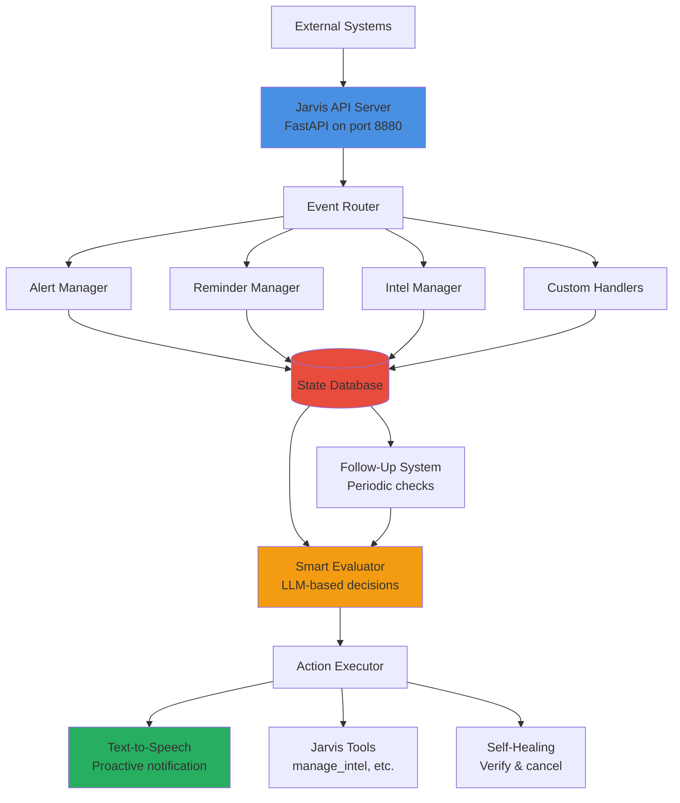
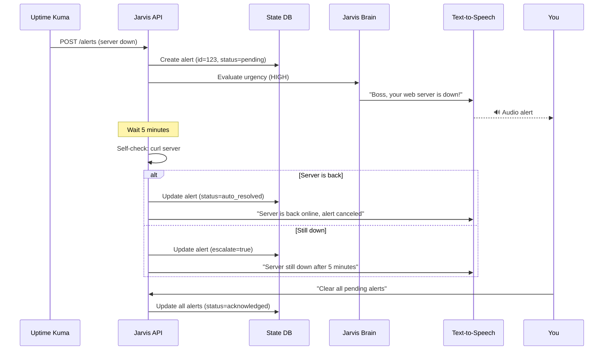
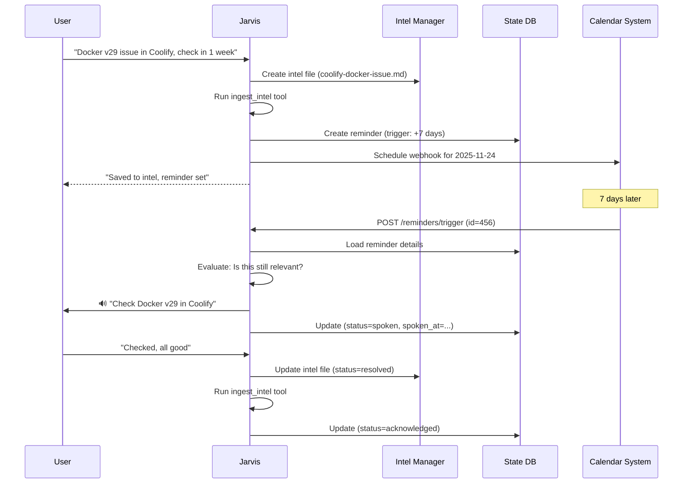
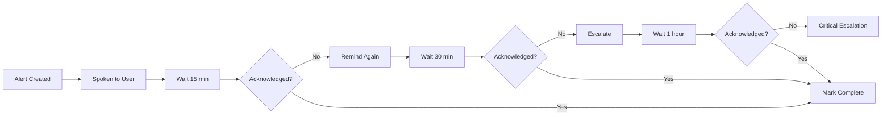

# Jarvis Proactive Assistant System

> **Vision**: Transform Jarvis from a reactive voice assistant into a proactive event-driven system that can be triggered by external events (health checks, reminders, webhooks) and take autonomous action.

---

## Table of Contents

1. [Overview](#overview)
2. [Architecture](#architecture)
3. [Use Cases](#use-cases)
4. [API Server Design](#api-server-design)
5. [Database Schema](#database-schema)
6. [Folder Structure](#folder-structure)
7. [Implementation Phases](#implementation-phases)
8. [Extension Patterns](#extension-patterns)

---

## Overview

### Current State (Reactive)

```
User → Wake Word → Jarvis Processes → Response → Done
```

### Future State (Proactive)

```
External Event → API Endpoint → Jarvis Evaluates → Takes Action → Notifies User
                                        ↓
                                  Updates State
                                        ↓
                              Monitors & Follows Up
```

### Key Capabilities

1. **External Triggers**: Webhooks, API calls, scheduled events
2. **State Management**: Track alerts, reminders, tasks (pending/done/canceled)
3. **Proactive Notifications**: Jarvis interrupts to alert you
4. **Self-Healing**: Checks if issues resolved, auto-cancels alerts
5. **Follow-Up System**: Reminds until acknowledged
6. **Intelligence**: Understands context, prioritizes, decides when to interrupt

---

## Architecture

### High-Level Design



### Components

| Component | Purpose | Technology |
|-----------|---------|------------|
| **API Server** | Receive external events | FastAPI (async) |
| **Event Router** | Route events to handlers | Python dispatcher |
| **State Database** | Track alerts/reminders/tasks | SQLite (dual-mode compatible) |
| **Smart Evaluator** | LLM-based decision making | Claude/Ollama |
| **Action Executor** | Execute Jarvis tools/commands | Existing orchestrator |
| **TTS Engine** | Proactive voice notifications | Existing say.sh |
| **Follow-Up System** | Background monitoring | Cron/systemd timer |

---

## Use Cases

### Use Case 1: Server Health Check Alert

**Scenario**: Uptime Kuma detects your server is down

**Flow**:



**Database Record**:
```json
{
  "id": 123,
  "type": "health_check",
  "source": "uptime_kuma",
  "title": "Web Server Down",
  "description": "example.com not responding (HTTP 503)",
  "severity": "high",
  "status": "pending",
  "created_at": "2025-11-17 10:00:00",
  "spoken_at": "2025-11-17 10:00:05",
  "last_check": "2025-11-17 10:05:00",
  "auto_resolve_url": "https://example.com",
  "metadata": {"server": "web01", "ip": "192.168.1.100"}
}
```

---

### Use Case 2: Reminder with Intel Creation

**Scenario**: Docker version issue in Coolify

**Flow**:



---

### Use Case 3: Proactive Follow-Up System

**Scenario**: Critical alert not acknowledged after 1 hour

**Flow**:



**Configuration**:
```python
FOLLOW_UP_SCHEDULE = {
    "high": [15, 30, 60],    # Minutes between reminders
    "medium": [30, 60, 120],
    "low": [60, 180, 360]
}
```

---

## API Server Design

### Endpoints

#### Health & Status

```http
GET /health
→ Returns: {"status": "ok", "mode": "cloud", "uptime": 12345}

GET /status
→ Returns: {"alerts": 2, "reminders": 5, "tasks": 3}
```

#### Alerts

```http
POST /alerts
Body: {
  "title": "Server Down",
  "description": "example.com not responding",
  "severity": "high",
  "source": "uptime_kuma",
  "metadata": {...},
  "auto_resolve_url": "https://example.com"  # Optional
}
→ Returns: {"id": 123, "status": "pending", "spoken": true}

GET /alerts
Query: ?status=pending&severity=high
→ Returns: [{"id": 123, ...}, ...]

PUT /alerts/{id}/acknowledge
→ Marks alert as acknowledged

DELETE /alerts/{id}
→ Cancels/deletes alert

POST /alerts/clear
Body: {"status": "all"} or {"severity": "low"}
→ Clears matching alerts
```

#### Reminders

```http
POST /reminders
Body: {
  "title": "Check Docker v29",
  "description": "Unpin if Traefik supports it",
  "trigger_time": "2025-11-24T10:00:00",
  "related_intel": "servers/coolify-docker-issue.md",
  "metadata": {...}
}
→ Returns: {"id": 456, "status": "scheduled"}

POST /reminders/trigger/{id}
→ Triggers reminder immediately (called by calendar system)

GET /reminders
Query: ?status=pending
→ Returns: [{"id": 456, ...}, ...]

DELETE /reminders/{id}
→ Cancels reminder
```

#### Intel Management

```http
POST /intel/create
Body: {
  "path": "servers/coolify-docker-issue.md",
  "content": "# Docker Issue\n...",
  "auto_ingest": true
}
→ Returns: {"file": "...", "ingested": true}

GET /intel/list
Query: ?category=servers
→ Returns: [{"file": "...", "modified": "..."}, ...]

PUT /intel/update
Body: {"path": "...", "content": "...", "auto_ingest": true}

DELETE /intel/{path}
```

#### Tasks (Future)

```http
POST /tasks
Body: {
  "title": "Backup server configs",
  "priority": "medium",
  "due_date": "2025-11-20",
  "steps": ["step 1", "step 2"]
}

GET /tasks
Query: ?status=pending&priority=high
```

#### Voice/TTS Control

```http
POST /speak
Body: {
  "message": "Boss, urgent alert!",
  "priority": "high",
  "mode": "cloud"  # or "local"
}
→ Plays audio immediately via say.sh

POST /voice/query
Body: {
  "query": "What's the weather?",
  "wait_for_response": true
}
→ Processes query, returns response
```

---

## Database Schema

### New Tables

#### `alerts` Table

```sql
CREATE TABLE alerts (
    id INTEGER PRIMARY KEY AUTOINCREMENT,
    
    -- Core fields
    title TEXT NOT NULL,
    description TEXT,
    severity TEXT CHECK(severity IN ('low', 'medium', 'high', 'critical')) DEFAULT 'medium',
    source TEXT NOT NULL,  -- uptime_kuma, custom, manual, etc.
    
    -- Status tracking
    status TEXT CHECK(status IN ('pending', 'acknowledged', 'auto_resolved', 'canceled')) DEFAULT 'pending',
    created_at TEXT NOT NULL,
    updated_at TEXT,
    acknowledged_at TEXT,
    resolved_at TEXT,
    
    -- Notification tracking
    spoken BOOLEAN DEFAULT 0,
    spoken_at TEXT,
    follow_up_count INTEGER DEFAULT 0,
    last_follow_up TEXT,
    
    -- Self-healing
    auto_resolve_url TEXT,
    auto_resolve_check_interval INTEGER DEFAULT 300,  -- seconds
    last_check_at TEXT,
    
    -- Metadata
    metadata TEXT,  -- JSON blob for extensibility
    related_intel_file TEXT,
    
    -- Sync tracking
    synced_to_other_db BOOLEAN DEFAULT 0,
    sync_timestamp TEXT
);

CREATE INDEX idx_alerts_status ON alerts(status);
CREATE INDEX idx_alerts_severity ON alerts(severity);
CREATE INDEX idx_alerts_source ON alerts(source);
```

#### `reminders` Table

```sql
CREATE TABLE reminders (
    id INTEGER PRIMARY KEY AUTOINCREMENT,
    
    -- Core fields
    title TEXT NOT NULL,
    description TEXT,
    trigger_time TEXT NOT NULL,  -- ISO 8601 format
    
    -- Status tracking
    status TEXT CHECK(status IN ('scheduled', 'triggered', 'acknowledged', 'canceled', 'expired')) DEFAULT 'scheduled',
    created_at TEXT NOT NULL,
    triggered_at TEXT,
    acknowledged_at TEXT,
    
    -- Notification tracking
    spoken BOOLEAN DEFAULT 0,
    spoken_at TEXT,
    
    -- Integration
    related_intel_file TEXT,
    callback_url TEXT,  -- Webhook to call when reminder triggers
    
    -- Recurrence (future)
    recurrence_rule TEXT,  -- Cron-like syntax
    
    -- Metadata
    metadata TEXT,
    
    -- Sync tracking
    synced_to_other_db BOOLEAN DEFAULT 0,
    sync_timestamp TEXT
);

CREATE INDEX idx_reminders_trigger ON reminders(trigger_time);
CREATE INDEX idx_reminders_status ON reminders(status);
```

#### `tasks` Table (Future)

```sql
CREATE TABLE tasks (
    id INTEGER PRIMARY KEY AUTOINCREMENT,
    title TEXT NOT NULL,
    description TEXT,
    priority TEXT CHECK(priority IN ('low', 'medium', 'high')) DEFAULT 'medium',
    status TEXT CHECK(status IN ('pending', 'in_progress', 'completed', 'canceled')) DEFAULT 'pending',
    due_date TEXT,
    completed_at TEXT,
    steps TEXT,  -- JSON array
    metadata TEXT,
    synced_to_other_db BOOLEAN DEFAULT 0,
    sync_timestamp TEXT
);
```

### Schema Migration

Update `bin/sync-memory-db.py` to handle new tables:

```python
SYNCED_TABLES = [
    'knowledge_base',  # Existing
    'conversations',   # Existing
    'alerts',          # NEW
    'reminders',       # NEW
    'tasks'            # NEW (future)
]
```

---

## Folder Structure

```
jarvis-voice/
├── api/                           # NEW: API server
│   ├── __init__.py
│   ├── server.py                  # FastAPI app
│   ├── routes/
│   │   ├── __init__.py
│   │   ├── alerts.py              # Alert endpoints
│   │   ├── reminders.py           # Reminder endpoints
│   │   ├── intel.py               # Intel management
│   │   ├── tasks.py               # Task management
│   │   ├── voice.py               # TTS/query endpoints
│   │   └── health.py              # Health/status
│   ├── models/
│   │   ├── __init__.py
│   │   ├── alert.py               # Pydantic models
│   │   ├── reminder.py
│   │   └── task.py
│   ├── managers/
│   │   ├── __init__.py
│   │   ├── alert_manager.py       # Alert logic
│   │   ├── reminder_manager.py    # Reminder logic
│   │   ├── intel_manager.py       # Intel CRUD
│   │   └── follow_up_manager.py   # Follow-up system
│   └── middleware/
│       ├── __init__.py
│       ├── auth.py                # API key auth (optional)
│       └── cors.py                # CORS config
│
├── services/                      # NEW: Background services
│   ├── __init__.py
│   ├── follow_up_daemon.py        # Periodic alert follow-ups
│   ├── self_healing_daemon.py     # Auto-resolve checks
│   └── reminder_scheduler.py      # Reminder triggers
│
├── skills/                        # ENHANCED
│   ├── manage_intel.py            # NEW: Intel CRUD tool
│   ├── manage_intel.tool.json
│   ├── manage_alerts.py           # NEW: Alert management tool
│   ├── manage_alerts.tool.json
│   └── ... (existing tools)
│
├── bin/
│   ├── jarvis-api                 # NEW: Start API server
│   ├── jarvis-services            # NEW: Start background services
│   ├── sync-memory-db.py          # ENHANCED: Sync new tables
│   └── ... (existing scripts)
│
├── data/
│   ├── jarvis_memory.db           # ENHANCED: New tables added
│   └── jarvis_memory_local.db     # ENHANCED: New tables added
│
├── docs/
│   ├── PROACTIVE_ASSISTANT_SYSTEM.md  # This document
│   ├── API_REFERENCE.md           # NEW: API documentation
│   ├── ALERT_SYSTEM.md            # NEW: Alert system guide
│   └── ... (existing docs)
│
└── tests/
    ├── api/                       # NEW: API tests
    │   ├── test_alerts.py
    │   ├── test_reminders.py
    │   └── test_intel.py
    └── integration/
        ├── test_proactive_system.sh  # NEW: End-to-end test
        └── ... (existing tests)
```

---

## Implementation Phases

### Phase 1: Foundation (Week 1)

**Goal**: Basic API server + Alert system

- ✅ Create FastAPI server (`api/server.py`)
- ✅ Add `alerts` table to database
- ✅ Implement alert endpoints (POST, GET, PUT, DELETE)
- ✅ Create `alert_manager.py` logic
- ✅ Add TTS endpoint (`POST /speak`)
- ✅ Update `sync-memory-db.py` to sync alerts
- ✅ Test with Uptime Kuma webhook

**Deliverable**: External systems can send alerts to Jarvis

### Phase 2: Intel Management (Week 2)

**Goal**: Structured intel creation + auto-ingest

- ✅ Create `manage_intel.py` tool (sandboxed to jarvis-intel/)
- ✅ Implement CRUD operations (create, read, update, delete, list)
- ✅ Add format validation (follows README.md template)
- ✅ Auto-run `ingest_intel` after changes
- ✅ Add intel endpoints to API
- ✅ Add `long_form` column to `knowledge_base` table

**Deliverable**: Jarvis can create/manage intel files programmatically

### Phase 3: Reminders (Week 3)

**Goal**: Scheduled reminders with callbacks

- ✅ Add `reminders` table
- ✅ Implement reminder endpoints
- ✅ Create `reminder_scheduler.py` service
- ✅ Integrate with calendar system (MCP or internal)
- ✅ Link reminders to intel files
- ✅ Test full flow (create → trigger → speak → acknowledge)

**Deliverable**: Time-based reminders work end-to-end

### Phase 4: Self-Healing (Week 4)

**Goal**: Auto-resolve + follow-up system

- ✅ Implement `self_healing_daemon.py`
- ✅ Add HTTP health check logic
- ✅ Create `follow_up_manager.py`
- ✅ Implement escalation rules
- ✅ Add "clear all alerts" command
- ✅ Test auto-resolution flow

**Deliverable**: Jarvis autonomously checks and resolves issues

### Phase 5: Tasks & Extensions (Week 5+)

**Goal**: Task management + extensibility

- ✅ Add `tasks` table
- ✅ Implement task endpoints
- ✅ Create task management tool
- ✅ Add recurring reminders
- ✅ Documentation for custom handlers
- ✅ Plugin system for new event types

**Deliverable**: Fully extensible event-driven system

---

## Extension Patterns

### Adding a New Event Type

**Example**: Add "backup completion" events

**Step 1**: Define the model

```python
# api/models/backup.py
from pydantic import BaseModel

class BackupEvent(BaseModel):
    server: str
    backup_type: str  # full, incremental
    status: str  # success, failed
    size_mb: float
    duration_seconds: int
```

**Step 2**: Create handler

```python
# api/managers/backup_manager.py
def handle_backup_event(event: BackupEvent):
    if event.status == "failed":
        # Create high-priority alert
        create_alert(
            title=f"Backup Failed: {event.server}",
            severity="high",
            source="backup_system",
            metadata=event.dict()
        )
    else:
        # Log to intel
        update_intel_file(
            path=f"backups/{event.server}.md",
            content=f"Last backup: {event.size_mb}MB"
        )
```

**Step 3**: Add endpoint

```python
# api/routes/backups.py
@router.post("/backups")
async def receive_backup_event(event: BackupEvent):
    handle_backup_event(event)
    return {"status": "processed"}
```

### Custom Follow-Up Logic

**Example**: Weekly health report

```python
# services/custom_follow_ups.py
def weekly_health_report():
    """Run every Monday at 9am"""
    alerts = get_alerts(status="pending")
    reminders = get_reminders(status="scheduled")
    
    report = f"Boss, weekly summary: {len(alerts)} pending alerts, {len(reminders)} upcoming reminders."
    
    speak(report, priority="low")
```

---

## Security Considerations

### API Authentication

**Option 1**: API Key (Simple)

```python
# In config/cloud.env
JARVIS_API_KEY="secure-random-key-here"

# In api/middleware/auth.py
@app.middleware("http")
async def verify_api_key(request: Request, call_next):
    if request.url.path.startswith("/api/"):
        key = request.headers.get("X-API-Key")
        if key != os.getenv("JARVIS_API_KEY"):
            return JSONResponse({"error": "Unauthorized"}, status_code=401)
    return await call_next(request)
```

**Option 2**: Source Whitelist

```python
ALLOWED_SOURCES = [
    "192.168.1.0/24",  # Local network
    "uptime_kuma",     # Specific services
]
```

### Sandboxing

- Intel files: **Only** write to `jarvis-intel/`
- Bash execution: Require explicit permission
- API endpoints: Rate limiting

---

## Monitoring & Debugging

### Logging

```python
# All API calls logged to
logs/api/api-calls-{date}.jsonl

# Format:
{
  "timestamp": "2025-11-17T10:00:00",
  "endpoint": "/alerts",
  "method": "POST",
  "source_ip": "192.168.1.100",
  "payload": {...},
  "response": {...},
  "duration_ms": 45
}
```

### Dashboard (Future)

Web UI to view:
- Pending alerts
- Upcoming reminders
- Recent tasks
- System health

---

## Example Integrations

### Uptime Kuma

```bash
# In Uptime Kuma notification settings:
Webhook URL: http://localhost:8880/api/alerts
Method: POST
Body:
{
  "title": "{{name}} is {{status}}",
  "description": "{{msg}}",
  "severity": "high",
  "source": "uptime_kuma",
  "metadata": {
    "monitor": "{{name}}",
    "url": "{{url}}"
  },
  "auto_resolve_url": "{{url}}"
}
```

### Coolify (Health Check)

```bash
# Coolify webhook on deployment failure:
curl -X POST http://localhost:8880/api/alerts \
  -H "Content-Type: application/json" \
  -d '{
    "title": "Deployment Failed",
    "description": "App: myapp, Error: Docker build failed",
    "severity": "high",
    "source": "coolify"
  }'
```

### Cron Job (Backup)

```bash
#!/bin/bash
# backup-notify.sh
RESULT=$(run-backup.sh)

if [ $? -eq 0 ]; then
  STATUS="success"
else
  STATUS="failed"
fi

curl -X POST http://localhost:8880/api/backups \
  -H "Content-Type: application/json" \
  -d "{
    \"server\": \"$(hostname)\",
    \"backup_type\": \"full\",
    \"status\": \"$STATUS\",
    \"size_mb\": 1024,
    \"duration_seconds\": 300
  }"
```

---

## Summary

This system transforms Jarvis from a **reactive assistant** into a **proactive event-driven agent** that:

✅ Receives events from external systems  
✅ Intelligently decides how to respond  
✅ Proactively notifies you when needed  
✅ Manages state (alerts, reminders, tasks)  
✅ Self-heals (checks if issues resolved)  
✅ Follows up until acknowledged  
✅ Syncs state between cloud/local modes  
✅ Extensible for new event types  
✅ Secure and sandboxed  

**Next Step**: Choose implementation phase (recommend Phase 1 + 2 first).

---

## Files to Create

Immediate (Phase 1):
1. `api/server.py` - FastAPI app
2. `api/routes/alerts.py` - Alert endpoints
3. `api/managers/alert_manager.py` - Alert logic
4. `bin/jarvis-api` - Start script
5. Database migration for `alerts` table
6. Update `sync-memory-db.py`

---

**Ready to start building?** Let me know which phase to begin with!

