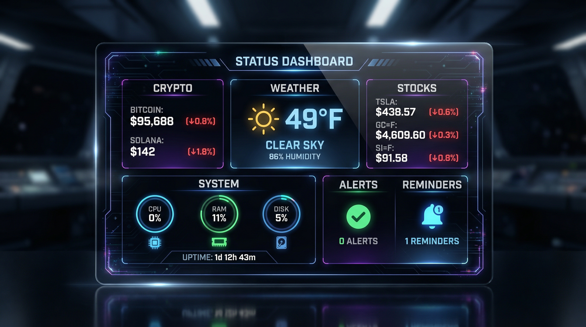

# Status Recap Tool

> **Version:** 1.4  
> **Created:** January 2026  
> **Type:** Auto-generated Tool (enhanced)  
> **Location:** `skills/auto-tools/status_recap.py`

A comprehensive status briefing tool that aggregates data from multiple Jarvis subsystems into a unified report.

---

## Table of Contents

1. [Overview](#overview)
2. [Features](#features)
3. [Data Sources](#data-sources)
4. [Parameters](#parameters)
5. [Output Format](#output-format)
6. [Architecture](#architecture)
7. [Usage Examples](#usage-examples)
8. [Integration Points](#integration-points)
9. [Extending the Tool](#extending-the-tool)
10. [Troubleshooting](#troubleshooting)

---

## Overview



The `status_recap` tool provides a "morning briefing" or on-demand status check by:

1. **Gathering** data from 6+ internal tools
2. **Aggregating** into a structured report
3. **Saving** full report to Stash (for follow-up queries)
4. **Creating** a formatted Canvas page (visual reference)
5. **Optionally generating** an AI dashboard image
6. **Supporting** native LLM search for news integration

### When to Use

| User Request | Tool Triggered |
|-------------|----------------|
| "Give me a status recap" | ✅ |
| "Morning briefing" | ✅ |
| "What's my current status?" | ✅ |
| "Daily update" | ✅ |
| "Status with news" | ✅ (+ native search) |
| "Status with dashboard image" | ✅ (+ image generation) |

---

## Features

### Core Features

- **Time-Aware Greeting** - "Good morning/afternoon/evening" based on current hour
- **Weather Report** - Current conditions, temperature, humidity, wind
- **Crypto Prices** - Real-time prices with 24h change percentages (Bitcoin, Solana default)
- **Stock/Futures Prices** - Real-time stock and commodity prices (Tesla, Gold, Silver default)
- **Alerts Check** - Any pending system alerts
- **Reminders List** - Upcoming scheduled reminders
- **System Health** - CPU, RAM, disk, uptime, network stats

### Advanced Features

- **Canvas Integration** - Auto-saves formatted markdown report
- **Stash Integration** - Saves JSON data for programmatic access
- **Image Generation** - Optional AI-generated dashboard visualization
- **News Integration** - Native LLM grounding search for headlines (via `include_news` flag)
- **Configurable Sections** - Enable/disable specific data sources
- **Custom Crypto List** - Specify which coins to track
- **Custom Stock/Futures List** - Specify which stocks or commodities to track

---

## Data Sources

The tool calls these Jarvis tools internally:

| Tool | Purpose | Timeout |
|------|---------|---------|
| `get_time` | Current date/time | 10s |
| `weather` | Weather conditions | 60s |
| `crypto_price` | Per-coin pricing | 45s (per coin) |
| `stock_price` | Per-stock/futures pricing | 45s (per symbol) |
| `list_alerts` | Pending alerts | 20s |
| `list_reminders` | Scheduled reminders | 20s |
| `system_monitor` | System metrics | 30s |
| `generate_image` | Dashboard image (optional) | 120s |
| `stash` | Save JSON report | 20s |
| `canvas` | Create markdown page | 30s |

### Data Flow

```
┌──────────────────────────────────────────────────────────────┐
│                      status_recap.py                          │
├──────────────────────────────────────────────────────────────┤
│                                                               │
│  ┌─────────┐  ┌─────────┐  ┌─────────────┐  ┌─────────────┐  │
│  │get_time │  │ weather │  │crypto_price │  │ stock_price │  │
│  └────┬────┘  └────┬────┘  └──────┬──────┘  └──────┬──────┘  │
│       │            │              │                │          │
│       └────────────┴──────────────┴────────────────┘          │
│                           ▼                                   │
│         ┌─────────────────────────────────────┐               │
│         │         report_data (dict)          │               │
│         └─────────────────┬───────────────────┘               │
│                           │                                   │
│              ┌────────────┼────────────┐                      │
│              ▼            ▼            ▼                      │
│         ┌─────────┐  ┌─────────┐  ┌─────────┐                │
│         │  stash  │  │ canvas  │  │  image  │                │
│         │  (JSON) │  │  (MD)   │  │ (opt.)  │                │
│         └─────────┘  └─────────┘  └─────────┘                │
│                                                               │
└──────────────────────────────────────────────────────────────┘
```

---

## Parameters

| Parameter | Type | Default | Description |
|-----------|------|---------|-------------|
| `include_news` | boolean | `false` | Flag telling LLM to use native grounding search for news |
| `generate_image` | boolean | `false` | Generate AI dashboard image (~60-90s) |
| `crypto_coins` | array | `["bitcoin", "solana"]` | Coins to check prices for |
| `stock_symbols` | array | `["TSLA", "GC=F", "SI=F"]` | Stock tickers or futures symbols to check |
| `sections` | array | `["time", "weather", "crypto", "stocks", "alerts", "reminders", "system"]` | Data sections to include |
| `save_to_canvas` | boolean | `true` | Save formatted report to canvas |

### Section Options

Available sections for the `sections` parameter:

- `time` - Current date/time
- `weather` - Weather conditions
- `crypto` - Cryptocurrency prices
- `stocks` - Stock and commodity/futures prices
- `alerts` - System alerts
- `reminders` - Upcoming reminders
- `system` - System health metrics

### Stock/Futures Symbols

The `stock_symbols` parameter accepts:

| Type | Examples | Description |
|------|----------|-------------|
| **Stocks** | `TSLA`, `AAPL`, `NVDA`, `MSFT` | Individual company stocks |
| **Commodities** | `GC=F`, `SI=F`, `CL=F`, `NG=F` | Gold, Silver, Oil, Natural Gas futures |
| **ETFs** | `SPY`, `QQQ`, `GLD`, `SLV` | Index and commodity ETFs |
| **Forex** | `EURUSD=X`, `USDJPY=X` | Currency pairs |

**Note:** Use futures (`GC=F`) for actual commodity prices per unit. Use ETFs (`GLD`) for fund share prices.

---

## Output Format

### Speech (TTS)

Concise summary for voice output:
```
"Good morning. It's 72°F and partly cloudy. Bitcoin $95,000 (+3.2%), Solana $145 (+1.5%). 
TSLA $438.57 (-0.9%), Gold $4,608 (-0.3%). No alerts. 2 upcoming reminders. Full details on canvas."
```

### Data Structure

```json
{
  "ok": true,
  "speech": "Good morning. It's 72°F...",
  "data": {
    "report": {
      "generated_at": "2026-01-13T08:00:00",
      "greeting": "Good morning",
      "time": {...},
      "weather": {
        "temperature": 72,
        "condition": "Partly Cloudy",
        "humidity": 65,
        "wind_speed": 8
      },
      "crypto": {
        "bitcoin": {
          "price": 95000,
          "price_display": "$95,000",
          "change_24h": 3.2,
          "change_display": "+3.2%",
          "summary": "Bitcoin $95,000 (+3.2%)",
          "name": "Bitcoin"
        }
      },
      "stocks": {
        "TSLA": {
          "price": 438.57,
          "price_display": "$438.57",
          "change_today": -0.87,
          "change_display": "-0.9%",
          "summary": "TSLA $438.57 (-0.9%)",
          "company": "Tesla, Inc.",
          "market_cap_display": "$1.46T",
          "pe_ratio": 302.46,
          "sector": "Consumer Cyclical"
        },
        "GC=F": {
          "price": 4608,
          "price_display": "$4,608",
          "change_today": -0.3,
          "change_display": "-0.3%",
          "summary": "GC=F $4,608 (-0.3%)",
          "company": "Gold Feb 26"
        }
      },
      "alerts": {"alerts": []},
      "reminders": {"reminders": [...]},
      "system": {
        "cpu_percent": 12.5,
        "memory_percent": 45.2,
        "disk_percent": 68.0,
        "uptime": "23 days, 12 hours"
      },
      "news_requested": false,
      "failures": []
    },
    "stash_ref": "stash://space_xxx/f_yyy",
    "canvas_id": "page_20260113_080000",
    "image_ref": null,
    "failures": []
  }
}
```

### Canvas Output

The canvas page includes:

1. **Dashboard image** (if generated) - embedded at top
2. **Executive summary** - Key highlights in blockquote
3. **Weather section** - conditions, temp, humidity, wind
4. **Crypto section** - prices with 24h change indicators
5. **Stocks section** - prices with daily change, P/E ratio, market cap
6. **Alerts section** - active alerts or "no active alerts"
7. **Reminders section** - upcoming reminders or "none"
8. **System health** - CPU, RAM, disk, uptime, network
9. **Data issues** - any failed data sources
10. **Stash reference** - link to JSON report

---

## Architecture

### Tool Calling Pattern

The `status_recap` tool uses subprocess calls to invoke other Jarvis tools:

```python
def call_tool(tool_name, args=None):
    tool_path = find_tool(tool_name)  # Check skills/ then skills/auto-tools/
    input_data = json.dumps(args or {})
    result = subprocess.run(
        ["python3", tool_path, input_data],
        capture_output=True,
        timeout=TIMEOUTS.get(tool_name, 45),
        cwd=project_root  # Critical for lib imports!
    )
    return json.loads(result.stdout)
```

### Key Design Decisions

1. **Sequential execution** - Tools run one at a time to avoid overwhelming APIs
2. **Graceful degradation** - Failures in one section don't stop the report
3. **Timeout per tool** - Each tool has appropriate timeout based on expected duration
4. **Stash persistence** - Full data saved for follow-up questions
5. **Canvas for humans** - Formatted markdown for visual reference

### Orchestrator Integration

The orchestrator has special handling for `status_recap`:

- **180-second timeout** (vs 45s default) - allows image generation
- **4000 char context** (vs 1500 default) - ensures full data reaches LLM
- **Direct Speech Mode** - bypasses LLM reformatting to prevent number mangling
- **News hint injection** - when `news_requested: true`, tells LLM to use native search

#### Direct Speech Mode (Critical!)

The `status_recap` tool is in the `DIRECT_SPEECH_TOOLS` set, meaning the orchestrator uses its `speech` field verbatim instead of asking the LLM to reformulate.

**Why this matters:** When the LLM reformulates tool output, it sometimes mangles large numbers. For example, "$93,345" might become "$9,334" - dropping a digit. This was traced to the `_format_single_turn_casual()` function which asks the LLM to condense responses.

```python
# In orchestrator_v2.py
DIRECT_SPEECH_TOOLS = {'status_recap', 'generate_music', 'phone_call'}

if last_tool in DIRECT_SPEECH_TOOLS:
    # Use tool's speech directly - NO LLM reformatting
    speech = tool_speech  # "$93,345" stays "$93,345" ✅
else:
    # Let LLM condense (may mangle numbers)
    speech = _format_single_turn_casual(raw_speech)  # Risk: "$9,334" ❌
```

**If adding new tools with precise numerical output**, consider adding them to `DIRECT_SPEECH_TOOLS` in `orchestrator_v2.py`.

#### News Hint Injection

```python
# In orchestrator_v2.py
if tool_name == "status_recap" and result.get('data', {}).get('report', {}).get('news_requested'):
    result_summary += "\n\nNOTE TO LLM: User requested news. Use your NATIVE SEARCH capabilities..."
```

---

## Usage Examples

### Basic Recap (Terminal)

```bash
source ~/jarvis-venv/bin/activate
./orchestrator/orchestrator_v2.py cloud "Give me a status recap"
```

### Web UI with @prompt

```
@status_recap Give me my morning briefing
```

### With Specific Crypto

```
@status_recap Status update with ETH and DOGE prices
```
Parameters: `{"crypto_coins": ["bitcoin", "solana", "ethereum", "dogecoin"]}`

### With Custom Stocks/Futures

```
@status_recap Status with Apple, oil, and natural gas
```
Parameters: `{"stock_symbols": ["TSLA", "AAPL", "CL=F", "NG=F"]}`

**Common symbols:**
- Stocks: `TSLA`, `AAPL`, `NVDA`, `MSFT`, `AMZN`, `GOOGL`
- Commodities: `GC=F` (gold ~$4600/oz), `SI=F` (silver), `CL=F` (oil), `NG=F` (natural gas)
- ETFs: `SPY`, `QQQ`, `GLD` (gold ETF ~$420/share)

### With Dashboard Image

```
@status_recap Full status with visual dashboard
```
Parameters: `{"generate_image": true}`

### With News Headlines

```
@status_recap Status recap plus latest news
```
Parameters: `{"include_news": true}`

The LLM receives `news_requested: true` and uses its native search (Anthropic Search or xAI Live Search) to fetch headlines.

### Minimal Status

```
@status_recap Quick check - just weather and system health
```
Parameters: `{"sections": ["weather", "system"]}`

---

## Integration Points

### Stash

Full JSON report is saved to stash:
- **Kind:** `json`
- **Name:** `status_recap_YYYYMMDD_HHMMSS.json`
- **Tags:** `["status", "recap"]`

Retrieve later with:
```
"Show me the status recap from this morning"
```
The LLM can use `stash` tool to retrieve by tag or name.

### Canvas

Formatted markdown page created:
- **Title:** `Daily Status/YYYY-MM-DD Recap`
- **Tags:** `["status", "recap", "daily"]`

View with:
```
"Open my latest canvas"
"Show the status recap canvas"
```

### Native Search (News)

When `include_news: true`:
1. Tool sets `report_data['news_requested'] = True`
2. Orchestrator detects this flag in response
3. Orchestrator adds hint to LLM context
4. LLM uses native search (`ANTHROPIC_SEARCH` or `XAI_SEARCH` in cloud.env)
5. News is included in LLM's final response

---

## Extending the Tool

### Adding New Data Sources

1. Add tool call in `main()`:
```python
if 'new_section' in sections:
    result = call_tool('new_tool', {'param': 'value'})
    if result.get('ok'):
        report_data['new_section'] = result.get('data', {})
```

2. Add timeout in `TIMEOUTS`:
```python
TIMEOUTS = {
    ...
    'new_tool': 30,
}
```

3. Add to canvas output:
```python
if 'new_section' in report_data:
    canvas_lines.extend([
        "## 📊 New Section",
        f"- **Data:** {report_data['new_section'].get('value')}",
        ""
    ])
```

4. Update `sections` default in `.tool.json`

### Future Enhancements

Potential additions to the status recap:

| Feature | Tool Required | Notes |
|---------|--------------|-------|
| **Email summary** | `check_email` | Unread count, important senders |
| **Calendar events** | `calendar` | Today's appointments |
| **Home automation** | `home_assistant` | Smart home status |
| **Server health** | `ssh_remote` | Remote server checks |
| **Docker status** | `docker_control` | Container health |
| **Spotify** | `spotify` | Currently playing, recent tracks |

---

## Troubleshooting

### Common Issues

#### "Tool timed out"

**Cause:** Default 45s wasn't enough for slow API responses.

**Solution:** Tool has per-tool timeouts. If still failing:
```python
TIMEOUTS = {
    'weather': 90,  # Increase for slow proxy
}
```

#### "Image not showing on canvas"

**Cause:** Image stash ref not extracted correctly.

**Solution:** Image ref is at `result.data.saved.stash_ref`. Canvas embeds with:
```markdown

```

#### "Crypto shows N/A"

**Cause:** Wrong data path for price extraction.

**Solution:** `crypto_price` tool returns `data.price_usd` not `data.price`:
```python
price = d.get('price_usd', 0)
change = d.get('change_24h_percent', 0)
```

#### "News not appearing"

**Cause:** LLM not triggering native search.

**Solution:** 
1. Ensure `ANTHROPIC_SEARCH=true` or `XAI_SEARCH=true` in `cloud.env`
2. Orchestrator must detect `news_requested: true` and add hint
3. Check `orchestrator_v2.py` for the injection logic

#### "Crypto price wrong/truncated" (e.g., "$9,334" instead of "$93,345")

**Cause:** LLM reformatting mangles large numbers during `_format_single_turn_casual()`.

**Solution:** This was fixed by adding `status_recap` to `DIRECT_SPEECH_TOOLS` in `orchestrator_v2.py`. The tool's speech is now used verbatim without LLM reformatting.

**If issue returns:**
1. Verify `status_recap` is in `DIRECT_SPEECH_TOOLS` set (~line 430)
2. Check that `use_direct_speech = True` is being set when tool runs
3. Look for `🎯 Using status_recap's direct speech` in terminal output

**Root cause analysis:** Both xAI and Anthropic exhibited this issue. The LLM would see "$93,345" in the tool output but generate "$9,334" when asked to condense for voice. The exact cause (tokenization, number formatting, context window) was never isolated, but bypassing LLM reformatting solved it completely.

### Debug Mode

Run with verbose output:
```bash
python3 skills/auto-tools/status_recap.py '{"sections": ["weather"]}'
```

Check stash/canvas saved correctly:
```bash
ls -la data/stash/
ls -la data/canvas/
```

---

## Related Documentation

- [Canvas System](../CANVAS_SYSTEM.md) - Canvas integration
- [Stash System](../STASH_SYSTEM.md) - Stash storage
- [Tool Builder](../TOOL_BUILDER.md) - Auto-generating tools
- [@status_recap Prompt](../../jarvis-web/data/prompts/status_recap.md) - Web UI prompt

---

## Changelog

| Date | Version | Changes |
|------|---------|---------|
| 2026-01-13 | 1.0 | Initial release with weather, crypto, alerts, reminders, system |
| 2026-01-13 | 1.1 | Fixed data paths, added stash/canvas integration, image embedding |
| 2026-01-13 | 1.2 | Added news integration via native LLM grounding search |
| 2026-01-13 | 1.3 | Fixed crypto price mangling - added to DIRECT_SPEECH_TOOLS to bypass LLM reformatting |
| 2026-01-15 | 1.4 | Added stocks/futures support via `stock_price` tool. Defaults: TSLA, GC=F (gold), SI=F (silver). Supports stocks, commodities, ETFs, and forex. |