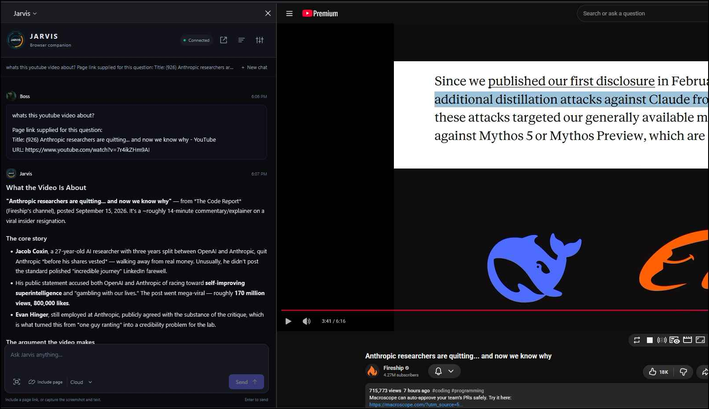

# Jarvis Companion for Firefox

A Firefox client for [Jarvis Voice](https://github.com/bigsk1/jarvis-voice): chat in a sidebar or detached window, capture a webpage's screenshot **and readable text**, and ask follow-up questions without saving screenshots or copying articles by hand.

This independently versioned extension targets **unlisted Mozilla signing and self-distribution**. Its standalone source repository is [bigsk1/jarvis-firefox-extension](https://github.com/bigsk1/jarvis-firefox-extension). It requires your own Jarvis Web server. See [REVIEW.md](REVIEW.md) for the signing upload steps, reproducible packaging, and submission notes. Building this source produces an unsigned ZIP; Mozilla returns the signed installer separately.

## What it does

- Opens the Jarvis sidebar from the toolbar, with an **Open pop-out** button for a detached window.
- **Talk** listens for a question, sends after a short silence, speaks the reply, and listens again in the same conversation.
- **Include page** attaches the current page's title and link to the next message. YouTube video links prefer the existing transcript tool.
- Stages a visible-tab screenshot with a preview, source title, URL, and capture time.
- Stages the page's readable text as a durable Jarvis source (same 100KB text-upload path as Web notes). Follow-ups can refer to that captured page after reload.
- Sends your question or an **Analyze page** / **Analyze screenshot** prompt through your Jarvis Web server.
- Provides right-click **Jarvis** actions for a page capture, selected text, a link, or an image URL.
- Shows task and tool progress, completed answers, conversation history with pinned labels, and **Stop**.
- Reconnects to accepted work by its request/conversation ID without automatically sending the question again.
- Shows a toolbar badge for pending work and unread results, with optional desktop notifications.
- Uses the display name and profile image saved in Jarvis Web **Settings → Profile → Appearance** on your messages. Changes sync automatically while connected; the default avatar is the Jarvis HUD logo.

Chat and Talk use the tools enabled by the connected Jarvis server. Dedicated Intel, Stash, workflow, and media screens are not included. Intermediate tool events missed during a disconnect cannot all be replayed; saved answers and current run status are recovered.

Replies support headings, ordered/unordered lists with nesting, fenced code, bold text, inline code, and HTTP(S) links. This is a lightweight Markdown renderer; tables, blockquotes, and italics are not yet formatted. Raw HTML stays inert, and Markdown images are not fetched automatically.



## Requirements

- Firefox **140 or newer**.
- A reachable **Jarvis Web** server with Companion API **1** and authenticated sockets. Use the Web chat server address, commonly port `5001`, rather than the separate FastAPI server on `8880`.
- Page-text upload requires `extension.features.text` on that server (restart Jarvis Web after updating). Older servers still support chat, screenshots, and image URLs.
- Node.js **22 or newer** and npm to install development dependencies or build the package.

The extension checks `/api/status` for the capability contract and rejects servers that lack Companion API 1 before sending chat content. Missing `features.text` does not block that connection; Capture then takes a screenshot only. The contract is independent of the extension and Jarvis release numbers.

Profile appearance is also optional (`extension.features.profile`). On older servers, user messages show **You** with the packaged HUD icon. Restart an updated Web server to enable profile sync, then reload the companion. Appearance is shared by clients of that server across cloud/local mode; it does not change login credentials or the Intelligence Profile Card.

## Install the signed extension

Download the **Mozilla-signed `.xpi`** supplied by the maintainer. In desktop Firefox, open **Add-ons and themes → gear menu → Install Add-on From File**, select that file, and approve installation. It stays installed across restarts and does not use `about:debugging`. A public Firefox Add-ons store listing is not required. See [Mozilla's file installation instructions](https://extensionworkshop.com/documentation/publish/install-self-distributed/).

The repository's source ZIPs and locally built packages are unsigned; renaming them to `.xpi` does not sign them. Maintainers should follow the [unlisted signing guide](REVIEW.md#submit-for-unlisted-signing) and distribute the returned signed file unchanged through GitHub Releases. Firefox checks the repository's [update manifest](https://raw.githubusercontent.com/bigsk1/jarvis-firefox-extension/main/updates.json) for higher signed versions. Uploading a release asset alone does not update that manifest; see the [release steps](REVIEW.md#publish-a-signed-update).

## Temporary loading for development

From this directory:

```sh
npm ci
npm run vendor
```

In Firefox, open `about:debugging`, choose **This Firefox → Load Temporary Add-on**, and select this directory's `manifest.json`. After editing files, use **Reload** on that debugging page.

Temporary add-ons are removed when Firefox restarts. Reloading or removing the add-on can also clear its session state; sign in again if requested. This workflow is for local testing and does not produce a permanently installed unsigned extension.

For a distributable development ZIP:

```sh
npm test
npm run lint
npm run build
```

The unsigned upload ZIP and versioned installation instructions are written to `web-ext-artifacts/`. Use the [unlisted signing guide](REVIEW.md#submit-for-unlisted-signing) for persistent installation. Temporary loading remains available while developing. Passing local checks does not guarantee signing or approval.

### Version every update

Every distributable update gets a new extension version, independently of Jarvis Voice. Use `npm run bump -- patch` for fixes, `npm run bump -- minor` for new features, or `npm run bump -- major` for breaking changes. This updates `manifest.json`, `package.json`, and both root version fields in `package-lock.json` together; it does not commit or tag anything. Update `CHANGELOG.md`, test, then build.

`npm run build` checks that the versions match and **refuses to overwrite an existing ZIP**. Keep previous ZIPs in `web-ext-artifacts/` and preserve published releases in your distribution archive/AMO history. The artifact directory is ignored by Git, so copy release ZIPs to your release archive when publishing. Use temporary loading from `manifest.json` while iterating before producing the next versioned package. Version **0.2.0** introduces Talk; the earlier development package mistakenly reused 0.1.6 and is preserved unchanged.

Current `web-ext` reports two warnings: the unmodified Socket.IO 4.7.2 bundle contains a `Function` fallback for environments without `self`/`window` (unused in Firefox, and blocked by this extension's CSP), and the desktop Firefox 140 minimum predates Android's built-in data consent support. This version targets desktop Firefox; Android support is untested. Neither warning is suppressed. Keep the pinned library source and lockfile available for review.

## Connect and capture

1. Open the webpage you want to discuss and click the Jarvis toolbar icon. This grants temporary tab access and opens the sidebar. Its **Open pop-out** button keeps the detached window available.
2. In **Connection settings**, enter the full Web server origin, such as `https://jarvis.example.com`, including a port when needed. Omit `/api` and other paths.
3. Click **Connect** and grant Firefox access to that server. If Jarvis authentication is enabled, enter the existing **Jarvis Web password** and sign in. Servers with authentication disabled do not require a password.
4. Click **Capture this page**. Review the screenshot and page-text cards, open **Review full text** to inspect the exact Markdown that will be uploaded, then **Send**. **Analyze page** sends the displayed capture with its default question. Remove either card if you only want the screenshot or only the text. A staged selection or link stays in the composer and is included with the request.
5. After changing the webpage or switching tabs, use **Capture again** and ask “Check it now.” Each click selects the currently active tab in that sidebar's window. The pop-out selects the most recently used normal browser window. If Firefox requests tab access, click the Jarvis toolbar icon on that webpage and retry.

Right-click selected text or a link to stage that content in the same composer. These actions do not fetch the page or send its contents until you choose **Send**. Screenshots are also kept locally until Send/Analyze; removing an unsent attachment prevents its upload.

### Ask about the current page or video

Click **Include page** beside the capture button, type your question, and **Send**. For example, on a YouTube video, ask “What's this video about?” The removable card shows the exact title and URL being shared. Including a link does not take a screenshot or read page text, and it preserves any other staged sources. Ordinary chat never attaches the active tab automatically.

The button requests Firefox's optional **tabs** permission to read the active tab's title and URL directly from the sidebar. If you decline, an existing toolbar/context-menu `activeTab` grant may still work; otherwise click the Jarvis toolbar icon on that page and retry. You can also right-click the webpage and choose **Jarvis → Include page link**. This permission does not grant screenshot or page-text access: **Capture** still uses its existing temporary tab grant.

The link stays fixed when you navigate or switch tabs. Click **Include page** again to replace it, or **×** to remove it. Send clears it from the composer; it remains in the saved conversation for follow-ups. New conversations clear it too. Links work on older Companion API 1 servers without page-text upload support and do not count against the two-source limit in local mode.

YouTube watch, short, live, and shared video links add a `youtube_transcript` preference through the existing tool-hint path; slash commands keep their own routing. Jarvis still controls tool availability, and transcripts may be unavailable. Other URLs use normal tool selection. A link alone does not give the server access to a logged-in page: use **Capture** when Jarvis needs the text or image visible in your browser.

Right-click an image and choose **Analyze this image** to append `Analyze this image:` and its URL to your editable draft. Review or change the question, then Send. While that staged URL remains in a normal chat draft, the extension includes an `analyze_image` tool hint through Jarvis's existing tool-selection path. The server still controls tool availability. Removing the image context or URL, changing mode/conversation, or using a slash workflow removes the hint. Removing context leaves editable draft text in place; delete the URL from the composer too if you do not want to send it.

Image staging does not fetch the image, copy browser cookies, or upload image bytes. Jarvis must be able to fetch the URL itself; login-only images may be inaccessible. Browser-only `blob:`/`data:` URLs are rejected. Use a screenshot for images that cannot be shared by URL.

## Hands-free Talk

For sidebar Talk, first open **Settings → Microphone setup**, click **Allow microphone**, and approve Firefox's prompt. Keep that setup tab open. With an empty draft, click **Talk** below the composer, speak, and pause for about 1.2 seconds. Jarvis transcribes and sends your question, speaks its reply, then listens again. Speech is sent automatically. Your transcripts and answers remain in ordinary conversation history. Talk works in both the sidebar and pop-out; only one extension view can own a session at a time.

- **Pause** stops playback and releases the microphone. Submitted work can finish silently. **Resume** continues without replaying that answer.
- **Interrupt to speak** stops playback, requests cancellation of unfinished work, and waits for it to settle before listening.
- **End Talk**, **Esc**, or the Talk button ends the session and requests cancellation of its unfinished task. Completed tool actions cannot be undone. The standalone phrases “end talk”, “stop listening”, and “goodbye” also end Talk.
- Closing or hiding the owning view, changing connection/conversation, or disconnecting stops microphone capture and playback. Accepted tasks can finish and be recovered in chat. Reloading never starts the microphone automatically.
- Another task in the conversation, including an automatic Completion Guard repair, pauses Talk. Resume after it finishes; its separate reply is not spoken by Talk.

The microphone is disabled during transcription, tool/model work, and playback. Interruption uses the button, not speech over Jarvis. Background noise can trigger this audio-level detector. Recording is limited to 45 seconds and 10 MB per turn; 30 seconds without speech pauses Talk. Speech requests have bounded deadlines and failures pause the session.

Talk requires `extension.features.talk` from the server and configured STT/TTS in the selected local/cloud mode. Update and restart Jarvis Web, then reconnect the extension if Talk is disabled. It uses the existing casual formatter and the mode's configured word limits (normal defaults when unset). It plays its own answers independently of the Web UI's speaker toggle, without changing your text formatting or audio settings. No new model or provider is required.

### Firefox permissions

Firefox manages add-on/data consent, access to your chosen server, and microphone access separately. The extension keeps server access scoped to your chosen host; it does not request all websites to remove a prompt. Existing grants are reused. Optional notifications and tab metadata remain requested only when you choose those features.

**Microphone setup** is always available in Settings, and beside the Talk controls while preparing or paused. Click **Allow microphone** in that tab and accept Firefox's prompt with **Remember this decision** selected. The check immediately stops capture and sends no audio. Return to the sidebar and press Talk or Resume. If you previously blocked the microphone, clear that decision in Firefox first. Microphone permission cannot be bundled into `browser.permissions.request()` for server access.

Keep the setup tab open for sidebar Talk. Firefox can leave a sidebar microphone request pending even with a remembered grant. The companion therefore opens the microphone in its normal extension tab and supplies the stream to the sidebar. Starting or resuming briefly selects the setup tab, then restores your previous tab unless you selected another one yourself. The helper stays in the background while you converse. Closing it pauses Talk and stops capture. Pop-outs and full-page extension views open their microphone directly.

Microphone and audio startup have deadlines and actionable errors, so an unresolved browser request cannot leave Talk preparing indefinitely. A late permission grant after Pause/End is immediately released. No speech network request is expected until capture finishes; STT/TTS requests use the extension's background transport.

## Completion signals

Open the existing **Settings** drawer to change these preferences independently of the server connection:

| Setting | Default | Behavior |
| --- | --- | --- |
| Toolbar badge | On | Shows `…` while a request is pending, then an unread-result count. |
| Desktop notifications | Off | Requests Firefox's optional notifications permission when enabled. |
| Answer previews | Off | Includes a short answer excerpt in notifications when enabled; otherwise the message is generic. |

Only requests submitted by this extension produce completion signals. A result already displayed in the focused conversation does not need an alert. Opening that conversation clears its unread badge. Failed requests have a distinct notification; cancelled or unconfirmed submissions do not produce a completion alert. Clicking a notification opens the matching conversation in the pop-out. If another request is still active, Jarvis keeps it in place and asks you to open History after it finishes.

Closing the sidebar/pop-out does not stop accepted work. While requests are pending, the extension checks saved request status about once a minute, including after Firefox unloads its background page. These are authenticated read-only checks; they never resubmit the question. Checks stop when all tracked requests have settled. Firefox must remain running; browser sleep or a disconnected server can delay alerts. Pending tracking expires after seven days, and ending the extension session clears it. Results remain in Jarvis history.

Capture covers the **visible webpage viewport** for the screenshot, plus a one-shot read of the page's visible text (not password fields, form inputs, or other tabs). It does not capture the full scrolling screenshot, Firefox browser chrome, another application, or the desktop. Pages that are only images or canvases may have no readable text; the screenshot can still be sent. Very long articles are truncated to Jarvis Web's existing 100KB text-upload limit. The selected tab must remain active in its normal, restored browser window. Jarvis checks the tab ID, window ID, URL, and window state before and after capture; it refuses a source that changes during capture. Minimized windows, private browsing, and non-HTTP(S) pages are unsupported.

Screenshots are resized locally to a maximum **1,024 pixels on the longest edge**, preserving aspect ratio without upscaling, and encoded as JPEG at quality **0.85**. The server keeps its existing resize safeguard. This limit is intentional for Jarvis's image/provider transport. There is no continuous screen sharing or background screenshot collection.

## Connection and privacy

HTTPS/WSS is required for servers on another machine, including private LAN addresses. **Allow HTTP for localhost on this computer** enables an explicit exception for `localhost` and its subdomains, `127.0.0.0/8`, or `::1`, for example `http://127.0.0.1:5001`. HTTP is unencrypted. Private-LAN HTTP is refused even if the exception was saved by an older extension version; change that connection to HTTPS. Invalid HTTPS certificates are not bypassed.

For private HTTPS without publishing your Jarvis server, follow the
[Jarvis Tailscale HTTPS guide](https://github.com/bigsk1/jarvis-voice/blob/main/docs/TAILSCALE_HTTPS.md).
Use the resulting Web HTTPS origin in the extension's connection settings.

The server address and preferences use `storage.local`. The login token and bounded recovery/draft state use in-memory `storage.session`; the extension does not persist the password, save the token to disk storage, or synchronize it. Expect to sign in after Firefox restarts. Logout clears the extension credential but does not revoke the server's existing stateless token or cancel already accepted work.

**Jarvis stores submitted content.** Image upload writes to the server, page-text upload writes a bounded note through the existing Web text-attachment path, and the normal chat path can preserve screenshots in Stash and memory as well as save conversation history. Your server may forward content to its configured model and tool providers. Removing an attachment after sending, logging out, or uninstalling the extension does not delete those server records. Read [PRIVACY.md](PRIVACY.md) before connecting to a server you do not operate.

## Development

| Command | Purpose |
| --- | --- |
| `npm ci` | Install the pinned development dependencies. |
| `npm run vendor` | Copy the unmodified Socket.IO client, matching source map, and license into `vendor/`. |
| `npm test` | Run the Node test suite. |
| `npm run lint` | Check the extension package with `web-ext`. |
| `npm run build` | Lint and produce the unsigned development ZIP. |
| `npm run bump -- patch` | Increment all extension version fields; use `minor` for features or `major` for breaking changes. |

The background event page owns the client and connection. While a sidebar or pop-out is open, a small ping/pong every ten seconds prevents Firefox's idle event-page suspension. These messages stay inside the extension and do not copy screenshots, write storage, or call Jarvis. Closing the view stops its timer. Firefox may then unload the background; a browser alarm wakes it for pending completion checks. Recovery and notification deduplication state live in `storage.session`, while actual run ownership stays on the server. Reopening recovers accepted work without sending it again.

```text
background.js   Browser lifecycle, view messages, and action wiring
core/           Authentication, server transport, client state, and recovery
browser/        Source selection, screenshots, page-text capture, context menus, completion signals
ui/             Sidebar, pop-out, connection settings, and rendering
assets/         Packaged icons and styling assets
vendor/         Pinned third-party runtime code and its license
tests/          Browser, client, UI, and packaging checks
scripts/        Vendor copying and package creation
```

Keep new feature screens behind the client/capability contract. Do not import files from `../jarvis-web/` or load executable libraries from a CDN. Development currently happens in Jarvis Voice's `jarvis-firefox-extension/` directory. Reviewed, committed extension snapshots are exported into this standalone repository without the parent repository's history or runtime data. `.github/jarvis-source.json` identifies the source commit and exported file hashes. Changes proposed here must be carried back to that source before the next export; publishing checks for conflicting downstream edits. There is no nested Git repository or automatic push on a Jarvis commit.

Page-text capture uses a one-shot `scripting.executeScript` after a toolbar, capture-button, or context-menu gesture. It does not register a persistent content script. The packaged `assets/jarvis.svg` uses the artwork from Jarvis Web's `client/assets/jarvis-hud-logo.svg`. The panel inlines this local asset and keeps its animation rules in `ui/panel.css` to support both logo instances under the extension's Content Security Policy. The ring rotates amber when connected and rests red when offline; reduced-motion preferences disable rotation. Toolbar and reply icons use the static SVG, and `assets/jarvis-96.png` is its 96-pixel export for desktop notifications. Keep these packaged copies together when updating the artwork.

## License

Copyright © 2024–2026 BigSk1. This extension uses the parent project's [Source Available License](LICENSE), including attribution and non-commercial restrictions. See the original [Jarvis Voice repository](https://github.com/bigsk1/jarvis-voice). Vendored dependencies retain their own accompanying licenses.
